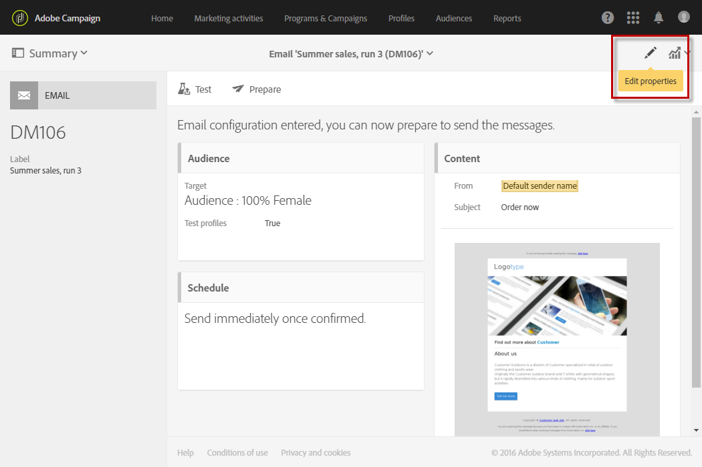
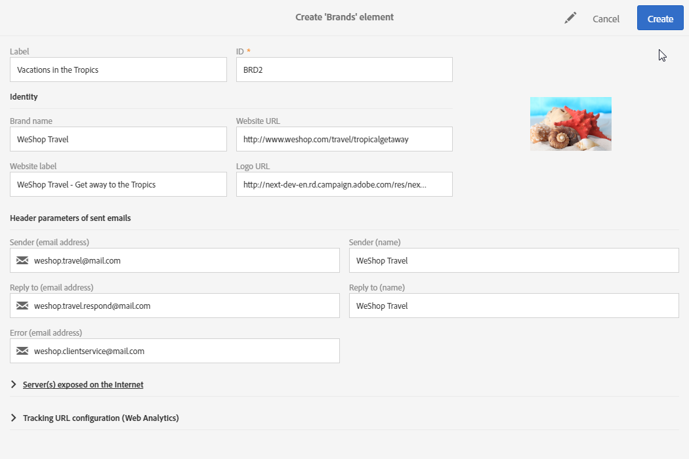

# Branding{#branding}

## Informatie over merkidentiteit {#about-brand-identity}

Elk bedrijf heeft merkvisuele en technische richtlijnen. Met de Campagne van Adobe, kunt u een reeks specificatie bepalen om een verenigbaar merk aan uw klanten, van logo&#39;s aan technische aspecten, zoals e-mailafzender, URL of domeinen voor te stellen.

Technische beheerders kunnen een of meer merken definiëren om de parameters die de identiteit van een merk beïnvloeden, centraal in te voeren. Dit zijn onder andere het merklogo, het domein van de toegangs-URL van de bestemmingspagina&#39;s of de instellingen voor het bijhouden van berichten. Met Adobe Campaign kunt u deze merken maken en ze koppelen aan berichten of bestemmingspagina&#39;s. Deze configuratie wordt beheerd in malplaatjes.

## Brandmerken configureren en gebruiken {#configuring-and-using-brands}

Het belangrijkste beginsel van het vormen en het gebruiken van merken is:

1. Maak en configureer het merk. Voor deze bewerking zijn specifieke machtigingen vereist en deze wordt uitgevoerd door de technische beheerder van Adobe Campagne.
1. Maak een of meer leverings- en landingspagina-sjablonen voor dit merk. Raadpleeg de sectie [Een sjabloon](../../start/using/marketing-activity-templates.md) maken.
1. Maak berichten en bestemmingspagina&#39;s op basis van deze sjabloon. Raadpleeg de secties [Een e-mail](../../channels/using/creating-an-email.md) maken en [Een bestemmingspagina](../../channels/using/designing-a-landing-page.md) maken.

>[!IMPORTANT]
>
>Merken kunnen niet door eindgebruikers worden gemaakt of gewijzigd: deze bewerkingen moeten worden uitgevoerd door de technische beheerder van Adobe Campagne. Neem voor elk verzoek contact op met de klantenservice van Adobe. Multi-branding kan niet worden gebruikt in de context van transactieoverseinen. Voor meer op dit, zie [Transactionele berichten en branding](../../channels/using/about-transactional-messaging.md#permissions-and-branding).

De merken kunnen in het **[!UICONTROL Administration > Instance settings > Brand configuration]** menu worden gevonden.

Een nieuw merk is standaard alleen zichtbaar voor gebruikers met de bijbehorende rechten van de beheerder.

Een **merk** wordt gedefinieerd door de volgende kenmerken:

* An **Identity**, that define and personalizes your brand. Deze sectie bevat de volgende velden:

   

   * **Label** zichtbaar in de interface
   * **Merknaam**
   * **URL** van website en label **van** website van merk
   * **Merk-logo**

* **[!UICONTROL Header parameters of sent emails]** die personaliseert wat de ontvangers van uw campagnes zullen zien. Deze sectie bevat de volgende velden:

   

   * **Afzender (e-mailadres)** met het e-mailadres van het merk.
   * **Afzender (naam)** met de naam van het merk.
   * **Reageren op (e-mailadres)** met het e-mailadres waarop de klant kan antwoorden.
   * **Reageer op (naam)** met de naam van het merk.
   * **Fout (e-mailadres)** met het e-mailadres dat moet worden gebruikt in het geval van een fout.
   >[!IMPORTANT]
   >
   >Nadat u de headerparameters van de e-mailberichten hebt bijgewerkt, controleert u de geavanceerde instellingen van de sjabloon als de naam en het e-mailadres van de afzender niet zijn gewijzigd in het e-mailbericht dat met de sjabloon is gemaakt.

* **Server(s) die op internet** worden weergegeven, definiëren de servers die worden gebruikt voor tracering, maar ook voor toegang tot landingspagina&#39;s. Deze sectie bevat de volgende velden:

   

   * **Externe URL van de toepassingsserver** die wordt gebruikt voor het hosten van en de toegang tot van de verschillende bestemmingspagina&#39;s u creeert.
   * **Externe URL van de trackingserver** die tijdens de leveringen als bijgehouden URL wordt gebruikt.
   * **Externe URL van de spiegelpaginaserver** die als standaard spiegelpagina in uw leveringen wordt gebruikt.
   >[!NOTE]
   >
   >Als u de voorvertoning van de bestemmingspagina en de rendering van de spiegelpagina wilt weergeven in de gebruikersinterface van Campagne, moeten de URL&#39;s van de toepassingsserver en van de spiegel veilig zijn. Gebruik in dat geval https:// in plaats van http:// wanneer u deze URL&#39;s instelt.

* **[!UICONTROL Tracking URL configuration (Web Analytics)]**, die de configuratie van de URL&#39;s voor het bijhouden van uw merk definieert.

   Hier worden de aanvullende parameters gedefinieerd waarmee de koppelingen kunnen worden bijgehouden op externe systemen, zoals Web Analytics-programma&#39;s zoals Adobe Analytics of Google Analytics.

   

## Een merk toewijzen aan een e-mail {#assigning-a-brand-to-an-email}

### Een merk koppelen aan een sjabloon {#linking-a-brand-to-a-template}

Om de parameters te gebruiken die voor een merk worden bepaald, moet het met een leveringsmalplaatje of het landende paginasjabloon worden verbonden. Hiervoor moet u een sjabloon maken of bewerken.

>[!NOTE]
>
>Raadpleeg de sectie [Een sjabloon](../../start/using/marketing-activity-templates.md) maken voor meer informatie over het maken van een sjabloon.

Nadat u de sjabloon hebt gemaakt, kunt u deze koppelen aan een merk. Dit doet u als volgt:

1. Klik op de **[!UICONTROL Edit properties]** knop voor toegang tot de sjablooneigenschappen.

   

1. Gebruik de vervolgkeuzelijst om het merk te selecteren dat u aan de sjabloon wilt koppelen.

   >[!NOTE]
   >
   >Standaard **[!UICONTROL Default brand (branding)]** is de optie geselecteerd.

   

   Klik op het **[!UICONTROL Navigate to the detail of the element selected]** pictogram om te zien hoe het geselecteerde merk is geconfigureerd.

   

1. Bevestig uw selectie en sla uw sjabloon op.

Je template is gekoppeld aan het merk. In de e-mailredacteur, zullen de elementen zoals het **E-mailadres van standaardafzender**, de **Standaard afzendernaam**, of het **Logo** de gevormde merkgegevens gebruiken.

### Branding use case {#branding-use-case}

In dit voorbeeld gaan we een nieuw aan reizen gerelateerd merk maken en dit in een e-mail gebruiken.

#### Een nieuw merk configureren {#configure-a-new-brand}

>[!IMPORTANT]
>
>Merkconfiguratie wordt alleen door Adobe beheerd omdat hiervoor specifieke machtigingen en technische instellingen vereist zijn.

1. De beheerder van de Campagne van Adobe leidt tot het merk in **[!UICONTROL Administration > Instance settings > Brand configuration]**. Hij voegt de **Vakantie in het element van Tropen** van het geavanceerde menu toe en vormt de **[!UICONTROL ID]** en de **[!UICONTROL Header parameters of sent emails]** van het merk.

   

1. De beheerder configureert vervolgens de URL van de **server(s) die op internet** beschikbaar is (zijn), zodat bestemmingspagina&#39;s kunnen worden gebruikt en daarna de URL&#39;s voor bijhouden.

   In dit voorbeeld wordt **Web Analytics** gebruikt voor **Google Analytics**. De beheerder configureert de URL voor bijhouden als volgt:

   

Het merk wordt correct gecreeerd en gevormd. Het kan nu door de marketing teams worden gebruikt.

#### Een nieuw merk implementeren {#implement-a-new-brand}

Als leveringsmanager, bent u verantwoordelijk voor het creëren van de leveringsmalplaatjes om het nieuwe merk te gebruiken. Volg onderstaande stappen om dit te bereiken:

1. In het geavanceerde menu, dupliceer een ingebouwde malplaatje **[!UICONTROL Resources > Templates > Delivery templates]** om een nieuw leveringsmalplaatje te vormen.

   

1. Als u deze sjabloon wilt koppelen aan de **Vakantie in het merk Tropics** , bewerkt u de sjablooneigenschappen en selecteert u het merk in de vervolgkeuzelijst.

   

1. Configureer deze e-mailsjabloon om de merkidentiteit weer te geven.
1. Nadat de sjabloon is voltooid, kunt u deze opslaan.

   

   De leveringssjabloon kan nu worden gebruikt om e-mails te maken die naar een publiek worden verzonden.

#### Het nieuwe merk in een levering gebruiken {#use-the-new-brand-in-a-delivery}

Voer de onderstaande stappen uit om een e-mailbericht te maken dat is gekoppeld aan een merk:

1. Klik op de **[!UICONTROL Create]** knop in het **[!UICONTROL Marketing activities]** menu.

   

1. Selecteer de **[!UICONTROL Email]** activiteit, dan kies het malplaatje verbonden aan het nieuwe merk.

   

1. Uw e-mailadres is al geconfigureerd. U kunt de informatie controleren voordat u deze test met behulp van de testprofielen en deze vervolgens naar het publiek sturen.

   

