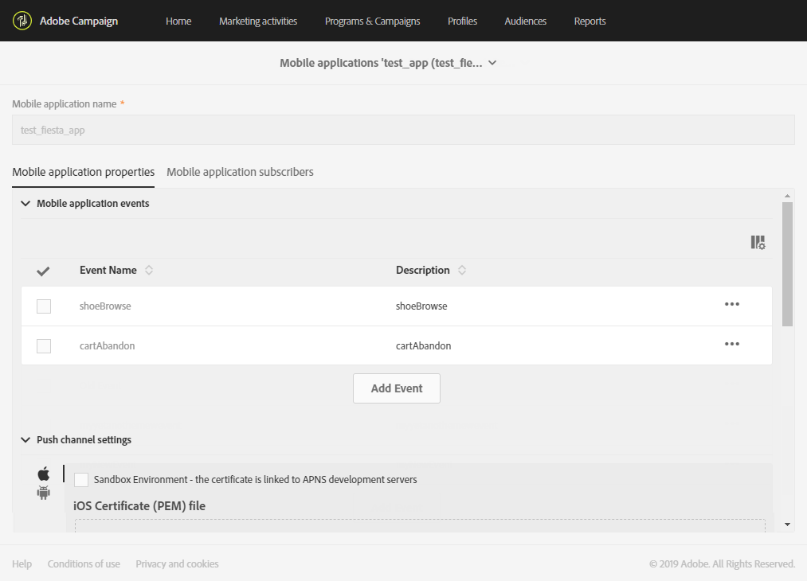

# Een mobiele toepassing configureren{#configuring-a-mobile-application}

Pushberichten of In-App-berichten worden ontvangen op mobiele toepassingen die eerst moeten worden geconfigureerd in Adobe Campagnestandaard, afhankelijk van het kanaal dat u wilt gebruiken.

Als u berichten en pushmeldingen in de app wilt verzenden, moeten uw mobiele toepassingen worden ingesteld in Adobe Campagne door gebruik te maken van Adobe Experience Platform SDK&#39;s. Zie [De SDK](#using-adobe-experience-platform-sdk)van het Adobe Experience Platform gebruiken.

Nadat uw mobiele toepassingen zijn ingesteld in Adobe Campagne door de Experience Cloud Mobile SDK V4 of Experience Platform SDK te gebruiken, moeten ze worden geconfigureerd door een beheerder in het menu [!UICONTROL Administration] > [!UICONTROL Channels] > [!UICONTROL Mobile app] .

>[!IMPORTANT]
>
>Pushmeldingen en implementaties in de app moeten worden uitgevoerd door deskundige gebruikers. Neem contact op met de manager of de Professional-servicepartner van Adobe-accounts als u hulp nodig hebt.

Zodra een mobiele toepassing is ingesteld, kunt u de verzamelde PII-gegevens ophalen om profielen te maken of bij te werken vanuit uw database. Raadpleeg voor meer informatie deze sectie: Profielgegevens [maken en bijwerken op basis van gegevens](../../channels/using/updating-profile-with-mobile-app-data.md)van mobiele toepassingen.

Raadpleeg deze [pagina voor algemene richtlijnen voor mobiele levering in Adobe Campagne Standard](https://helpx.adobe.com/campaign/kb/acs-mobile.html)

## Adobe Experience Platform SDK gebruiken {#using-adobe-experience-platform-sdk}

>[!Nofferte]
>
>Raadpleeg deze [pagina](https://helpx.adobe.com/campaign/kb/configure-launch-rules-acs-use-cases.html)voor meer informatie over de verschillende gevallen van mobiel gebruik die worden ondersteund in Adobe Campaign Standard met de SDK&#39;s van het Adobe Experience Platform.

Als u pushmeldingen en In-App-berichten wilt verzenden met Experience Platform SDK-toepassing, moet een mobiele toepassing worden ingesteld in Adobe Experience Platform Experience Platform Experience Platform Launch en geconfigureerd in Adobe Campaign. Raadpleeg deze [pagina](https://helpx.adobe.com/campaign/kb/configuring-app-sdkv4.html)voor gedetailleerde stappen om uw mobiele toepassing te configureren met de Experience Platform SDK.

Voer de onderstaande stappen uit om de configuratie te starten:

1. Controleer of u toegang hebt tot de **[!UICONTROL Mobile]** kanalen: Pushmelding en bericht in de app in Adobe Campaign. Als dat niet het geval is, neemt u contact op met uw accountteam.

   

1. Maak de mobiele toepassing in Experience Platform Launch door een eigenschap van het type Mobile te maken. Raadpleeg de documentatie bij Launch [Experience Platform voor meer informatie](https://aep-sdks.gitbook.io/docs/getting-started/create-a-mobile-property#create-a-new-mobile-property) .
1. Installeer de **[!UICONTROL Adobe Campaign Standard]** extensie voor uw mobiele toepassing in Experience Platform Launch:

   Raadpleeg de documentatie bij Launch [Experience Platform voor meer informatie over extensies](https://aep-sdks.gitbook.io/docs/using-mobile-extensions/adobe-campaign-standard) .

1. Regels voor uw toepassing configureren in Adobe Launch, zie Uw toepassing [configureren in Launch](https://helpx.adobe.com/campaign/kb/config-app-in-launch.html#Step1Createdataelements)
1. Configureer uw Adobe-toepassing voor starten in Adobe Campaign Standard. Zie De Adobe-toepassing [starten instellen in Adobe Campagne](https://helpx.adobe.com/campaign/kb/configuring-app-sdk.html#SettingupyourAdobeLaunchapplicationinAdobeCampaign).
1. Voeg kanaalspecifieke configuratie aan uw Mobiele opstelling van de Toepassing toe, zie [kanaal-specifieke toepassingsconfiguratie in de Campagne](https://helpx.adobe.com/campaign/kb/configuring-app-sdk.html#ChannelspecificapplicationconfigurationinAdobeCampaign)van Adobe.

   
