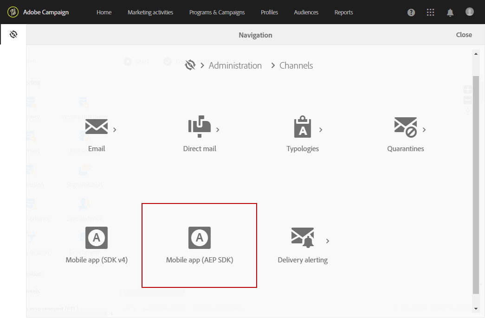
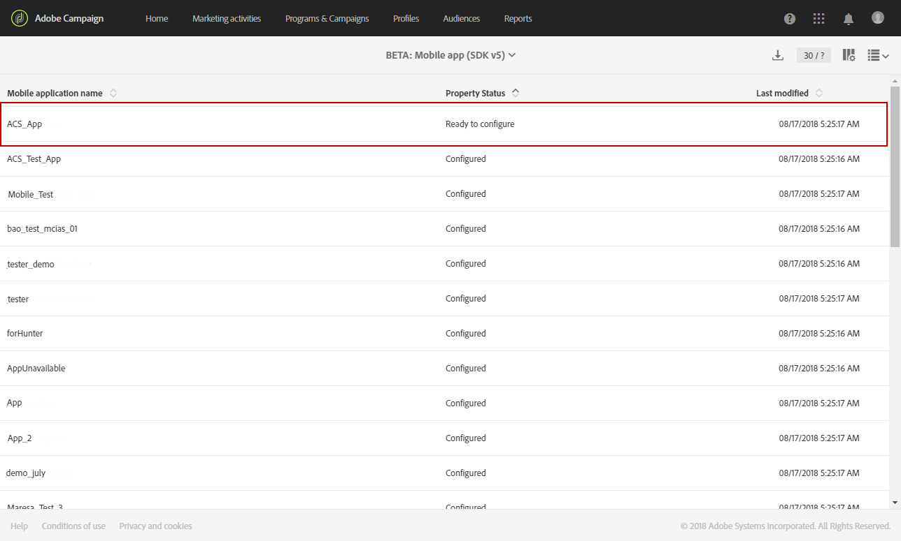
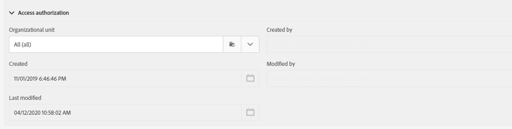
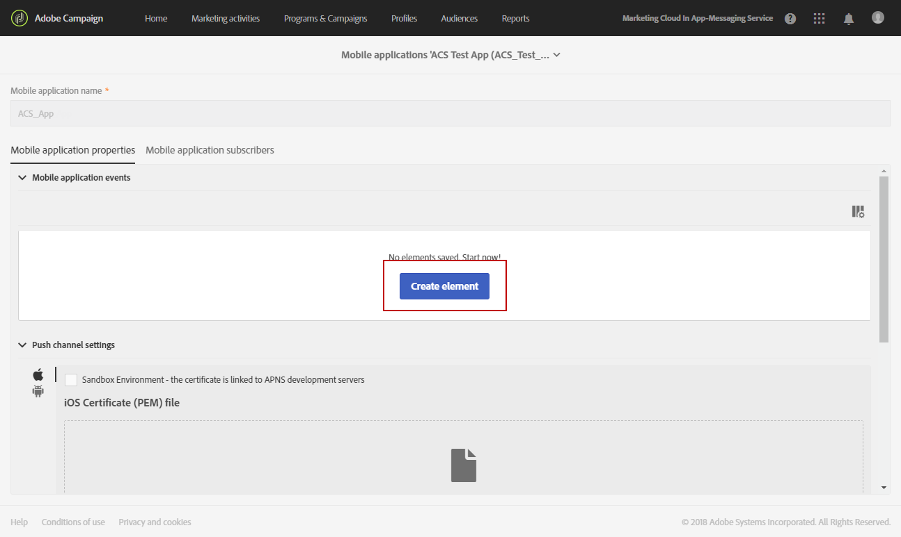
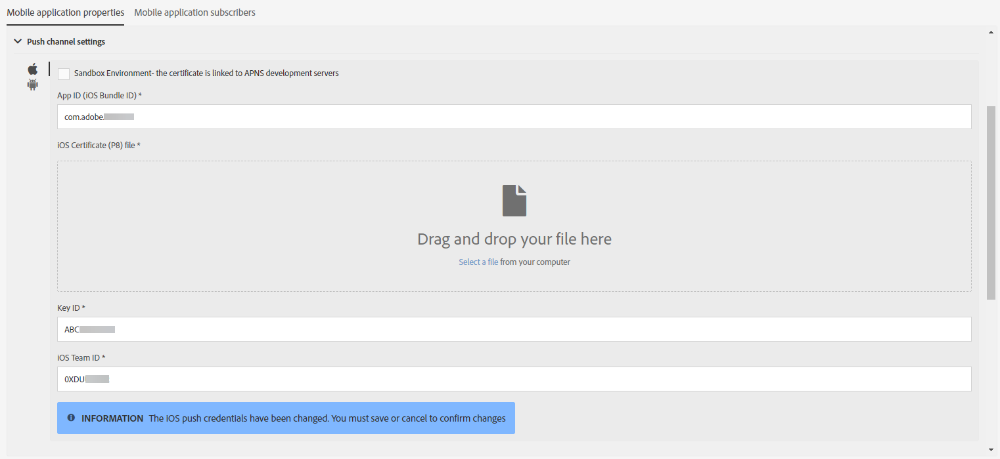
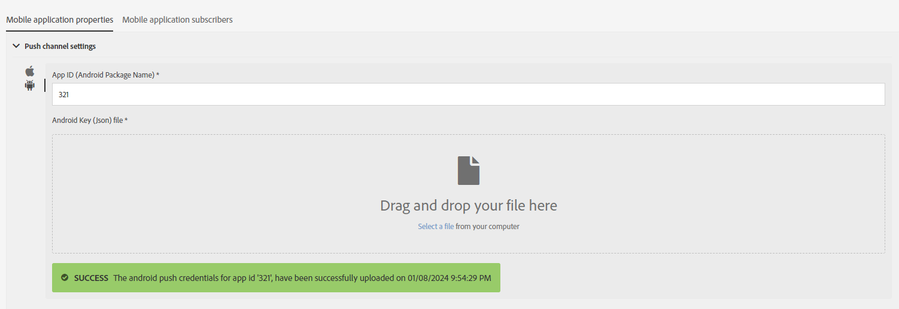

# Een mobiele applicatie configureren{#configuring-a-mobile-application}

## Een mobiele toepassing configureren met Adobe Experience Platform SDK&#39;s {#using-adobe-experience-platform-sdk}

>[!IMPORTANT]
>
> Adobe Experience Platform Launch is omgedoopt tot een reeks technologieën voor gegevensverzameling in Adobe Experience Platform. Diverse terminologische wijzigingen zijn als gevolg hiervan in de productdocumentatie doorgevoerd. Gelieve te verwijzen naar het [&#x200B; volgende document &#x200B;](https://experienceleague.adobe.com/docs/experience-platform/tags/term-updates.html){target="_blank"} voor een geconsolideerde verwijzing van de terminologieveranderingen.

Merk op dat de pushmelding en de implementaties in de app door deskundige gebruikers moeten worden uitgevoerd. Neem voor hulp contact op met uw Adobe-accountmanager of Professional-servicepartner.

Als u pushmeldingen en In-App-berichten wilt verzenden met de Experience Platform SDK-toepassing, moet een mobiele toepassing worden ingesteld in de gebruikersinterface voor gegevensverzameling en worden geconfigureerd in Adobe Campaign.

Zodra een mobiele toepassing is ingesteld, kunt u de PII-gegevens ophalen die zijn verzameld om profielen te maken of bij te werken vanuit uw database. Voor meer op dit, verwijs naar deze sectie: [&#x200B; Creërend en het bijwerken profielinformatie die op mobiele toepassingsgegevens &#x200B;](../../channels/using/updating-profile-with-mobile-app-data.md) wordt gebaseerd.

Om meer op de verschillende mobiele gebruiksgevallen te leren die in Adobe Campaign Standard door Adobe Experience Platform SDKs worden gesteund te gebruiken, verwijs naar deze [&#x200B; pagina &#x200B;](../../administration/using/supported-mobile-use-cases.md).

Voer de volgende stappen uit om de configuratie te voltooien:

1. Ga in Adobe Campaign naar het volgende:
   * **[!UICONTROL Push notification]**
   * **[!UICONTROL In-App message]**
   * **[!UICONTROL Adobe Places]**

   Als dat niet het geval is, neemt u contact op met uw accountteam.

1. Controleer of de gebruiker beschikt over de benodigde rechten in Adobe Campaign Standard en tags in Adobe Experience Platform.

   * In Adobe Campaign Standard moet u ervoor zorgen dat de IMS-gebruiker deel uitmaakt van de standaardprofielen voor gebruikers- en beheerproducten. Met deze stap kan de gebruiker zich aanmelden bij Adobe Campaign Standard, naar de mobiele app-pagina van Experience Platform SDK navigeren en de eigenschappen van de mobiele app weergeven die u hebt gemaakt in de gebruikersinterface voor gegevensverzameling.

   * Controleer in de gebruikersinterface voor gegevensverzameling of uw IMS-gebruiker deel uitmaakt van een productprofiel voor het starten van een Experience Platform.
Met deze stap kan de gebruiker zich aanmelden bij de gebruikersinterface voor gegevensverzameling om de eigenschappen te maken en weer te geven. Voor meer informatie over productprofielen in de Inzameling UI van Gegevens, zie [&#x200B; uw productprofiel &#x200B;](https://experienceleague.adobe.com/docs/experience-platform/tags/admin/manage-permissions.html#gain-admin-rights-for-a-tags-product-profile) creëren. In het productprofiel, zou er geen toestemmingen moeten zijn die op het bedrijf of de eigenschappen worden geplaatst, maar de gebruiker zou nog login moeten kunnen.

   Als u aanvullende taken wilt uitvoeren, zoals het installeren van een extensie, het publiceren van een app, het configureren van omgevingen, enzovoort, moet u machtigingen instellen in het productprofiel.

1. Maak een **[!UICONTROL Mobile property]** in de gebruikersinterface voor gegevensverzameling. Zie [Een mobiele eigenschap instellen](https://developer.adobe.com/client-sdks/documentation/getting-started/create-a-mobile-property) voor meer informatie.

1. Klik in de gebruikersinterface voor gegevensverzameling op het tabblad **[!UICONTROL Extensions]** , ga naar **[!UICONTROL Catalog]** en zoek naar de extensie **[!UICONTROL Adobe Campaign Standard]** . Voor meer informatie, zie [&#x200B; Adobe Campaign Standard &#x200B;](https://developer.adobe.com/client-sdks/documentation/adobe-campaign-standard).

1. Installeer de extensie **[!UICONTROL Places]** in de gebruikersinterface voor gegevensverzameling voor ondersteuning van gevallen van locatiegebruik in Campaign Standard. Verwijs naar deze [&#x200B; pagina &#x200B;](https://developer.adobe.com/client-sdks/solution/places).

1. In Adobe Campaign Standard, vorm het mobiele bezit dat u in de Inzameling UI van Gegevens creeerde. Verwijs naar [&#x200B; Vestiging uw toepassing van Adobe Experience Platform Launch in Adobe Campaign &#x200B;](../../administration/using/configuring-a-mobile-application.md#set-up-campaign).

1. Voeg de kanaalspecifieke configuratie toe aan uw mobiele toepassingsopstelling.
Zie [Kanaalspecifieke applicatieconfiguratie in Adobe Campaign](../../administration/using/configuring-a-mobile-application.md#channel-specific-config) voor meer informatie.

1. Indien nodig, kunt u de eigenschap tag verwijderen.
Voor meer informatie, zie [&#x200B; het Schrappen van uw toepassing &#x200B;](../../administration/using/configuring-a-mobile-application.md#delete-app).

## Mobiele app synchroniseren met AEPSDK vanuit technische workflow starten {#aepsdk-workflow}

Nadat u de mobiele eigenschap hebt gemaakt en geconfigureerd in de gebruikersinterface voor gegevensverzameling, synchroniseert de technische workflow van **[!UICONTROL Sync Mobile app AEPSDK from Launch]** nu de mobiele eigenschappen van tags die zijn geïmporteerd in Adobe Campaign Standard.

Standaard begint de technische werkstroom elke 15 minuten. Indien nodig kan de toepassing handmatig opnieuw worden gestart:

1. Kies in Adobe Campaign Standard in het geavanceerde menu de optie **[!UICONTROL Administration]** > **[!UICONTROL Application Settings]** > **[!UICONTROL Workflows]** .
1. Open de **[!UICONTROL Sync Mobile app AEPSDK from Launch (syncWithLaunch)]** -workflow.

   

1. Klik op de **[!UICONTROL Scheduler]** -activiteit.

1. Selecteer **[!UICONTROL Immediate execution]**.

   

De workflow wordt nu opnieuw gestart en gesynchroniseerd met de mobiele eigenschappen van de tag die in Adobe Campaign Standard zijn geïmporteerd.

## Toepassing instellen in Adobe Campaign {#set-up-campaign}

Als u een eigenschap tag mobile wilt gebruiken in Campagne, moet u deze eigenschap ook configureren in Adobe Campaign. In Adobe Campaign moet u ervoor zorgen dat de IMS-gebruiker deel uitmaakt van de standaardprofielen voor gebruikers- en beheerproducten.

U moet wachten tot de technische workflow wordt uitgevoerd en de eigenschap mobile van de tag synchroniseren met Adobe Campaign. U kunt de configuratie vervolgens configureren in Adobe Campaign.

Voor meer informatie over Mobiele app AEPSDK van de Synchronisatie van de Technische werkschema van de Lancering, verwijs naar dit [&#x200B; sectie &#x200B;](../../administration/using/configuring-a-mobile-application.md#aepsdk-workflow).

>[!NOTE]
>
>Standaard kunnen beheerders met een organisatorische eenheid ingesteld op ALL de mobiele toepassing bewerken.

1. Selecteer in het menu Geavanceerd de optie **[!UICONTROL Administration]** > **[!UICONTROL Channels]** > **[!UICONTROL Mobile app (AEP SDK)]** .

   

1. Selecteer de mobiele toepassing die u hebt gemaakt in de gebruikersinterface voor gegevensverzameling.
De **[!UICONTROL Property Status]** moet **[!UICONTROL Ready to configure]** zijn.

   >[!NOTE]
   >
   >Standaard gebruikt Campaign Standard voor het ophalen van de lijst met mobiele toepassingen die zijn gemaakt in de gebruikersinterface voor gegevensverzameling de waarde die is gedefinieerd in de optie NmsServer_URL om te zoeken naar overeenkomende eigenschappen.
   >
   >In sommige gevallen, kan het eindpunt van de Campagne voor een mobiele toepassing van die in NmsServer_URL worden bepaald verschillend zijn. Definieer in dat geval het eindpunt in de optie `Launch_URL_Campaign` . De campagne zal de waarde van deze optie gebruiken om passende eigenschappen in de UI van de Inzameling van Gegevens te zoeken.

   

1. U kunt de organisatie-eenheid van uw mobiele toepassing wijzigen onder de sectie **[!UICONTROL Access Authorization]** om de toegang tot deze mobiele toepassing te beperken tot specifieke organisatie-eenheden. Raadpleeg deze pagina voor meer informatie.

   Hier, kan de beheerder suborganisatorische eenheden toewijzen door hen van drop-down te selecteren.

   

1. Klik op **[!UICONTROL Save]** om een verbinding tot stand te brengen tussen Campagne en tags in Adobe Experience Platform.

1. Controleer of de status van de mobiele app is gewijzigd van **[!UICONTROL Ready to Configure]** in **[!UICONTROL Configured]** .

   Wanneer de uitbreiding van de Campagne toont dat de sleutel opstelling met succes is geweest, kunt u ook verifiëren dat het bezit opstelling met succes in Campaign is geweest.

   

1. Voor deze configuratie om van kracht te worden, moeten de veranderingen in de Inzameling UI van Gegevens worden gepubliceerd.

   Voor meer informatie, zie [&#x200B; Publish configuratie &#x200B;](https://developer.adobe.com/client-sdks/documentation/getting-started/create-a-mobile-property/#publish-the-configuration)

## Kanaalspecifieke toepassingsconfiguratie in Adobe Campaign {#channel-specific-config}

Uw mobiele toepassing kan nu worden gebruikt in Campagne voor pushberichten of in-app-leveringen. U kunt het nu verder configureren als dat nodig is om gebeurtenissen te maken die uw In-App-berichten activeren en/of pushcertificaten uploaden.

1. Selecteer in het menu Geavanceerd de optie **[!UICONTROL Administration]** > **[!UICONTROL Channels]** > **[!UICONTROL Mobile app (AEP SDK)]** .

1. Selecteer de mobiele toepassing die u hebt gemaakt en geconfigureerd in de gebruikersinterface voor gegevensverzameling.

1. Op het tabblad **[!UICONTROL Mobile application properties]** kunt u gebeurtenissen toevoegen die beschikbaar zijn in uw mobiele toepassing voor uw In-App-berichten.

1. Klik op **[!UICONTROL Create Element]** om uw gebeurtenissen te configureren.

   

1. Typ een naam en een beschrijving.

   

1. Klik op **[!UICONTROL Add]**.

   De gebeurtenis is nu beschikbaar op het tabblad Triggers wanneer u een bericht in de app maakt. Voor meer informatie, zie [&#x200B; Voorbereidend en verzendend een bericht in-app &#x200B;](../../channels/using/preparing-and-sending-an-in-app-message.md).

1. Geef in het gedeelte **[!UICONTROL Device-specific settings]** van een dashboard voor mobiele toepassingen voor elk apparaat de toepassingsgegevens op.

   +++ Voor iOS

   Voer de volgende toepassingsgegevens in:

   * **identiteitskaart van de Toepassing (identiteitskaart van de Bundel van iOS)**: Verwijs naar [&#x200B; documentatie van Apple &#x200B;](https://developer.apple.com/documentation/appstoreconnectapi/bundle_ids){target="_blank"} voor meer informatie over Bundel identiteitskaart
   * **het Certificaat van iOS (P8) dossier**: Sleep en laat vallen uw .p8 auth sleutel. Voor instructies op hoe te om het .p8 authentificatiedossier te produceren, verwijs naar uw [&#x200B; de ontwikkelaarsrekening van Apple &#x200B;](https://developer.apple.com/account/ios/authkey/create){target="_blank"}.
   * **Zeer belangrijke identiteitskaart**: Verwijs naar [&#x200B; documentatie van Apple &#x200B;](https://developer.apple.com/help/account/manage-keys/get-a-key-identifier/){target="_blank"} voor meer informatie over Zeer belangrijke identiteitskaart
   * **identiteitskaart van het Team van iOS**: Verwijs naar [&#x200B; documentatie van Apple &#x200B;](https://developer.apple.com/help/account/manage-your-team/locate-your-team-id/){target="_blank"} voor meer informatie over identiteitskaart van het Team van iOS.

         
     +++

   +++ Voor Android

   Voer de volgende toepassingsgegevens in:

   * **identiteitskaart van de Toepassing (de Naam van het Pakket van Android)**: Verwijs naar [&#x200B; documentatie van Android &#x200B;](https://support.google.com/admob/answer/9972781?hl=en#:~:text=The%20package%20name%20of%20an,supported%20third%2Dparty%20Android%20stores){target="_blank"} voor meer informatie over de naam van het Pakket.
   * **Android Zeer belangrijk (JSON) dossier**: Belemmering en laat vallen uw .json privé zeer belangrijk dossier. Voor instructies op hoe te om het .json privé zeer belangrijke dossier te produceren, verwijs naar de [&#x200B; documentatie van de Ontwikkelaar voor Vuurbasis &#x200B;](https://firebase.google.com/docs/admin/setup#initialize_the_sdk_in_non-google_environments){target="_blank"}.

     
   +++

1. Nadat het certificaat is geüpload, verschijnt er een bericht met de melding dat het uploaden is voltooid en wordt de vervaldatum van het certificaat weergegeven.

1. Klik op het tabblad **[!UICONTROL Mobile application subscribers]** om een lijst met abonnees en andere informatie over deze abonnees weer te geven, bijvoorbeeld of ze uw meldingen hebben verlaten.

## Uw toepassing verwijderen {#delete-app}

>[!CAUTION]
>
>Het verwijderen van uw toepassing kan niet ongedaan worden gemaakt.

Om uw toepassing te schrappen, voltooi de stappen in [&#x200B; het Schrappen van mobiele eigenschappen &#x200B;](https://developer.adobe.com/client-sdks/documentation/adobe-campaign-standard/#deleting-mobile-properties-in-the-data-collection-ui).

Nadat uw toepassing is verwijderd, controleert u in Adobe Campaign of de eigenschappenstatus van uw toepassing correct is bijgewerkt naar Verwijderd in Launch.

Als u op de toepassing in Adobe Campaign klikt, kunt u deze toepassing volledig uit Adobe Campaign verwijderen door op Verwijderen uit campagne te klikken.

