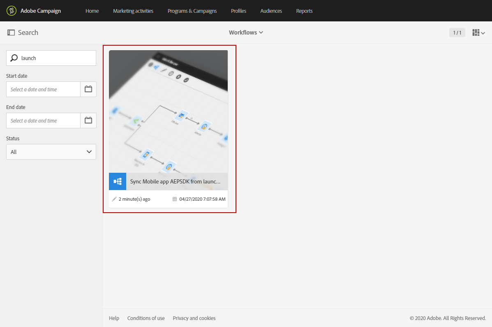
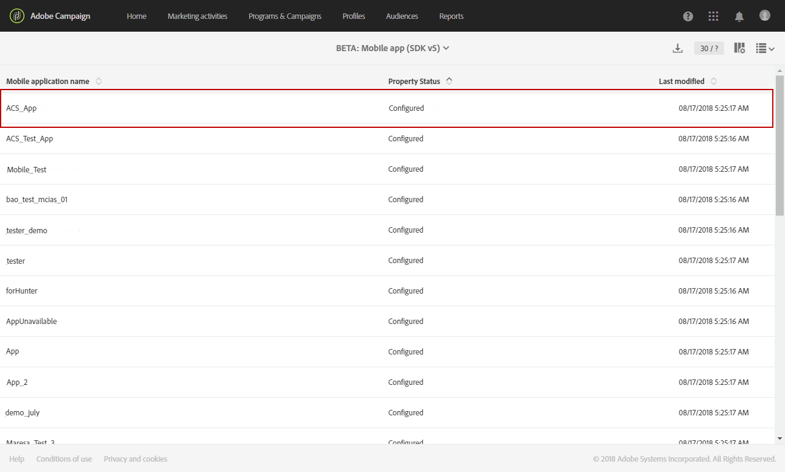
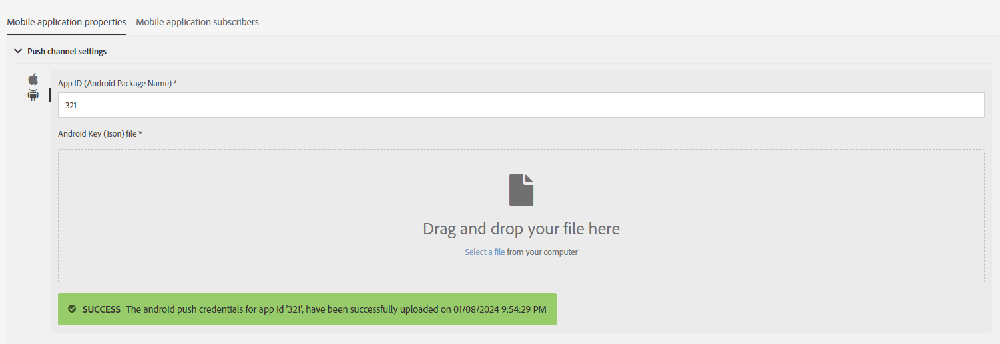

# Een mobiele applicatie configureren{#configuring-a-mobile-application}

## Een mobiele toepassing configureren met Adobe Experience Platform SDK&#39;s {#using-adobe-experience-platform-sdk}

>[!IMPORTANT]
>
> Adobe Experience Platform Launch is omgedoopt tot een reeks technologieën voor gegevensverzameling in Adobe Experience Platform. Diverse terminologische wijzigingen zijn als gevolg hiervan in de productdocumentatie doorgevoerd. Raadpleeg de [volgend document](https://experienceleague.adobe.com/docs/experience-platform/tags/term-updates.html){target="_blank"} voor een geconsolideerde referentie van de terminologische wijzigingen.

Merk op dat de pushmelding en de implementaties in de app door deskundige gebruikers moeten worden uitgevoerd. Neem voor hulp contact op met uw Adobe Account Executive of Professional Services-partner.

Als u pushmeldingen en In-App-berichten wilt verzenden met de SDK-toepassing van het Experience Platform, moet een mobiele toepassing worden ingesteld in de gebruikersinterface voor gegevensverzameling en worden geconfigureerd in Adobe Campaign.

Zodra een mobiele toepassing is ingesteld, kunt u de PII-gegevens ophalen die zijn verzameld om profielen te maken of bij te werken vanuit uw database. Raadpleeg voor meer informatie deze sectie: [Profielgegevens maken en bijwerken op basis van gegevens van mobiele toepassingen](../../channels/using/updating-profile-with-mobile-app-data.md).

Als u meer wilt weten over de verschillende gevallen van mobiel gebruik die in Adobe Campaign Standard worden ondersteund met de SDK&#39;s van Adobe Experience Platform, raadpleegt u deze [page](../../administration/using/supported-mobile-use-cases.md).

Voer de volgende stappen uit om de configuratie te voltooien:

1. Ga in Adobe Campaign naar het volgende:
   * **[!UICONTROL Push notification]**
   * **[!UICONTROL In-App message]**
   * **[!UICONTROL Adobe Places]**

   Als dat niet het geval is, neemt u contact op met uw accountteam.

1. Controleer of de gebruiker beschikt over de benodigde rechten in Adobe Campaign Standard en tags in Adobe Experience Platform.

   * In Adobe Campaign Standard moet u ervoor zorgen dat de IMS-gebruiker deel uitmaakt van de standaardprofielen voor gebruikers- en beheerproducten. Met deze stap kan de gebruiker zich aanmelden bij Adobe Campaign Standard, naar de pagina voor de mobiele app van de SDK van het Experience Platform navigeren en de eigenschappen van de mobiele app weergeven die u hebt gemaakt in de gebruikersinterface voor gegevensverzameling.

   * Controleer in de gebruikersinterface voor gegevensverzameling of uw IMS-gebruiker deel uitmaakt van een productprofiel van een Experience Platform Launch.
Met deze stap kan de gebruiker zich aanmelden bij de gebruikersinterface voor gegevensverzameling om de eigenschappen te maken en weer te geven. Zie voor meer informatie over productprofielen in de gebruikersinterface voor gegevensverzameling [Uw productprofiel maken](https://experienceleague.adobe.com/docs/experience-platform/tags/admin/manage-permissions.html#gain-admin-rights-for-a-tags-product-profile). In het productprofiel, zou er geen toestemmingen moeten zijn die op het bedrijf of de eigenschappen worden geplaatst, maar de gebruiker zou nog login moeten kunnen.

   Als u aanvullende taken wilt uitvoeren, zoals het installeren van een extensie, het publiceren van een app, het configureren van omgevingen, enzovoort, moet u machtigingen instellen in het productprofiel.

1. In de UI van de Inzameling van Gegevens, creeer a **[!UICONTROL Mobile property]**. Zie [Een mobiele eigenschap instellen](https://developer.adobe.com/client-sdks/documentation/getting-started/create-a-mobile-property) voor meer informatie.

1. Klik in de gebruikersinterface van de gegevensverzameling op de knop **[!UICONTROL Extensions]** tab, ga naar **[!UICONTROL Catalog]** en zoek naar **[!UICONTROL Adobe Campaign Standard]** extensie. Zie voor meer informatie [Adobe Campaign Standard](https://developer.adobe.com/client-sdks/documentation/adobe-campaign-standard).

1. Installeer de **[!UICONTROL Places]** in de UI voor gegevensverzameling. Zie dit [page](https://developer.adobe.com/client-sdks/solution/places).

1. In Adobe Campaign Standard, vorm het mobiele bezit dat u in de Inzameling UI van Gegevens creeerde. Zie [Een Adobe Experience Platform Launch-toepassing instellen in Adobe Campaign](../../administration/using/configuring-a-mobile-application.md#set-up-campaign).

1. Voeg de kanaalspecifieke configuratie toe aan uw mobiele toepassingsopstelling.
Zie [Kanaalspecifieke applicatieconfiguratie in Adobe Campaign](../../administration/using/configuring-a-mobile-application.md#channel-specific-config) voor meer informatie.

1. Indien nodig, kunt u de eigenschap tag verwijderen.
Zie voor meer informatie [Uw toepassing verwijderen](../../administration/using/configuring-a-mobile-application.md#delete-app).

## Mobiele app synchroniseren met AEPSDK vanuit technische workflow starten {#aepsdk-workflow}

Nadat u uw mobiele eigenschap hebt gemaakt en geconfigureerd in de gebruikersinterface van de gegevensverzameling, **[!UICONTROL Sync Mobile app AEPSDK from Launch]** in de technische workflow worden de mobiele eigenschappen van tags die in Adobe Campaign Standard zijn geïmporteerd, nu gesynchroniseerd.

Standaard begint de technische werkstroom elke 15 minuten. Indien nodig kan de toepassing handmatig opnieuw worden gestart:

1. Selecteer in Adobe Campaign Standard in het menu Geavanceerd de optie **[!UICONTROL Administration]** > **[!UICONTROL Application Settings]** > **[!UICONTROL Workflows]**.
1. Open de **[!UICONTROL Sync Mobile app AEPSDK from Launch (syncWithLaunch)]** workflow.

   

1. Klik op de knop **[!UICONTROL Scheduler]** activiteit.

1. Selecteer **[!UICONTROL Immediate execution]**.

   

De workflow wordt nu opnieuw gestart en gesynchroniseerd met de mobiele eigenschappen van de tag die in Adobe Campaign Standard zijn geïmporteerd.

## Toepassing instellen in Adobe Campaign {#set-up-campaign}

Als u een eigenschap tag mobile wilt gebruiken in Campagne, moet u deze eigenschap ook configureren in Adobe Campaign. In Adobe Campaign moet u ervoor zorgen dat de IMS-gebruiker deel uitmaakt van de standaardprofielen voor gebruikers- en beheerproducten.

U moet wachten tot de technische workflow wordt uitgevoerd en de eigenschap mobile van de tag synchroniseren met Adobe Campaign. U kunt de configuratie vervolgens configureren in Adobe Campaign.

Raadpleeg voor meer informatie over het synchroniseren van mobiele app AEPSDK vanuit de technische workflow van Starten de volgende [sectie](../../administration/using/configuring-a-mobile-application.md#aepsdk-workflow).

>[!NOTE]
>
>Standaard kunnen beheerders met een organisatorische eenheid ingesteld op ALL de mobiele toepassing bewerken.

1. Selecteer in het menu Geavanceerd de optie **[!UICONTROL Administration]** > **[!UICONTROL Channels]** > **[!UICONTROL Mobile app (AEP SDK)]**.

   

1. Selecteer de mobiele toepassing die u hebt gemaakt in de gebruikersinterface voor gegevensverzameling.
haar **[!UICONTROL Property Status]** moeten **[!UICONTROL Ready to configure]**.

   >[!NOTE]
   >
   >Door gebrek, om de lijst van mobiele toepassingen terug te winnen die in de UI van de Inzameling van Gegevens worden gecreeerd, gebruikt het Campaign Standard de waarde die in de optie NmsServer_URL wordt bepaald om passende eigenschappen te zoeken.
   >
   >In sommige gevallen, kan het eindpunt van de Campagne voor een mobiele toepassing van die in NmsServer_URL worden bepaald verschillend zijn. In dat geval definieert u het eindpunt in het dialoogvenster `Launch_URL_Campaign` -optie. De campagne zal de waarde van deze optie gebruiken om passende eigenschappen in de UI van de Inzameling van Gegevens te zoeken.

   

1. U kunt de organisatorische eenheid van uw mobiele toepassing veranderen onder **[!UICONTROL Access Authorization]** om de toegang tot deze mobiele toepassing te beperken tot specifieke organisatie-eenheden. Raadpleeg deze pagina voor meer informatie.

   Hier, kan de beheerder suborganisatorische eenheden toewijzen door hen van drop-down te selecteren.

   

1. Als u een verbinding wilt maken tussen Campagne en tags in Adobe Experience Platform, klikt u op **[!UICONTROL Save]**.

1. Controleer of de status van de mobiele app is gewijzigd van **[!UICONTROL Ready to Configure]** tot **[!UICONTROL Configured]**.

   Wanneer de uitbreiding van de Campagne toont dat de sleutel opstelling met succes is geweest, kunt u ook verifiëren dat het bezit opstelling met succes in Campaign is geweest.

   

1. Voor deze configuratie om van kracht te worden, moeten de veranderingen in de Inzameling UI van Gegevens worden gepubliceerd.

   Zie voor meer informatie [Configuratie publiceren](https://developer.adobe.com/client-sdks/documentation/getting-started/create-a-mobile-property/#publish-the-configuration)

## Kanaalspecifieke toepassingsconfiguratie in Adobe Campaign {#channel-specific-config}

Uw mobiele toepassing kan nu worden gebruikt in Campagne voor pushberichten of in-app-leveringen. U kunt het nu verder configureren als dat nodig is om gebeurtenissen te maken die uw In-App-berichten activeren en/of pushcertificaten uploaden.

1. Selecteer in het menu Geavanceerd de optie **[!UICONTROL Administration]** > **[!UICONTROL Channels]** > **[!UICONTROL Mobile app (AEP SDK)]**.

1. Selecteer de mobiele toepassing die u hebt gemaakt en geconfigureerd in de gebruikersinterface voor gegevensverzameling.

1. Op de **[!UICONTROL Mobile application properties]** kunt u beginnen met het toevoegen van gebeurtenissen die beschikbaar zijn in uw mobiele toepassing voor uw In-App-berichten.

1. Om uw gebeurtenissen te vormen, klik **[!UICONTROL Create Element]**.

   

1. Typ een naam en een beschrijving.

   

1. Klik op **[!UICONTROL Add]**.

   De gebeurtenis is nu beschikbaar op het tabblad Triggers wanneer u een bericht in de app maakt. Zie voor meer informatie [Een bericht in de app voorbereiden en verzenden](../../channels/using/preparing-and-sending-an-in-app-message.md).

1. In de **[!UICONTROL Device-specific settings]** van een mobiel toepassingsdashboard, voor elk apparaat, de toepassingsdetails verstrekken.

   * +++ Voor iOS

     Voer de volgende toepassingsgegevens in:

      * **Toepassings-id (iOS-bundel-id)**: Zie [Apple-documentatie](https://developer.apple.com/documentation/appstoreconnectapi/bundle_ids){target="_blank"} voor meer informatie over bundel-id.
      * **iOS Certificate (P8)-bestand**: Sleep de p8-auttoets en zet deze neer. Raadpleeg voor instructies over het genereren van het .p8-verificatiebestand de [Apple Developer Account](https://developer.apple.com/account/ios/authkey/create){target="_blank"}.
      * **Sleutel-id**: Zie [Apple-documentatie](https://developer.apple.com/help/account/manage-keys/get-a-key-identifier/){target="_blank"} voor meer informatie over sleutel-id.
      * **iOS Team ID**: Zie [Apple-documentatie](https://developer.apple.com/help/account/manage-your-team/locate-your-team-id/){target="_blank"} voor meer informatie over iOS Team ID.

        
+++

   * +++ Voor Android

     Voer de volgende toepassingsgegevens in:

      * **Toepassings-id (Android-pakketnaam)**: Zie [Android-documentatie](https://support.google.com/admob/answer/9972781?hl=en#:~:text=The%20package%20name%20of%20an,supported%20third%2Dparty%20Android%20stores){target="_blank"} voor meer informatie over de naam van het pakket.
      * **JSON-bestand (Android Key)**: Sleep het bestand met de persoonlijke sleutel .json en zet het neer. Voor instructies over het genereren van het .json-bestand met de persoonlijke sleutel raadpleegt u de [Documentatie voor ontwikkelaars voor Firebase](https://firebase.google.com/docs/admin/setup#initialize_the_sdk_in_non-google_environments){target="_blank"}.

        
+++

1. Nadat het certificaat is geüpload, verschijnt er een bericht met de melding dat het uploaden is voltooid en wordt de vervaldatum van het certificaat weergegeven.

1. Klik op de knop **[!UICONTROL Mobile application subscribers]** om een lijst met abonnees en andere informatie over deze abonnees weer te geven, bijvoorbeeld of ze uw meldingen hebben verlaten.

## Uw toepassing verwijderen {#delete-app}

>[!CAUTION]
>
>Het verwijderen van uw toepassing kan niet ongedaan worden gemaakt.

Als u uw toepassing wilt verwijderen, voert u de stappen in [Mobiele eigenschappen verwijderen](https://developer.adobe.com/client-sdks/documentation/adobe-campaign-standard/#deleting-mobile-properties-in-the-data-collection-ui).

Nadat uw toepassing is verwijderd, controleert u in Adobe Campaign of de eigenschappenstatus van uw toepassing correct is bijgewerkt naar Verwijderd in Launch.

Als u op de toepassing in Adobe Campaign klikt, kunt u deze toepassing volledig uit Adobe Campaign verwijderen door op Verwijderen uit campagne te klikken.

