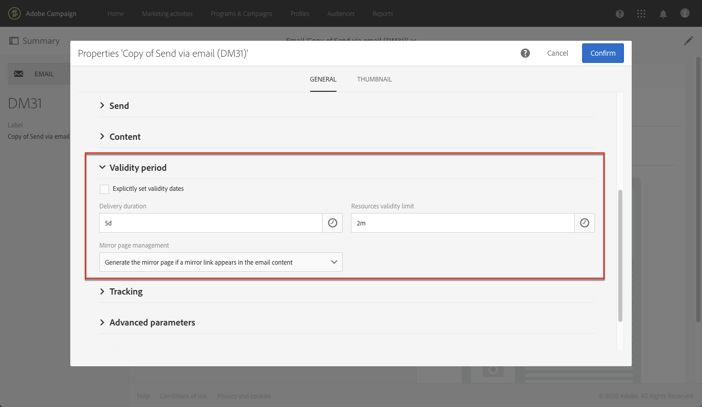

# E-mailkanaal configureren{#configuring-email-channel}

Als [beheerder](../../administration/using/users-management.md#functional-administrators)van de Campagne, kunt u e-mailkanaalmontages vormen. Deze geavanceerde instellingen zijn onder andere algemene parameters voor e-mailkanalen, accounts voor het routeren van e-mail, verwerkingsregels voor e-mail en e-maileigenschappen. Op deze pagina leert u hoe u de standaardwaarden voor de algemene e-mail en het verzenden van parameters kunt bewerken.

Sommige e-mailinstellingen worden nu beheerd door de uitgebreide MTA van Adobe Campagne. Daarom:
* Sommige configuraties in de gebruikersinterface van de Campagne worden niet meer toegepast:
   * De **[!UICONTROL Retries]** montages in het menu [van de](#email-channel-parameters) Configuratie en in de [Verzendende parameters](#retries-parameters) van de e-maileigenschappen.
   * De regels **[!UICONTROL MX management]** en **[!UICONTROL Domain management]** regels in het menu [Regels voor e-](#email-processing-rules)mailverwerking.

* Andere parameters worden nu gedeeltelijk beheerd door Verbeterde MTA, terwijl één of andere configuratie nog binnen Campagne kan worden gedaan. De beïnvloede montages zijn als volgt:
   * De **[!UICONTROL Message delivery duration]** parameter in het **[!UICONTROL Configuration]** menu. Zie [deze sectie](#email-channel-parameters)voor meer informatie.
   * De **[!UICONTROL Delivery duration]** of **[!UICONTROL Validity limit for sending messages]** parameter in de **[!UICONTROL Validity period]** sectie. Zie [deze sectie](#validity-period-parameters)voor meer informatie.
   * De **[!UICONTROL Bounce mails]** regels in de **[!UICONTROL Email processing rules]**. Zie [deze sectie](#email-processing-rules)voor meer informatie.

## Parameters e-mailkanaal {#email-channel-parameters}

In het configuratiescherm voor e-mail kunt u de parameters voor het e-mailkanaal definiëren. Beheerders hebben toegang tot deze configuraties via het menu **[!UICONTROL Administration]>[!UICONTROL Channels]>[!UICONTROL Email]>[!UICONTROL Configuration]**.

* **Geautoriseerde maskervelden**

   De **[!UICONTROL Header parameters of sent emails]** lijst bevat de geoorloofde e-mailadressen die u kunt gebruiken om e-mails naar uw ontvangers te verzenden (verzendadres) en om hen op de hoogte te stellen van eventuele fouten (foutadres).  Adobe Campagne controleert of de ingevoerde adressen geldig zijn tijdens de voorbereiding van berichten. Deze werkende wijze zorgt ervoor dat geen adressen worden gebruikt die leveringskwesties konden teweegbrengen.
   * Zowel het afzenderadres als het foutadres worden ingesteld door Adobe. Deze velden mogen niet leeg zijn.
   * U kunt deze velden niet bewerken. Als u een adres wilt bijwerken, neemt u contact op met het team voor klantenservice van Adobe.
   * Als u nog een adres wilt toevoegen, gebruikt u het [Configuratiescherm](https://docs.adobe.com/content/help/en/control-panel/using/subdomains-and-certificates/setting-up-new-subdomain.html) om een nieuw subdomein in te stellen of neemt u contact op met het team van de klantenservice van Adobe. Als u meerdere maskers gebruikt, worden deze door komma&#39;s van elkaar gescheiden.
   * Het is aan te raden adressen in te stellen met een ster zoals **@yourdomain.com*: u kunt hiermee elk adres gebruiken dat eindigt met uw subdomeinnaam.

* **Leverbaarheid**

   Het **[!UICONTROL Delivery reports ID]** wordt geleverd door het team van de klantenservice van Adobe. Het identificeert elk geval met een leverability identiteitskaart die in de technische leveringsrapporten wordt gebruikt.
   <!--The Technical Deliverability report is not accessible through the UI in ACS. It will be replaced with 250ok in the future (project starting).-->

* **Leveringsparameters**

   Adobe Campaign verzendt de berichten die op de begindatum beginnen. In het **[!UICONTROL Message delivery duration]** veld kunt u opgeven gedurende welke periode de berichten kunnen worden verzonden.

   >[!IMPORTANT]
   >
   >**Deze parameter in Campaign wordt nu alleen gebruikt als deze is ingesteld op 3,5 dagen of minder.** Als u een waarde definieert die hoger is dan 3,5 dagen, wordt er geen rekening mee gehouden omdat deze waarde nu wordt beheerd door de verbeterde MTA voor Adobe Campagne.

   Het **[!UICONTROL Online resources validity duration]** veld wordt gebruikt voor geüploade bronnen, voornamelijk voor de spiegelpagina en afbeeldingen. De bronnen op deze pagina zijn gedurende een beperkte tijd geldig (om schijfruimte te besparen).

* **Opnieuw**

   Voor tijdelijk onafgeleverde berichten moet u het opnieuw proberen. Zie [Opnieuw proberen na een tijdelijke leveringsfout](../../sending/using/understanding-delivery-failures.md#retries-after-a-delivery-temporary-failure)voor meer informatie.

   >[!NOTE]
   >
   >Het maximumaantal uit te voeren pogingen en de minimumvertraging tussen pogingen worden nu beheerd door Verbeterde MTA van de Campagne van Adobe, die op hoe goed wordt gebaseerd IP zowel historisch als momenteel bij een bepaald domein presteert. De instellingen voor **Opnieuw proberen** in Campagne worden genegeerd.

   <!--This section indicates how many retries should be performed the day after the send is started (**Number of retries**) and the minimum delay between retries (**Retry period**). By default, five retries are scheduled for the first day with a minimum interval of one hour, spread out over the 24 hours of the day. One retry per day is programmed after that and until the delivery deadline, which is defined in the **[!UICONTROL Delivery parameters]** section.-->

* **E-mailquarantaineparameters**

   Voer in het **[!UICONTROL Time between two significant errors]** veld een waarde in om de tijd te definiëren die de toepassing wacht voordat de foutenteller bij een fout wordt verhoogd. De standaardwaarde is **&quot;1d&quot;**, voor 1 dag.

   Wanneer de **[!UICONTROL Maximum number of errors before quarantine]** waarde is bereikt, wordt het e-mailadres in quarantaine geplaatst. De standaardwaarde is **&quot;5&quot;**: het adres zal op de vijfde fout in quarantined zijn. Dit betekent dat het contact automatisch van volgende leveringen wordt uitgesloten.
   <!--Actually the way ACS works is that the address is already on the quarantine list on the first bounce, but with a different status meaning that the error count has started.-->

   Voor meer op quarantines, zie het [Begrip van quarantainebeheer](../../sending/using/understanding-quarantine-management.md).

## E-mailrouteringsaccounts {#email-routing-accounts}

De **[!UICONTROL Integrated email routing]** externe rekening wordt standaard verschaft. Het bevat de technische parameters waarmee de toepassing e-mailberichten kan verzenden.

Het accounttype moet altijd worden ingesteld op **[!UICONTROL Routing]**, het kanaal op **[!UICONTROL Email]** en de leveringsmodus op **[!UICONTROL Bulk delivery]**.

**Verwant onderwerp**:

[Externe rekeningen](../../administration/using/external-accounts.md)

## E-mailverwerkingsregels {#email-processing-rules}

Beheerders **[!UICONTROL Email processing rules]** hebben toegang tot dit bestand via het **[!UICONTROL Administration > Channels > Email]** menu.

Merk op dat de e-maildomeinen en de MX regels nu door Verbeterde MTA van de Campagne van Adobe worden beheerd:
* **DKIM (DomainKeys Identified Mail)** e-mailverificatie wordt ondertekend door de Enhanced MTA voor alle berichten met alle domeinen. Het ondertekent niet met identiteitskaart **van de** Afzender, **DomainKeys**, of **S/MIME** tenzij anders gespecificeerd op het Verbeterde niveau MTA.
* Verbeterde MTA gebruikt zijn eigen MX regels die het toestaan om uw productie door domein aan te passen die op uw eigen historische e-mailreputatie wordt gebaseerd, en op real time terugkoppelen die uit de domeinen komt waar u e-mails verzendt.

### Stuitberichten {#bounce-mails}

De asynchrone stuitingen worden nog gekwalificeerd door het proces van de Campagne inMail door de **[!UICONTROL Bounce mails]** regel.

Deze regel bevat de lijst met tekenreeksen die door externe servers kunnen worden geretourneerd en waarmee u de fout kunt kwalificeren (**Hard**, **Zacht** of **Genegeerd**).

>[!NOTE]
>
>Voor de synchrone foutberichten van de leveringsmislukking, bepaalt Verbeterde MTA van de Campagne van Adobe het stuittype en de kwalificatie, en stuurt die informatie terug naar Campagne.

Zie deze [sectie](../../sending/using/understanding-delivery-failures.md#bounce-mail-qualification)voor meer informatie over stuiterende mailkwalificatie.

<!--Because they are now managed by the Enhanced MTA, the bounce qualifications in the Campaign **[!UICONTROL Message qualification]** table are no longer used. For more on bounce mail qualification, see this [section](../../sending/using/understanding-delivery-failures.md#bounce-mail-qualification).

### Management of email domains {#managing-email-domains}

The email domains are now managed by the Adobe Campaign Enhanced MTA. The Adobe Campaign **[!UICONTROL Domain management]** rules are no longer used.

**DKIM (DomainKeys Identified Mail)** email authentication signing is done by the Enhanced MTA for all messages with all domains. It does not sign with **Sender ID**, **DomainKeys**, or **S/MIME** unless otherwise specified at the Enhanced MTA level.

### MX management {#mx-management}

The MX rules are now managed by the Adobe Campaign Enhanced MTA. The Adobe Campaign **[!UICONTROL MX management]** delivery throughput rules are no longer used.

The Enhanced MTA uses its own MX rules that allow it to customize your throughput by domain based on your own historical email reputation, and on the real-time feedback coming from the domains where you are sending emails.-->

## Lijst met e-maileigenschappen {#list-of-email-properties}

In deze sectie wordt de lijst met parameters weergegeven die beschikbaar is in het eigenschappenscherm van een e-mail- of e-mailsjabloon.

>[!NOTE]
>
>Sommige parameters zijn alleen beschikbaar in sjablonen. De parameters u tot toegang hebt [hangen van uw toestemmingen](../../administration/using/users-management.md)af.

Met de **[!UICONTROL Edit properties]** knop kunt u de eigenschappen van een e-mailsjabloon of een e-mailsjabloon bewerken.

### Algemene parameters {#general-parameters}

Identificeer boven aan het parameterscherm E-mail de e-mail met behulp van de **[!UICONTROL Label]** en de **[!UICONTROL ID]** velden. Deze informatie verschijnt in de interface maar is niet zichtbaar aan de berichtontvangers.

>[!IMPORTANT]
>
>De id moet uniek zijn.

In het **[!UICONTROL Brand]** veld kunt u het merk selecteren dat aan de levering is gekoppeld. Raadpleeg de sectie [Branding](../../administration/using/branding.md) voor meer informatie over het gebruik en de configuratie van merken.

In het **[!UICONTROL Campaign]** veld kunt u de campagne invoeren die aan de e-mail is gekoppeld.

U kunt ook een afbeelding toevoegen **[!UICONTROL Description]** in het desbetreffende veld en de afbeelding bewerken die wordt weergegeven in de miniatuur van de e-mail in de lijsten.

### Parameters verzenden {#sending-parameters}

De **[!UICONTROL Send]** sectie is alleen beschikbaar voor e-mailsjablonen. Het bevat de volgende parameters:

#### Parameters opnieuw {#retries-parameters}

Voor tijdelijk onafgeleverde berichten moet u het opnieuw proberen. Zie [Opnieuw proberen na een tijdelijke leveringsfout](../../sending/using/understanding-delivery-failures.md#retries-after-a-delivery-temporary-failure)voor meer informatie.

>[!NOTE]
>
>De minimale vertraging tussen pogingen en het maximale aantal uit te voeren pogingen wordt nu beheerd door de uitgebreide MTA van de Campagne van Adobe, die op hoe goed wordt gebaseerd IP zowel historisch als momenteel bij een bepaald domein presteert. De instellingen voor **Nieuwe campagne** worden genegeerd.

<!--This section indicates how many retries should be performed the day after the send is started ( **[!UICONTROL Max. number of retries]** ) and the minimum delay between retries ( **[!UICONTROL Retry period]** ).

By default, five retries are scheduled for the first day with a minimum interval of one hour, spread out over the 24 hours of the day. One retry per day is programmed after that and until the delivery deadline, which is defined in the [Validity period parameters](#validity-period-parameters) section.

The number of retries can be changed globally (contact your Adobe technical administrator) or for each delivery or delivery template.-->

De instelling **voor de** leveringsduur (gedefinieerd in de sectie Parameters [voor](#validity-period-parameters) geldigheidsperiode) die in de campagne is **ingesteld, wordt nog steeds toegepast, maar slechts tot 3,5 dagen**. Op dat punt, zal om het even welk bericht in de herprobeer rij worden verwijderd uit de rij en terug als stuiteren. Zie deze [sectie](../../sending/using/understanding-delivery-failures.md#about-delivery-failures)voor meer informatie over leveringsfouten.

#### Parameters voor e-mailindeling {#email-format-parameters}

U kunt de indeling van de te verzenden e-mails configureren. Er zijn drie opties beschikbaar:

* **Voorkeuren** voor ontvangers gebruiken (standaardmodus): De berichtindeling wordt gedefinieerd op basis van de gegevens die zijn opgeslagen in het ontvangende profiel en wordt standaard opgeslagen in het veld **E-mailindeling** (@emailFormat). Als een ontvanger berichten in een bepaald formaat wenst te ontvangen, is dit het verzonden formaat. Als het veld niet is ingevuld, wordt een meerdelig alternatief bericht verzonden (zie hieronder).
* **Laat de ontvanger e-mailcliënt het meest aangewezen formaat (multipart-alternatief)** kiezen: het bericht bevat beide indelingen : tekst en HTML. De indeling die bij ontvangst wordt weergegeven, is afhankelijk van de configuratie van de e-mailsoftware van de ontvanger (meerdelig-alternatief).

   >[!IMPORTANT]
   >
   >Deze optie omvat beide versies van het bericht. Het beïnvloedt daarom de leveringsproductie, omdat de berichtgrootte groter is.

* **Verzend alle berichten in tekstformaat**: het bericht wordt verzonden in tekstformaat. De HTML-indeling wordt niet verzonden, maar wordt alleen voor de spiegelpagina gebruikt wanneer de ontvanger op de koppeling in het bericht klikt.

#### SMTP-testmodus {#smtp-test-mode}

Met de **[!UICONTROL Enable SMTP test mode]** optie kunt u het verzenden van e-mails via een SMTP-verbinding testen zonder dat u daadwerkelijk berichten verzendt.
De berichten worden verwerkt tot de verbinding met de server SMTP wordt bereikt, maar zij worden niet verzonden.

Deze optie is beschikbaar voor e-mails en e-mailsjablonen.

Als u de optie van de SMTP testwijze voor een e-mailmalplaatje toelaat, zullen alle e-mailberichten die van dit malplaatje worden gecreeerd deze optie toegelaten hebben.

>[!IMPORTANT]
>
>Als deze optie is ingeschakeld voor een e-mailbericht, worden er geen berichten verzonden totdat deze zijn uitgeschakeld.
>Er wordt een waarschuwing weergegeven in het dashboard voor de sjabloon E-mail of E-mail.

Voor meer informatie bij het vormen van SMTP, verwijs naar de [Lijst van e-mailSMTP parametersectie](#list-of-email-smtp-parameters) .

### Geldigheidsperiode {#validity-period-parameters}

De **[!UICONTROL Validity period]** sectie bevat de volgende parameters:

* **[!UICONTROL Explicitly set validity dates]**: Als dit vakje niet is ingeschakeld, moet u een duur invoeren in de velden **[!UICONTROL Delivery duration]** en in de **[!UICONTROL Resource validity limit]** velden.

   Schakel dit selectievakje in als u specifieke tijden en datums wilt definiëren.

   

* **[!UICONTROL Delivery duration]** / **[!UICONTROL Validity limit for sending messages]**: Adobe Campaign verzendt de berichten die op de begindatum beginnen. In dit veld kunt u opgeven gedurende welke periode de berichten kunnen worden verzonden.

   >[!IMPORTANT]
   >
   >Deze parameter wordt nu beheerd door de verbeterde MTA van de Campagne van Adobe. **U moet een waarde van maximaal 3,5 dagen definiëren.** Als u een waarde definieert die hoger is dan 3,5 dagen, wordt hiermee geen rekening gehouden.

* **[!UICONTROL Resource validity duration]** / **[!UICONTROL Validity limit date for resources]**: dit veld wordt gebruikt voor geüploade bronnen , voornamelijk voor de spiegelpagina en afbeeldingen . De bronnen op deze pagina zijn gedurende een beperkte tijd geldig (om schijfruimte te besparen).
* **[!UICONTROL Mirror page management]**: De spiegelpagina is een HTML-pagina die online via een webbrowser toegankelijk is. De inhoud is identiek aan de e-mailinhoud. Standaard wordt de spiegelpagina gegenereerd als de koppeling wordt ingevoegd in de e-mailinhoud. In dit veld kunt u de manier wijzigen waarop deze pagina wordt gegenereerd:

   >[!IMPORTANT]
   >
   >Er moet HTML-inhoud zijn gedefinieerd voordat de e-mailpagina kan worden gemaakt.

   * **[!UICONTROL Generate the mirror page if a mirror link appears in the email content]** (standaardmodus): De spiegelpagina wordt geproduceerd als de verbinding in de postinhoud wordt opgenomen.
   * **Het genereren van de spiegelpagina** forceren: zelfs als geen verbinding aan de spiegelpagina in de berichten wordt opgenomen, zal de spiegelpagina worden gecreeerd.
   * **Genereer de spiegelpagina** niet: er wordt geen spiegelpagina gegenereerd, zelfs niet als de koppeling zich in de berichten bevindt.
   * **Genereer een spiegelpagina die alleen toegankelijk is met de bericht-id**: deze optie laat u tot de inhoud van de spiegelpagina, met verpersoonlijkingsinformatie, in het venster van het leveringslogboek toegang hebben.

>[!NOTE]
>
>De **[!UICONTROL Delivery duration]** parameter is niet van toepassing op transactieberichten. Zie [deze sectie](../../channels/using/about-transactional-messaging.md)voor meer informatie over transacties.

### Parameters bijhouden {#tracking-parameters}

De **[!UICONTROL Tracking]** sectie bevat de volgende parameters:

* **[!UICONTROL Activate tracking]**: Hiermee kunt u het bijhouden van berichten in- of uitschakelen. Als u de URL van elk bericht wilt bijhouden, gebruikt u het **[!UICONTROL Links]** pictogram in de actiebalk E-mailontwerp. Zie [Informatie over bijgehouden URL&#39;s](../../designing/using/links.md#about-tracked-urls).
* **[!UICONTROL Tracking validity limit]**: Hiermee kunt u de duur definiëren waarvoor de tracering wordt geactiveerd op de URL&#39;s.
* **[!UICONTROL Substitution URL for expired URLs]**: u kunt een URL invoeren naar een webpagina die wordt weergegeven wanneer de tekstspatiëring is verlopen.

### Geavanceerde parameters {#advanced-parameters}

De **[!UICONTROL Advanced parameters]** sectie bevat meerdere parameters.

In de eerste velden kunt u informatie invoeren die nodig is om e-mailkopteksten uit te werken. U kunt hier het antwoordadres en de tekst evenals het afzenderadres beheren (dat het gebied &quot;van:&quot;vult). Deze informatie kan worden gepersonaliseerd.

Klik op de knop rechts van het veld dat wordt gewijzigd en voeg vervolgens het verpersoonlijkingsveld, het inhoudsblok of dynamische tekst toe.

Het invoegen en gebruiken van de verpersoonlijkingsinhoud wordt gedetailleerd beschreven in de documentatie voor [het aanpassen van e-mailinhoud](../../designing/using/personalization.md) .

#### Doelcontext {#target-context}

De het richten context staat u toe om een reeks lijsten te bepalen die voor e-mail het richten (in het scherm van de publieksdefinitie) en verpersoonlijking zullen worden gebruikt (bepalend verpersoonlijkingsgebieden in de HTML inhoudsredacteur).

#### Routering {#routing}

Dit gebied wijst op de verpletterende gebruikte wijze. Het verwijst naar een externe rekening. Dit kan bijvoorbeeld worden gebruikt als u een externe account wilt gebruiken die specifieke brandingconfiguraties bevat.

>[!NOTE]
>
>Externe accounts zijn toegankelijk via het menu **Beheer** > **Toepassingsinstellingen** > **Externe accounts** .

#### Voorbereiding {#preparation}

Het voorbereiden van berichten wordt gedetailleerd in de [Goedkeuring berichten](../../sending/using/preparing-the-send.md) sectie.

* **[!UICONTROL Typology]**: voordat berichten worden verzonden, moeten berichten worden voorbereid om de inhoud en configuratie te valideren. De verificatieregels die tijdens de voorbereidingsfase worden toegepast, worden in een **typologie** gedefinieerd. Voor e-mails betekent voorbereiding bijvoorbeeld dat het onderwerp, de URL&#39;s en afbeeldingen worden gecontroleerd. Selecteer de typologie die u wilt toepassen in dit veld.

   >[!NOTE]
   >
   >Typologieën, die toegankelijk zijn via het menu **[!UICONTROL Administration]** > **[!UICONTROL Channels]** > **[!UICONTROL Typologies]** , worden in [deze sectie](../../sending/using/about-typology-rules.md)weergegeven.

* **[!UICONTROL Compute the label during delivery preparation]**: Hiermee kunt u de labelwaarde van de e-mail tijdens de voorbereidingsfase berekenen met gebruik van verpersoonlijkingsvelden, inhoudsblokken en dynamische tekst.

   Het is ook mogelijk om het leveringsetiket met gebeurtenisvariabelen te personaliseren die in de externe signaalactiviteit van het werkschema zijn verklaard. For more on this, refer to [this section](../../automating/using/calling-a-workflow-with-external-parameters.md).

* **[!UICONTROL Save SQL queries in the log]**: met deze optie kunt u SQL-querylogs toevoegen in het journaal tijdens de voorbereidingsfase.

#### Proefinstellingen {#proof-settings}

In deze sectie kunt u het standaardvoorvoegsel configureren voor gebruik in de onderwerpregel van de proefdruk. For more in this, refer to [this section](../../sending/using/sending-proofs.md).

### Lijst met SMTP-parameters voor e-mail {#list-of-email-smtp-parameters}

De **[!UICONTROL SMTP]** sectie bevat de volgende parameters:

* **[!UICONTROL Character encoding]**: Schakel het **[!UICONTROL Force encoding]** selectievakje in als u berichtcodering wilt forceren en selecteer vervolgens de gewenste codering.
* **[!UICONTROL Bounce mails]**: Standaard worden de stuiterende berichten ontvangen in de fout inbox van het platform (die in **[!UICONTROL Administration]** > **[!UICONTROL Channels]** > **[!UICONTROL Email]** > **[!UICONTROL Configuration]** scherm wordt bepaald). Als u een specifiek foutadres voor een e-mailbericht wilt definiëren, voert u het adres in het **[!UICONTROL Error address]** veld in.
* **[!UICONTROL Additional SMTP headers]**: deze optie staat voor extra kopballen SMTP toe om aan uw berichten worden toegevoegd. Het script dat in het **[!UICONTROL Headers]** veld wordt ingevoerd, moet verwijzen naar één header per regel, in de vorm van **name:value**. Waarden worden indien nodig automatisch gecodeerd.

   >[!IMPORTANT]
   >
   >Het toevoegen van een manuscript voor het opnemen van extra kopballen SMTP is gereserveerd voor gevorderde gebruikers. De syntaxis van dit script moet voldoen aan de vereisten van dit inhoudstype: geen ongebruikte ruimte, geen lege regel, enz.

### Lijst van parameters voor toegangsvergunningen {#list-of-access-authorization-parameters}

De **[!UICONTROL Access authorization]** sectie bevat de volgende parameters:

* In het **[!UICONTROL Organizational unit]** veld kunt u de toegang tot deze e-mail beperken tot bepaalde gebruikers. De gebruikers die zijn gekoppeld aan de opgegeven eenheid of bovenliggende eenheden hebben lees- en schrijftoegang tot deze e-mail. Gebruikers die zijn gekoppeld aan onderliggende eenheden hebben alleen leestoegang tot deze e-mail.

   >[!NOTE]
   >
   >U kunt organisatorische eenheden configureren via het menu **Beheer** > **Gebruikers en beveiliging** .

* De velden **[!UICONTROL Created by]**, **[!UICONTROL Created]****[!UICONTROL Modified by]** en **[!UICONTROL Last modified]** velden worden automatisch ingevuld.
