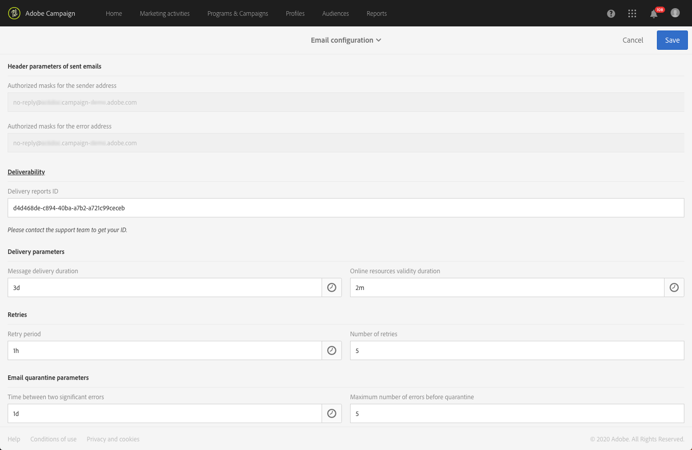
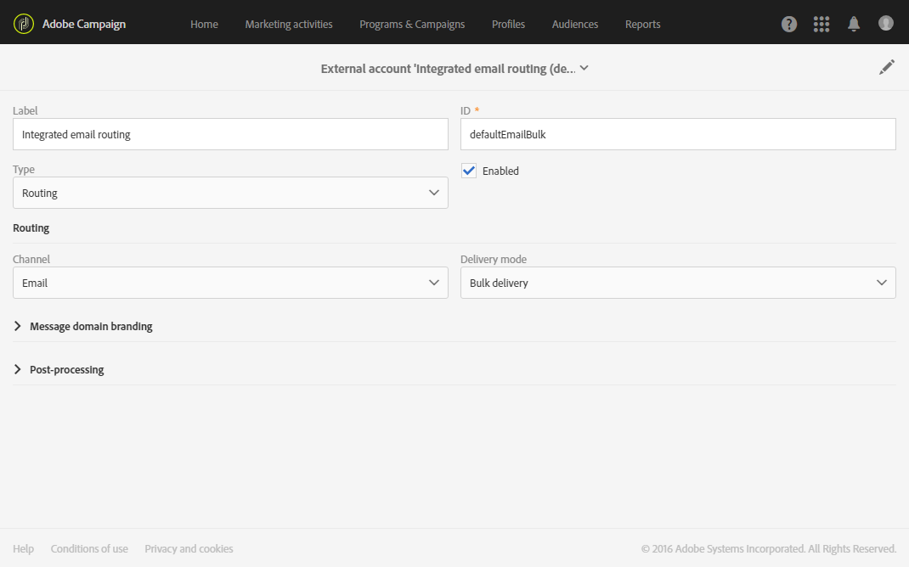
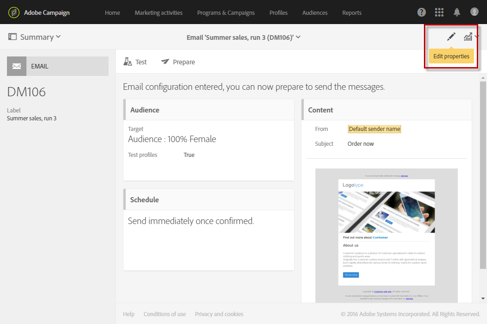
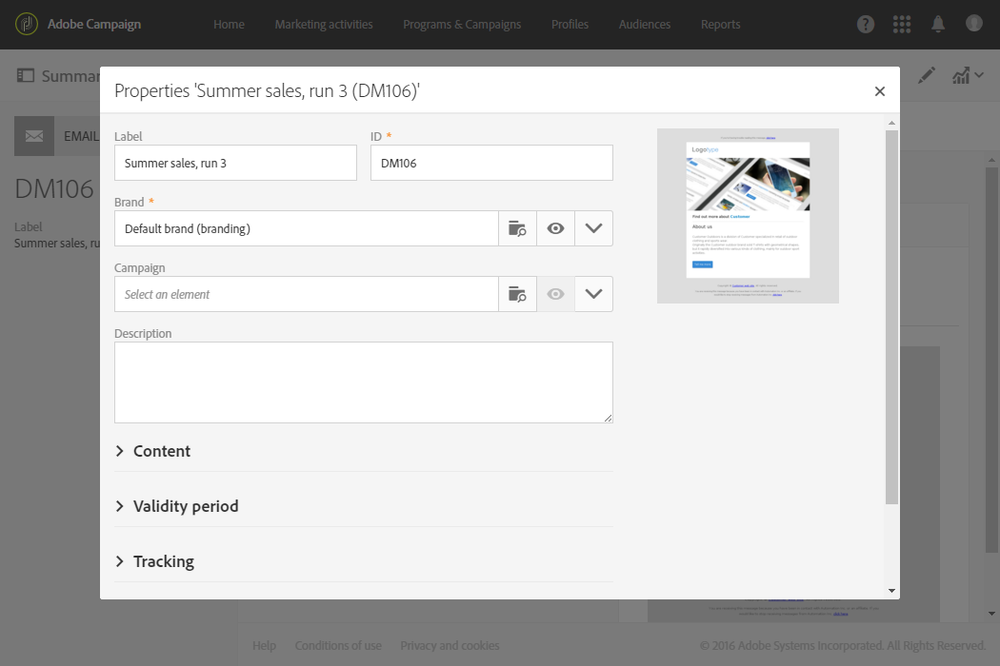
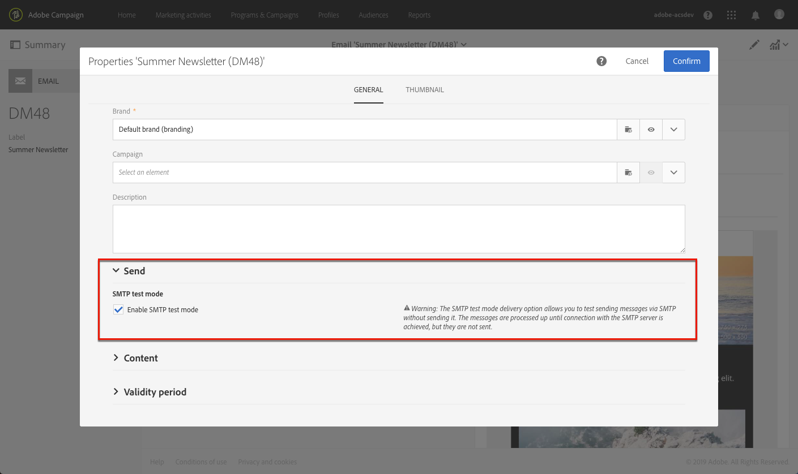
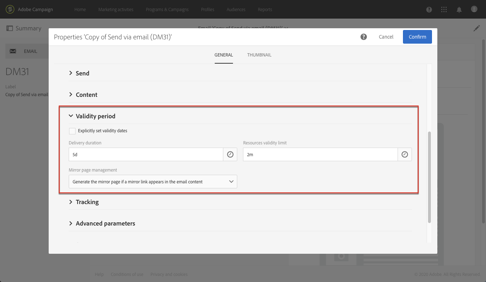
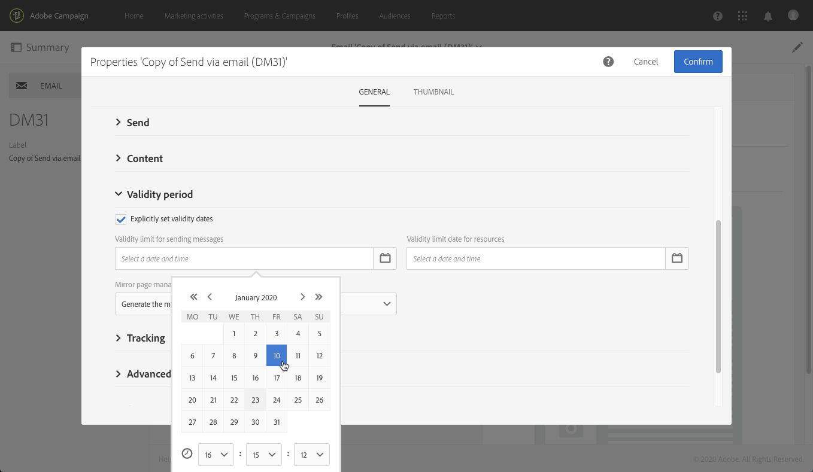
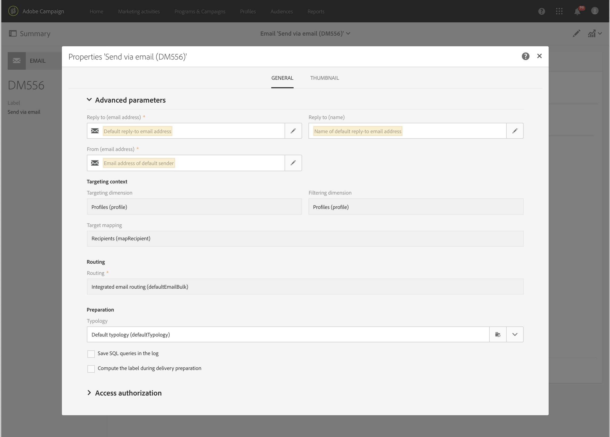

# E-mailkanaal configureren{#configuring-email-channel}

Als beheerder van de Campagne , kunt u de montages van het e-mailkanaal vormen. Deze geavanceerde instellingen zijn onder andere algemene parameters voor e-mailkanalen, accounts voor het routeren van e-mail, verwerkingsregels voor e-mail en e-maileigenschappen. Leer op deze pagina hoe u de standaardwaarden voor de algemene e-mail en het verzenden van parameters kunt bewerken.

## Parameters e-mailkanaal {#email-channel-parameters}

In het configuratiescherm voor e-mail kunt u de parameters voor het e-mailkanaal definiëren. Beheerders hebben toegang tot deze configuraties via het menu **[!UICONTROL Administration]> [!UICONTROL Channels] > [!UICONTROL Email] >[!UICONTROL Configuration]** .

* **Gemachtigde maskergebieden**

  In de sectie **[!UICONTROL Header parameters of sent emails]** worden de geoorloofde e-mailadressen weergegeven die u kunt gebruiken om e-mails naar uw ontvangers te verzenden (het adres van de afzender) en om hen in staat te stellen geautomatiseerde antwoorden zoals asynchrone stuitingen, uit-van-bureauantwoorden, enz. terug te sturen. (foutadres).

  Adobe Campaign controleert of de ingevoerde adressen geldig zijn tijdens de voorbereiding van berichten. Deze werkende wijze zorgt ervoor dat geen adressen worden gebruikt die leveringskwesties konden teweegbrengen.

   * Zowel de afzender als de foutenadressen worden opstelling door Adobe. Deze velden mogen niet leeg zijn.
   * U kunt deze velden niet bewerken. Neem contact op met het Adobe-team voor klantenservice als u een adres wilt bijwerken.
   * Om een ander adres toe te voegen, kunt u [ Controlebord van de Campagne ](https://experienceleague.adobe.com/docs/control-panel/using/subdomains-and-certificates/setting-up-new-subdomain.html) gebruiken aan opstelling een nieuw subdomain, of het team van de Zorg van de Klant van Adobe contacteren. Als u meerdere maskers gebruikt, worden deze door komma&#39;s van elkaar gescheiden.
   * Het is een goede praktijk om adressen te plaatsen gebruikend een ster zoals **@yourdomain.com**: het laat u toe om het even welk adres te gebruiken dat met uw subdomeinnaam beëindigt.

* **Leverbaarheid**

  Het **[!UICONTROL Delivery reports ID]** wordt geleverd door het Adobe-team voor klantenservice. Het identificeert elk geval met een leverability identiteitskaart die in de technische leveringsrapporten wordt gebruikt.
  <!--The Technical Deliverability report is not accessible through the UI in ACS. It will be replaced with 250ok in the future (project starting).-->

* **Parameters van de Levering**

  Adobe Campaign verzendt de berichten die beginnen op de begindatum.

  Wanneer een bericht in een levering wegens een tijdelijke fout of een zachte stuit wordt verworpen, probeert de Campagne opnieuw om dit bericht elke dag te verzenden. Gebruik het veld **[!UICONTROL Message delivery duration]** om het tijdframe op te geven wanneer opnieuw wordt geprobeerd.

  >[!IMPORTANT]
  >
  >**Deze parameter in Campagne wordt nu slechts gebruikt als reeks aan 3.5 dagen of minder.** Als u een waarde definieert die hoger is dan 3,5 dagen, wordt hiermee geen rekening gehouden.

  Het veld **[!UICONTROL Online resources validity duration]** wordt gebruikt voor geüploade bronnen, voornamelijk voor de spiegelpagina en afbeeldingen. De bronnen op deze pagina zijn gedurende een beperkte tijd geldig (om schijfruimte te besparen).

* **probeert opnieuw**

  Voor tijdelijk onafgeleverde berichten moet u het opnieuw proberen. Voor meer op dit, zie [ opnieuw na een tijdelijke mislukking van de levering ](../../sending/using/understanding-delivery-failures.md#retries-after-a-delivery-temporary-failure).

  >[!IMPORTANT]
  >
  >Het maximumaantal uit te voeren pogingen en de minimumvertraging tussen opnieuw proberen zijn nu gebaseerd op hoe goed IP zowel historisch als momenteel bij een bepaald domein uitvoert. De instellingen **[!UICONTROL Retry period]** en **[!UICONTROL Number of retries]** in Campagne worden genegeerd.

  <!--This section indicates how many retries should be performed the day after the send is started (**Number of retries**) and the minimum delay between retries (**Retry period**). By default, five retries are scheduled for the first day with a minimum interval of one hour, spread out over the 24 hours of the day. One retry per day is programmed after that and until the delivery deadline, which is defined in the **[!UICONTROL Delivery parameters]** section.-->

* **de parameters van de E-mail quarantaine**

  Voer in het veld **[!UICONTROL Time between two significant errors]** een waarde in om de tijd te definiëren die de toepassing wacht voordat de foutenteller wordt verhoogd in het geval van een fout met zachte vlag. De standaardwaarde is **&quot;1d&quot;**, voor 1 dag.

  Wanneer de waarde **[!UICONTROL Maximum number of errors before quarantine]** is bereikt, wordt het e-mailadres in quarantaine geplaatst. De standaardwaarde is **&quot;5&quot;**: het adres is quarantined op de vijfde fout. Dit betekent dat het contact automatisch van volgende leveringen wordt uitgesloten.
  <!--Actually the way ACS works is that the address is already on the quarantine list on the first bounce, but with a different status meaning that the error count has started.-->

  Voor meer op quarantines, zie [ Begrijpend quarantainebeheer ](../../sending/using/understanding-quarantine-management.md).

## E-mailrouteringsaccounts {#email-routing-accounts}

De externe account van **[!UICONTROL Integrated email routing]** wordt standaard verschaft. Het bevat de technische parameters waarmee de toepassing e-mailberichten kan verzenden.

Het accounttype moet altijd worden ingesteld op **[!UICONTROL Routing]** , het kanaal op **[!UICONTROL Email]** en de leveringsmodus op **[!UICONTROL Bulk delivery]** .

**Verwante onderwerp**:

[Externe rekeningen](../../administration/using/external-accounts.md)

## E-mailverwerkingsregels {#email-processing-rules}

Beheerders hebben toegang tot **[!UICONTROL Email processing rules]** via het menu **[!UICONTROL Administration > Channels > Email]** .

>[!IMPORTANT]
>
>De e-maildomeinen en de MX regels worden nu automatisch beheerd <!--by the Adobe Campaign Enhanced MTA (Message Transfer Agent)--> en kunnen niet worden veranderd.

* **DKIM (DomainKeys Identified Mail) {het ondertekenen van de 1} e-mailauthentificatie wordt gedaan voor alle berichten met alle domeinen.** Het ondertekent niet met **identiteitskaart van de Afzender**, **DomainKeys**, of **S/MIME**.
* MX-regels passen uw doorvoer automatisch aan per domein op basis van uw eigen historische e-mailreputatie en de real-time feedback uit de domeinen waar u e-mails verzendt.

<!--
Note that the email domains and the MX rules are now managed by the Adobe Campaign Enhanced MTA:
* **DKIM (DomainKeys Identified Mail)** email authentication signing is done by the Enhanced MTA for all messages with all domains. It does not sign with **Sender ID**, **DomainKeys**, or **S/MIME** unless otherwise specified at the Enhanced MTA level.
* The Enhanced MTA uses its own MX rules that allow it to customize your throughput by domain based on your own historical email reputation, and on the real-time feedback coming from the domains where you are sending emails.
-->

### Stuitberichten {#bounce-mails}

Asynchrone stuitingen worden nog steeds gekwalificeerd door het Campagne inMail-proces via de **[!UICONTROL Bounce mails]** -regels.

Deze regels bevatten de lijst van karakterkoorden die door verre servers kunnen zijn teruggekeerd en die u de fout (**Vaste** laten kwalificeren, **Zacht** of **Genegeerd**).

>[!IMPORTANT]
>
>De synchrone de foutenmeldingen van de leveringsmislukking worden nu gekwalificeerd door Adobe Campaign Verbeterde MTA, die het stuitertype en de kwalificatie bepaalt, en die informatie terugstuurt naar Campagne.

Voor meer op de kwalificatie van de stuiterende post, zie deze [ sectie ](../../sending/using/understanding-delivery-failures.md#bounce-mail-qualification).

<!--
Because they are now managed by the Enhanced MTA, the bounce qualifications in the Campaign **[!UICONTROL Message qualification]** table are no longer used. For more on bounce mail qualification, see this [section](../../sending/using/understanding-delivery-failures.md#bounce-mail-qualification).

### Management of email domains {#managing-email-domains}

The email domains are now managed by the Adobe Campaign Enhanced MTA. The Adobe Campaign **[!UICONTROL Domain management]** rules are no longer used.

**DKIM (DomainKeys Identified Mail)** email authentication signing is done by the Enhanced MTA for all messages with all domains. It does not sign with **Sender ID**, **DomainKeys**, or **S/MIME** unless otherwise specified at the Enhanced MTA level.

### MX management {#mx-management}

The MX rules are now managed by the Adobe Campaign Enhanced MTA. The Adobe Campaign **[!UICONTROL MX management]** delivery throughput rules are no longer used.

The Enhanced MTA uses its own MX rules that allow it to customize your throughput by domain based on your own historical email reputation, and on the real-time feedback coming from the domains where you are sending emails.
-->

## Lijst met e-maileigenschappen {#list-of-email-properties}

In deze sectie wordt de lijst met parameters weergegeven die beschikbaar is in het eigenschappenscherm van een e-mail- of e-mailsjabloon.

>[!NOTE]
>
>Sommige parameters zijn alleen beschikbaar in sjablonen. De parameters u tot [ kunt toegang hebben hangen van uw toestemmingen ](../../administration/using/users-management.md) af.

Met de knop **[!UICONTROL Edit properties]** kunt u de eigenschappen van een e-mailsjabloon of een e-mailsjabloon bewerken.

### Algemene parameters {#general-parameters}

Identificeer boven aan het parameterscherm E-mail de e-mail met de velden **[!UICONTROL Label]** en **[!UICONTROL ID]** . Deze informatie verschijnt in de interface maar is niet zichtbaar aan de berichtontvangers.

>[!IMPORTANT]
>
>De id moet uniek zijn.

Gebruik het veld **[!UICONTROL Brand]** om het merk te selecteren dat aan de levering is gekoppeld. Voor meer informatie bij het gebruiken van en het vormen van merken, verwijs naar [ Brandend ](../../administration/using/branding.md) sectie.

Voer in het veld **[!UICONTROL Campaign]** de campagne in die aan de e-mail is gekoppeld.

U kunt ook een **[!UICONTROL Description]** toevoegen in het desbetreffende veld en de afbeelding bewerken die wordt weergegeven in de miniatuur van de e-mail in de lijsten.

### Parameters verzenden {#sending-parameters}

De sectie **[!UICONTROL Send]** is alleen beschikbaar voor e-mailsjablonen. Het bevat de volgende parameters:

#### Parameters opnieuw {#retries-parameters}

Voor tijdelijk onafgeleverde berichten moet u het opnieuw proberen. Voor meer op dit, zie [ opnieuw na een tijdelijke mislukking van de levering ](../../sending/using/understanding-delivery-failures.md#retries-after-a-delivery-temporary-failure).

>[!IMPORTANT]
>
>De minimale vertraging tussen pogingen en het maximumaantal uit te voeren pogingen zijn nu gebaseerd op hoe goed IP zowel historisch als momenteel bij een bepaald domein uitvoert. De instellingen **[!UICONTROL Retry period]** en **[!UICONTROL Max. number of retries]** in Campagne worden genegeerd.

De **leveringsduur die** plaatsen (in de [ wordt bepaald de parameterparameters van de Geldigheidsperiode ](#validity-period-parameters) sectie) **opstelling in Campagne zal nog maar slechts tot 3.5 dagen** worden geëerd. Op dat punt, zal om het even welk bericht in de herprobeer rij worden verwijderd uit de rij en terug als stuiteren. Voor meer op leveringsmislukkingen, zie deze [ sectie ](../../sending/using/understanding-delivery-failures.md#about-delivery-failures).

#### Parameters voor e-mailindeling {#email-format-parameters}

U kunt de indeling van de te verzenden e-mails configureren. Er zijn drie opties beschikbaar:

* **de ontvankelijke voorkeur van het Gebruik** (standaardwijze): het berichtformaat wordt bepaald volgens de gegevens die in het ontvankelijke profiel worden opgeslagen en door gebrek in het **E-mail formaat** gebied (@emailFormat) worden opgeslagen. Als een ontvanger berichten in een bepaald formaat wenst te ontvangen, is dit het verzonden formaat. Als het veld niet is ingevuld, wordt een meerdelig alternatief bericht verzonden (zie hieronder).
* **laat ontvankelijke postcliënt kiezen het meest aangewezen formaat (multipart-alternatief)**: het bericht bevat beide formaten: tekst en HTML. De indeling die bij ontvangst wordt weergegeven, is afhankelijk van de configuratie van de e-mailsoftware van de ontvanger (meerdelig-alternatief).

  >[!IMPORTANT]
  >
  >Deze optie omvat beide versies van het bericht. Het beïnvloedt daarom de leveringsproductie, omdat de berichtgrootte groter is.

* **verzend alle berichten in tekstformaat**: het bericht wordt verzonden in tekstformaat. De HTML-indeling wordt niet verzonden, maar wordt alleen voor de spiegel gebruikt wanneer de ontvanger op de koppeling in het bericht klikt.

#### SMTP-testmodus {#smtp-test-mode}

Met de optie **[!UICONTROL Enable SMTP test mode]** kunt u het verzenden van e-mails via een SMTP-verbinding testen zonder dat er daadwerkelijk berichten worden verzonden. De levering wordt verwerkt tot verbinding aan de server SMTP maar niet verzonden: voor elke ontvanger van de levering, verbindt de Campagne met de SMTP leverancierserver, voert SMTP RCPT aan bevel uit, en sluit de verbinding vóór het bevel SMTP DATA.

Deze optie is beschikbaar voor e-mails en e-mailsjablonen.

Als u de optie van de SMTP testwijze voor een e-mailmalplaatje toelaat, zullen alle e-mailberichten die van dit malplaatje worden gecreeerd deze optie toegelaten hebben.

>[!IMPORTANT]
>
>Als deze optie is ingeschakeld voor een e-mailbericht, worden er geen berichten verzonden totdat deze zijn uitgeschakeld.
>Er wordt een waarschuwing weergegeven in het dashboard voor de sjabloon E-mail of E-mail.

Voor meer informatie bij het vormen van SMTP, verwijs naar de [ Lijst van de parameters SMTP van e-mail ](#list-of-email-smtp-parameters) sectie.

### Geldigheidsperiode {#validity-period-parameters}

De sectie **[!UICONTROL Validity period]** bevat de volgende parameters:

* **[!UICONTROL Explicitly set validity dates]** : als dit selectievakje is uitgeschakeld, moet u een duur invoeren in de velden **[!UICONTROL Delivery duration]** en **[!UICONTROL Resource validity limit]** .

  Schakel dit selectievakje in als u specifieke tijden en datums wilt definiëren.

  

* **[!UICONTROL Delivery duration]** / **[!UICONTROL Validity limit for sending messages]** : Adobe Campaign verzendt de berichten die beginnen op de begindatum. In dit veld kunt u opgeven gedurende welke periode de berichten kunnen worden verzonden.

  >[!IMPORTANT]
  >
  >**u moet een waarde tot 3.5 dagen bepalen.** Als u een waarde instelt die hoger is dan 3,5 dagen, wordt hiermee geen rekening gehouden.
  >
  >De parameter **[!UICONTROL Delivery duration]** is niet van toepassing op transactieberichten. Voor meer op transactioneel overseinen, zie [ deze sectie ](../../channels/using/getting-started-with-transactional-msg.md).

* **[!UICONTROL Resource validity duration]** / **[!UICONTROL Validity limit date for resources]** : dit veld wordt gebruikt voor geüploade bronnen, voornamelijk voor de spiegelpagina en afbeeldingen. De bronnen op deze pagina zijn gedurende een beperkte tijd geldig (om schijfruimte te besparen).
* **[!UICONTROL Mirror page management]** : de spiegelpagina is een HTML-pagina die online via een webbrowser toegankelijk is. De inhoud is identiek aan de e-mailinhoud. Standaard wordt de spiegelpagina gegenereerd als de koppeling wordt ingevoegd in de e-mailinhoud. Met dit veld wijzigt u de manier waarop deze pagina wordt gegenereerd:

   * **[!UICONTROL Generate the mirror page if a mirror link appears in the email content]** (standaardmodus): de spiegelpagina wordt gegenereerd als de koppeling in de e-mailinhoud wordt ingevoegd.
   * **dwingt de generatie van de spiegelpagina** af: zelfs als geen verbinding aan de spiegelpagina in de berichten wordt opgenomen, zal de spiegelpagina worden gecreeerd.
   * **produceert niet de spiegelpagina**: geen spiegelpagina wordt geproduceerd, zelfs als de verbinding in de berichten is.
   * **produceer een spiegel toegankelijke pagina gebruikend slechts bericht identiteitskaart**: deze optie laat u tot de inhoud van de spiegelpagina, met verpersoonlijkingsinformatie, in het venster van het leveringslogboek toegang hebben.

  >[!IMPORTANT]
  >
  >De spiegelpagina wordt alleen gegenereerd als er voor de e-mail HTML-inhoud is gedefinieerd.
  >

### Parameters bijhouden {#tracking-parameters}

De sectie **[!UICONTROL Tracking]** bevat de volgende parameters:

* **[!UICONTROL Activate tracking]**: gebruik deze optie om bericht-URL&#39;s te activeren/deactiveren. Als u de URL van elk bericht wilt bijhouden, gebruikt u het pictogram **[!UICONTROL Links]** op de actiebalk E-mail-Designer. Zie [ Ongeveer bijgehouden URLs ](../../designing/using/links.md#about-tracked-urls).
* **[!UICONTROL Tracking validity limit]**: gebruik deze optie om de duur te bepalen waarvoor het volgen op URLs zal worden geactiveerd.
* **[!UICONTROL Substitution URL for expired URLs]**: gebruik deze optie om een URL naar een terugvalwebpagina in te voeren: deze wordt weergegeven zodra de tekstspatiëring is verlopen.
* **[!UICONTROL Use tracking pixel at the top of email]**: gebruik deze optie om de volgende pixel boven aan het e-mailbericht in plaats van onderaan te plaatsen. Deze pixel bevindt zich standaard onder aan uw e-mailberichten. Als u grote berichten verzendt, kunt u deze pixel boven aan uw e-mails in plaats van onder aan de e-mail verplaatsen om het bijhouden van de gegevens te verbeteren. Anders kan de pixel voor het bijhouden van de berichten door sommige e-mailproviders worden geknipt.

### Geavanceerde parameters {#advanced-parameters}

De sectie **[!UICONTROL Advanced parameters]** bevat meerdere parameters.

In de eerste velden kunt u informatie invoeren die nodig is om e-mailkopteksten uit te werken. U kunt hier het antwoordadres en de tekst evenals het afzenderadres beheren (dat het gebied &quot;van:&quot;vult). Deze informatie kan worden gepersonaliseerd.

Klik op de knop rechts van het veld dat wordt gewijzigd en voeg vervolgens het verpersoonlijkingsveld, het inhoudsblok of dynamische tekst toe.

Het opnemen van en het gebruiken van de verpersoonlijkingsinhoud wordt gedetailleerd in [ Personaliserend e-mailinhoud ](../../designing/using/personalization.md) documentatie.

#### Doelcontext {#target-context}

Gebruik de het richten context om een reeks lijsten te bepalen die voor e-mail het richten (in het scherm van de publieksdefinitie) en verpersoonlijking zullen worden gebruikt (bepalend verpersoonlijkingsgebieden in de de inhoudsredacteur van HTML).

#### Routering {#routing}

Dit gebied wijst op de verpletterende gebruikte wijze. Het verwijst naar een externe rekening. Dit kan bijvoorbeeld worden gebruikt als u een externe account wilt gebruiken die specifieke brandingconfiguraties bevat.

>[!NOTE]
>
>De externe rekeningen zijn toegankelijk via het **Beleid** > **montages van de Toepassing** > **Externe rekeningen** menu.

#### Voorbereiding {#preparation}

Het voorbereiden van berichten wordt gedetailleerd in [ goedkeurend berichten ](../../sending/using/preparing-the-send.md) sectie.

* **[!UICONTROL Typology]**: voordat berichten worden verzonden, moeten berichten worden voorbereid om de inhoud en configuratie te valideren. De verificatieregels die tijdens de voorbereidingsfase worden toegepast worden bepaald in a **typologie**. Voor e-mails betekent voorbereiding bijvoorbeeld dat het onderwerp, de URL&#39;s en afbeeldingen worden gecontroleerd. Selecteer de typologie die u wilt toepassen in dit veld.

  >[!NOTE]
  >
  >Typologieën, die via **[!UICONTROL Administration]** > **[!UICONTROL Channels]** > **[!UICONTROL Typologies]** menu kunnen worden betreden, worden voorgesteld in [ deze sectie ](../../sending/using/about-typology-rules.md).

* **[!UICONTROL Compute the label during delivery preparation]**: gebruik deze optie om de labelwaarde van de e-mail tijdens de voorbereidingsfase van het bericht te berekenen met gebruik van verpersoonlijkingsvelden, inhoudsblokken en dynamische tekst.

  Het is ook mogelijk om het leveringsetiket met gebeurtenisvariabelen te personaliseren die in de externe signaalactiviteit van het werkschema zijn verklaard. Voor meer op dit, verwijs naar [ deze sectie ](../../automating/using/calling-a-workflow-with-external-parameters.md).

* **[!UICONTROL Save SQL queries in the log]**: gebruik deze optie om SQL vraaglogboeken in het dagboek tijdens de voorbereidingsfase toe te voegen.

#### Proefinstellingen {#proof-settings}

In deze sectie kunt u het standaardvoorvoegsel configureren voor gebruik op de onderwerpregel van de proefberichten. Leer meer over proeven in [ deze sectie ](../../sending/using/sending-proofs.md).

### Lijst met SMTP-parameters voor e-mail {#list-of-email-smtp-parameters}

De sectie **[!UICONTROL SMTP]** bevat de volgende parameters:

* **[!UICONTROL Character encoding]** : schakel het selectievakje **[!UICONTROL Force encoding]** in als u berichtcodering wilt forceren en selecteer vervolgens de gewenste codering.
* **[!UICONTROL Bounce mails]**: standaard worden stuiterende mails ontvangen in het foutvak van het platform (gedefinieerd in het scherm **[!UICONTROL Administration]** > **[!UICONTROL Channels]** > **[!UICONTROL Email]** > **[!UICONTROL Configuration]** ). Als u een specifiek foutadres voor een e-mailbericht wilt definiëren, voert u het adres in het veld **[!UICONTROL Error address]** in.
* **[!UICONTROL Additional SMTP headers]**: met deze optie kunnen extra SMTP-headers aan uw berichten worden toegevoegd. Het manuscript ingegaan op het **[!UICONTROL Headers]** gebied moet één kopbal per lijn, in de vorm van **naam:value** van verwijzingen voorzien. Waarden worden indien nodig automatisch gecodeerd.

  >[!IMPORTANT]
  >
  >Het toevoegen van een manuscript voor het opnemen van extra kopballen SMTP is gereserveerd voor gevorderde gebruikers. De syntaxis van dit script moet voldoen aan de vereisten van dit inhoudstype: geen ongebruikte spatie, geen lege regel, enz.

  Vanaf 1 juni 2024, Google en Yahoo! zal afzenders vereisen om **te voldoen één-Klik lijst-Unsubscribe**. De campagne steunt dit vermogen uit-van-de-doos voor leveringsmalplaatjes.

  Om **toe te passen één-Klik lijst-opzegt** op alle niet-malplaatje e-mailleveringen, moet u het **[!UICONTROL Copy headers from delivery templates]** technische werkschema in werking stellen. [ Leer meer ](technical-workflows.md)

  >[!CAUTION]
  >
  >Als u de kopbalwaarde in **[!UICONTROL Additional SMTP headers]** van uw e-mailmalplaatjes wijzigt, kon het de naleving met **breken één-Klik lijst-opzeggen** vereiste van Google en Yahoo!.

### Lijst van parameters voor toegangsvergunningen {#list-of-access-authorization-parameters}

De sectie **[!UICONTROL Access authorization]** bevat de volgende parameters:

* Met het veld **[!UICONTROL Organizational unit]** wordt de toegang tot deze e-mail beperkt tot bepaalde gebruikers. De gebruikers die zijn gekoppeld aan de opgegeven eenheid of bovenliggende eenheden hebben lees- en schrijftoegang tot deze e-mail. Gebruikers die zijn gekoppeld aan onderliggende eenheden hebben alleen leestoegang tot deze e-mail.

  >[!NOTE]
  >
  >U kunt organisatorische eenheden via het **Beleid** vormen > **Gebruikers &amp; het menu van de Veiligheid**.

* De velden **[!UICONTROL Created by]** , **[!UICONTROL Created]** , **[!UICONTROL Modified by]** en **[!UICONTROL Last modified]** worden automatisch ingevuld.

## Oudere instellingen {#legacy-settings}

Als u **NIET** in werking stelt de recentste versie van Campagne, zijn de hieronder beschreven parameters en secties UI nog op u van toepassing.

### Opnieuw {#legacy-retries}

De **[!UICONTROL Retries]** montages in het [ menu van de Configuratie ](#email-channel-parameters) en in de [ Verzendende parameters ](#retries-parameters) van de e-maileigenschappen wijzen erop hoeveel herpogingen de dag zouden moeten worden uitgevoerd nadat verzendt (**[!UICONTROL Number of retries]** / **[!UICONTROL Max. number of retries]**) en de minimumvertraging tussen herpogingen (**[!UICONTROL Retry period]**) is begonnen.

Het aantal pogingen kan globaal worden veranderd (contacteer uw technische beheerder van Adobe) of voor elke levering of leveringsmalplaatje.

Door gebrek, zijn vijf herpogingen gepland voor de eerste dag met een minimuminterval van één uur, uitgespreid zich over de 24 uren van de dag. Één opnieuw probeert per dag wordt geprogrammeerd na dat en tot de leveringsdeadline, die globaal in de **[!UICONTROL Delivery parameters]** sectie van het **[!UICONTROL Configuration]** menu, of in de **[!UICONTROL Validity period]** sectie op het leveringsniveau (zie de [ sectie van de Duur van de Levering ](#legacy-delivery-duration) hieronder) wordt bepaald.

### Leveringsduur {#legacy-delivery-duration}

Gebruik de **[!UICONTROL Message delivery duration]** parameter in het [ menu van de Configuratie ](#email-channel-parameters) om het tijdkader te specificeren waarin om het even welk bericht in de levering die een tijdelijke fout of zachte stuit ontmoet opnieuw zal worden geprobeerd.

Gebruik de **[!UICONTROL Delivery duration]** of **[!UICONTROL Validity limit for sending messages]** parameter in de [ sectie van de de parameterparameters van de Geldigheidsperiode ](#validity-period-parameters) om de duur te specificeren waarin de berichten kunnen worden verzonden.

### E-mailverwerkingsregels {#legacy-email-processing-rules}

De **[!UICONTROL MX management]** -, **[!UICONTROL Bounce mails]** - en **[!UICONTROL Domain management]** -regels kunnen door beheerders worden benaderd en gewijzigd via het menu **[!UICONTROL Administration > Channels > Email > Email processing rules]** . [ Leer meer ](#email-processing-rules)

### Bounce mail-kwalificatie {#legacy-bounce-mail-qualification}

Om van de diverse grenzen, en hun bijbehorende foutentypes en redenen een lijst te maken, klik het **Adobe** embleem, in top-left, dan uitgezocht **[!UICONTROL Administration > Channels > Quarantines > Message qualification]**.

Stuiterwaarden kunnen de volgende kwalificatiestatus hebben:

* **[!UICONTROL To qualify]** : de stuiterende post moet worden gekwalificeerd. De kwalificatie moet door het leveringsteam worden gedaan om ervoor te zorgen dat de platformleverbaarheid correct functioneert. Zolang het niet wordt gekwalificeerd, wordt de stuiterende post niet gebruikt om de lijst van e-mailverwerkingsregels te verrijken.
* **[!UICONTROL Keep]**: de stuiterende post werd gekwalificeerd en zal door de **Update voor leverability** werkschema worden gebruikt om aan bestaande e-mailverwerkingsregels te worden vergeleken en de lijst te verrijken.
* **[!UICONTROL Ignore]**: de stuiterende post werd gekwalificeerd maar zal niet door de **Update voor leverability** werkschema worden gebruikt. Het wordt dus niet naar de clientinstanties verzonden.

>[!NOTE]
>
>In het geval van een stroomonderbreking van ISP, zullen de e-mails die door Campaign worden verzonden verkeerd als stegels worden gemerkt. U moet de stuiterkwalificatie bijwerken om dit te corrigeren. [Meer info](../../administration/using/update-bounce-qualification.md).

<!--Bounces are qualified through the **[!UICONTROL Bounce mails]** processing rule. For more on accessing this rule, refer to this [section](#legacy-bounce-mail-qualification).-->

### Rapportage van geleverde indicatoren {#legacy-delivered-status-report}

In de **[!UICONTROL Summary]** weergave van elk bericht gaat het **[!UICONTROL Delivered]** -percentage progressief omhoog gedurende de geldigheidsperiode van de levering, naarmate de zachte en harde grenzen worden gemeld.

Zachte berichten worden weergegeven als **[!UICONTROL Failed]** op de eerste dag na de levering. Deze berichten worden elke dag opnieuw geprobeerd, tot de geldigheidsperiode van de levering beëindigt.
