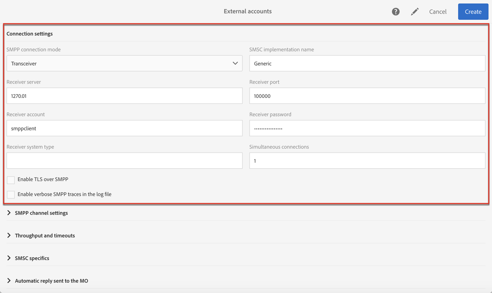
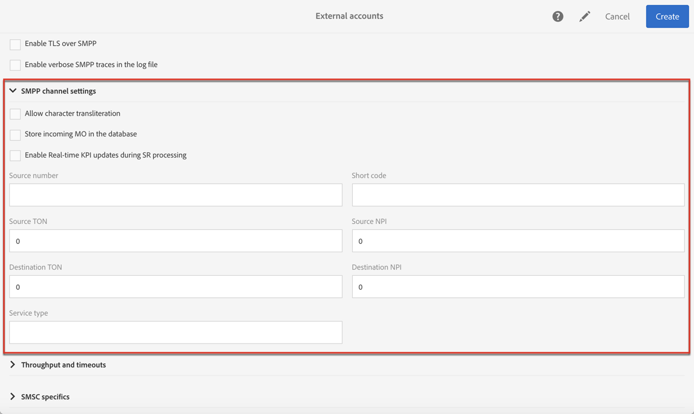

# Een sms-kanaal configureren{#configuring-sms-channel}

Een beheerder moet een of meer externe accounts configureren in het menu **[!UICONTROL Administration]** > **[!UICONTROL Channels]** > **[!UICONTROL SMS]** > **[!UICONTROL SMS accounts]** voor het verzenden van sms-berichten.

De stappen voor het maken en wijzigen van een extern account worden beschreven in de sectie [Externe accounts](../../administration/using/external-accounts.md). Hieronder vindt u de parameters die specifiek zijn voor externe accounts bij het verzenden van sms-berichten.

## Een sms-routering bepalen {#defining-an-sms-routing}

Het externe account **[!UICONTROL SMS routing via SMPP]** wordt standaard opgegeven, maar het kan nuttig zijn om andere accounts toe te voegen.

Als u het SMPP-protocol wilt gebruiken, kunt u ook een nieuw extern account maken. Voor meer informatie over het protocol en instellingen van sms raadpleegt u deze [technische opmerking](https://helpx.adobe.com/campaign/kb/sms-connector-protocol-and-settings.html).

1. Maak een nieuw extern account vanaf **[!UICONTROL Administration > Application settings > External accounts]**.
1. Definieer het accounttype als **[!UICONTROL Routing]**, het kanaal als **[!UICONTROL Mobile (SMS)]** en de leveringsmodus als **[!UICONTROL Bulk delivery]**.

   

1. Definieer de verbindingsinstellingen.

   Als u de verbindingsinstellingen wilt invoeren die specifiek zijn voor het verzenden van sms-berichten, neemt u contact op met uw sms-serviceprovider die u zal uitleggen hoe u de verschillende velden voor externe accounts moet invullen.

   

   Met de optie **[!UICONTROL Enable TLS over SMPP]** kunt u SMPP-verkeer versleutelen.

   Met **[!UICONTROL Enable verbose SMPP traces in the log file]** kunt u al het SMPP-verkeer in logboekbestanden dumpen. Deze optie moet zijn ingeschakeld om problemen met de connector op te lossen en om vergelijkingen te maken met het verkeer dat door de provider wordt waargenomen.

1. Neem contact op met Adobe om de waarde te verkrijgen die u in het veld **[!UICONTROL SMS-C implementation name]** moet invoeren, afhankelijk van de gekozen provider.
1. Geef de instellingen voor het SMPP-kanaal op. In de sectie [Sms-codering en -indelingen](#sms-encoding-and-formats) vindt u meer informatie.

   Schakel **[!UICONTROL Store incoming MO in the database]** in als u alle binnenkomende sms-berichten in de tabel voor binnenkomende sms-berichten wilt opslaan. Raadpleeg deze [sectie](../../channels/using/managing-incoming-sms.md#storing-incoming-sms) voor meer informatie over het ophalen van uw binnenkomende sms-berichten.

   Met de optie **[!UICONTROL Enable Real-time KPI updates during SR processing]** kunnen de KPI’s voor **[!UICONTROL Delivered]** of **[!UICONTROL Bounces + Errors]** in real time worden bijgewerkt nadat de levering is verzonden. Deze KPI’s vindt u in het venster **[!UICONTROL Deployment]** en ze worden direct herberekend vanaf het SR (statusrapport) dat van de provider wordt ontvangen.

   

1. Definieer de parameters **[!UICONTROL Throughput and timeouts]**.

   U kunt de maximale doorvoer van uitgaande berichten (‘MT’ of Mobile Terminated) in MT per seconde specificeren. Als u ‘0’ invoert in het overeenkomstige veld, is de doorvoer onbeperkt.

   De waarden van alle velden die corresponderen met een tijdsduur, moeten in seconden worden ingevuld.

1. Definieer de specifieke parameters voor SMSC wanneer u een specifieke coderingstoewijzing moet definiëren. Raadpleeg de sectie met [SMSC-specificaties](#smsc-specifics) voor meer informatie.

   Schakel de optie **[!UICONTROL Send full phone number (send characters other than digits)]** in als u het SMPP-protocol niet wilt naleven en het voorvoegsel **[!UICONTROL +]** wilt overdragen naar de server van de sms-provider (SMSC).

   Aangezien bepaalde providers echter het gebruik van het voorvoegsel **[!UICONTROL +]** vereisen, wordt u geadviseerd contact op te nemen met uw provider, die u zal aanraden om deze optie zo nodig in te schakelen.

1. Definieer zo nodig automatische antwoorden om acties te activeren op basis van de content van een antwoord. Raadpleeg [deze sectie](../../channels/using/managing-incoming-sms.md#managing-stop-sms) voor meer informatie.
1. Sla de configuratie van het externe account voor sms-routering op.

U kunt nu uw nieuwe routering gebruiken om sms-berichten te verzenden met Adobe Campaign.

## Sms-codering en -indelingen {#sms-encoding-and-formats}

### Sms-codering, -lengte en -transliteratie {#sms-encoding--length-and-transliteration}

Standaard voldoet het aantal tekens in een sms aan de gsm-standaarden (Global System for Mobile Communications).

Sms-berichten met gsm-codering mogen maximaal 160 tekens bevatten of 153 tekens per sms voor berichten die in meerdere delen worden verzonden.

>[!NOTE]
>
>Bepaalde tekens tellen als twee tekens: accolades, vierkante haakjes, het euroteken, enzovoort. De lijst met beschikbare gsm-tekens vindt u in de sectie [Tabel met tekens - gsm-standaard](#table-of-characters---gsm-standard).

Desgewenst kunt u tekentransliteratie autoriseren door het betreffende vakje in te schakelen.

Transliteratie houdt in dat een teken van een sms door een ander teken wordt vervangen wanneer dat teken niet in aanmerking wordt genomen door de gsm-standaard.

* Als transliteratie is **toegestaan**, wordt elk teken dat niet in aanmerking wordt genomen, vervangen door een gsm-teken wanneer het bericht wordt verzonden. De letter ‘ë’ wordt bijvoorbeeld vervangen door ‘e’. Het bericht is daarom enigszins gewijzigd, maar de tekenlimiet blijft hetzelfde.
* Wanneer transliteratie **niet is geautoriseerd**, wordt elk bericht dat tekens bevat die niet in aanmerking worden genomen, verzonden in binaire indeling (Unicode). Dit betekent dat alle tekens worden verzonden zoals ze zijn. De sms-berichten met Unicode zijn echter beperkt tot 70 tekens (of 67 tekens per sms voor berichten die in meerdere delen worden verzonden). Als het maximum aantal tekens wordt overschreden, worden verschillende berichten verzonden, wat extra kosten kan veroorzaken.

>[!IMPORTANT]
>
>Als u personalisatievelden invoegt in de content van uw sms-bericht, worden mogelijk tekens ingevoegd die niet in aanmerking worden genomen door de gsm-codering. Een contentvoorbeeld vindt u in de sectie [Sms-berichten personaliseren](../../channels/using/personalizing-sms-messages.md).

Standaard is transliteratie van tekens uitgeschakeld. Als u alle tekens in uw sms-berichten wilt behouden zoals ze zijn, bijvoorbeeld om geen eigennamen te wijzigen, wordt u aangeraden deze optie niet in te schakelen.

Als uw sms-berichten echter veel tekens bevatten die Unicode-berichten genereren, kunt u deze optie inschakelen om de kosten voor het verzenden van uw berichten te beperken.

### Tabel met tekens - gsm-standaard {#table-of-characters---gsm-standard}

In deze sectie vindt u de tekens die in aanmerking worden genomen door de gsm-standaard. Alle tekens die in de hoofdtekst van het bericht worden ingevoegd, met uitzondering van de onderstaande tekens, converteren het volledige bericht naar de binaire indeling (Unicode) en beperken het tot 70 tekens. Raadpleeg de sectie [Sms-codering, -lengte en -transliteratie](#sms-encoding--length-and-transliteration) voor meer informatie.

**Standaardtekens**

<table> 
 <tbody> 
  <tr> 
   <td> @  </td> 
   <td>    </td> 
   <td> SP  </td> 
   <td> 0  </td> 
   <td> ¡  </td> 
   <td> P  </td> 
   <td> ¿  </td> 
   <td> P  </td> 
  </tr> 
  <tr> 
   <td> £  </td> 
   <td> _  </td> 
   <td> !  </td> 
   <td> 1  </td> 
   <td> A  </td> 
   <td> Q  </td> 
   <td> a  </td> 
   <td> q  </td> 
  </tr> 
  <tr> 
   <td> $  </td> 
   <td>    </td> 
   <td> “  </td> 
   <td> 2  </td> 
   <td> B  </td> 
   <td> R  </td> 
   <td> b  </td> 
   <td> r  </td> 
  </tr> 
  <tr> 
   <td> ¥  </td> 
   <td>    </td> 
   <td> #  </td> 
   <td> 3  </td> 
   <td> C  </td> 
   <td> S  </td> 
   <td> c  </td> 
   <td> s  </td> 
  </tr> 
  <tr> 
   <td> è  </td> 
   <td>    </td> 
   <td> ¤  </td> 
   <td> 4  </td> 
   <td> D  </td> 
   <td> T  </td> 
   <td> d  </td> 
   <td> t  </td> 
  </tr> 
  <tr> 
   <td> é  </td> 
   <td>    </td> 
   <td> %  </td> 
   <td> 5  </td> 
   <td> E  </td> 
   <td> U  </td> 
   <td> e  </td> 
   <td> u  </td> 
  </tr> 
  <tr> 
   <td> ù  </td> 
   <td>    </td> 
   <td> &amp;  </td> 
   <td> 6  </td> 
   <td> F  </td> 
   <td> V  </td> 
   <td> f  </td> 
   <td> v  </td> 
  </tr> 
  <tr> 
   <td> ì  </td> 
   <td>    </td> 
   <td> ’  </td> 
   <td> 7  </td> 
   <td> G  </td> 
   <td> W  </td> 
   <td> g  </td> 
   <td> w  </td> 
  </tr> 
  <tr> 
   <td> ò  </td> 
   <td>    </td> 
   <td> (  </td> 
   <td> 8  </td> 
   <td> H  </td> 
   <td> X  </td> 
   <td> h  </td> 
   <td> x  </td> 
  </tr> 
  <tr> 
   <td> Ç  </td> 
   <td>    </td> 
   <td> )  </td> 
   <td> 9 </td> 
   <td> I  </td> 
   <td> Y  </td> 
   <td> i  </td> 
   <td> y  </td> 
  </tr> 
  <tr> 
   <td> LF  </td> 
   <td>    </td> 
   <td> *  </td> 
   <td> :  </td> 
   <td> J  </td> 
   <td> Z  </td> 
   <td> j  </td> 
   <td> z  </td> 
  </tr> 
  <tr> 
   <td> Ø  </td> 
   <td> ESC  </td> 
   <td> +  </td> 
   <td> ;  </td> 
   <td> K  </td> 
   <td> Ä  </td> 
   <td> k  </td> 
   <td> ä  </td> 
  </tr> 
  <tr> 
   <td> ø  </td> 
   <td> Æ  </td> 
   <td> ,  </td> 
   <td> &lt;  </td> 
   <td> L  </td> 
   <td> Ö  </td> 
   <td> l  </td> 
   <td> ö  </td> 
  </tr> 
  <tr> 
   <td> CR  </td> 
   <td> æ  </td> 
   <td> -  </td> 
   <td> = </td> 
   <td> M  </td> 
   <td> Ñ  </td> 
   <td> m  </td> 
   <td> ñ  </td> 
  </tr> 
  <tr> 
   <td> Å  </td> 
   <td> ß  </td> 
   <td> .  </td> 
   <td> &gt;  </td> 
   <td> N  </td> 
   <td> Ü  </td> 
   <td> n  </td> 
   <td> ü  </td> 
  </tr> 
  <tr> 
   <td> å  </td> 
   <td> É  </td> 
   <td> /  </td> 
   <td> ?  </td> 
   <td> O  </td> 
   <td> §  </td> 
   <td> o  </td> 
   <td> à  </td> 
  </tr> 
 </tbody> 
</table>

SP: Spatie

ESC: Escape

LF: Nieuwe regel

CR: Enter-teken

**Geavanceerde tekens (twee keer geteld)**

^ { } [ ~ ] | €

### SMSC-specificaties {#smsc-specifics}

>[!NOTE]
>
>Met deze opties kunt u de connector aanpassen om te werken met niet-standaard-SMSC (dit betekent dat de SMPP 3.4-specificatie niet exact wordt gevolgd) of specifieke coderingsvereisten. Deze opties mogen alleen door gevorderde gebruikers worden geconfigureerd.

Wanneer u een sms-bericht verzendt, kan Adobe Campaign een of meer tekstcoderingen gebruiken. Elke codering heeft een eigen specifieke tekenset en bepaalt het aantal tekens dat in een sms-bericht past.

In het veld **[!UICONTROL DATA_CODING]** kan Adobe Campaign met SMSC communiceren om aan te geven welke codering wordt gebruikt.

>[!NOTE]
>
>De toewijzing tussen de waarde **data_coding** en de werkelijk gebruikte codering wordt gestandaardiseerd. Niettemin hebben bepaalde SMSC’s hun eigen specifieke toewijzing. In dit geval moet uw **Adobe Campaign**-beheerder deze toewijzing declareren. Neem contact op met uw provider om meer informatie te krijgen.

Met de functionaliteit **[!UICONTROL Define a specific mapping of encodings]** kunt u **data_codings** declareren en zo nodig de codering forceren. Hiervoor geeft u één codering in de tabel op.

**Configuratie**

* Wanneer de functionaliteit **[!UICONTROL Define a specific mapping of encodings]** niet is ingeschakeld, vertoont de connector generiek gedrag.

   * Er wordt geprobeerd gsm-codering te gebruiken waaraan de waarde **data_coding = 0** wordt toegewezen.
   * Als gsm-codering mislukt, wordt **UCS2** -codering gebruikt waaraan de waarde **data_coding = 8** wordt toegewezen.

   

* Wanneer de functionaliteit **[!UICONTROL Define a specific mapping of encodings]** is ingeschakeld, kunt u de gewenste coderingen en de gekoppelde **[!UICONTROL data_coding]**-veldwaarden definiëren. Adobe Campaign probeert de eerste codering in de lijst te gebruiken, en daarna de volgende codering als de eerste codering niet mogelijk is.

   De volgorde van de declaratie is belangrijk. U wordt aangeraden de lijst in oplopende volgorde **van kosten** te plaatsen om voorrang te geven aan de coderingen, zodat u in elk sms-bericht zoveel mogelijk tekens kunt plaatsen.

   Declareer alleen de coderingen die u wilt gebruiken. Als sommige van de coderingen die door SMSC worden verstrekt niet aan uw gebruiksdoel beantwoorden, declareer deze dan niet in de lijst.

   

### Automatisch antwoord verzonden naar het MO-bericht {#automatic-reply-sent-to-the-mo}

Wanneer een profiel een sms-bericht beantwoordt dat via Campaign is verzonden, kunt u berichten configureren die automatisch naar het profiel worden teruggestuurd, evenals de actie die moet worden uitgevoerd.

Raadpleeg [deze sectie](../../channels/using/managing-incoming-sms.md) voor meer informatie.

## Sms-eigenschappen configureren {#configuring-sms-properties}

In deze sectie vindt u de lijst met parameters die uniek zijn voor sms in het eigenschappenscherm van een sms-levering of een sms-sjabloon.

De specifieke parameters voor het verzenden van sms-berichten worden opnieuw gegroepeerd in de secties **[!UICONTROL Send]** en **[!UICONTROL Advanced parameters]**.

From the **[!UICONTROL Advanced parameters]** section:

* Met de optie **[!UICONTROL From]** kunt u de naam van de afzender van het sms-bericht aanpassen met een reeks tekens. Dit is de naam die wordt weergegeven als de afzender van het sms-bericht op de mobiele telefoon van de ontvanger.

   Als dit veld leeg is, wordt het bronnummer gebruikt dat in het externe account is opgegeven. Als er geen bronnummer is opgegeven, wordt de korte code gebruikt. Het externe account specifiek voor sms-levering wordt in de sectie [Een sms-routering bepalen](#defining-an-sms-routing) opgegeven.

   

   >[!IMPORTANT]
   >
   >Controleer de wetgeving in uw land met betrekking tot het wijzigen van het adres van de afzender. Neem ook contact op met uw sms-serviceprovider om te controleren of deze deze functionaliteit aanbiedt.

Uit het **[!UICONTROL Send]** gedeelte van een SMS-sjabloon:

* Met de optie **[!UICONTROL Maximum number of SMS per message]** kunt u het aantal sms-berichten definiëren dat moet worden gebruikt om een bericht te verzenden. Als dit aantal wordt overschreden, wordt het bericht niet verzonden.

   >[!IMPORTANT]
   >
   >Als u personalisatievelden of voorwaardelijke tekst in de content van uw sms-bericht hebt ingevoegd, kunnen de lengte van het bericht en daarmee het aantal te verzenden sms-berichten verschillen afhankelijk van de ontvanger. Raadpleeg de sectie [Sms-berichten personaliseren](../../channels/using/personalizing-sms-messages.md) voor meer informatie.

   

* In het veld **[!UICONTROL Transmission mode]** kunt u de leveringsmethode voor sms-berichten bepalen:

   * **[!UICONTROL Saved on SIM card]**: Het bericht wordt opgeslagen op de simkaart van de telefoon van de ontvanger.
   * **[!UICONTROL Saved on mobile]**: Het bericht wordt opgeslagen op het interne geheugen van de telefoon.
   * **[!UICONTROL Flash]**: Het bericht wordt op de mobiele telefoon van de ontvanger getoond als een melding en verdwijnt vervolgens zonder dat het wordt opgeslagen.
