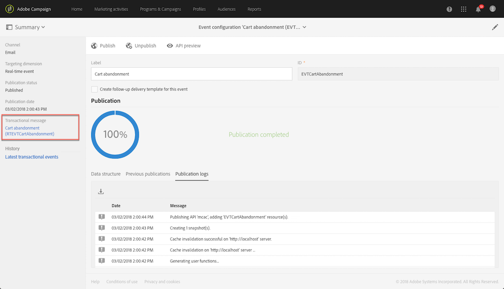
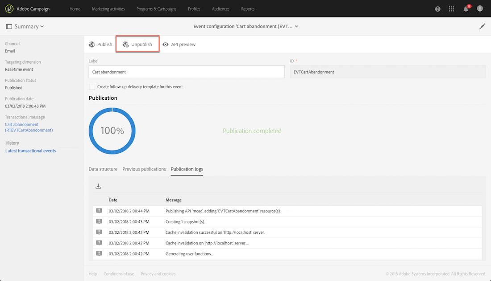
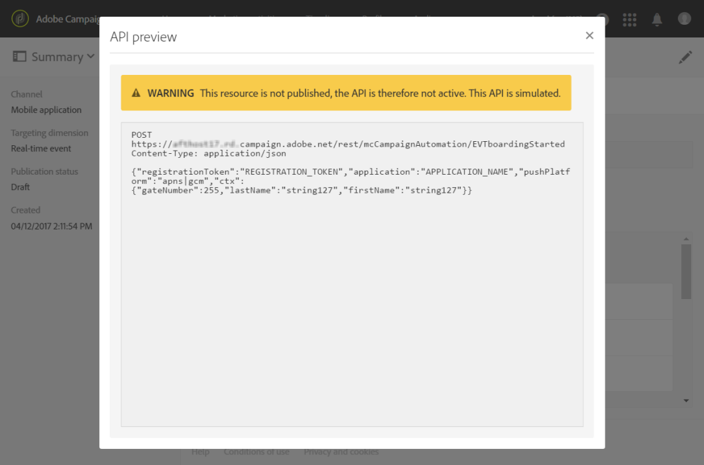
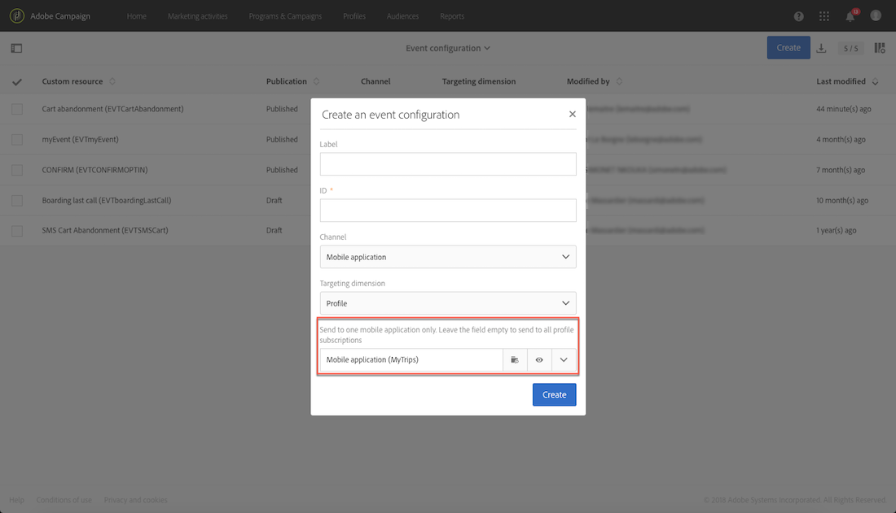
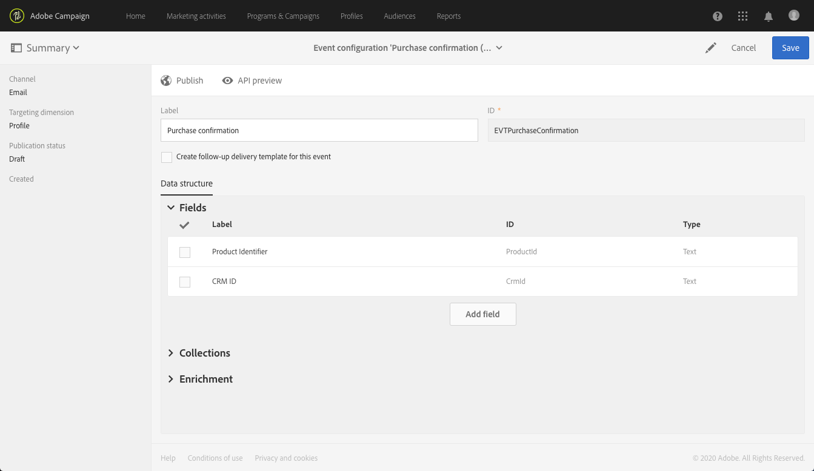

# Transactionele berichten configureren{#configuring-transactional-messaging}

Als u een transactiebericht met Adobe Campaign wilt verzenden, moet u eerst de structuur van de gebeurtenisgegevens beschrijven.

Gebeurtenisconfiguratie moet worden uitgevoerd door een [beheerder](../../administration/using/users-management.md#functional-administrators) die de onderstaande stappen uitvoert.

>[!NOTE]
>
>De configuratie kan afhankelijk van het type van transactiebericht variëren u wilt verzenden. Raadpleeg voor meer informatie de specifieke configuraties [van](#transactional-event-specific-configurations)Transactionele gebeurtenissen.

Nadat de gebeurtenis is gepubliceerd:

* De API die door uw websiteontwikkelaar wordt gebruikt, wordt opgesteld en de transactionele gebeurtenissen kunnen nu worden verzonden. Zie Het activeren van de gebeurtenis [integreren in een website](#integrating-the-triggering-of-the-event-in-a-website).

* Het overeenkomstige transactiemelding wordt automatisch gecreeerd. Zie [Aan de slag met transactieberichten](../../channels/using/getting-started-with-transactional-msg.md).

## Een gebeurtenis maken {#creating-an-event}

Maak de gebeurtenis die aan uw behoeften voldoet om aan de slag te gaan.

>[!IMPORTANT]
>
>Alleen gebruikers die de **[!UICONTROL Administration]** rol spelen en deel uitmaken van de **[!UICONTROL All]**[ organisatie](../../administration/using/organizational-units.md) , hebben de juiste rechten om een gebeurtenisconfiguratie te maken.

1. Klik in de linkerbovenhoek op het logo **[!UICONTROL Adobe Campaign]** en selecteer **[!UICONTROL Marketing plans]** > **[!UICONTROL Transactional messages]** > **[!UICONTROL Event configuration]**.
1. Klik op de knop **[!UICONTROL Create]**.
1. Geef een **[!UICONTROL Label]** en een **[!UICONTROL ID]** waarde op voor de gebeurtenis. Het **[!UICONTROL ID]** veld is verplicht en moet beginnen met het voorvoegsel &quot;EVT&quot;. Als u dit voorvoegsel niet gebruikt, wordt het automatisch toegevoegd wanneer u klikt **[!UICONTROL Create]**.

   

   >[!IMPORTANT]
   >
   >De id mag niet langer zijn dan 64 tekens, inclusief het voorvoegsel EVT.

1. Selecteer het kanaal dat wordt gebruikt om uw transactiemeldingen te verzenden **[!UICONTROL Email]**, **[!UICONTROL Mobile (SMS)]** of **[!UICONTROL Mobile application]** (pushmelding).

   >[!NOTE]
   >
   >Voor elke gebeurtenisconfiguratie kan slechts één kanaal worden gebruikt. Nadat de gebeurtenis is gemaakt, kunt u het kanaal niet meer wijzigen.

1. Selecteer de doeldimensie die overeenkomt met de gewenste gebeurtenisconfiguratie en klik op **[!UICONTROL Create]**.

   Transactieberichten die zijn gebaseerd op gebeurtenissen, zijn gericht op gegevens die zich in de gebeurtenis zelf bevinden, terwijl op een profiel gebaseerde transactieberichten bedoeld zijn voor gegevens die zich in de Adobe Campaign-database bevinden. Raadpleeg voor meer informatie de specifieke configuraties [van](#transactional-event-specific-configurations)Transactionele gebeurtenissen.

>[!NOTE]
>
>Het aantal gemaakte realtime-gebeurtenissen kan van invloed zijn op uw platform. Voor optimale prestaties moet u realtime gebeurtenissen verwijderen die u niet meer nodig hebt. See [Deleting an event](#deleting-an-event).

## Gebeurteniskenmerken definiëren {#defining-the-event-attributes}

In de **[!UICONTROL Fields]** sectie, bepaal de attributen die in de gebeurtenisinhoud zullen worden geïntegreerd en dan zullen kunnen worden gebruikt om het transactionele bericht te personaliseren.

De stappen voor het toevoegen en wijzigen van velden zijn gelijk aan die voor [aangepaste bronnen](../../developing/using/configuring-the-resource-s-data-structure.md#adding-fields-to-a-resource).

>[!NOTE]
>
>Als u een meertalig transactiebericht wilt maken, definieert u een extra gebeurteniskenmerk met de **[!UICONTROL AC_language]** id. Dit is alleen van toepassing op transactieberichten voor gebeurtenissen. Nadat de gebeurtenis is gepubliceerd, zijn de stappen voor het bewerken van de inhoud van een meertalig transactiebericht gelijk aan die voor een meertalig standaard-e-mailbericht. See [Creating a multilingual email](../../channels/using/creating-a-multilingual-email.md).

## Gegevensverzamelingen definiëren {#defining-data-collections}

U kunt aan de inhoud van de gebeurtenis een inzameling van elementen toevoegen, elk element zelf met verscheidene attributen.

Deze verzameling kan worden gebruikt in een transactie-e-mail om [productaanbiedingen](../../channels/using/event-transactional-messages.md#using-product-listings-in-a-transactional-message) aan de inhoud van het bericht toe te voegen, bijvoorbeeld een lijst met producten - met de prijs, het referentienummer, het aantal, enz. voor elk product in de lijst.

1. In the **[!UICONTROL Collections]** section, click the **[!UICONTROL Create element]** button.

   

1. Voeg een label en een id voor uw verzameling toe.
1. Voeg alle velden toe die u in het transactiebericht voor elk product in de lijst wilt weergeven.

   In dit voorbeeld hebben we de volgende velden toegevoegd:

   

1. Op het **[!UICONTROL Enrichment]** tabblad kunt u elk item van de verzameling verrijken. Op deze manier kunt u de elementen van de overeenkomende productlijst aanpassen met informatie uit de Adobe Campaign-database of uit andere bronnen die u hebt gemaakt.

>[!NOTE]
>
>De stappen voor het verrijken van de elementen van een verzameling zijn gelijk aan de stappen die worden beschreven in de sectie [Verrijken van de gebeurtenis](#enriching-the-transactional-message-content) . Door de gebeurtenis te verrijken, kunt u een verzameling niet verrijken: u moet een verrijking aan de inzameling zelf in de **[!UICONTROL Collections]** sectie toevoegen.

Zodra de gebeurtenis en het bericht worden gepubliceerd, zult u deze inzameling in uw transactiebericht kunnen gebruiken.

Hier volgt de API-voorvertoning voor dit voorbeeld:

**Verwante onderwerpen:**

* [De gebeurtenis voorvertonen en publiceren](#previewing-and-publishing-the-event)
* [Productvermeldingen gebruiken in een transactiebericht](../../channels/using/event-transactional-messages.md#using-product-listings-in-a-transactional-message)

## De gebeurtenis verrijken {#enriching-the-transactional-message-content}

U kunt de inhoud van het transactiebericht verrijken met informatie uit de Adobe Campaign-database om uw berichten aan te passen. Van achternaam of identiteitskaart van CRM van elk van uw ontvangers, bijvoorbeeld, kunt u gegevens zoals hun adres of geboortedatum of een ander douanegebied terugkrijgen dat in de lijst van het Profiel wordt toegevoegd, om de informatie te personaliseren die naar hen wordt verzonden.

Het is mogelijk om de inhoud van het transactiebericht te verrijken met informatie van uitgebreid **[!UICONTROL Profile and services Ext API]**. Zie API [uitbreiden voor meer informatie: De extensie publiceren](../../developing/using/step-2--publish-the-extension.md)

Deze informatie kan ook in nieuwe middelen worden opgeslagen. In dat geval moet de bron rechtstreeks of via een andere tabel worden gekoppeld aan de **[!UICONTROL Profile]** of de **[!UICONTROL Service]** bronnen. Bijvoorbeeld, in de configuratie hieronder, is het mogelijk om de transactionele berichtinhoud met informatie van het **[!UICONTROL Product]** middel zoals de productcategorie of identiteitskaart te verrijken, als het middel met het **[!UICONTROL Product]** **[!UICONTROL Profile]** middel verbonden is.

Raadpleeg [deze pagina](../../developing/using/key-steps-to-add-a-resource.md)voor meer informatie over het maken en publiceren van bronnen.

1. In the **[!UICONTROL Enrichment]** section, click the **[!UICONTROL Create element]** button.

   

1. Selecteer de bron waarmee u uw bericht wilt koppelen. Kies in dit geval de **[!UICONTROL Profile]** bron.

   

1. Gebruik de **[!UICONTROL Create element]** knop om een veld van de geselecteerde bron te koppelen aan een van de velden die u eerder aan de gebeurtenis hebt toegevoegd (zie [De gebeurteniskenmerken](#defining-the-event-attributes)definiëren).

   

1. In dit voorbeeld combineren we de velden **[!UICONTROL Last name]** en de **[!UICONTROL First name]** velden met de corresponderende velden in de **[!UICONTROL Profile]** bron.

   

   U kunt de transactionele berichtinhoud ook verrijken gebruikend het **[!UICONTROL Service]** middel. For more on services, see this [section](../../audiences/using/creating-a-service.md).

1. Als u een op een profiel gebaseerde gebeurtenis maakt of bewerkt, selecteert u in de **[!UICONTROL Targeting enrichment]** sectie de verrijking die tijdens de uitvoering van de levering als berichtdoel wordt gebruikt.

   

   >[!NOTE]
   >
   >Het selecteren van een het richten verrijking die op de **[!UICONTROL Profile]** middel wordt gebaseerd is verplicht voor op profiel-gebaseerde gebeurtenissen.

Zodra de gebeurtenis en het bericht worden gepubliceerd, zal deze verbinding u toestaan om de inhoud van het transactiebericht te verrijken.

**Verwante onderwerpen:**

* [Een voorvertoning weergeven en de gebeurtenis](#previewing-and-publishing-the-event)publiceren.
* [Een transactiebericht aanpassen](../../channels/using/event-transactional-messages.md#personalizing-a-transactional-message).

## Previewing and publishing the event {#previewing-and-publishing-the-event}

Voordat u de gebeurtenis kunt gebruiken, moet u deze voorvertonen en publiceren.

1. Klik op de **[!UICONTROL API preview]** knop voor een simulatie van de REST API die door de ontwikkelaar van uw website wordt gebruikt voordat deze wordt gepubliceerd. Nadat de gebeurtenis is gepubliceerd, kunt u met deze knop ook een voorvertoning van de API in productie zien. Zie Het activeren van de gebeurtenis [integreren in een website](#integrating-the-triggering-of-the-event-in-a-website).

   

   >[!NOTE]
   >
   >De REST API varieert afhankelijk van het geselecteerde kanaal en de geselecteerde doeldimensie. Voor meer details over de diverse configuraties, verwijs naar [Transactiegebeurtenis specifieke configuraties](#transactional-event-specific-configurations).

1. Klik **[!UICONTROL Publish]** om de publicatie te starten.

   

   De API die door uw websiteontwikkelaar wordt gebruikt, wordt opgesteld en de transactionele gebeurtenissen kunnen nu worden verzonden.

1. U kunt de publicatielogboeken weergeven op het bijbehorende tabblad.

   

   >[!IMPORTANT]
   >
   >Telkens wanneer u de gebeurtenis wijzigt, moet u **[!UICONTROL Publish]** opnieuw klikken om de bijgewerkte REST API te genereren die door uw websiteontwikkelaar wordt gebruikt.

   Nadat de gebeurtenis is gepubliceerd, wordt automatisch een transactiebericht gemaakt dat aan de nieuwe gebeurtenis is gekoppeld.

1. U kunt tot dit transactiebericht direct toegang hebben door de verbinding die in het linkerzijgebied wordt gevestigd.

   

Als de gebeurtenis het verzenden van een transactiemelding moet activeren, moet u het bericht wijzigen en publiceren dat net is gemaakt. Zie [Transactieberichten voor gebeurtenissen](../../channels/using/event-transactional-messages.md).

U moet deze triggergebeurtenis ook integreren in uw website. Zie Het activeren van de gebeurtenis [integreren in een website](#integrating-the-triggering-of-the-event-in-a-website).

Zodra Adobe Campaign gebeurtenissen ontvangt die betrekking hebben op deze gebeurtenisconfiguratie, kunt u via de **[!UICONTROL Latest transactional events]** koppeling onder de **[!UICONTROL History]** sectie toegang krijgen tot de meest recente gebeurtenissen die door uw service van derden zijn verzonden en door Adobe Campaign zijn verwerkt.

De gebeurtenissen (in JSON-indeling) worden weergegeven van de meest recente tot de oudste. Met deze lijst kunt u gegevens zoals de inhoud of de status van een gebeurtenis controleren voor controle en foutopsporing.

### Publicatie van een gebeurtenis ongedaan maken {#unpublishing-an-event}

Met de **[!UICONTROL Unpublish]** knop kunt u de publicatie van de gebeurtenis annuleren. Hierdoor wordt de bron die overeenkomt met de gebeurtenis die u eerder hebt gemaakt, verwijderd uit de REST API. Zelfs als de gebeurtenis via uw website wordt geactiveerd, worden de bijbehorende berichten niet meer verzonden en niet opgeslagen in de database.

>[!NOTE]
>
>Als u het overeenkomstige transactiemelding reeds hebt gepubliceerd, wordt de transactieberichtpublicatie ook geannuleerd. See [Unpublishing a transactional message](../../channels/using/event-transactional-messages.md#unpublishing-a-transactional-message).

Klik op de **[!UICONTROL Publish]** knop om een nieuwe REST API te genereren.

### Publicatieproces voor transactieberichten {#transactional-messaging-pub-process}

De grafiek hieronder illustreert het publicatieproces voor transactieberichten.

Zie [deze sectie](../../channels/using/event-transactional-messages.md#publishing-a-transactional-message)voor meer informatie over het publiceren, pauzeren en verwijderen van transactiemeldingen.

### Een gebeurtenis verwijderen {#deleting-an-event}

Nadat een gebeurtenis niet gepubliceerd is of nog niet gepubliceerd is, kunt u deze verwijderen uit de lijst met gebeurtenisconfiguraties. Dit doet u als volgt:

1. Klik in de linkerbovenhoek op het logo **[!UICONTROL Adobe Campaign]** en selecteer **[!UICONTROL Marketing plans]** > **[!UICONTROL Transactional messages]** > **[!UICONTROL Event configuration]**.
1. Houd de muis boven de gewenste gebeurtenisconfiguratie en selecteer de **[!UICONTROL Delete element]** knop.

   

   >[!NOTE]
   >
   >Make sure the event configuration has the **[!UICONTROL Draft]** status, otherwise you will not be able to delete it. The **[!UICONTROL Draft]** status applies to an event that has not been published yet or that has been [unpublished](#unpublishing-an-event).

1. Klik op de knop **[!UICONTROL Confirm]**.

   

>[!IMPORTANT]
>
>Als u een gebeurtenisconfiguratie verwijdert die is gepubliceerd en al wordt gebruikt, worden ook de bijbehorende transactiemeldingen en de bijbehorende verzendings- en trackinglogboeken verwijderd.

## Transactiegebeurtenissen zoeken {#searching-transactional-events}

Voer de onderstaande stappen uit om de reeds gemaakte transactiegebeurtenissen te openen en te doorzoeken.

1. Klik in de linkerbovenhoek op het logo **[!UICONTROL Adobe Campaign]** en selecteer **[!UICONTROL Marketing plans]** > **[!UICONTROL Transactional messages]** > **[!UICONTROL Event configuration]**.
1. Klik op de knop **[!UICONTROL Show search]**.

   

1. U kunt filteren op de **[!UICONTROL Publication status]**. Zo kunt u bijvoorbeeld alleen de gepubliceerde gebeurtenissen weergeven.
1. U kunt de gebeurtenissen ook filteren met behulp van de **[!UICONTROL Last event received]**. Als u bijvoorbeeld 10 invoert, worden alleen de gebeurtenisconfiguraties met de laatste gebeurtenis die tien dagen geleden of later is ontvangen, weergegeven. Hierdoor kunt u weergeven welke gebeurtenissen gedurende een bepaalde periode inactief zijn geweest.

   

   >[!NOTE]
   >
   >De standaardwaarde is 0. Alle gebeurtenissen worden dan weergegeven.

## De activering van de gebeurtenis in een website integreren {#integrating-the-triggering-of-the-event-in-a-website}

Nadat u een gebeurtenis hebt gemaakt, moet u de activering van deze gebeurtenis integreren in uw website.

In het voorbeeld dat wordt beschreven in de sectie [Transaction messaging Operating Principle](../../channels/using/getting-started-with-transactional-msg.md#transactional-messaging-operating-principle) , wilt u dat een gebeurtenis &quot;Cart-stopzetting&quot; wordt geactiveerd wanneer een van uw klanten uw website verlaat voordat ze de producten in hun winkelwagentje kopen. Hiervoor moet de webontwikkelaar van uw website de Adobe Campaign Standard REST API gebruiken.

Zie de documentatie van de [REST API](../../api/using/managing-transactional-messages.md).

## Specifieke configuraties voor gebeurtenissen {#transactional-event-specific-configurations}

Transactionele gebeurtenisconfiguratie kan afhankelijk van het type van transactiebericht variëren u (gebeurtenis of profiel) wilt verzenden, en het kanaal dat zal worden gebruikt.

In de volgende secties wordt gedetailleerd welke specifieke configuratie moet worden ingesteld op basis van het gewenste transactiebericht. Zie Een gebeurtenis [maken voor meer informatie over de algemene stappen voor het configureren van een gebeurtenis](#creating-an-event).

### Transactieberichten op basis van gebeurtenissen {#event-based-transactional-messages}

Als u een op een gebeurtenis gebaseerd transactiebericht wilt verzenden, moet u eerst een gebeurtenis maken en configureren die zich richt op de gegevens in de gebeurtenis zelf.
Voor meer informatie, zie het [Inschakelen met transactioneel overseinen](https://helpx.adobe.com/campaign/kb/simplify-campaign-management.html#Managedatatofuelengagingexperiences).

1. Selecteer bij het maken van de gebeurtenisconfiguratie de **[!UICONTROL Real-time event]** doeldimensie (zie [Een gebeurtenis](#creating-an-event)maken).
1. Voeg velden toe aan de gebeurtenis om het transactiemelding aan te passen (zie Gebeurteniskenmerken definiëren).
1. Verrijk de inhoud van het transactiebericht als u extra informatie van het gegevensbestand van Adobe Campaign wilt gebruiken (zie het Verrijken van de inhoud van het transactionele bericht).

   >[!NOTE]
   >
   >Het gebeurtenistransactiebericht wordt verondersteld om alleen de data in de verzendgebeurtenis zelf te gebruiken bij het bepalen van de ontvanger en de personalisatie van de berichtcontent. U kunt de content van het transactiebericht echter wel verrijken met data uit de Adobe Campaign-database.

1. Een voorvertoning van de gebeurtenis weergeven en deze publiceren (zie [De gebeurtenis](#previewing-and-publishing-the-event)voorvertonen en publiceren).

   Wanneer u een voorvertoning van de gebeurtenis weergeeft, bevat de REST API een kenmerk dat het e-mailadres of de mobiele telefoon opgeeft volgens het geselecteerde kanaal.

   Nadat de gebeurtenis is gepubliceerd, wordt automatisch een transactiebericht gemaakt dat aan de nieuwe gebeurtenis is gekoppeld. Als de gebeurtenis het verzenden van een transactiemelding moet activeren, moet u het bericht wijzigen en publiceren dat net werd gecreeerd, zie de transactieberichten [van de](../../channels/using/event-transactional-messages.md)Gebeurtenis.

1. Integreer de gebeurtenis in uw website (zie het activeren van de gebeurtenis in een website integreren).

### Transactieberichten op basis van profiel {#profile-based-transactional-messages}

Als u een op een profiel gebaseerd transactiebericht wilt verzenden, moet u eerst een gebeurtenis maken en configureren die gegevens als doel heeft die zich in de Adobe Campaign-database bevinden.

1. Selecteer bij het maken van de gebeurtenisconfiguratie de **[!UICONTROL Profile event]** doeldimensie (zie [Een gebeurtenis](#creating-an-event)maken).
1. Voeg velden toe aan de gebeurtenis om het transactiemelding aan te passen (zie Gebeurteniskenmerken definiëren). U moet ten minste één veld toevoegen om een verrijking te maken. U hoeft geen andere velden te maken, zoals **Voornaam** en **Achternaam** , omdat u in de Adobe Campaign-database verpersoonlijkingsvelden kunt gebruiken.
1. Maak een verrijking om de gebeurtenis aan de **[!UICONTROL Profile]** bron te koppelen (zie De inhoud [van het transactiebericht](#enriching-the-transactional-message-content)verrijken). Het is verplicht een verrijking te maken wanneer u een **[!UICONTROL Profile]** doeldimensie gebruikt.
1. Een voorvertoning van de gebeurtenis weergeven en deze publiceren (zie [De gebeurtenis](#previewing-and-publishing-the-event)voorvertonen en publiceren).

   Als u een voorvertoning van de gebeurtenis weergeeft, bevat de REST API geen kenmerk dat het e-mailadres of de mobiele telefoon opgeeft zoals deze uit de **[!UICONTROL Profile]** bron wordt opgehaald.

   Nadat de gebeurtenis is gepubliceerd, wordt automatisch een transactiebericht gemaakt dat aan de nieuwe gebeurtenis is gekoppeld. Als de gebeurtenis het verzenden van een transactiemelding moet activeren, moet u het bericht wijzigen en publiceren dat net werd gecreeerd, zie het [Verzenden van een bericht](../../channels/using/profile-transactional-messages.md#sending-a-profile-transactional-message)van de profieltransactie.

1. Integreer de gebeurtenis in uw website (zie het activeren van de gebeurtenis in een website integreren).

### Op gebeurtenissen gebaseerde pushmeldingen voor transacties {#event-based-transactional-push-notifications}

Als u pushmeldingen over transacties wilt verzenden, moet u Adobe Campaign dienovereenkomstig configureren. Zie [Push-configuratie](https://docs.adobe.com/content/help/nl-NL/campaign-standard/using/administrating/configuring-channels/configuring-a-mobile-application.translate.htmll).

Als u een anonieme pushmelding over een transactie wilt verzenden naar alle gebruikers die zich hebben aangemeld voor het ontvangen van berichten van uw mobiele toepassing, moet u eerst een gebeurtenis maken en configureren die gericht is op de gegevens in de gebeurtenis zelf. De bijbehorende stappen worden hieronder weergegeven.

De gebeurtenis moet de volgende drie elementen bevatten:

* Een **registratietoken**, de gebruikers-id voor één mobiele toepassing en één apparaat. Deze komt mogelijk niet overeen met enig profiel uit de Adobe Campaign-database.
* Een **mobiele toepassingsnaam** (één voor alle apparaten - Android en iOS). Dit is de id van de mobiele toepassing die in Adobe Campaign is geconfigureerd en die wordt gebruikt voor het ontvangen van pushberichten op de apparaten van de gebruiker. Raadpleeg [deze pagina](https://docs.adobe.com/content/help/nl-NL/campaign-standard/using/administrating/configuring-channels/configuring-a-mobile-application.translate.html) voor meer informatie
* Een **pushplatform** (&quot;gcm&quot; voor Android of &quot;apns&quot; voor iOS).

1. Wanneer u de gebeurtenisconfiguratie maakt, selecteert u het **[!UICONTROL Mobile application]** kanaal en de **[!UICONTROL Real-time event]** doeldimensie (zie [Een gebeurtenis](#creating-an-event)maken).
1. Voeg velden toe aan de gebeurtenis om het transactiemelding aan te passen (zie Gebeurteniskenmerken definiëren).
1. Verrijk de inhoud van het transactiemelding als u extra informatie van het gegevensbestand van Adobe Campaign wilt gebruiken (zie het Verrijken van de inhoud van het transactiemelding).

   >[!NOTE]
   >
   >Het gebeurtenistransactiebericht wordt verondersteld om alleen de data in de verzendgebeurtenis zelf te gebruiken bij het bepalen van de ontvanger en de personalisatie van de berichtcontent. U kunt de content van het transactiebericht echter wel verrijken met data uit de Adobe Campaign-database.

1. Een voorvertoning van de gebeurtenis weergeven en deze publiceren (zie [De gebeurtenis](#previewing-and-publishing-the-event)voorvertonen en publiceren).

   Wanneer u een voorvertoning van de gebeurtenis weergeeft, bevat de REST-API de kenmerken &quot;registrationToken&quot;, &quot;application&quot; en &quot;pushPlatform&quot; die worden gebruikt voor de levering.

   

   Nadat de gebeurtenis is gepubliceerd, wordt automatisch een transactioneel pushbericht gemaakt dat aan de nieuwe gebeurtenis is gekoppeld. Als u het bericht wilt wijzigen en publiceren dat zojuist is gemaakt, raadpleegt u [Transactie push-berichten voor een gebeurtenis](../../channels/using/transactional-push-notifications.md#transactional-push-notifications-targeting-an-event)verzenden.

1. Integreer de gebeurtenis in uw website (zie het activeren van de gebeurtenis in een website integreren).

### Op profielen gebaseerde pushmeldingen voor transacties {#profile-based-transactional-push-notifications}

Als u een pushmelding over een transactie wilt verzenden naar de Adobe Campaign-profielen die zijn geabonneerd op uw mobiele toepassing, moet u eerst een gebeurtenis maken en configureren die gericht is op de Adobe Campaign-database.

1. Wanneer u de gebeurtenisconfiguratie maakt, selecteert u het **[!UICONTROL Mobile application]** kanaal en de **[!UICONTROL Profile]** doeldimensie (zie [Een gebeurtenis](#creating-an-event)maken).

   Standaard wordt de transactionele pushmelding verzonden naar alle mobiele toepassingen waarop de ontvangers zich hebben geabonneerd. Als u de pushmelding naar een specifieke mobiele toepassing wilt verzenden, selecteert u deze in de lijst. De andere mobiele toepassingen zullen door het bericht worden gericht maar van het verzenden worden uitgesloten.

   

1. Voeg velden toe aan de gebeurtenis als u het transactiemelding wilt aanpassen (zie Gebeurteniskenmerken definiëren).

   >[!NOTE]
   >
   >U moet ten minste één veld toevoegen om een verrijking te maken. U hoeft geen andere velden te maken, zoals **Voornaam** en **Achternaam** , omdat u in de Adobe Campaign-database verpersoonlijkingsvelden kunt gebruiken.

1. Maak een verrijking om de gebeurtenis aan de **[!UICONTROL Profile]** bron te koppelen (zie De inhoud [van het transactiebericht](#enriching-the-transactional-message-content)verrijken). Het is verplicht een verrijking te maken wanneer u een **[!UICONTROL Profile]** doeldimensie gebruikt.
1. Een voorvertoning van de gebeurtenis weergeven en deze publiceren (zie [De gebeurtenis](#previewing-and-publishing-the-event)voorvertonen en publiceren).

   Wanneer de voorvertoning van de gebeurtenis wordt weergegeven, bevat de REST API geen kenmerk dat het registratietoken, de toepassingsnaam en het pushplatform opgeeft zoals deze uit de **[!UICONTROL Profile]** bron worden opgehaald.

   Nadat de gebeurtenis is gepubliceerd, wordt automatisch een transactioneel pushbericht gemaakt dat aan de nieuwe gebeurtenis is gekoppeld. Als u het bericht wilt wijzigen dat zojuist is gemaakt, raadpleegt u [Transactie push-berichten voor een profiel](../../channels/using/transactional-push-notifications.md#transactional-push-notifications-targeting-a-profile)verzenden.

1. Integreer de gebeurtenis in uw website (zie het activeren van de gebeurtenis in een website integreren).

### Een gebeurtenis configureren om een vervolgbericht te verzenden {#configuring-an-event-to-send-a-follow-up-message}

Een follow-upbericht is een vooraf bepaalde marketing leveringsmalplaatje dat in een werkschema kan worden gebruikt om berichten naar de ontvangers van een specifiek transactiebericht te verzenden. For more on this, see [Follow-up messages](../../channels/using/follow-up-messages.md).

1. Gebruik dezelfde gebeurtenisconfiguratie die u hebt gemaakt om een transactiebericht voor een gebeurtenis te verzenden. See [Event-based transactional messages](#event-based-transactional-messages).
1. Schakel het **[!UICONTROL Create follow-up delivery template for this event]** vakje in wanneer u de gebeurtenis configureert voordat u de gebeurtenis publiceert.

   

1. Een voorvertoning van de gebeurtenis weergeven en deze publiceren (zie [De gebeurtenis](#previewing-and-publishing-the-event)voorvertonen en publiceren).

   Nadat de gebeurtenis is gepubliceerd, worden automatisch een transactiemelding en een leveringssjabloon voor de follow-up gemaakt die aan de nieuwe gebeurtenis zijn gekoppeld. Zie Een vervolgbericht [verzenden voor meer informatie over het gebruik van vervolgberichten](../../channels/using/follow-up-messages.md#sending-a-follow-up-message).

## Hoofdlettergebruik: een gebeurtenis configureren om een transactiemelding te verzenden {#use-case--configuring-an-event-to-send-a-transactional-message}

In dit voorbeeld willen we een gebeurtenis configureren om na elke aankoop op onze website bevestigingsberichten te verzenden met de volgende voorwaarden:

Aangezien wij onze cliënt via zijn identiteitskaart van CRM willen identificeren, zorg eerst ervoor dat het **[!UICONTROL Profile]** middel met dit nieuwe gebied is uitgebreid.

Op dezelfde manier, moet een douanemiddel die met aankopen beantwoordt zijn gecreeerd en gepubliceerd, en moet met het **[!UICONTROL Profile]** middel verbonden zijn. Op deze manier kunt u informatie ophalen uit deze bron om de inhoud van het bericht te verrijken.

Raadpleeg [deze pagina](../../developing/using/key-steps-to-add-a-resource.md)voor meer informatie over het maken en publiceren van bronnen.

1. Maak een nieuwe gebeurtenis met gebruik van het **[!UICONTROL Email]** kanaal en de **[!UICONTROL Profile]** doeldimensie (zie [Een gebeurtenis](#creating-an-event)maken).
1. Definieer de kenmerken die beschikbaar zijn om het transactiebericht aan te passen. Voeg in ons geval de velden &quot;CRM-id&quot; en &quot;Product-id&quot; toe (zie [Gebeurteniskenmerken](#defining-the-event-attributes)definiëren).

   

1. Om de berichtinhoud met informatie betreffende de vorige aankopen van de cliënt te verrijken, creeer een verrijking gericht op het **[!UICONTROL Purchase]** middel (zie het [Verrijken van de transactionele berichtinhoud](#enriching-the-transactional-message-content)).

   

1. Maak een verbindingsvoorwaarde tussen het veld &quot;Product-id&quot; dat eerder aan het bericht is toegevoegd en het bijbehorende veld van de **[!UICONTROL Purchase]** bron.

   

1. Een voorvertoning van de gebeurtenis weergeven en deze publiceren (zie [De gebeurtenis](#previewing-and-publishing-the-event)voorvertonen en publiceren).
1. Integreer de gebeurtenis in uw website (zie [Het activeren van de gebeurtenis in een website](#integrating-the-triggering-of-the-event-in-a-website)integreren).

