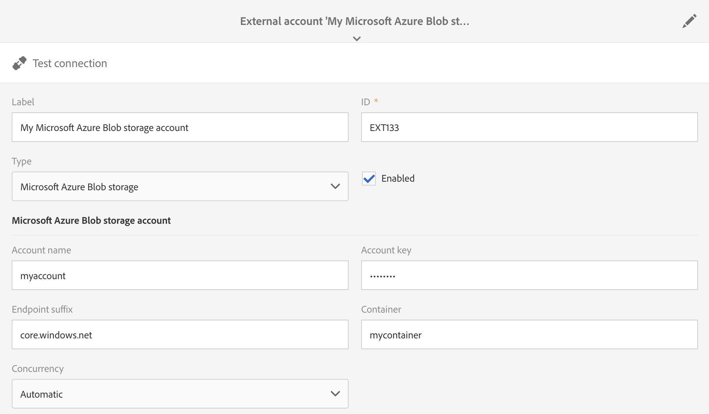

# Externe rekeningen{#external-accounts}

Een externe account is een configuratie waarmee u de toegang tot een externe server van Adobe Campaign kunt configureren en testen.

Deze externe accounts kunnen in Campagneworkflows worden gebruikt voor toegang tot en beheer van gegevens.

U kunt de volgende typen externe accounts instellen:

* SFTP. For more on this, refer to [this section](#sftp-external-account).
* Amazon Storage Service (S3). For more on this, refer to [this section](#amazon-s3-external-account).
* Adobe Experience Manager. For more on this, refer to [this section](#adobe-experience-manager-external-account).
* Adobe Analytics. For more on this, refer to [this section](../../integrating/using/configure-campaign-analytics-integration.md).
* Google reCAPTCHA. For more on this, refer to [this section](#google-recaptcha-external-account).
* Microsoft Azure Blob-opslag. For more on this, refer to [this section](#microsoft-azure-external-account).

>[!NOTE]
>
>Andere typen externe accounts worden door Adobe gebruikt tijdens het proces van productprovisioning. Vanaf Campaign Standard 17.9 kunnen externe FTP-accounts nog wel worden gedefinieerd, maar kunnen ze niet meer worden gebruikt voor nieuwe workflowactiviteiten. Als u al een verbinding had opstelling, wordt het nog toegelaten.

Externe accounts kunnen worden geconfigureerd door beheerders onder het **[!UICONTROL Administration > Application settings > External accounts]** menu.

## Een externe account maken {#creating-an-external-account}

Adobe Campaign wordt geleverd met een reeks vooraf gedefinieerde externe accounts. Als u verbindingen wilt instellen met externe systemen, zoals FTP-servers die worden gebruikt voor bestandsoverdracht, kunt u uw eigen externe accounts maken.

Externe accounts worden gebruikt door technische processen, zoals technische workflows of workflows voor campagnes. Wanneer u een bestandsoverdracht instelt in een workflow of een gegevensuitwisseling met een andere toepassing (Adobe Target, Experience Manager, enz.), moet u een externe account selecteren.

1. Klik op de **[!UICONTROL Create]** knop.
1. Voer een label in. Het label en de id worden gebruikt bij het selecteren van externe accounts in workflows.
1. Selecteer het type account dat u wilt maken.
1. Configureer de toegang tot de account door referenties, serveradres, poortnummer en of sleutels op te geven, indien van toepassing.

   De noodzakelijke informatie wordt gewoonlijk verstrekt door de leverancier van de server u met verbindt.

1. Sla uw account op.

De externe account wordt gemaakt en toegevoegd aan de accountlijst. Het is nu beschikbaar voor uw gegevens/dossier overdrachten of het verpletteren van configuraties in werkschemaactiviteiten en leveringseigenschappen.

## Externe SFTP-account {#sftp-external-account}

Voor verschillende typen externe rekeningen moeten verschillende gegevens worden opgegeven.

Geef voor een externe SFTP-account de volgende gegevens op:

* Serveradres. Bijvoorbeeld **ftp.domain.com**.
* Poortnummer. For example, **22**.
* Referenties SFTP-server: accountnaam en wachtwoord waarmee verbinding wordt gemaakt met de server.

### Aanbevelingen voor door Adobe gehoste SFTP-servers {#adobe-hosted-sftp-server-recommendations}

Als u bestanden en gegevens beheert voor ETL-doeleinden, worden deze bestanden opgeslagen op een gehoste SFTP-server die door Adobe wordt geleverd. Deze SFTP is ontworpen als een tijdelijke opslagruimte waarop u het bewaren en het schrappen van dossiers kunt controleren.

Wanneer deze ruimte niet correct wordt gebruikt of wordt gecontroleerd, kan deze snel de fysieke ruimte op de server vullen en ernstige problemen veroorzaken. Dit kan leiden tot gegevensverlies of beschadiging op uw platform.

Om dergelijke problemen te voorkomen, raadt Adobe aan de onderstaande aanbevolen procedures te volgen:

* Houd de minimale gegevens mogelijk.
* Gebruik op sleutels gebaseerde verificatie om te voorkomen dat het wachtwoord vervalt. Ondersteunde indelingen zijn alleen **OpenSSH** en **SSH2** . U moet de openbare sleutel aan het ondersteuningsteam van Adobe verstrekken om het te hebben geupload op de server van de Campagne.
* Bewaar de gegevens slechts zolang als nodig is. 15 dagen is de maximumtermijn.
* Gebruik workflows om de gegevens correct te verwijderen (de bewaring van werkstromen die gegevens verbruiken, beheren).
* Gebruik batchverwerking in SFTP-uploads en in workflows.
* Fouten/uitzonderingen afhandelen.
* Soms, login aan SFTP om direct te controleren wat daar ligt.
* Houd er rekening mee dat SFTP-schijfbeheer primair uw verantwoordelijkheid is.

Ook, merk op dat openbare IPs waarvan u probeert om de verbinding in werking te stellen SFTP aan toe te voegen staat lijst op de instantie van de Campagne toe. Het toevoegen van IP adressen aan staat lijst kan via een [steunkaartje](https://helpx.adobe.com/enterprise/using/support-for-experience-cloud.html), samen met het verstrekken van de openbare sleutel aan gebruik voor authentificatie worden gevraagd.

SFTP-servers kunnen worden beheerd via het Configuratiescherm. Raadpleeg de documentatie bij het [Configuratiescherm voor meer informatie](https://docs.adobe.com/content/help/en/control-panel/using/sftp-management/about-sftp-management.html).

>[!NOTE]
>
>Het Configuratiescherm is alleen beschikbaar voor Admin-gebruikers van klanten die op AWS worden gehost.
Controleer of uw exemplaar [hier](https://docs.adobe.com/content/help/en/control-panel/using/faq.html#ims-org-id)op AWS wordt gehost.

## Amazon S3 externe account {#amazon-s3-external-account}

Het veld Amazon S3-server moet als volgt worden ingevuld:

```
<S3 bucket name>.s3.amazonaws.com/<s3 object path>
```

Schakel het **[!UICONTROL Keep files in S3 encrypted]** selectievakje in om het bestand op te slaan in de modus S3.


De noodzakelijke informatie wordt gewoonlijk verstrekt door de leverancier van de server u met verbindt.

Specificeer **[!UICONTROL AWS Region]** verbonden aan uw eindpunt. U kunt de ondersteunde regio&#39;s en handtekeningversies controleren in de officiële [Amazon S3-documentatie](https://docs.aws.amazon.com/general/latest/gr/rande.html#s3_region).

>[!NOTE]
>
>Uw **[!UICONTROL Receiver server]** gegevens moeten zonder uw AWS-regio worden ingevoerd. De gegevens worden later automatisch aan uw URL toegevoegd.

### Aanbevelingen voor Amazon S3-account {#amazon-s3-account-recommendations}

We raden u aan de volgende aanbevelingen te volgen om u te helpen bij het instellen van uw Amazon S3-account:

* Creeer het strikte emmerbeleid om toegang tot S3 emmers te beperken. Het beleid van het emmertje kan worden gevormd terwijl het creëren van een emmertje. Raadpleeg de documentatie bij [](https://docs.aws.amazon.com/AmazonS3/latest/dev//example-bucket-policies.html)Amazon S3 voor meer informatie.
* Schakel tijdens het maken van een externe account de codering in om gevoelige gegevens op te slaan in het S3-emmertje door het **[!UICONTROL Keep files in S3 encrypted]** selectievakje in te schakelen.
* Rechten van emmertjes verlenen om op te geven wie toegang heeft tot het object in een emmertje. Raadpleeg de documentatie [van](https://docs.aws.amazon.com/AmazonS3/latest/dev//access-control-overview.html)Amazon S3 voor meer informatie over emmermachtigingen.

## Externe rekening van Adobe Experience Manager {#adobe-experience-manager-external-account}

De externe rekeningen van de Adobe Experience Manager worden gebruikt wanneer het integreren van Campagne met Experience Manager.

De processen en vereisten met betrekking tot deze integratie zijn beschikbaar in [dit document](../../integrating/using/get-started-campaign-integrations.md).

Wanneer u deze nieuwe externe account instelt, moet u de volgende gegevens opgeven:

* Server: Voer de URL van de Adobe Experience Manager-server in. Bijvoorbeeld:

   ``` http://aem.domain.com:4502 ```

* Referenties van AEM-account: gebruik de rekening die tot de instantie van de Adobe Experience Manager zal toegang hebben. Het zou een rekeningsdeel van de campagne-verre groep in Experience Manager moeten zijn.

## Google reCAPTCHA externe account {#google-recaptcha-external-account}

>[!NOTE]
>
>Voor de Google reCAPTCHA-configuratie is een Google-account vereist.

Met het Google reCAPTCHA-mechanisme kunt u uw landingspagina beschermen tegen spam en misbruik door bots. Dit is niet-indringend voor uw klanten aangezien het geen interactie van hen vereist en op interactie met uw plaats gebaseerd is. Raadpleeg deze [pagina](https://www.google.com/recaptcha/admin/create)om uw site te registreren. U moet het type V3 reCAPTCHA kiezen.

Om de Google reCAPTCHA V3 aan u landende pagina toe te voegen, moet u het eerst in uw externe rekening vormen. Raadpleeg deze [sectie](../../channels/using/configuring-landing-page.md#setting-google-recaptcha)voor meer informatie over het toevoegen van de sjabloon aan de bestemmingspagina.

Geef voor een externe account van Google reCAPTCHA V3 de volgende gegevens op:

* Een **[!UICONTROL Label]** en **[!UICONTROL ID]** van uw externe account
* **[!UICONTROL Type]**: Google reCAPTCHA
* Uw **[!UICONTROL Site key]** en **[!UICONTROL Site secret]**
* A **[!UICONTROL Threshold]** tussen 0 en 1

   De 0,0- **[!UICONTROL Threshold]** waarde betekent dat het waarschijnlijk een beide is en 1,0 dat het waarschijnlijk een goede interactie is. Standaard kunt u een drempel van 0,5 gebruiken.


## Microsoft Azure Blob-opslagexterne account {#microsoft-azure-external-account}

>[!NOTE]
>
>De informatie die nodig is om uw externe account in Adobe Campaign Standard te configureren, kunt u vinden in de Azure Portal door **[!UICONTROL Settings]** > **[!UICONTROL Access keys]** te selecteren.

De Azure Blob-opslagconnector kan worden gebruikt voor het importeren of exporteren van gegevens naar Adobe Campaign met behulp van een **[!UICONTROL Transfer file]** workflowactiviteit. For more on this, refer to this [section](../../automating/using/transfer-file.md#azure-blob-configuration-wf).

Geef voor een externe account voor Microsoft Azure Blob-opslag de volgende gegevens op:

* Een **[!UICONTROL Label]** en **[!UICONTROL ID]** van uw externe account
* **[!UICONTROL Type]**: Microsoft Azure Blob-opslag
* Je **[!UICONTROL Account name]** en **[!UICONTROL Account key]**. Als u wilt weten waar u de naam en sleutel van uw account vindt, raadpleegt u deze [pagina](https://docs.microsoft.com/en-us/azure/storage/common/storage-account-keys-manage).
* Je **[!UICONTROL Endpoint suffix]**. U vindt dit in uw **[!UICONTROL Connection string]** menu in het **[!UICONTROL Access keys]** Azure Portal. Raadpleeg deze [pagina](https://docs.microsoft.com/en-us/azure/storage/common/storage-account-keys-manage)voor meer informatie.
* Uw **[!UICONTROL Container]** naam. Als u meerdere containers wilt gebruiken, moet u zoveel externe accounts maken als containers.
* Met de **[!UICONTROL Concurrency]** optie kunt u de snelheid van de bestandsoverdracht afstemmen.



Klik eenmaal geconfigureerd **[!UICONTROL Test connection]** om Adobe Campaign te koppelen aan Microsoft Azure Blob-opslag.

### Aanbevelingen voor opslag Microsoft Azure Blob {#azure-blob-recommendations}

**Versleuteling**

Adobe Campaign gebruikt een HTTPS (Secure Connection) om toegang te krijgen tot uw Microsoft Azure Blob-opslagaccount.

**Accountsleutel**

Wanneer u uw externe account configureert, moet u een van de **[!UICONTROL Account key]** beschikbare mogelijkheden van de Azure Portal gebruiken. Raadpleeg deze [pagina](https://docs.microsoft.com/en-us/azure/storage/common/storage-account-keys-manage#view-access-keys-and-connection-string)voor meer informatie over waar u uw accountsleutels kunt vinden.

**De bestandsoverdrachtsnelheid optimaliseren**

Met de **[!UICONTROL Concurrency]** optie kunt u de snelheid van de bestandsoverdracht afstemmen.
Het vertegenwoordigt het aantal draden die zullen worden gebruikt om de dossieroverdracht uit te voeren. Elk van deze draden zal een gedeelte van ongeveer 1MB van de blob downloaden. Zij zullen dan in de rij worden geplaatst om aan schijf worden geschreven. Door het aantal threads te verhogen, verhoogt u ook de belasting van de bronnen die door de toepassing worden gebruikt tijdens de bestandsoverdracht.

Nadat de bestandsoverdracht is voltooid, kunt u de prestatiegegevens vinden in de workflowlogboeken.

**Opnieuw**

Standaard kan de bestandsoverdracht voor Azure Blob maximaal vier keer worden uitgevoerd.  Als de Azure Storage-service een foutcode retourneert zoals 503 (server bezet) of 500 (bewerkingstijd), kan dit erop wijzen dat u de schaalbaarheid van uw opslagaccount nadert of overschrijdt. Dit kan gebeuren als u een nieuwe account gebruikt of tests uitvoert.

Als de fout zich blijft voordoen, kunt u het aantal pogingen verhogen door een optie te creëren onder het Geavanceerde menu **[!UICONTROL Administration]** > **[!UICONTROL Application Settings]** > **[!UICONTROL Options]**.

Indien geïmplementeerd, moet de optie als volgt worden gemaakt:

```
ID:        AzureBlob_Max_Retries
Date type: Integer
Default:   <the number of retries needed>
```
