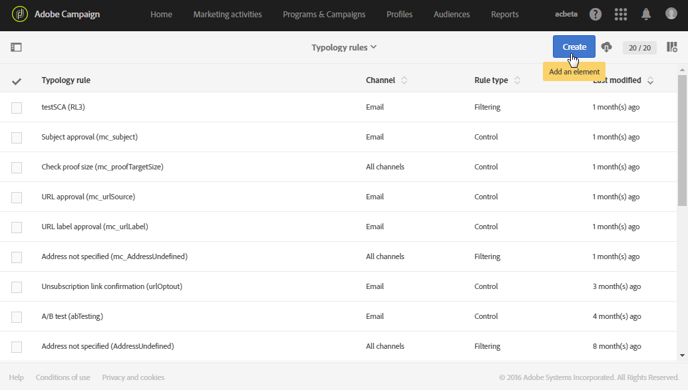

# Filterregels{#filtering-rules}

Met filterregels kunt u een deel van het berichtdoel uitsluiten volgens criteria die in een query zijn gedefinieerd, zoals quarantineprofielen of profielen die al een bepaald aantal e-mailberichten hebben ontvangen.

Bijvoorbeeld, kunt u de nieuwsbrief abonnees filtreren zodat de abonnees die jonger zijn dan 18 jaar geen mededelingen ontvangen.

## Filterregels maken {#creating-a-filtering-rule}

1. Maak een **Filtrerende** typologieregel die op alle communicatiekanalen kan worden toegepast.

   

1. Selecteer op het **[!UICONTROL Filtering criteria]** tabblad de abonnementen in de **[!UICONTROL Subscription]** categorie.

   

1. In het **[!UICONTROL Explorer]** lusje van de vraagredacteur, sleep en laat vallen de **[!UICONTROL Subscriber]** knoop in het belangrijkste deel van het scherm.

   

1. Selecteer het **[!UICONTROL Age]** gebied en bepaal de het filtreren voorwaarden zodat de leeftijd van de abonnees 18 of hoger is.

   

1. Koppel deze regel in het **[!UICONTROL Typologies]** tabblad aan een typologie.

   

1. Zorg ervoor dat de typologie in kwestie in het leveringsmalplaatje wordt geselecteerd dat u wilt gebruiken.

   

   >[!NOTE]
   >
   >Als u de leveringssjablonen wilt openen, selecteert u **[!UICONTROL Resources]** > **[!UICONTROL Templates]** in het navigatiemenu, dat u kunt openen via het logo van de Adobe-campagne.

Wanneer deze regel in een bericht wordt gebruikt, worden abonnees die als minderjarigen worden beschouwd, automatisch uitgesloten.

## De toepasbaarheid van een filterregel beperken {#restricting-the-applicability-of-a-filtering-rule}

U kunt de toepasbaarheid van een het filtreren regel volgens het te verzenden bericht beperken.

1. Schakel op het **[!UICONTROL Application criteria]** **[!UICONTROL Apply the rule on all deliveries]** tabblad van de typologieregel de optie uit, die standaard is ingeschakeld.

   

1. Gebruik de vraagredacteur om een filter te bepalen. U kunt de regel bijvoorbeeld alleen toepassen op berichten waarvan het label met een bepaald woord begint of waarvan de id bepaalde letters bevat.

   

In dit geval wordt de regel alleen toegepast op de berichten die aan de gedefinieerde criteria voldoen.

## Uitsluitingsregels voor standaardlevering {#default-deliverability-exclusion-rules}

Twee het filtreren regels zijn beschikbaar door gebrek: **[!UICONTROL Exclusion of addresses]** ( **[!UICONTROL addressExclusions]** ) en **[!UICONTROL Exclusion of domains]** ( **[!UICONTROL domainExclusions]** ) . Tijdens de e-mailanalyse, vergelijken deze regels de ontvankelijke e-mailadressen met de verboden adressen of domeinnamen in een gecodeerde globale suppressielijst die in de leveringsinstantie wordt beheerd. Als er een gelijke is, wordt het bericht niet verzonden naar die ontvanger.

Dit om te voorkomen dat ze op de zwarte lijst worden gezet vanwege kwaadwillige activiteiten, met name het gebruik van een Spamtrap. Als bijvoorbeeld een spamtrap wordt gebruikt om zich te abonneren via een van uw webformulieren, wordt automatisch een bevestigingsbericht verzonden naar die spamtrap. Hierdoor wordt uw adres automatisch op de zwarte lijst gezet.

>[!NOTE]
>
>De adressen en domeinnamen in de globale suppressielijst worden verborgen. Alleen het aantal uitgesloten ontvangers wordt vermeld in de logboeken van de leveringsanalyse.

