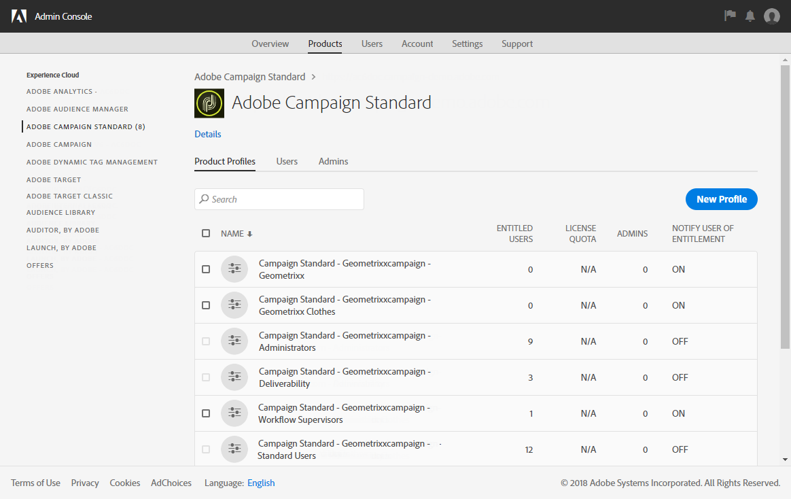
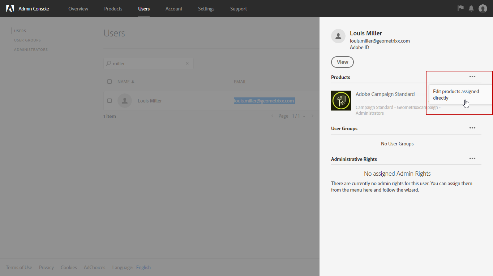

# Groepen en gebruikers beheren{#managing-groups-and-users}

## Informatie over beveiligingsgroepen {#about-security-groups}

>[!IMPORTANT]
>
>De **[!UICONTROL Access to the deliverability parameters (Deliverability)]** en **[!UICONTROL Message Center agents (mcExec)]** veiligheidsgroepen zijn Adobe intern slechts en zouden niet aan enige gebruiker moeten worden toegewezen.

Beveiligingsgroepen zijn groepen gebruikers die dezelfde rollen en rechten binnen uw organisatie delen.

Gebruikers moeten altijd aan een beveiligingsgroep gekoppeld zijn. Hierdoor kunt u specifieke rollen en organisatie-eenheden toewijzen aan deze groepen. Als u de toegang van een gebruiker wilt beperken, voegt u de gebruiker niet toe aan de campagne **[!UICONTROL Standard Users]** groep als deze is gekoppeld aan **[!UICONTROL All]** organisatie-eenheid.

Voor meer informatie over rollen, presenteert de lijst in de volgende pagina mogelijke verrichtingen beschikbaar volgens de rol(s) van een gebruiker: [Adobe Campaign Standard-machtigingen](https://experienceleague.adobe.com/docs/campaign-standard/assets/acs_rights.pdf).

Standaardbeveiligingsgroepen zijn:

* **[!UICONTROL Administrators]**
* **[!UICONTROL Delivery supervisors]**
* **[!UICONTROL Standard Users]**
* **[!UICONTROL Workflow supervisors]**

Deze ingebouwde beveiligingsgroepen zijn alleen-lezen en kunnen niet worden gewijzigd. Als u uw eigen beveiligingsgroep met een set specifieke rollen wilt maken, raadpleegt u de onderstaande sectie.

## Een beveiligingsgroep maken en gebruikers toewijzen {#creating-a-security-group-and-assigning-users}

>[!IMPORTANT]
>
>In de Admin Console worden beveiligingsgroepen profielen genoemd.

U kunt uw eigen beveiligingsgroepen maken als de standaardgroepen niet genoeg zijn om uw gebruikers te beheren. Zij kunnen door Beheerders worden geleid die toegang tot zowel de beleidsmenu&#39;s van Adobe Campaign als de Admin Console hebben. Voor meer informatie over de Admin Console raadpleegt u deze [documentatie](https://helpx.adobe.com/enterprise/managing/user-guide.html).

Hier moeten we eerst de twee kant-en-klare groepen, Standaardgebruikers en Beheerders, aan onze gebruikers toewijzen. Deze beveiligingsgroepen beperken een aantal functies van Adobe Campaign: de standaardgebruiker heeft basistoegang tot Adobe Campaign terwijl de beheerder bijvoorbeeld toegang heeft tot de beheermenu’s.

Wijzigingen die in de Admin Console in beveiligingsgroepen worden aangebracht, worden gesynchroniseerd zodra gebruikers zich aanmelden bij Adobe Campaign.

Vervolgens gaan we een reeks beveiligingsgroepen maken, Geometrixx en Geometrixx Clothes, waardoor de toegang wordt beperkt afhankelijk van de organisatie-eenheden van onze standaardgebruiker en beheerder.

U moet eerst een van de standaardbeveiligingsgroepen aan uw gebruikers toewijzen:

1. Selecteer in de Admin Console eerst uw instantie en daarna de **Gebruikers** tab.

   

1. Klik op de knop **[!UICONTROL Add user]** en voer het e-mailadres van de gebruiker in.
1. Selecteer op het tabblad **[!UICONTROL Assign Products]** uw instantie en kies vervolgens de standaardbeveiligingsgroep **[!UICONTROL Administrators]** in de vervolgkeuzelijst. De gebruiker krijgt hierdoor toegang tot de beheermenu’s en kan de volgende beveiligingsgroepen maken.

   

1. Klik op **[!UICONTROL Save]** en volg dezelfde procedures om de standaardbeveiligingsgroep **[!UICONTROL Standard Users]** aan uw nieuwe gebruiker toe te wijzen.

   

Zodra uw twee gebruikers zijn gekoppeld aan de standaardbeveiligingsgroepen **[!UICONTROL Administrators]** en **[!UICONTROL Standard users]**, die rollen aan de gebruikers toewijzen, kan de gebruiker van het type Beheerder de twee beveiligingsgroepen **Geometrixx** en **Geometrixx Clothes** maken, waardoor naast de standaardbeveiligingsgroepen organisatie-eenheden aan de gebruikers worden toegewezen.

1. Selecteer in de Admin Console eerst uw instantie en daarna de **Producten** tab.
1. Klik op de knop **Nieuw profiel** om de beveiligingsgroep **Geometrixx** te maken.

   

1. Typ de **[!UICONTROL Profile name]** door precies deze syntaxis te volgen: **[!UICONTROL Campaign Standard- instance name - ID of the security group]** en klik op **[!UICONTROL Done]**.

   De gekozen id wordt vervolgens gebruikt tijdens het maken van de beveiligingsgroep in Adobe Campaign.

   >[!NOTE]
   >
   >Als de bovenstaande syntaxis niet werkt met een oudere instantie, moet u deze vervangen door **[!UICONTROL Campaign - instance name - ID of the security group]**.

   

1. Volg dan dezelfde procedures om de beveiligingsgroep **Geometrixx Clothes** te maken.
1. Wijs de beveiligingsgroep toe aan de gebruiker door het tabblad **[!UICONTROL Users]** te selecteren.

   

1. Klik op de eerder gemaakte gebruiker en klik vervolgens op het pictogram  in de categorie **[!UICONTROL Products]**.

   Selecteer **[!UICONTROL Edit products assigned directly]** om de nieuwe beveiligingsgroep aan de gebruiker toe te wijzen.

   

1. Selecteer op het tabblad **[!UICONTROL Assign Products]** uw instantie en vervolgens de eerder gemaakte Geometrixx-beveiligingsgroepen in de vervolgkeuzelijst om deze toe te wijzen aan de gebruiker van het type Beheerder.

   Klik op **[!UICONTROL Save]**.

   

   Als een gebruiker deel uitmaakt van verscheidene groepen, zijn de gevolgen als volgt:

   * De rollen van de verschillende groepen worden gecumuleerd. Hier bevinden gebruikers zich in twee verschillende groepen: één die van invloed is op rollen en de andere die van invloed is op eenheden.
   * De eenheid die het hoogste is in de hiërarchie wordt gebruikt (zie het voorbeeld in de sectie [Organisatie-eenheden](../../administration/using/organizational-units.md)).
   * De gebruiker kan geen verbinding meer maken als eenheden hetzelfde equivalente niveau hebben en zich in parallelle vertakkingen in de hiërarchie bevinden.

1. Volg dezelfde procedures om de beveiligingsgroep Geometrixx Clothes aan uw standaardgebruiker toe te wijzen.

   

De nieuwe beveiligingsgroepen worden nu in de Admin Console gemaakt. Als u ze volledig wilt synchroniseren, moet u ze ook in Adobe Campaign maken.

De gebruiker van het type Beheerder moet de reeks beveiligingsgroepen maken die worden gebruikt om organisatie-eenheden toe te wijzen: Geometrixx en Geometrixx Clothes. Zie [Eenheden maken en beheren](../../administration/using/organizational-units.md#creating-and-managing-units) voor informatie over het maken van organisatie-eenheden.

1. Klik op de knop **Adobe** logo, in de linkerbovenhoek, en selecteer **[!UICONTROL Administration > Users & Security > Security groups]**.
1. Maak uw nieuwe beveiligingsgroep en geef het **[!UICONTROL Label]** en de **[!UICONTROL ID]** van de groep op.

   De id moet dezelfde zijn als de id die u in de Admin Console hebt gekozen.

1. Wijs in het veld **[!UICONTROL User access]** een organisatie-eenheid toe. Hier wordt de organisatie-eenheid **[!UICONTROL All]** aan de beveiligingsgroep Geometrixx toegewezen.

   >[!NOTE]
   >
   >Als u een uit-van-de-doos veiligheidsgroep aan uw gebruikers toewijst, zult u de organisatorische eenheid moeten terugstellen.

   

1. U kunt ook rollen toewijzen aan uw beveiligingsgroep. In dit geval is deze stap niet nodig aangezien de standaardbeveiligingsgroepen **[!UICONTROL Administrators]** en **[!UICONTROL Standard users]** worden gebruikt om rollen toe te wijzen.
1. Volg dezelfde procedures om de laatste beveiligingsgroep Geometrixx Clothes te maken en hieraan een organisatie-eenheid toe te wijzen.

   

Uw gebruikers zijn nu toegewezen aan een beveiligingsgroep en kunnen verbinding maken met Adobe Campaign.

>[!IMPORTANT]
>
>Als gebruikers worden verwijderd uit een beveiligingsgroep in de Admin Console, blijven ze deel uitmaken van de Adobe Campaign-beveiligingsgroep en kunnen ze zich niet meer aanmelden bij Adobe Campaign. Verwijder in dat geval de e-mailadressen van de gebruikers in de Admin Console om te voorkomen dat ze vertrouwelijke informatie ontvangen.
