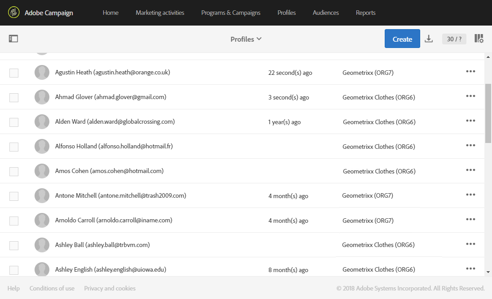

# Organisatorische eenheden{#organizational-units}

## Eenheden {#about-units}

Elk object en elke gebruiker van het platform is gekoppeld aan een organisatorische eenheid. Met deze eenheid kan een hiërarchische structuur worden gedefinieerd om gebruikers een gefilterde weergave te geven. De eenheid van een gebruiker bepaalt hun toegangsniveau voor verschillende platformvoorwerpen.

>[!IMPORTANT]
>
>Als een gebruiker niet is gekoppeld aan een eenheid, kan die gebruiker geen verbinding maken met Adobe Campaign. Als u de toegang voor een bepaalde gebruiker of groep gebruikers wilt beperken, moet u de toegang niet aan de **[!UICONTROL All]** eenheid koppelen.
>
>Standaard wordt de organisatie-eenheid **[!UICONTROL All (all)]** toegewezen aan de beveiligingsgroep **[!UICONTROL Administrators]**. Deze is alleen-lezen en kan niet worden gewijzigd.

Een gebruiker heeft alleen-lezen toegang tot alle objecten in de bovenliggende eenheden. Hij heeft toegang tot alle voorwerpen van zijn eenheid en kindeenheden gelezen en geschreven. Een gebruiker heeft geen toegang tot objecten in parallelle vertakkingen.

Standaard zijn alleen de **[!UICONTROL All]** eenheden beschikbaar.

Wanneer aan de gebruiker een organisatorische eenheid wordt toegewezen, wordt deze eenheid altijd toegepast op de objecten die de gebruiker heeft gemaakt.

>[!NOTE]
>
>Wanneer een gebruiker in verscheidene groepen verbonden aan verschillende eenheden is, worden bepaalde regels toegepast. Raadpleeg de sectie [Groepen en gebruikers](../../administration/using/managing-groups-and-users.md) beheren voor meer informatie.

## Eenheden maken en beheren {#creating-and-managing-units}

Met de eenheden van de organisatie kunt u uw exemplaar filteren, afhankelijk van de organisatie waaraan uw gebruikers zijn gekoppeld. Deze eenheid kan een regio, land of zelfs een merk in uw exemplaar vertegenwoordigen.

Hier, creeerden wij eerder veiligheidsgroepen met verschillende rollen aan twee gebruikers: Eén gebruiker wordt toegewezen aan de beveiligingsgroepen Beheerders en Geometrixx, de andere gebruiker behoort tot de beveiligingsgroepen Standaardgebruiker en Geometrixx Zie Een beveiligingsgroep [maken en gebruikers](../../administration/using/managing-groups-and-users.md#creating-a-security-group-and-assigning-users) toewijzen voor het volledige voorbeeld.

We moeten nu de organisatorische eenheden creëren voor de Geometrixx Clothes en de veiligheidsgroepen van de Geometrixx:

1. Kies in het geavanceerde menu van de Adobe-campagne **[!UICONTROL Administration]** > **[!UICONTROL Users & security]** > **[!UICONTROL Organizational units]**.
1. Klik **[!UICONTROL Create]** om uw organisatorische eenheid te beginnen vormen.

   

1. Wijzig de standaardinstelling **[!UICONTROL Label]** en **[!UICONTROL ID]** de Geometrixx.
1. Koppel deze eenheid vervolgens aan een bovenliggende eenheid. Hier hebben we gekozen **[!UICONTROL All]**.

   

1. Tot slot klik **[!UICONTROL Create]** om uw nieuwe organisatorische eenheid aan veiligheidsgroep toe te wijzen.
1. Volg dezelfde procedure voor de eenheid van de Kleuren van de Geometrixx, behalve dat moet zijn oudereenheid eerder gecreeerd eenheid, Geometrixx zijn.

   

Om het effect van het toewijzen van verschillende eenheden aan verschillende veiligheidsgroep te zien, zal de gebruiker die aan de Beheerder en de groepen van Geometrixx wordt toegewezen twee e-mailmalplaatjes creëren om te zien wat de andere gebruiker aan StandaardGebruiker en de Kleuren van de Geometrixx kan of niet kan toegang hebben.

1. Selecteer in het menu Geavanceerd **[!UICONTROL Resources]** > **[!UICONTROL Templates]** > **[!UICONTROL Delivery Templates]**.
1. Dupliceer een bestaande sjabloon en pas deze zo nodig aan. For more on this, refer to the [About templates](../../start/using/marketing-activity-templates.md) section.
1. Wanneer de sjabloon wordt gemaakt, selecteert u het **[!UICONTROL Edit properties]** pictogram dat u eenheden aan de sjabloon wilt toewijzen.

   

1. Selecteer de organisatie-eenheid in het **[!UICONTROL Access authorization]** keuzemenu.

   Hier gaan wij één malplaatje met de eerder gecreeerde organisatorische eenheid Geometrixx tot stand brengen.

   

1. Volg de zelfde procedures om het tweede malplaatje tot stand te brengen dat aan de eerder gecreeerde organisatorische eenheid van de Kleuren van de Geometrixx wordt toegewezen.

De gebruiker die aan de StandaardGroepen van de Gebruiker en van de Kleuren van de Geometrixx wordt toegewezen zal beide malplaatjes kunnen zien. Wegens de hiërarchische structuur van de organisatorische eenheden, zal hij lees- en schrijftoegang tot het malplaatje hebben verbonden aan de eenheid van de Kleuren van de Geometrixx en slechts read-only toegang tot het malplaatje verbonden aan de eenheid van de Geometrixx.

Aangezien de eenheid van de Geometrixx kleding een kindeenheid van Geometrixx is, verschijnt het volgende bericht wanneer de gebruiker probeert om het malplaatje van de Geometrixx te wijzigen:

Organisatorische eenheden kunnen de toegang tot verschillende functies, zoals profielen, beperken. Bijvoorbeeld, als onze gebruiker van de Kleuren van Geometrixx tot het **[!UICONTROL Profiles]** lusje toegang heeft, zal hij tot de profielen met de organisatorische eenheid van de Kleuren van de Geometrixx volledig kunnen toegang hebben en wijzigen.

Terwijl de profielen bij de organisatie van de Geometrixx alleen-lezen zijn, wordt de volgende fout weergegeven als onze gebruiker één profiel probeert te wijzigen: **[!UICONTROL You do not have the rights needed to modify the 'profile' resource of ID]**.

## Profielen partitioneren {#partitioning-profiles}

Als uw organisatie de profielen moet isoleren die door elk van uw verschillende merken worden gecontacteerd, kunt u uw profielen door hun organisatorische eenheden verdelen.

Standaard zijn de velden voor de organisatie-eenheid niet beschikbaar in uw profielen en moeten deze worden toegevoegd.

Gebruikers hebben geen toegang tot profielen zonder organisatie.

>[!IMPORTANT]
>
>U wordt aangeraden deze optie toe te voegen voordat u profielen importeert. Als u uw klantengegevensbestand reeds hebt ingevoerd, is een update noodzakelijk om de organisatorische eenheidswaarden op de reeds ingevoerde Profielen te plaatsen.

1. Kies in het menu Geavanceerd via het Adobe Campaign-logo **Beheer > Ontwikkeling > Aangepaste bronnen**.
1. Selecteer **Profiel** of maak een nieuwe aangepaste bron om de profielen uit te breiden.
1. Schakel het vakje **Toegangsmachtigingsbeheervelden** toevoegen in om de organisatorische eenheden toe te voegen in de extensie **Profiel** .

   

1. Klik op **[!UICONTROL Save]**.
1. Werk de structuur bij door de aangepaste bronnen opnieuw te publiceren. Raadpleeg [De sectie Structuur](../../developing/using/data-model-concepts.md) bijwerken voor meer informatie over het publicatieproces.

Het veld Organisatorische eenheid wordt toegevoegd aan uw profielen in de **[!UICONTROL Access authorization]** sectie.

**Verwante onderwerpen**:

* [Eenheden](../../administration/using/organizational-units.md#about-units)
* [Toegangsbeheer](../../administration/using/about-access-management.md)

