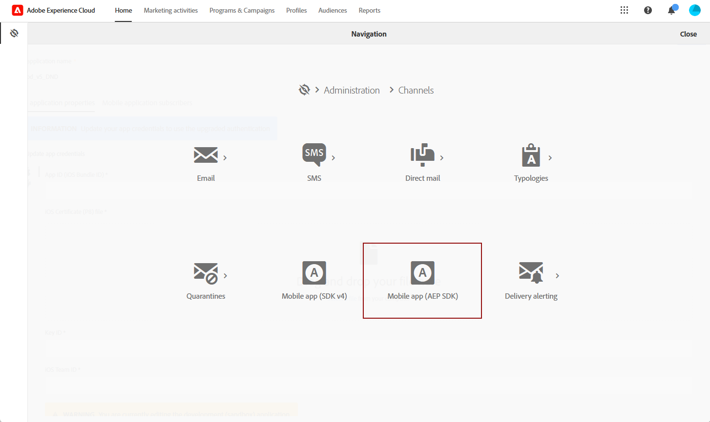
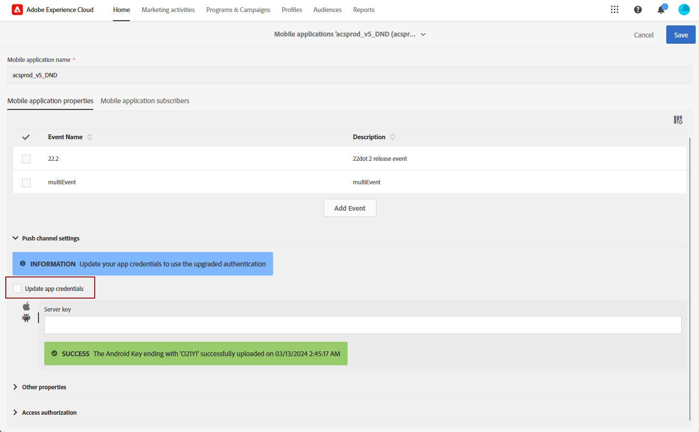
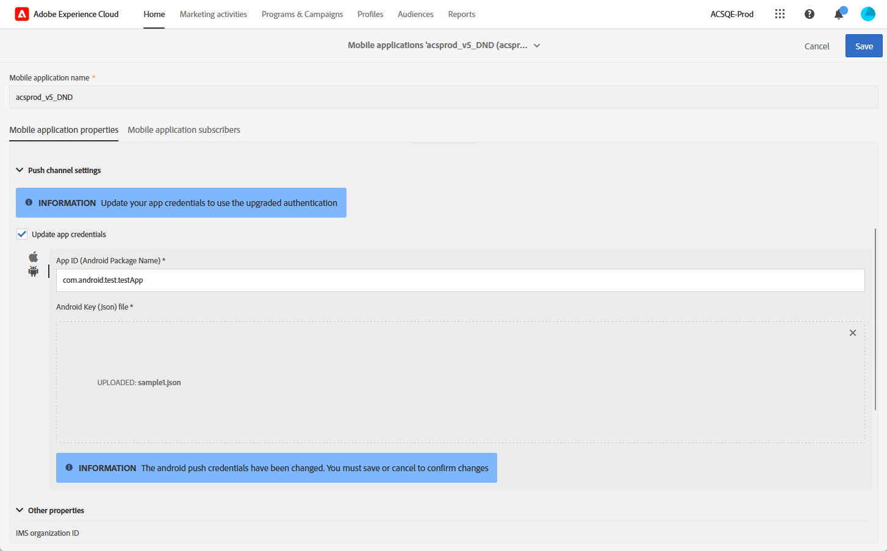

# Wijzigingen in kanaal voor pushmelding {#push-upgrade}

Met Campagne kunt u pushmeldingen verzenden op Android- en iOS-apparaten. Om dit te doen, baseert de Campagne zich op de specifieke abonnementsdiensten. Enkele belangrijke wijzigingen in de Android Firebase Cloud Messaging (FCM)-service worden in 2024 gepubliceerd en kunnen van invloed zijn op uw Adobe Campaign-implementatie. Mogelijk moet uw configuratie met abonnementsservices voor Android-pushberichten worden bijgewerkt om deze wijziging te ondersteunen.

Daarnaast raadt Adobe ten zeerste aan om over te schakelen naar de tokengebaseerde verbinding met APN&#39;s in plaats van een op een certificaat gebaseerde verbinding, die veiliger en schaalbaarder is.

Voor een ononderbroken service moet u een upgrade uitvoeren van uw mobiele toepassing die bij Adobe Campaign is geregistreerd, zodat deze de nieuwste verificatiemechanismen voor FCM (Android) en APNs (iOS) bevat.

[Meer informatie over het configureren van certificaten voor mobiele toepassingen in Adobe Campaign Standard](configuring-a-mobile-application.md#channel-specific-config)

## Google Android Firebase Cloud Messaging (FCM)-service {#fcm-push-upgrade}

### Wat is er veranderd? {#fcm-changes}

Als deel van Google dat voortdurend probeert om zijn diensten te verbeteren, zal erfenis FCM APIs op **juni 20, 2024** worden opgeheven. Leer meer over het protocol van HTTP van het Overseinen van de Wolk van de Wolk van de Wolk van de Vuurstand van de Wolk van de Vuurstand van de Wolk van de Vuurstand in [&#x200B; Google documentatie &#x200B;](https://firebase.google.com/docs/cloud-messaging/http-server-ref){target="_blank"}.

Beginnend [&#x200B; versie 24.1 &#x200B;](../../rn/using/release-notes.md), steunt Adobe Campaign Standard v1 APIs van HTTP om de Berichten van het Bericht van het Push van Android te verzenden.

### Heb je invloed op? {#fcm-impact}

Als u Adobe Campaign Standard al gebruikt om pushmeldingen te verzenden, moet uw implementatie worden bijgewerkt.

De overgang naar de nieuwste API&#39;s is verplicht om elke onderbreking van de service te voorkomen.

<!--
To check if you are impacted, you can filter your **Services and Subscriptions** as per the filter below

* If any of your active push notification service uses the **HTTP (legacy)** API, your setup will be directly impacted by this change. You must review your current configurations and move to the newer APIs as described below.

* If your setup exclusively uses the **HTTP v1** API for Android push notifications, then you are already in compliance and no further action will be required on your part.
-->

### Hoe kan ik bijwerken? {#fcm-transition-procedure}

#### Vereisten {#fcm-transition-prerequisites}

* De steun van **v1 API van HTTP** wijze is toegevoegd in versie 24.1. Als uw milieu op een oudere versie loopt, is een eerste vereiste voor deze verandering uw milieu aan de [&#x200B; recentste versie van Campaign Standard &#x200B;](../../rn/using/release-notes.md) te bevorderen.

* Het JSON-bestand van de Android Firebase Admin SDK-service is nodig om de mobiele toepassing naar HTTP v1 te verplaatsen. Leer hoe te om dit dossier in [&#x200B; documentatie van de Vuurbasis van Google &#x200B;](https://firebase.google.com/docs/admin/setup#initialize-sdk){target="_blank"} te krijgen.

* Als u deze oudere versie van de SDK nog gebruikt, moet u uw implementatie bijwerken met Adobe Experience Platform SDK. Leer hoe te om aan de Ervaring van Adobe te migreren Plaform SDK in [&#x200B; dit artikel &#x200B;](sdkv4-migration.md).

* Zorg ervoor u de **Mobiele toestemming van de Configuratie van de App** in Mobiele de Inzameling van Gegevens van Adobe Experience Platform alvorens de hieronder stappen uit te voeren hebt. [Meer info](https://experienceleague.adobe.com/docs/experience-platform/collection/permissions.html?lang=nl-NL#adobe-experience-platform-data-collection-permissions){target="_blank"}.

#### Overgangprocedure {#fcm-transition-steps}

Ga als volgt te werk om uw omgeving te verplaatsen naar HTTP v1:

1. Blader naar **[!UICONTROL Administration]** > **[!UICONTROL Channels]** > **[!UICONTROL Mobile app (AEP SDK)]** .

   

1. Selecteer de specifieke mobiele toepassing waarvoor het certificaat moet worden bijgewerkt.

1. Schakel het selectievakje **[!UICONTROL Update app credentials]** in.

   

1. Geef de toepassings-id (Android-pakketnaam) op uit het `build.gradle` -bestand van uw Android-project. Bijvoorbeeld `com.android.test.testApp` . Zorg ervoor dat u verschillende id&#39;s gebruikt voor testomgevingen en productieomgevingen.

1. Upload uw JSON-sleutelbestand met de persoonlijke sleutel van Android.

   

1. Klik **sparen** knoop.

>[!NOTE]
>
>Zodra deze wijzigingen zijn toegepast, gebruiken alle nieuwe pushberichten die aan Android-apparaten worden geleverd de HTTP v1-API. Bestaande push-items worden opnieuw uitgevoerd, in uitvoering en in gebruik, maar gebruiken nog steeds de HTTP (legacy) API.

## Apple iOS Push Notification Service (APNs) {#apns-push-upgrade}

### Wat is er veranderd? {#ios-changes}

Zoals aanbevolen door Apple, moet u uw communicatie met de APNs (Apple Push Notification service) beveiligen door stateless verificatietokens te gebruiken.

Token-gebaseerde authentificatie biedt een stateless manier om met APNs te communiceren. Stateloze communicatie is sneller dan op certificaat-gebaseerde communicatie omdat het geen APNs vereist om het certificaat, of andere informatie, met betrekking tot uw leverancierserver op te zoeken. Er zijn andere voordelen aan het gebruiken van op teken-gebaseerde authentificatie:

* U kunt hetzelfde token gebruiken van meerdere providerservers.

* U kunt één token gebruiken om meldingen te distribueren voor alle apps van uw bedrijf.

Leer meer over op token-gebaseerde verbindingen aan APNs in [&#x200B; documentatie van de Ontwikkelaar van Apple &#x200B;](https://developer.apple.com/documentation/usernotifications/establishing-a-token-based-connection-to-apns){target="_blank"}.

Adobe Campaign Standard ondersteunt zowel tokenverbindingen als verbindingen op basis van certificaten. Als uw implementatie afhankelijk is van een verbinding op basis van een certificaat, raadt Adobe u ten zeerste aan deze bij te werken naar een tokenverbinding.

### Heb je invloed op? {#ios-impact}

Als uw huidige implementatie afhankelijk is van op een certificaat gebaseerde aanvragen om verbinding te maken met APNs, heeft dit gevolgen voor u. De overgang naar een op een token gebaseerde verbinding wordt aanbevolen.

<!--
To check if you are impacted, you can filter your **Services and Subscriptions** as per the filter below:

* If any of your active push notification service uses the **Certificate-based authentication** mode (.p12), your current implementations should be reviewed and moved to a **Token-based authentication** mode (.p8) as described below.

* If your setup exclusively uses the **Token-based authentication** mode for iOS push notifications, then your implementation is already up-to-date and no further action will be required on your part.
-->

### Hoe kan ik bijwerken? {#ios-transition-procedure}

#### Vereisten {#ios-transition-prerequisites}

* De steun van **op token-gebaseerde authentificatie** wijze is toegevoegd in [&#x200B; versie 24.1 &#x200B;](../../rn/using/release-notes.md). Als uw milieu op een oudere versie loopt, is een eerste vereiste voor deze verandering uw milieu aan de [&#x200B; recentste versie van Campaign Standard &#x200B;](../../rn/using/release-notes.md) te bevorderen.

* U hebt een APNs-verificatietoken voor ondertekening nodig om de tokens te genereren die uw server gebruikt. U vraagt deze sleutel van uw Apple ontwikkelaarsrekening, zoals die in [&#x200B; documentatie van de Ontwikkelaar van Apple &#x200B;](https://developer.apple.com/documentation/usernotifications/establishing-a-token-based-connection-to-apns){target="_blank"} wordt verklaard.

#### Overgangprocedure {#ios-transition-steps}

Voer de volgende stappen uit om uw mobiele iOS-toepassingen te verplaatsen naar de op token gebaseerde verificatiemodus:

1. Blader naar **[!UICONTROL Administration]** > **[!UICONTROL Channels]** > **[!UICONTROL Mobile app (AEP SDK)]** .

   

1. Selecteer de specifieke mobiele toepassing waarvoor het certificaat moet worden bijgewerkt.

1. Schakel het selectievakje **[!UICONTROL Update app credentials]** in.

   

1. Verstrek **identiteitskaart van de Toepassing** (identiteitskaart van de Bundel van iOS). U vindt de iOS Bundle ID (App ID) in het primaire doel van uw app in Xcode.

1. Upload uw **iOS p8 certificaatdossier**.

1. Vul de APNs verbindingsmontages **[!UICONTROL Key Id]** en **[!UICONTROL iOS Team Id]** in.

   

1. Klik op **[!UICONTROL Save]** .

Uw iOS-toepassing wordt nu verplaatst naar de op token gebaseerde verificatiemodus.

## Veelgestelde vragen{#push-upgrade-faq}

+++Kunnen we dezelfde appID behouden op het werkgebied en de prod-instantie?

Voor mobiele iOS-toepassingen kunt u dezelfde app-id gebruiken, de bundel-id van de iOS-app, voor zowel testomgevingen als productieomgevingen. Op Android moet de toepassings-id echter uniek zijn voor elke omgeving. Daarom wordt aanbevolen &#39;stage&#39; toe te voegen aan de toepassings-id die in de testomgeving is gemaakt

+++

+++Kunnen we alleen de Android-app migreren?

Nee, zowel Android- als iOS-toepassingen moeten worden gemigreerd volgens de bovenstaande stappen.

+++

+++Welk type verificatie moeten we uitvoeren na de migratie?

Onze aanbeveling is om functionele validatie uit te voeren van al uw zaken met betrekking tot het gebruik van pushtechnologie.

+++

+++Wat moet u doen als er een fout &#39;Niet geautoriseerd&#39; optreedt tijdens het opslaan van de mobiele app?

Dit lijkt een machtigingsprobleem te zijn met betrekking tot de gegevensverzameling van Adobe Experience Platform. U kunt dit oplossen door de machtigingen Mobiele en Mobiele toepassingsconfiguratie toe te voegen in de Adobe Admin Console, zoals beschreven in de sectie Voorwaarden van dit artikel.

+++

+++Worden wijzigingen vereist in mobiele toepassingscode?

Nee, alleen configuratiewijzigingen zijn vereist in Firebase en de ontwikkelaarsaccount van de app. Wijzigingen in de mobiele app van de klant zijn niet vereist.

+++

+++Moeten we het iOS-certificaat elk jaar bijwerken?

Nee, na deze migratie is het niet nodig om het iOS-certificaat elk jaar bij te werken.

+++

+++Wat gebeurt er als deze migratie niet wordt uitgevoerd?

De Android-pushberichten zullen mislukken na 20 juni 2024, zoals aangegeven in de kennisgeving van Google. [&#x200B; las meer &#x200B;](https://firebase.google.com/docs/cloud-messaging/migrate-v1){target="_blank"}.

+++

+++Kunnen klanten na voltooiing van de FCMv1-migratie terugmigreren naar FCM?

Ja, klanten kunnen tot 20 juni 2024 terugmigreren naar FCM. Na deze datum is de migratieoptie niet meer beschikbaar.

+++

+++Wordt de migratie van de HTTP v1-API ondersteund op een mobiele SDK V4-app?

Nee, klanten moeten eerst hun mobiele app migreren naar de V5 SDK en vervolgens doorgaan met de bovenstaande migratie. Zij moeten dit als prioriteit doen, aangezien hun pushservice vanaf juni 2024 zal mislukken, zoals in de kennisgeving van Google wordt aangegeven.

+++

+++Heeft een wijziging van het werkgebied gevolgen voor de productie-instantie?

Nee, wijzigingen in de stage mobile-app hebben geen invloed op de productie-instantie.

+++
