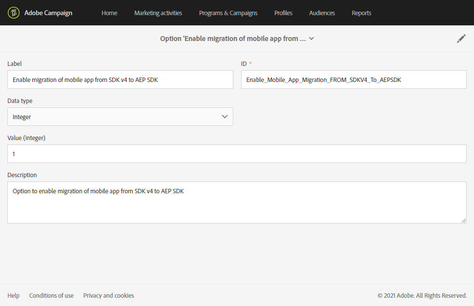

# Uw mobiele toepassing migreren van SDK v4 naar Adobe Experience Platform SDK {#sdkv4-migration}

>[!IMPORTANT]
>
> Het migratieproces is onomkeerbaar.
>
> Lees het document zorgvuldig door voordat u de migratie van uw SDK V4 mobiele toepassing naar de Adobe Experience Platform SDK start.

## De SDK V4-migratie

Adobe Campaign Standard verwerkt mobiele toepassingen die SDK V4 gebruiken als aparte toepassingen dan toepassingen die Adobe Experience Platform SDK gebruiken.
Nadat u de SDK-versie van Adobe van v4 naar Adobe Experience Platform hebt bijgewerkt, moeten mobiele toepassingen de bestaande abonnementsgegevens en -campagnes van de toepassing blijven gebruiken: daarom is een migratie noodzakelijk .

>[!NOTE]
>
> Op deze pagina wordt de migratie van een mobiele SDK v4-toepassing naar een nieuwe Adobe Experience Platform SDK-toepassing gedocumenteerd. Uw mobiele SDK v4-toepassingen worden niet samengevoegd met een mobiele Adobe Experience Platform SDK-toepassing met een **[!UICONTROL Configured]** **[!UICONTROL Property status]**.

| Wat na de migratie niet verandert |
|:-:|
| Er is geen effect op bestaande leveringen en campagnes met de gemigreerde SDK V4-toepassing. |
| De naam van de mobiele toepassing blijft ongewijzigd. |
| De platforminstellingen voor iOS en Android blijven behouden. |
| Alle abonnees van de toepassing en hun gegevens zullen worden bewaard. |
| De bestaande mobiele SDK v4-toepassing zal gegevens (PII-gegevens, Abonnee &amp; token-gegevens) naar Adobe Campaign Standard blijven verzenden. |
| De **[!UICONTROL Organizational unit]** van de mobiele toepassing blijft ongewijzigd. |

| Wat verandert er na de migratie |
|:-:|
| De mobiele toepassing is beschikbaar in **[!UICONTROL Administration]** > **[!UICONTROL Channels]** > **[!UICONTROL Mobile app (Adobe Experience Platform SDK)]**. Vóór de migratie was deze beschikbaar in **[!UICONTROL Administration]** > **[!UICONTROL Channels]** > **[!UICONTROL Mobile app (SDK V4)]**. |
| De **[!UICONTROL Collect PII Endpoint]** van de toepassing wordt gewijzigd. De oudere **[!UICONTROL Collect PII Endpoint]** blijft werken, de verzonden gegevens gaan niet verloren. |
| De toepassing wordt gekoppeld aan een Adobe Experience Platform Launch **[!UICONTROL Mobile Property]**. Het wordt verwerkt als een nieuwe mobiele toepassing. |
| De oorspronkelijke Adobe Experience Platform SDK-toepassing die in de migratie wordt gebruikt, bestaat niet als een aparte toepassing. Alleen de v4-toepassing voor gemigreerde SDK is beschikbaar. |

## Uw mobiele toepassing migreren van SDK v4 naar Adobe Experience Platform SDK {#how-to-migrate}

Voordat u gaat migreren, moet u rekening houden met de volgende aanbevelingen:

* Het migratieproces is onomkeerbaar.
* U moet migratie van meerdere toepassingen niet tegelijkertijd uitvoeren. Zorg er ook voor dat de migratie van een zelfde toepassing niet tezelfdertijd door meerdere vensters wordt geactiveerd.
* Voordat u gaat migreren, controleert u of u de **[!UICONTROL Organizational unit]** hebt toegewezen van de mobiele toepassing die u wilt migreren en van de Adobe Experience Platform-toepassing die u gebruikt voor migratie.
* Na de migratie wordt de toepassing een Adobe Experience Platform SDK-toepassing. De wijzigingen worden gekoppeld aan de bijbehorende Starten **[!UICONTROL Mobile Property]**.

1. Maak een nieuwe **[!UICONTROL Mobile property]** in de Adobe Experience Platform Launch. Raadpleeg [Adobe Experience Platform Launch-documentatie](https://aep-sdks.gitbook.io/docs/getting-started/create-a-mobile-property#create-a-mobile-property) voor meer informatie hierover.

1. Selecteer in Adobe Campaign Standard in het geavanceerde menu **[!UICONTROL Administration]** > **[!UICONTROL Application Settings]** > **[!UICONTROL Workflows]** en open de **[!UICONTROL syncWithLaunch]**-workflow. Controleer of de workflow zonder fout is beëindigd.

1. Nadat de workflow is voltooid, controleert u via het menu **[!UICONTROL Administration]** > **[!UICONTROL Channels]** > **[!UICONTROL Mobile app (Adobe Experience Platform SDK)]** of de mobiele toepassing beschikbaar is in Adobe Campaign Standard en de status **[!UICONTROL Ready to Configure]** heeft.

   

1. Selecteer in **[!UICONTROL Administration]** > **[!UICONTROL Channels]** > **[!UICONTROL Mobile app (SDK V4)]** de SDK V4-toepassing die u wilt migreren.

1. Selecteer het tabblad **[!UICONTROL Mobile application migration to AEP SDK]**. 

   

1. Selecteer in de vervolgkeuzelijst **[!UICONTROL Select AEP SDK mobile application to merge current application with]** de mobiele Adobe Experience Platform SDK-toepassing die u eerder hebt gemaakt.

1. Klik op **[!UICONTROL Migrate]**.

   

1. Klik in het venster **[!UICONTROL Migration application]** op **[!UICONTROL Ok]**.

   

1. Klik op **[!UICONTROL Go to Adobe Experience Platform SDK Channel list]** in het venster met geslaagde voltooiing.

1. Controleer op de pagina met de kanaallijsten van de Adobe Experience Platform SDK of uw vorige mobiele V4-toepassing is ingesteld op **[!UICONTROL Ready To Configure]**.

1. Selecteer uw mobiele toepassing en klik op **[!UICONTROL Save]** om de migratie te voltooien.

Na deze migratie zijn abonnees die zijn verzameld door de V4-versie van de mobiele toepassing en nieuwe abonnees die zijn verzameld door de AEP-versie van de mobiele toepassing, beschikbaar in de gemigreerde toepassing.

Als u de twee verschillende typen abonnees wilt onderscheiden, kunt u een nieuw aangepast veld van het type **[!UICONTROL Text]** toevoegen wanneer u de aangepaste bron **[!UICONTROL Subscriptions to an application (appSubscriptionRcp)]** uitbreidt als `sdkversion` of `appVersion` bijvoorbeeld. Voor meer informatie over hoe te om een douanemiddel uit te breiden, verwijs naar deze [pagina](../../developing/using/creating-or-extending-the-resource.md).
Vervolgens moet u de gekoppelde Launch **[!UICONTROL Mobile property]** configureren om deze aangepaste veldwaarde in de oproep PII verzamelen te verzenden en de configuratie van uw mobiele toepassing dienovereenkomstig te wijzigen.

## Veelgestelde vragen {#faq}

### V: In de mobiele SDK v4-toepassing is het tabblad Migratie van mobiele toepassingen naar Adobe Experience Platform SDK niet zichtbaar. {#tab-not-visible}

A: Controleer in het geavanceerde menu **[!UICONTROL Administration]** > **[!UICONTROL Application Settings]** > **[!UICONTROL Options]** de waarde van de optie **[!UICONTROL Enable migration of mobile app from SDK v4 to Adobe Experience Platform SDK option]**. Deze moet op 1 worden ingesteld en standaard worden ingeschakeld. Beheerders hebben de toepassing mogelijk handmatig uitgeschakeld.

### V: Het bericht Geen gegevens wordt weergegeven op het tabblad Mobile-toepassingsmigratie naar Adobe Experience Platform SDK. {#no-data}

A: In de lijst wordt alleen de in aanmerking komende toepassing van uw **[!UICONTROL Organizational unit]** weergegeven. Controleer of u de juiste Adobe Experience Platform-toepassing voor de migratie hebt. **[!UICONTROL Property Status]** van uw Adobe Experience Platform-toepassing moet worden ingesteld op **[!UICONTROL Ready to Configure]** en **[!UICONTROL Mobile app migration status]** op **[!UICONTROL Not Migrated]**.

### V: Waarom kan de toepassing van SDK van Adobe Experience Platform met de Gevormde Status van het Bezit niet voor migratie worden gebruikt? {#property-status}

A: Tijdens het migratieproces blijven de SDK v4-abonnees en -kenmerken behouden. Deze houdt alleen de informatie over Starten bij van de Adobe Experience Platform SDK-toepassing. Abonnees en andere gegevens uit de Adobe Experience Platform SDK-toepassing gaan verloren. Om gegevensverlies te voorkomen, komen alleen Adobe Experience Platform SDK-toepassingen met **[!UICONTROL Ready to Configure]** **[!UICONTROL Property Status]** in aanmerking voor migratie.

### V: Waar kan ik na de migratie mijn vorige SDK v4 mobiele toepassing vinden? {#v4-app-not-visible}

A: De mobiele toepassing na migratie wordt weergegeven in het geavanceerde menu **[!UICONTROL Administration]** > **[!UICONTROL Channels]** > **[!UICONTROL Mobile app (Adobe Experience Platform SDK)]**.

### V: Waar kan ik na de migratie mijn nieuwe Adobe Experience Platform SDK-toepassing vinden? {#aep-not-visible}

A: De nieuwe Adobe Experience Platform SDK-toepassing die voor de migratie wordt gebruikt, bestaat niet als een aparte toepassing. Alleen de v4-toepassing voor gemigreerde SDK is beschikbaar.

### V: Als de SDK v4 mobile application Organizational unit is ingesteld op A (een onderliggend element van de Organizer-eenheid ALL) en de Adobe Experience Platform SDK op ALL. Hoe kan ik mijn mobiele toepassing migreren? {#v4-org-unit}

A: Beheerders van de ALLE **[!UICONTROL Organizational unit]** hebben de rechten om zowel mobiele toepassingen te beheren en zijn verantwoordelijk voor de migratie.

### V: Als de SDK v4 mobile application Organizational unit is ingesteld op A en de Adobe Experience Platform SDK-toepassing is ingesteld op B (een verwant van Organizational Unit A). Hoe kan ik mijn mobiele toepassing migreren? {#aep-org-unit}

A: Aangezien de Adobe Experience Platform SDK-toepassing het middel is van een sibling **[!UICONTROL Organizational unit]**, is de mobiele toepassing niet zichtbaar voor gebruikers van **[!UICONTROL Organizational unit]** A. De mobiele toepassing is beschikbaar voor de beheerders van de ALLE **[!UICONTROL Organizational unit]**, maar we raden deze beheerders niet aan de mobiele toepassing te migreren.
In dit geval moet u uw mobiele toepassingen in dezelfde **[!UICONTROL Organizational unit]** of in een **[!UICONTROL Organizational unit]** met een bovenliggende koppeling verplaatsen.
Voor meer informatie over **[!UICONTROL Organizational unit]**, gelieve te verwijzen naar [sectie](../../administration/using/organizational-units.md).

### V: Vanaf de pagina Mobiele toepassing van Adobe Experience Platform SDK (die is gemigreerd vanuit uw mobiele toepassing van v4) wordt onder de vervolgkeuzelijst Push channel-instellingen geen informatie zoals geüploade datum/naam weergegeven voor de Android-sleutel of het iOS-certificaat {#no-information-v5}

A: Deze informatie wordt niet door het systeem opgeslagen wanneer de mobiele SDK V4-toepassing wordt gemaakt. Wanneer u uw SDK V4 mobiele toepassing naar een mobiele Adobe Experience Platform SDK-toepassing migreert, beschikt uw gemigreerde mobiele toepassing ook niet over dit soort informatie. Zodra een gebruiker een nieuw iOS-certificaat of een Android-sleutel uploadt, worden de verschillende details van de sleutel of het certificaat op de juiste wijze opgeslagen en weergegeven in de vervolgkeuzelijst **[!UICONTROL Push channel settings]**.
