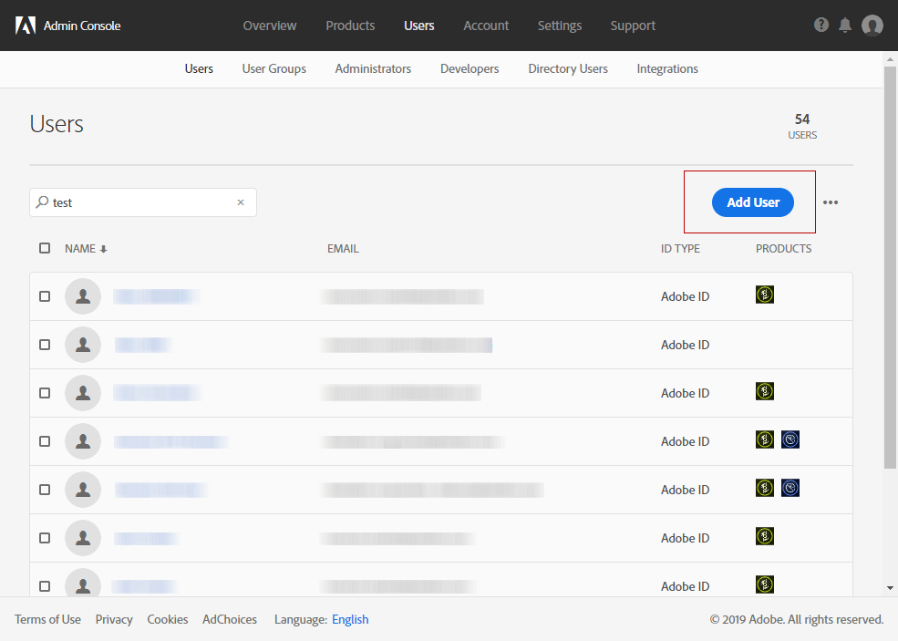

# Gebruikersbeheer{#users-management}

## Gebruikers {#about-users}

Met Adobe Campaign kunt u een set rollen toewijzen aan uw gebruikers om te bepalen tot welk deel van de interface ze toegang hebben.

De specifieke rollen en de bijbehorende machtigingen worden in de volgende secties nader beschreven: [inzicht in rollen](../../administration/using/list-of-roles.md) en [machtigingen](https://docs.campaign.adobe.com/doc/standard/en/Technotes/AdobeCampaign-ACSRights.pdf).

Beheerders kunnen gebruikers beheren via Admin Console. Gebruikers worden dan automatisch gesynchroniseerd met Adobe Campaign. Raadpleeg de documentatie bij de [Admin Console](https://helpx.adobe.com/nl/enterprise/using/users.html) voor meer informatie.

Als u gebruikers in Adobe Campaign wilt weergeven, klikt u op het **[!UICONTROL Adobe Campaign]**-logo in de linkerbovenhoek en selecteert u **[!UICONTROL Administration > Users & Security > Users]**.

Klik op **[!UICONTROL User administration]** voor toegang tot de gebruikersbeheerinterface van Adobe Campaign.

**Verwante onderwerpen:**

* [Gebruikersmachtigingen beheren](https://docs.adobe.com/content/help/en/campaign-learn/campaign-standard-tutorials/getting-started/access-management.html) (video)
* [Lijst met rollen](../../administration/using/list-of-roles.md)
* [Lijst met machtigingen](https://docs.campaign.adobe.com/doc/standard/en/Technotes/AdobeCampaign-ACSRights.pdf)

## Gebruikerstypen {#type-of-users}

Deze gebruikerssegmentatie is niet verplicht, maar een afspiegeling van de meest voorkomende gebruikerstypen in Adobe Campaign.

Deze sectie biedt u inzicht in de belangrijkste typen gebruikers van Adobe Campaign. We zullen hier niet ingaan op alle specifieke rollen die een gebruiker kan hebben (leveringen starten, uitvoeren, leveringen voorbereiden, enz.). Voor meer informatie over rollen gaat u naar de pagina [Lijst met rollen](../../administration/using/list-of-roles.md) of [Groepen en gebruikers beheren](../../administration/using/managing-groups-and-users.md).

We concentreren ons liever op de manier waarop verschillende taken in Adobe Campaign worden verdeeld over de drie belangrijkste typen gebruikers:

* [Functionele beheerders](#functional-administrators): dit zijn de meest technische gebruikers in uw organisatie.
* [Geavanceerde gebruikers](#advanced-users): deze gebruikers verzorgen de instellingen van alle elementen die marketeers nodig hebben om hun leveringen te verzenden en te controleren.
* [Basisgebruikers](#basic-users): dit zijn de marketeers die hun campagnes personaliseren, leveren en controleren.

>[!NOTE]
>
>Functionele beheerders zijn niet hetzelfde als de technische beheerders van Adobe. De technische beheerders van Adobe hebben een interne Adobe-rol die niet toegankelijk is voor klanten. Zij beheren zaken als de provisioning van instanties, hosting, monitoring en toezicht op de infrastructuur en alle technische probleemoplossing.

### Functionele beheerders {#functional-administrators}

Functionele beheerders zijn gebruikers die toegang hebben tot de meest technische onderdelen van de interface. Zij beschikken over de rol **[!UICONTROL Administration]** en zorgen ervoor dat het platform zo is opgezet dat marketeers zich puur kunnen richten op het leveren van hun campagnes.

>[!CAUTION]
>
>Alleen functionele beheerders met **[!UICONTROL Administration]** rol en toegang tot **alle** eenheden hebben toegang tot verzendende logboeken, berichtlogboeken, trackinglogboeken, uitsluitingslogboeken, propositielogboeken en abonnementlogboeken. Een gebruiker zonder beheerdersrechten kan zich richten op deze logbestanden, maar begint met een gekoppelde tabel (profielen, levering).

Functionele beheerders zijn de enige gebruikers die toegang hebben tot het menu **[!UICONTROL Administration]** in de Adobe Campaign-interface. Aangezien deze gebruikers toegang nodig hebben tot de technische bronnen, kunt u de meer geavanceerde rollen aan hen toewijzen, zoals de kant-en-klare rollen **[!UICONTROL Administration]** en **[!UICONTROL Datamodel]**. Deze rollen worden gecombineerd in de **[!UICONTROL Administrators]** kant-en-klare beveiligingsgroep. Raadpleeg [deze sectie](../../administration/using/list-of-roles.md) voor meer informatie hierover.

Hier zijn de belangrijkste taken die ze kunnen uitvoeren:

* [Gebruikers en machtigingen beheren](../../administration/using/about-access-management.md): voor toegangsbeheer tot het platform (gebruikers, rollen, beveiligingsgroepen, eenheden).
* [Verschillende kanalen configureren](../../administration/using/about-channel-configuration.md): voor het instellen van verschillende platformkanalen en voor typologie- en quarantainebeheer.
* [Algemene applicatie-instellingen configureren](../../administration/using/external-accounts.md): voor de configuratie van de verschillende applicatie-elementen (externe accounts, opties, technische workflows).
* [Kant-en-klare functies verbeteren door ontwikkeling van nieuwe opties](../../developing/using/data-model-concepts.md): beheer van uw aangepaste bronnen en toegang tot diagnostische tools.
* [Instantieparameters instellen](../../administration/using/branding.md): voor het definiëren van verschillende merken en de configuratie van hun instellingen (logo, trackingbeheer, URL-domein voor toegang tot de landingspagina&#39;s, enz.).
* [Datapakketten exporteren en importeren](../../automating/using/managing-packages.md): voor het uitwisselen van bronnen tussen verschillende Adobe Campaign-instanties via gestructureerde XML-bestanden.
* [Logboeken exporteren](../../automating/using/exporting-logs.md) en [importsjablonen definiëren](../../automating/using/importing-data-with-import-templates.md#setting-up-import-templates).

### Geavanceerde gebruikers {#advanced-users}

Geavanceerde gebruikers zijn marketinggebruikers die de meest technische gebruiksscenario&#39;s in Adobe Campaign uitvoeren. Zij verzorgen de instellingen van alle elementen die marketeers nodig hebben om hun leveringen te verzenden en te controleren.

Voor dit type gebruiker gelden meer algemene rollen dan bij functionele beheerders, maar deze gebruikers kunnen ongetwijfeld ook een aantal technische bewerkingen uitvoeren. Daarvoor moeten ze bijvoorbeeld de kant-en-klare rollen **[!UICONTROL Export]**, **[!UICONTROL Generic import]** of **[!UICONTROL Workflow]** toegewezen krijgen. Raadpleeg [deze sectie](../../administration/using/list-of-roles.md) voor meer informatie hierover.

Hier zijn de belangrijkste taken die ze kunnen uitvoeren:

* [Complexe databeheerworkflows maken en uitvoeren](../../automating/using/about-data-management-activities.md): voor het importeren, verrijken en transformeren van data waarmee uw database wordt gevuld, of voor het exporteren van de benodigde data naar externe bestanden die u vervolgens kunt verwerken met uw eigen tools.
* [Sjabloonbeheer](../../start/using/marketing-activity-templates.md): voor het vooraf configureren van bepaalde parameters van uw marketingactiviteiten zodat de sjablonen perfect aansluiten op uw bedrijfsbehoeften.
* [Query&#39;s maken](../../automating/using/editing-queries.md#about-query-editor) en [doelgroepbeheer](../../audiences/using/about-audiences.md): voor het handmatig maken van doelgroepen via query&#39;s, of juist automatisch met gebruik van toegewezen workflows.
* [Geavanceerde expressies bewerken](../../automating/using/editing-queries.md#about-query-editor): voor gebruik van de geavanceerde functies om waarden te bewerken en hele specifieke query&#39;s uit te voeren zoals voor datums, tekenreeksen, numerieke velden, sorteren, enz.
* [Lijsten exporteren](../../automating/using/exporting-lists.md) en [data importeren met bestaande importsjablonen](../../automating/using/importing-data-with-import-templates.md).

### Basisgebruikers {#basic-users}

Dankzij de functionele beheerder en de geavanceerde gebruiker kunnen marketeers hun campagnes personaliseren, leveren en controleren, zonder dat ze zich zorgen hoeven te maken over de technische configuratie. Daarvoor moeten ze bijvoorbeeld de kant-en-klare rollen **[!UICONTROL Prepare deliveries]**, **[!UICONTROL Workflow]** of **[!UICONTROL Start deliveries]** toegewezen krijgen. Deze rollen worden gecombineerd in de **[!UICONTROL Standard Users]** kant-en-klare beveiligingsgroep. Raadpleeg [deze sectie](../../administration/using/list-of-roles.md) voor meer informatie hierover.

Hier zijn de belangrijkste taken die ze kunnen uitvoeren:

* [Programma&#39;s en campagnes beheren](../../start/using/programs-and-campaigns.md): marketingcampagnes opzetten en verschillende soorten activiteiten opnemen (e-mails, sms-berichten, pushberichten, workflows, landingspagina&#39;s).
* [Profielen](../../audiences/using/about-profiles.md) en [testprofielen](../../audiences/using/managing-test-profiles.md) beheren: voor het beheer van de geïdentificeerde ontvangers en testontvangers die worden getarget door uw leveringen. Informatie toevoegen in het systeem, zoals voornaam, achternaam, contactgegevens, abonnementen, e-mails, enz.
* [Berichten maken en verzenden](../../sending/using/confirming-the-send.md): berichten maken, de doelgroep selecteren, de berichtcontent definiëren, samen met de bijbehorende personalisatie-elementen, proefversies uitsturen en het uiteindelijke bericht naar uw doelgroep verzenden.
* [Landingspagina&#39;s maken en publiceren](../../channels/using/getting-started-with-landing-pages.md): een aantal services maken en beheren die u aan uw klanten wilt aanbieden, zoals formulieren voor abonneren of uitschrijven.
* [Workflows voor campagnes maken en uitvoeren](../../automating/using/building-a-workflow.md): voor de automatisering van uw campagneprocessen met behulp van workflows.
* Marketingactiviteiten kunnen worden bijgehouden via de [beschikbare rapporten](../../reporting/using/defining-the-report-period.md).

## Een gebruiker maken {#creating-a-user}

Als u een gebruiker aan een instantie wilt toevoegen, moet u de gebruiker eerst aanmaken in Admin Console voordat u deze in Adobe Campaign Standard kunt beheren.

1. Ga naar het menu Geavanceerd, selecteer **[!UICONTROL Administration > Users & Security > Users]** en klik op **[!UICONTROL User administration]** om Admin Console te openen.

   

1. Klik in het deelvenster **[!UICONTROL Admin Console]** op het tabblad **[!UICONTROL Users]**.

1. Klik op **[!UICONTROL Add User]**.

   

1. Op het tabblad **[!UICONTROL User details]** vult u de gegevens van de gebruiker in, zoals e-mailadres, naam en achternaam.

   

1. Op het tabblad **[!UICONTROL Assign products]** kunt u een of meer beveiligingsgroepen toewijzen aan uw gebruiker. Raadpleeg deze [pagina](../../administration/using/managing-groups-and-users.md) voor meer informatie over beveiligingsgroepen.

   Klik op **[!UICONTROL Save]** wanneer u klaar bent met de configuratie.

   

Wanneer de gebruiker is aangemaakt krijgt hij een e-mail waarmee hij wordt doorgestuurd naar het volgende venster. Hier moet de gebruiker een wachtwoord instellen en akkoord gaan met de gebruiksovereenkomst. Vervolgens kan deze gebruiker verbinding maken met uw Adobe Campaign Standard-instantie.

Uw gebruiker wordt gesynchroniseerd met Adobe Campaign Standard zodra hij zich aanmeldt bij uw instantie.

Vervolgens kunt u controleren of de gebruiker correct is gesynchroniseerd met Adobe Campaign:

1. Ga naar het menu Geavanceerd **[!UICONTROL Administration > Users & Security > Users]** en selecteer de gebruiker die u zojuist hebt gemaakt.

1. Werk de opties **[!UICONTROL Mobile]**, **[!UICONTROL Time zone]** of **[!UICONTROL Regional settings]** bij indien nodig.

1. Controleer de beveiligingsgroep van uw gebruiker. Hier kunt u zien dat de beveiligingsgroep **[!UICONTROL Administrators]** aan de gebruiker is toegewezen.

   >[!NOTE]
   >
   >Beveiligingsgroepen kunnen alleen worden verwijderd of toegevoegd aan een gebruiker in Admin Console.

   

1. Schakel de optie **[!UICONTROL Account disabled]** in als u deze gebruiker wilt deactiveren.

1. In het veld **[!UICONTROL Authorized connection zone]** geeft u aan op welke manier de gebruiker verbinding maakt met deze instantie, bijvoorbeeld via een intern netwerk of VPN.

1. Klik op **[!UICONTROL Save]**.

Uw gebruiker kan nu aan de slag met Adobe Campaign Standard.
