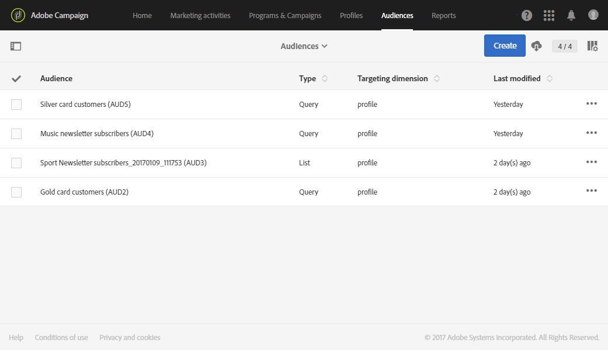
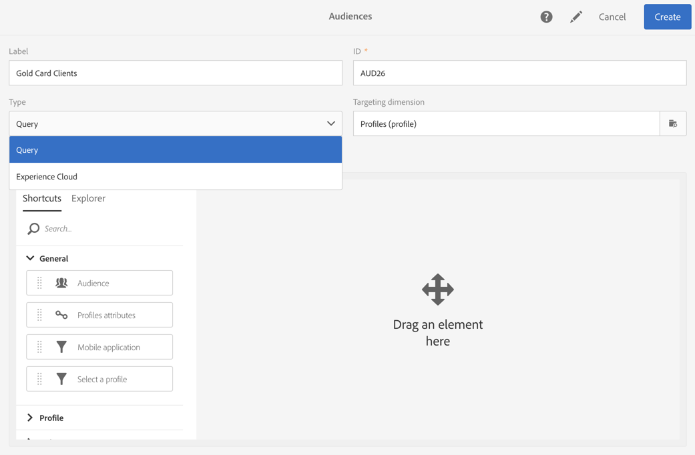

# Informatie over doelgroepen{#about-audiences}

Een doelgroep is een lijst met profielen die zijn gebaseerd op regels en kenmerken.

Met Adobe Campaign kunt u handmatig een doelgroep maken via query&#39;s, of automatisch door specifieke workflows te gebruiken. Met Adobe Experience Cloud kunt u ook gedeelde doelgroepen gebruiken. Alle doelgroepen worden opnieuw ingedeeld in een lijst die toegankelijk is via de kaart **[!UICONTROL Audiences]** op de startpagina van Adobe Campaign, of via de koppeling **[!UICONTROL Audiences]**.

In Adobe Campaign kunt u verschillende soorten doelgroepen bewerken. Het type doelgroep komt overeen met de manier waarop het is gemaakt:

* **[!UICONTROL Query]**: Hiermee wordt aangegeven dat het publiek is gemaakt met een [query](../../automating/using/editing-queries.md#about-query-editor) op gegevens uit de Adobe Campaign-database via de lijst met doelgroepen. Doelgroepen die op basis van een query worden gedefinieerd, worden bij elk volgend gebruik opnieuw berekend.
* **[!UICONTROL List]**: geeft aan dat de doelgroep bestaat uit een een vaste lijst met profielen. Deze lijsten worden gemaakt in een [workflow](../../automating/using/get-started-workflows.md) waarbij de datadimensie bekend is bij het opslaan van de doelgroep. Bijvoorbeeld na bepaalde targetingactiviteiten (met name **[!UICONTROL Query]**) of na de afstemming van data die vanuit een bestand zijn geïmporteerd.
* **[!UICONTROL File]**: geeft aan dat de doelgroep rechtstreeks is gebaseerd op een workflow voor [bestandsimport](../../automating/using/load-file.md) en dat de datadimensie onbekend was toen de doelgroep werd opgeslagen.
* **[!UICONTROL Experience Cloud]**: geeft aan dat de doelgroep is geïmporteerd uit Adobe Experience Cloud. Deze optie is alleen beschikbaar als de functionaliteit voor het delen van doelgroepen is geconfigureerd. Zie [Een doelgroep importeren uit Adobe Experience Cloud](../../integrating/using/sharing-audiences-with-audience-manager-or-people-core-service.md#importing-an-audience) voor meer informatie.

