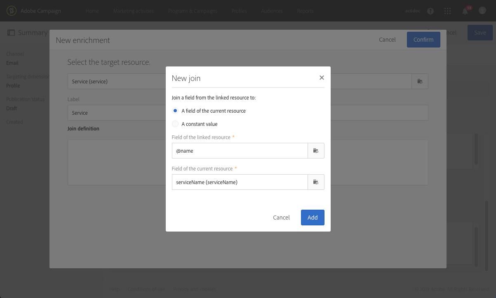

# Een abonnement op een service bevestigen{#confirming-subscription-to-a-service}

## Abonnementsbevestiging verzenden {#sending-subscription-confirmation}

In deze sectie wordt beschreven hoe u een automatisch aangepaste bevestigings-e-mail verzendt naar de profielen die zich inschrijven voor een specifieke service.

Wanneer u een bevestigingsbericht voor een inschrijving (of uitschrijving) bij de service wilt verzenden, kunt u het standaardbericht of een aangepast bericht gebruiken. De stappen voor het selecteren van een bevestigingsbericht worden weergegeven in de sectie [Een service maken](../../audiences/using/creating-a-service.md).

Als u het standaardbericht wilt gebruiken, kunt u de content ervan bewerken onder de volgende beperkingen:
* U kunt de content van het bericht alleen aanpassen met beperkte velden uit de context van de gebeurtenis.
* Dit bericht zal hetzelfde zijn voor alle services die de standaardmodus gebruiken.

Als u voor een bepaalde service een specifieke e-mailbevestiging wilt verzenden, kunt u een aangepast bericht maken waarin u ook personalisatievelden uit andere resources kunt gebruiken. Hiervoor moet u een transactioneel bericht maken en configureren. Naar dit bericht kan worden verwezen:
* Vanaf de service zelf. Zie [Een bevestigingsbericht configureren vanaf een service](#configuring-confirmation-message-from-service) voor meer informatie.
* Vanaf de landingspagina van een abonnement. Zie [Een bevestigingsbericht configureren vanaf een landingspagina](#configuring-confirmation-message-from-landing-page) voor meer informatie.

## Een bevestigingsbericht configureren vanaf een service {#configuring-confirmation-message-from-service}

U wilt bijvoorbeeld automatisch een bevestigingsbericht verzenden naar de bezoekers van uw website wanneer ze zich inschrijven voor uw nieuwsbrief.

U moet een transactionele e-mail configureren en naar dat bericht verwijzen vanaf de gewenste service (in dit geval een abonnement op uw nieuwsbrief). Als u het transactionele bericht wilt verrijken met servicedata, kunt u een afstemming definiëren wanneer u de gebeurtenis maakt.

Wanneer u het configureert vanaf de service, wordt het transactionele bericht met de bevestiging alleen verzonden wanneer een nieuwe gebruiker voor de eerste keer inschrijft op die service. Als een profiel al geabonneerd is, wordt er geen bevestigingsbericht meer naar dat profiel verzonden.

### Stap 1: De bevestigings-e-mail maken {#step-1--create-the-confirmation-email-1}

Er wordt automatisch een bevestigings-e-mail verzonden naar elk profiel dat zich inschrijft voor de nieuwsbrief (via een landingspagina of op een andere manier). Het abonnement wordt beschouwd als een gebeurtenis en de e-mail is een [transactioneel bericht](../../channels/using/getting-started-with-transactional-msg.md) dat doelgericht elk profiel benadert dat zich inschrijft voor de service.

De stappen voor het maken van de bevestigings-e-mail worden hieronder beschreven. Aangezien in de service naar het transactionele bericht wordt verwezen, moet u dit eerst maken.

#### De gebeurtenis maken {#create-the-event-1}

De bevestigings-e-mail is een transactioneel bericht omdat deze op een gebeurtenis reageert: de inschrijving op een service. Dit bericht wordt verzonden ter bevestiging van een abonnement op uw nieuwsbrief.

1. Maak een gebeurtenis vanaf het menu **[!UICONTROL Marketing plans]** > **[!UICONTROL Transactional messages]** > **[!UICONTROL Event configuration]**, dat u kunt openen via het Adobe Campaign-logo.
1. Voer een label in, selecteer een doeldimensie en klik op **[!UICONTROL Create]**.

   De configuratiestappen worden weergegeven in de sectie [Transactionele berichten configureren](../../administration/using/configuring-transactional-messaging.md).

1. Klik in de sectie **[!UICONTROL Fields]** op **[!UICONTROL Create element]** en voeg **[!UICONTROL publicLabel]** toe aan de datastructuur om de afstemming in te schakelen.

   

   >[!NOTE]
   >
   >Het veld **[!UICONTROL publicLabel]** is verplicht. Als u dit niet toevoegt aan de datastructuur van de gebeurtenis, kan Adobe Campaign de afstemming met de service niet uitvoeren. Wanneer u zich inschrijft voor een service, wordt dit veld ingevuld met het **[!UICONTROL Service label]** van de bijbehorende service.

1. Klik in de sectie **[!UICONTROL Enrichment]** op **[!UICONTROL Create element]** en selecteer de doelresource **[!UICONTROL Service]**.

   

1. Wijs in de sectie **[!UICONTROL Join definition]** het veld **[!UICONTROL publicLabel]** van de resource **[!UICONTROL Service]** toe aan het veld **[!UICONTROL publicLabel]** van de gebeurtenisconfiguratie.

   

   >[!NOTE]
   >
   >Hierdoor kunt u personalisatievelden van de resource **[!UICONTROL Service]** in het transactionele bericht gebruiken.

1. Sla de gebeurtenisconfiguratie op en klik op **[!UICONTROL Publish]** om de gebeurtenis te publiceren.

De gebeurtenis is gereed. U kunt nu het transactionele e-mailbericht ontwerpen.

#### Het bevestigingsbericht ontwerpen {#design-the-confirmation-message-1}

De bevestigings-e-mail is een transactioneel bericht gebaseerd op de gebeurtenis die u zojuist hebt gepubliceerd.

1. Selecteer vanaf het Adobe Campaign-logo de optie **[!UICONTROL Marketing plans]** > **[!UICONTROL Transactional messages]** en klik op **[!UICONTROL Transactional messages]**.
1. Selecteer de transactionele e-mail die overeenkomt met de gebeurtenis die u zojuist hebt gepubliceerd.

1. Klik op de sectie **[!UICONTROL Content]** en selecteer een e-mailsjabloon. Zie [Transactieberichten voor gebeurtenissen](../../channels/using/event-transactional-messages.md) voor meer informatie over het bewerken van de content van een transactioneel bericht.
1. Aangezien u directe toegang hebt tot alle velden van de resource **[!UICONTROL Service]**, kunt u een willekeurig veld selecteren vanaf het knooppunt **[!UICONTROL Context]** > **[!UICONTROL Real-time event (rtEvent)]** > **[!UICONTROL Event context (ctx)]** >**[!UICONTROL Service]** om uw content te personaliseren.

   

   Raadpleeg [deze sectie](../../channels/using/event-transactional-messages.md#personalizing-a-transactional-message) voor meer informatie over het personaliseren van een transactioneel bericht.

1. Bekijk een voorbeeld van uw bericht met een testprofiel. Zie [Een testprofiel definiëren in een transactioneel bericht](../../channels/using/event-transactional-messages.md#defining-a-test-profile-in-a-transactional-message) voor meer informatie.

1. Klik op **[!UICONTROL Save & close]** om de content op te slaan.
1. Publiceer het transactionele bericht. Zie [Een transactioneel bericht publiceren](../../channels/using/event-transactional-messages.md#publishing-a-transactional-message).

### Stap 2: De service maken en configureren {#step-2--create-and-configure-the-service-1}

1. Maak een service via het geavanceerde menu **Profiles &amp; audiences** > **Services** via het Adobe Campaign-logo.
1. Ga naar de sectie **[!UICONTROL Service properties]** via de knop  in het servicedashboard.
1. Vul het veld **[!UICONTROL Service label]** in.

   

   >[!NOTE]
   >
   >U moet dit veld invullen om afstemming met het transactionele bericht in te schakelen.

1. Selecteer in de sectie **[!UICONTROL Confirmation messages]** de optie **[!UICONTROL Custom message]**: in deze modus kunt u verwijzen naar een specifiek bevestigingsbericht voor profielen die geabonneerd zijn op uw service.
1. Selecteer de **[!UICONTROL Custom subscription event configuration]** die gekoppeld is aan het transactionele bericht dat u hebt gemaakt.

   

1. Klik op **[!UICONTROL Confirm]** en sla de service op.

Telkens wanneer een profiel zich inschrijft voor deze service, ontvangt dit nu het transactionele bericht dat u hebt gedefinieerd, met gepersonaliseerde velden die aan de geselecteerde service zijn toegewezen.

>[!NOTE]
>
>Er wordt alleen een bericht verzonden wanneer de gebruiker zich voor de eerste keer inschrijft.

## Een bevestigingsbericht configureren vanaf een landingspagina{#configuring-confirmation-message-from-landing-page}

U kunt ook naar het bevestigingsbericht verwijzen vanaf de landingspagina van een abonnement door de optie **[!UICONTROL Start sending messages]** van de sectie **[!UICONTROL Job]** van de landingspagina te gebruiken.

Wanneer naar het bevestigingsbericht wordt verwezen vanaf de landingspagina, wordt een bericht verzonden elke keer dat de landingspagina wordt verzonden (zelfs als het profiel al geabonneerd is).

### Stap 1: De bevestigings-e-mail maken {#step-1--create-the-confirmation-email-2}

Er wordt automatisch een bevestigings-e-mail verzonden naar elk profiel dat zich inschrijft voor de nieuwsbrief via een landingspagina. Het abonnement wordt beschouwd als een gebeurtenis en de e-mail is een [transactioneel bericht](../../channels/using/getting-started-with-transactional-msg.md) dat doelgericht elk profiel benadert dat zich inschrijft voor de service.

De stappen voor het maken van deze elementen worden hieronder beschreven. Aangezien in de landingspagina naar het transactionele bericht wordt verwezen, moet u dit eerst maken.

#### De gebeurtenis maken {#create-the-event-2}

De bevestigings-e-mail is een [transactioneel bericht](../../channels/using/getting-started-with-transactional-msg.md) omdat deze op een gebeurtenis reageert: de inschrijving op een service. Dit bericht wordt verzonden ter bevestiging van een abonnement op uw nieuwsbrief.

1. Maak een gebeurtenis vanaf het menu **[!UICONTROL Marketing plans]** > **[!UICONTROL Transactional messages]** > **[!UICONTROL Event configuration]**, dat u kunt openen via het Adobe Campaign-logo.
1. Voer een label in, selecteer een doeldimensie en klik op **[!UICONTROL Create]**.

   De configuratiestappen worden weergegeven in de sectie [Transactionele berichten configureren](../../administration/using/configuring-transactional-messaging.md).

1. Klik in de sectie **[!UICONTROL Fields]** op **[!UICONTROL Create element]** en voeg **[!UICONTROL serviceName]** toe aan de datastructuur om de afstemming in te schakelen.

   

   >[!NOTE]
   >
   >Het veld **[!UICONTROL serviceName]** is verplicht. Als u dit niet toevoegt aan de datastructuur van de gebeurtenis, kan Adobe Campaign de afstemming met de service waarop u lgeabonneerd bent, niet uitvoeren.

1. Klik in de sectie **[!UICONTROL Enrichment]** op **[!UICONTROL Create element]** en selecteer de doelresource **[!UICONTROL Service]**.
1. Wijs in de sectie **[!UICONTROL Join definition]** het veld **[!UICONTROL serviceName]** van de resource **[!UICONTROL Service]** toe aan het veld **[!UICONTROL name]** van de gebeurtenisconfiguratie.

   

   >[!NOTE]
   >
   >Hierdoor kunt u personalisatievelden van de resource [!UICONTROL Service] in het transactionele bericht gebruiken.

#### Het bevestigingsbericht ontwerpen {#design-the-confirmation-message-2}

De stappen voor het ontwerpen van het transactionele bericht worden weergegeven in deze [sectie](#design-the-confirmation-message-1).

### Stap 2: De service maken en configureren {#step-2--create-and-configure-the-service-2}

1. Maak een service via het geavanceerde menu **[!UICONTROL Profiles & audiences]** > **[!UICONTROL Services]** via het Adobe Campaign-logo.
1. Ga naar de sectie **[!UICONTROL Service properties]** via de knop  in het servicedashboard.
1. Vul het veld **[!UICONTROL Service label]** in. Dit label wordt weergegeven in het bevestigingsbericht en op de landingspagina van het abonnement.
1. Klik op **[!UICONTROL Confirm]** en sla de service op.

### Stap 3: De landingspagina maken en configureren {#step-3--create-and-configure-the-landing-page}

Maak een landingspagina voor abonnementen die op uw website wordt gepubliceerd.

Volg onderstaande stappen om deze landingspagina te maken en te configureren:

1. Ontwerp een [nieuwe landingspagina](../../channels/using/getting-started-with-landing-pages.md) op basis van de sjabloon **[!UICONTROL Subscription]**.
1. Bewerk de eigenschappen van de landingspagina. Selecteer in de sectie **[!UICONTROL Job]** > **[!UICONTROL Specific actions]** de optie **[!UICONTROL Specific service]** en kies de service die u zojuist hebt gemaakt in de vervolgkeuzelijst.

   

1. Selecteer de optie **[!UICONTROL Start sending message]** en kies het transactionele bericht dat u zojuist hebt gemaakt in de vervolgkeuzelijst.

   

1. Pas de content van de landingspagina aan.

1. [Test en publiceer](../../channels/using/testing-publishing-landing-page.md) de landingspagina.

Telkens wanneer een profiel zich inschrijft voor uw nieuwsbrief door de landingspagina te verzenden, ontvangt deze het bevestigingsbericht dat u hebt gedefinieerd met gepersonaliseerde velden die aan de service zijn toegewezen.

>[!NOTE]
>
>Elke keer dat de landingspagina wordt verzonden, wordt er een bericht verzonden, zelfs als het profiel al geabonneerd is.
