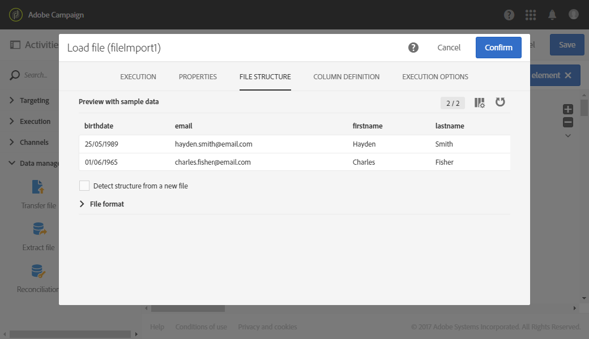
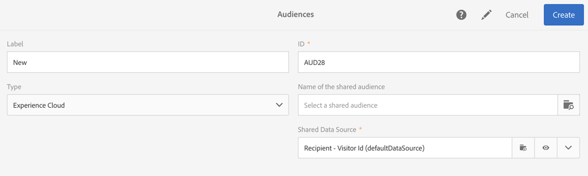

# Soorten publiek maken{#creating-audiences}

## Query-publiek maken {#creating-query-audiences}

In deze sectie wordt beschreven hoe u een **query** -publiek kunt maken. U kunt ook een publiek maken dat een bestand importeert of doelt in een [workflow](../../automating/using/discovering-workflows.md).

Vanuit de publiekslijst kunt u soorten publiek maken door query&#39;s uit te voeren in Adobe Campagneprofielen of door een Adobe Experience Cloud-publiek te importeren.

1. Ga naar de publiekslijst via het **[!UICONTROL Audiences]** tabblad of de kaart.

   

1. Selecteer **[!UICONTROL Create]** om tot het scherm toegang te hebben om een nieuw publiek tot stand te brengen.

   

1. Geef uw publiek een naam. Het label voor het publiek wordt gebruikt in de lijst met doelgroepen en in het palet van het querygereedschap.
1. Kies een type **[!UICONTROL Query]** publiek: het publiek dat door een vraag wordt bepaald wordt opnieuw berekend bij elk verder gebruik.

   

1. Selecteer vervolgens de **[!UICONTROL Targeting dimension]** code die u wilt gebruiken om uw klanten te filteren. Elk publiek bestaat uit één enkele gericht dimensie. U kunt bijvoorbeeld geen publiek maken dat is opgebouwd uit profielen, testprofielen en abonnees. Raadpleeg [deze pagina](../../automating/using/query.md#targeting-dimensions-and-resources)voor meer informatie over doelgerichte afmetingen.
1. Maak de query om de doelpopulatie te definiëren. Raadpleeg de sectie over het [bewerken van query](../../automating/using/editing-queries.md)&#39;s.
1. Klik op de **[!UICONTROL Create]** knop om uw publiek op te slaan.

>[!NOTE]
>
>U kunt een beschrijving aan dit publiek toevoegen en de toegangsvergunningen via het **[!UICONTROL Edit properties]** pictogram bepalen.

## Lijstpubliek maken {#creating-list-audiences}

In deze sectie wordt beschreven hoe u een **List** -publiek kunt maken nadat u zich hebt aangemeld voor een workflow. U kunt ook een publiek maken door een bestand in een [werkstroom](../../automating/using/discovering-workflows.md) te importeren of via een query in het **[!UICONTROL Audiences]** menu.

Voor het maken van een **List** -publiek worden de volgende stappen uitgevoerd:

1. Klik op het tabblad **Marketing-activiteiten** op **Maken** en selecteer vervolgens **Workflow**.

   

1. De belemmering en de daling, en vormen dan de het richten activiteiten die u zullen toestaan om een bevolking te selecteren die een **bekende** dimensie heeft. De lijst van beschikbare activiteiten en hun configuratie worden in de sectie [Doelactiviteiten](../../automating/using/about-targeting-activities.md) nader beschreven.

   U kunt een **[!UICONTROL Query]** activiteit gebruiken, of gegevens invoeren gebruikend een **[!UICONTROL Load file]** activiteit alvorens een **[!UICONTROL Reconciliation]** activiteit te gebruiken om de dimensie van de ingevoerde gegevens te identificeren. Hier willen we ontvangers die zich met een **[!UICONTROL Query]** activiteit hebben geabonneerd op de Sport Newsletter, als doel stellen.

   

1. Nadat u zich hebt gericht, sleep en laat vallen een **[!UICONTROL Save audience]** activiteit in uw werkschema. U kunt er bijvoorbeeld voor kiezen **[!UICONTROL Create or update an audience]**, zodat u uw publiek automatisch kunt bijwerken met nieuwe gegevens. Voeg in dit geval een **[!UICONTROL Scheduler]** activiteit toe aan het begin van de workflow.

   Raadpleeg de sectie [voor meer informatie over het configureren van deze activiteit](../../automating/using/save-audience.md) .

   

1. Sla de workflow op en start deze.

   Aangezien het **[!UICONTROL Save audience]** na het richten met een bekende dimensie wordt geplaatst, zijn de publiek dat via deze activiteit wordt gecreeerd **publiek List** .

   De inhoud van het opgeslagen publiek is vervolgens beschikbaar in de gedetailleerde weergave van het publiek, die toegankelijk is via de lijst met doelgroepen. De kolommen beschikbaar van deze mening beantwoorden aan de kolommen van de binnenkomende overgang van de werkschema sparen activiteit. Bijvoorbeeld: de kolommen van het ingevoerde dossier, de extra gegevens die van een vraag worden toegevoegd.

   

## Bestandspubliek maken {#creating-file-audiences}

In deze sectie wordt beschreven hoe u een **bestandspubliek** kunt maken door een bestand in een workflow te importeren. U kunt ook een publiek maken op basis van een doelactiviteit in een [workflow](../../automating/using/discovering-workflows.md) of via een query in het **[!UICONTROL Audiences]** menu.

Voor het maken van een **bestandspubliek** gelden de volgende stappen:

1. Klik op het tabblad **Marketing-activiteiten** op **Maken** en selecteer vervolgens **Workflow**.
1. Sleep en zet de cursor neer en configureer vervolgens een **[!UICONTROL Load file]** activiteit waarmee u een populatie kunt importeren die een **onbekende** dimensie heeft wanneer de workflow wordt uitgevoerd. Raadpleeg de sectie Bestand  laden voor meer informatie over het configureren van deze activiteit.

   

1. Sleep een **[!UICONTROL Save audience]** activiteit na de **[!UICONTROL Load file]** activiteit. Raadpleeg de sectie [voor meer informatie over het configureren van deze activiteit](../../automating/using/save-audience.md) .
1. Sla de workflow op en start deze.

   

   Terwijl de gegevens na het importeren **[!UICONTROL Save audience]** worden geplaatst, is de gegevensdimensie onbekend en zijn de doelgroepen die met deze activiteit worden gemaakt, **Bestandssoorten** .

   De inhoud van het opgeslagen publiek is vervolgens beschikbaar in de gedetailleerde weergave van het publiek, die toegankelijk is via de lijst met doelgroepen. De kolommen beschikbaar van deze mening beantwoorden aan de kolommen van de binnenkomende overgang van de werkschema sparen activiteit. Bijvoorbeeld: de kolommen van het ingevoerde dossier, de extra gegevens die van een vraag worden toegevoegd.

   

## Cloud-publiek maken {#creating-experience-cloud-audiences}

Met Adobe Campaign kunt u soorten publiek delen en uitwisselen met Adobe Experience Cloud. Een publiek van het type **Experience Cloud** wordt met de **[!UICONTROL Import shared audience]** technische workflow rechtstreeks geïmporteerd van de People core-service naar Adobe Campaign.

In tegenstelling tot het **vraagtype** dat profielen van de Campagne van Adobe zal vragen, wordt het publiek van de **Ervaring Cloud** samengesteld uit een lijst van Bezoeker IDs.

Voor deze integratie aan het werk, moet u het eerst vormen. Voor meer informatie over configuratie en hoe te om publiek met de kerndienst van Mensen in te voeren of uit te voeren, verwijs naar de volgende [sectie](../../integrating/using/sharing-audiences-with-audience-manager-or-people-core-service.md).

## Soorten publiek bewerken {#editing-audiences}

Er zijn verschillende manieren om een publiek uit te geven afhankelijk van het publiekstype:

* Als u een **query** -publiek wilt bewerken, gaat u naar de lijst met soorten publiek via het **[!UICONTROL Audiences]** menu of de **[!UICONTROL Audiences]** kaart van de startpagina van de Adobe-campagne.

   Open het relevante publiek. Alle elementen van een eerder gemaakt publiek kunnen worden bewerkt.

   >[!CAUTION]
   >
   >Als u **[!UICONTROL Filtering dimension]** in de vraag verandert, zullen de regels die eerder zijn bepaald worden verloren.

* Als u een **List** - of **File** -publiek wilt bewerken, bewerkt u de workflow van waaruit deze is gemaakt en wijzigt u de **[!UICONTROL Save audience]** activiteit. Start de workflow zodat het publiek wordt gewijzigd.
* Als u een **Experience Cloud** -publiek wilt bewerken, raadpleegt u de sectie [Importeren/exporteren van soorten publiek met de basisservice](../../integrating/using/sharing-audiences-with-audience-manager-or-people-core-service.md) Personen.

## Soorten publiek verwijderen {#deleting-audiences}

Er zijn twee manieren om een of meerdere soorten publiek te verwijderen. Eerst kunt u een vervaldatum aan uw publiek toevoegen

Daartoe:

1. Open een van uw publiek.
1. Klik op de  knop voor toegang tot de configuratie van uw publiek.

   

1. Voeg in het **[!UICONTROL Expires on]** veld een vervaldatum toe aan uw publiek.

   

1. Klik **[!UICONTROL Confirm]** dan **[!UICONTROL Save]**.

Uw vervaldatum is nu geconfigureerd. Zodra deze datum wordt bereikt, wordt uw publiek automatisch verwijderd.

Of als u een publiek moet verwijderen, kunt u gewoon een of meerdere soorten publiek selecteren en op de **[!UICONTROL Delete element]** knop klikken.

