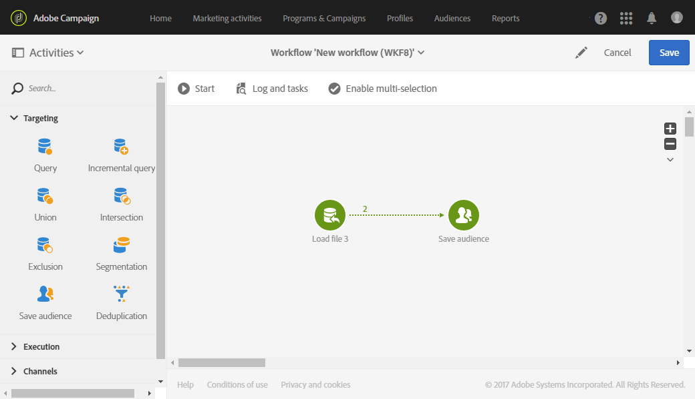

# Doelgroepen maken{#creating-audiences}

## Querydoelgroepen maken {#creating-query-audiences}

In deze sectie wordt beschreven hoe u een **query** doelgroep maakt. U kunt ook een doelgroep maken door een bestand te importeren of een doelgroep te targetten in een [workflow](../../automating/using/get-started-workflows.md).

Vanuit de doelgroeplijst kunt u doelgroepen maken door query&#39;s uit te voeren in Adobe Campaign-profielen of door een Adobe Experience Cloud-doelgroep te importeren.

1. Ga naar de doelgroeplijst via het tabblad **[!UICONTROL Audiences]** of de kaart.

   

1. Selecteer **[!UICONTROL Create]** om het scherm te openen waarin u een nieuwe doelgroep kunt maken.

   

1. Geef een naam aan de doelgroep. Het label voor de doelgroep wordt gebruikt in de lijst met doelgroepen en in het palet van de querytool.
1. Kies een type doelgroep voor **[!UICONTROL Query]**: de doelgroep die door een query wordt bepaald, wordt bij elk verder gebruik opnieuw berekend.

   

1. Selecteer vervolgens de **[!UICONTROL Targeting dimension]** die u wilt gebruiken om uw klanten te filteren. Elke doelgroep bestaat uit één targetingdimensie. U kunt bijvoorbeeld geen doelgroep maken die is opgebouwd uit zowel profielen, testprofielen als abonnees. Ga naar [deze pagina](../../automating/using/query.md#targeting-dimensions-and-resources) voor meer informatie over targetingdimensies.
1. Maak de query om de doelpopulatie te definiëren. Raadpleeg de sectie over het [bewerken van query&#39;s](../../automating/using/editing-queries.md).
1. Klik op de knop **[!UICONTROL Create]** om uw doelgroep op te slaan.

>[!NOTE]
>
>U kunt een beschrijving aan deze doelgroep toevoegen en de toegangsrechten bepalen via het pictogram **[!UICONTROL Edit properties]**.

## Lijstdoelgroepen maken {#creating-list-audiences}

In deze sectie wordt beschreven hoe u een **lijstdoelgroep** maakt na targeting in een workflow. U kunt ook doelgroepen maken door een bestand te importeren in een [workflow](../../automating/using/get-started-workflows.md) of via een query in het menu **[!UICONTROL Audiences]**.

Voer de volgende stappen uit om een **lijstdoelgroep** te maken:

1. Ga naar het tabblad met **marketingactiviteiten**, klik op **Create** (Maken) en selecteer vervolgens **Workflow**.

   

1. Sleep en zet de targetingactiviteiten neer waarmee u een populatie met een **bekende** dimensie kunt selecteren. Hierna kunt u deze activiteiten configureren. De lijst met beschikbare activiteiten en hun configuratie worden nader beschreven in de sectie [Doelactiviteiten](../../automating/using/about-targeting-activities.md).

   U kunt een **[!UICONTROL Query]**-activiteit gebruiken, of data via een **[!UICONTROL Load file]**-activiteit invoeren voordat u de dimensie van de geïmporteerde data identificeert met behulp van een **[!UICONTROL Reconciliation]**-activiteit. In dit voorbeeld willen we ontvangers die zijn geabonneerd op de Sport-nieuwsbrief targetten met een **[!UICONTROL Query]**-activiteit.

   

1. Na de targeting plaats u een **[!UICONTROL Save audience]**-activiteit in uw workflow via slepen en neerzetten. Kies bijvoorbeeld voor **[!UICONTROL Create or update an audience]** zodat uw doelgroep automatisch wordt bijgewerkt met nieuwe data. In dit geval voegt u een **[!UICONTROL Scheduler]**-activiteit toe aan het begin van de workflow.

   Raadpleeg de sectie [Doelgroep opslaan](../../automating/using/save-audience.md) voor meer informatie over het configureren van deze activiteit.

   

1. Sla de workflow op en start deze weer.

   Aangezien **[!UICONTROL Save audience]** na targeting met een bekende dimensie wordt geplaatst, zijn de doelgroepen die via deze activiteit zijn gemaakt zogenaamde **lijstdoelgroepen**.

   De content van de opgeslagen doelgroep wordt getoond in de gedetailleerde weergave voor de doelgroep, die toegankelijk is via de lijst met doelgroepen. De kolommen in deze weergave komen overeen met de kolommen van de binnenkomende overgang van de opslagactiviteit in de workflow. Bijvoorbeeld: de kolommen van het geïmporteerde bestand, de extra data die via een query zijn toegevoegd.

   

## Bestandsdoelgroepen maken {#creating-file-audiences}

In deze sectie wordt beschreven hoe u een **bestandsdoelgroep** maakt door een bestand te importeren in een workflow. U kunt ook een doelgroep maken van een targetingactiviteit in een [workflow](../../automating/using/get-started-workflows.md) of via een query in het menu **[!UICONTROL Audiences]**.

Voer de volgende stappen uit om een **bestandsdoelgroep** te maken:

1. Ga naar het tabblad met **marketingactiviteiten**, klik op **Create** (Maken) en selecteer vervolgens **Workflow**.
1. Sleep en zet een **[!UICONTROL Load file]**-activiteit neer waarmee u een populatie kunt importeren die een **onbekende** dimensie heeft wanneer de workflow wordt uitgevoerd. Hierna configureert u deze activiteit. Raadpleeg de sectie [Bestand laden](../../automating/using/load-file.md) voor meer informatie over het configureren van deze activiteit.

   

1. Sleep een **[!UICONTROL Save audience]**-activiteit en plaats deze na de **[!UICONTROL Load file]**-activiteit. Raadpleeg de sectie [Doelgroep opslaan](../../automating/using/save-audience.md) voor meer informatie over het configureren van deze activiteit.
1. Sla de workflow op en start deze weer.

   

   Omdat **[!UICONTROL Save audience]** pas na de importbewerking wordt geplaatst, is de datadimensie onbekend. De doelgroepen die met deze activiteit worden gemaakt zijn **bestandsdoelgroepen** .

   De content van de opgeslagen doelgroep wordt getoond in de gedetailleerde weergave voor de doelgroep, die toegankelijk is via de lijst met doelgroepen. De kolommen in deze weergave komen overeen met de kolommen van de binnenkomende overgang van de opslagactiviteit in de workflow. Bijvoorbeeld: de kolommen van het geïmporteerde bestand, de extra data die via een query zijn toegevoegd.

   

## Experience Cloud-doelgroepen maken {#creating-experience-cloud-audiences}

In Adobe Campaign kunt u doelgroepen delen en uitwisselen met Adobe Experience Cloud. Een doelgroep van **Experience Cloud** wordt rechtstreeks geïmporteerd van de People-kernservice naar Adobe Campaign met de technische workflow van **[!UICONTROL Import shared audience]**.

In tegenstelling tot doelgroepen van het type **Query**, waarbij query&#39;s worden uitgevoerd op Adobe Campaign-profielen, bestaat de **Experience Cloud**-doelgroep uit een lijst met bezoeker-id&#39;s.

Voordat u met deze integratie aan de slag kunt, moet u de integratie eerst configureren. Voor meer informatie over configuratie en hoe u doelgroepen importeert of exporteert met de People-kernservice, leest u de volgende [sectie](../../integrating/using/sharing-audiences-with-audience-manager-or-people-core-service.md).

## Doelgroepen bewerken {#editing-audiences}

Afhankelijk van het type doelgroep, kunt u een doelgroep op verschillende manieren bewerken:

* Als u een **querydoelgroep** wilt bewerken, gaat u naar de lijst met doelgroepen via het menu **[!UICONTROL Audiences]** of de kaart **[!UICONTROL Audiences]** op de startpagina van Adobe Campaign.

   Open de relevante doelgroep. Alle elementen van een eerder gemaakte doelgroep kunnen worden bewerkt.

   >[!CAUTION]
   >
   >Als u **[!UICONTROL Filtering dimension]** in de query verandert, gaan de regels die u eerder hebt gedefinieerd, verloren.

* Als u een **lijst-** of **bestandsdoelgroep** wilt bewerken, moet u de workflow waaruit de doelgroep is gemaakt bewerken en de **[!UICONTROL Save audience]**-activiteit wijzigen. Start de workflow zodat de doelgroep wordt gewijzigd.
* Als u een **Experience Cloud**-doelgroep wilt bewerken, raadpleegt u de sectie [Doelgroepen importeren/exporteren met de People-kernservice](../../integrating/using/sharing-audiences-with-audience-manager-or-people-core-service.md).

## Doelgroepen verwijderen {#deleting-audiences}

Er zijn twee manieren om een of meer doelgroepen te verwijderen. Ten eerste kunt u een vervaldatum aan een doelgroep toevoegen

Dit doet u als volgt:

1. Ga naar een doelgroep.
1. Klik op de knop  om toegang te krijgen tot de configuratie van uw doelgroep.

   

1. Voeg in het veld **[!UICONTROL Expires on]** een vervaldatum toe aan uw doelgroep.

   

1. Klik achtereenvolgens op **[!UICONTROL Confirm]** en **[!UICONTROL Save]**.

De vervaldatum is nu geconfigureerd. Wanneer deze datum wordt bereikt, wordt uw doelgroep automatisch verwijderd.

U kunt doelgroepen ook verwijderen door ze te selecteren en op de knop **[!UICONTROL Delete element]** te klikken.

