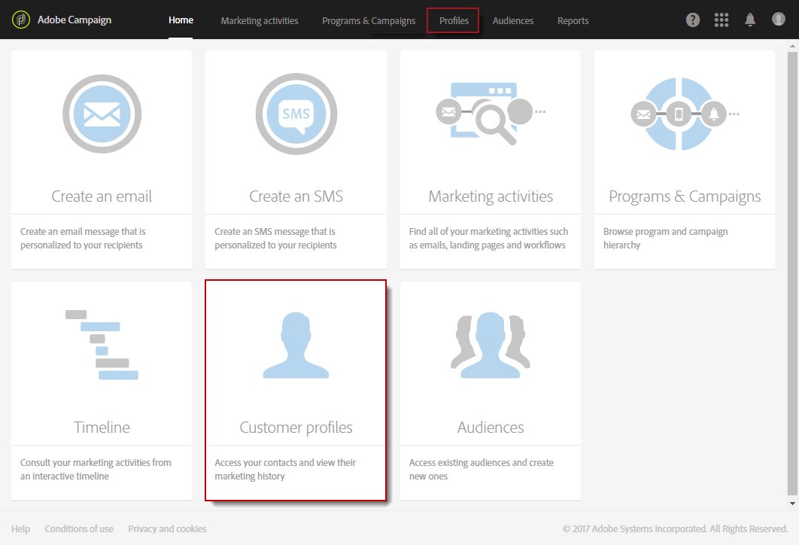
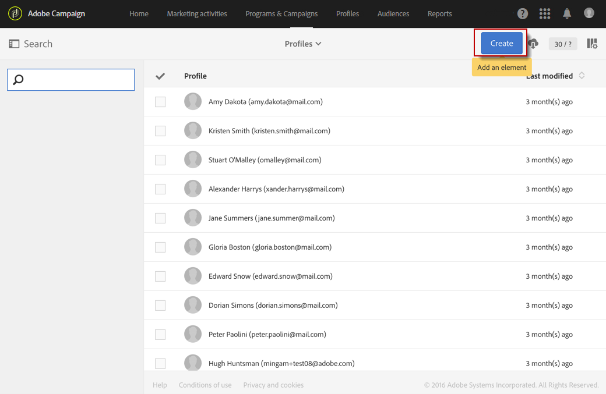
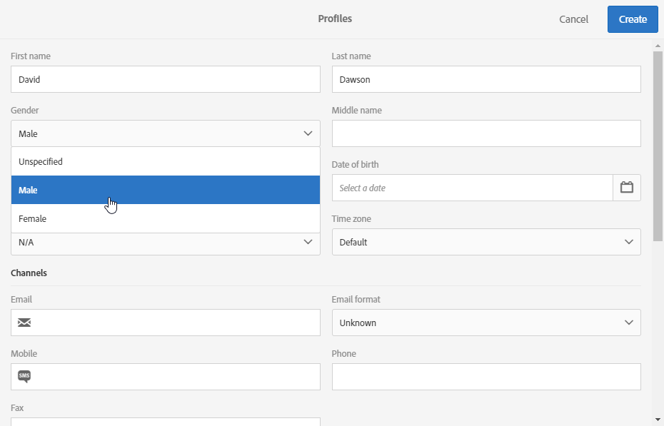

# Profielen maken{#creating-profiles}

In Adobe Campaign worden profielen standaard gebruikt om het hoofddoel van berichten te bepalen.

>[!NOTE]
>
>Het is ook mogelijk om profielen te maken met de Adobe Campaign Standard API. Raadpleeg de [desbetreffende documentatie](../../api/using/creating-profiles.md)voor meer informatie.

Als u een profiel wilt maken of bijwerken in Campaign, kunt u:

* een profiellijst importeren vanuit een bestand via een [workflow](../../automating/using/creating-import-workflow-templates.md)
* data online verzamelen via [landingspagina’s](../../channels/using/getting-started-with-landing-pages.md)
* bulk maken via [REST API](../../api/using/get-started-apis.md)
* profielen synchroniseren met [Microsoft Dynamics](../../integrating/using/working-with-campaign-standard-and-microsoft-dynamics-365.md)
* data invoeren met de grafische interfaceschermen, zoals hieronder wordt uitgelegd

Voer bijvoorbeeld de volgende stappen uit om een nieuw profiel rechtstreeks in de gebruikersinterface te maken:

1. Klik op de startpagina van Adobe Campaign op de kaart **Customer profiles** of op het tabblad **Profiles** om de lijst met profielen te openen.

   

1. Klik op **[!UICONTROL Create]**.

   

1. Voer de profieldata in.

   

   * De contactdata, zoals voornaam, achternaam, geslacht, geboortedatum, foto, voorkeurstaal (voor [meertalige e-mails](../../channels/using/creating-a-multilingual-email.md)), helpen de leveringen beter te personaliseren.
   * De **[!UICONTROL Time zone]** van het profiel wordt gebruikt om leveringen in de tijdzone van het profiel te verzenden. Raadpleeg deze [sectie](../../sending/using/sending-messages-at-the-recipient-s-time-zone.md) voor meer informatie.
   * In de categorie **[!UICONTROL Channels]**, die het e-mailadres, het mobiele telefoonnummer en informatie over uitschrijvingen bevat, kunt u zien via welk kanaal het profiel kan worden bereikt.
   * De categorie **[!UICONTROL No longer contact]** wordt bijgewerkt zodra het profiel zich uitschrijft bij een kanaal.
   * De categorie **[!UICONTROL Address]** bevat het postadres dat moet worden ingevuld en de optie **[!UICONTROL Address specified]** om [direct mail](../../channels/using/about-direct-mail.md) naar dit profiel te verzenden. Als de optie **[!UICONTROL Address specified]** niet is ingeschakeld, wordt dit profiel uitgesloten van elke direct-maillevering.
   * The **[!UICONTROL Access authorization]** category indicates the profile&#39;s organizational units to [manage permissions](../../administration/using/about-access-management.md). Raadpleeg de sectie [Partitioneringsprofielen](../../administration/using/organizational-units.md#partitioning-profiles) voor informatie over het toevoegen van organisatorische velden aan uw profielen.
   * De categorie **[!UICONTROL Traceability]** wordt automatisch bijgewerkt met informatie over de gebruiker die het profiel heeft gemaakt of gewijzigd.

1. Klik op **[!UICONTROL Create]** om het profiel op te slaan.

Het profiel wordt nu in de lijst weergegeven.

>[!NOTE]
>Het veld voor de voorkeurstaal wordt gebruikt om de taal te selecteren bij het verzenden van meertalige berichten. Raadpleeg deze [pagina](../../channels/using/creating-a-multilingual-email.md) voor meer informatie over de meertalige berichten.

**Verwante onderwerpen:**

* Stapsgewijze handleiding over [Landingspagina’s](../../channels/using/getting-started-with-landing-pages.md)
* Video over het [importeren van profielen](https://video.tv.adobe.com/v/24993?captions=dut)
