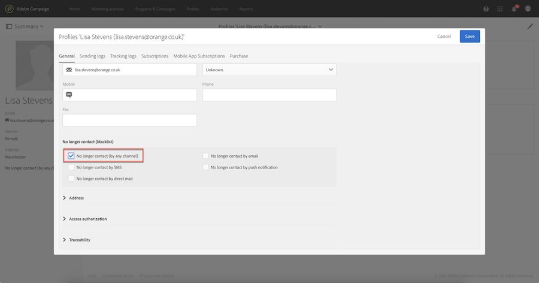

# Optie en opt-out beheren in campagne{#managing-opt-in-and-opt-out-in-campaign}

## Optie en opt-out beheren voor een profiel {#managing-opt-in-and-opt-out-from-a-profile}

Gebruikers kunnen door een operator rechtstreeks vanuit het **[!UICONTROL General]** tabblad Profiel in- of uitschakelen.

In de **[!UICONTROL No longer contact (on block list)]** sectie komen de geselecteerde selectievakjes overeen met de kanalen waarvan de gebruiker de optie Weigeren heeft gekozen. Selecteer de kanalen op basis van de behoeften van de gebruiker.

## Optie- en opt-out-bestemmingspagina&#39;s instellen {#setting-up-opt-in-and-opt-out-landing-pages}

Als u gebruikers de mogelijkheid wilt geven om in of uit te gaan, moet u een **[!UICONTROL Profile acquisition]** bestemmingspagina maken en publiceren. Vervolgens kunnen zij de kanalen selecteren op basis van hun behoeften. Volg de onderstaande stappen om dit te doen.

U kunt ook een **[!UICONTROL Block List]** openingspagina instellen waarmee gebruikers zich kunnen afmelden voor alle leveringen. Raadpleeg voor meer informatie een [bestemmingspagina instellen om te weigeren van alle leveringen](#setting-up-a-landing-page-to-opt-out-from-all-deliveries).

>[!NOTE]
>
>Landingspagina&#39;s kunnen ook worden gebruikt om servicesabonnement in te schakelen. For more on this, refer to [this page](../../channels/using/configuring-landing-page.md#linking-a-landing-page-to-a-service).

1. Maak een **[!UICONTROL Profile acquisition]** openingspagina (zie [deze sectie](../../channels/using/getting-started-with-landing-pages.md)).
1. Voeg een selectievakje toe in de inhoud van de bestemmingspagina voor elk gewenst kanaal en koppel het vervolgens vanuit de Campagne-database aan het corresponderende veld.

   

1. Sla de openingspagina op en publiceer deze.
1. Op de openingspagina zijn de selectievakjes al geselecteerd op basis van het **[!UICONTROL General]** tabblad Profiel. De gebruiker kan de kanalen naar behoefte selecteren of de selectie ervan opheffen en het formulier verzenden.

   

1. Nadat het formulier is verzonden, wordt het tabblad Profiel **[!UICONTROL General]** bijgewerkt op basis van de selectie van de gebruiker.

   

### Een landingspagina instellen om af te zien van alle leveringen {#setting-up-a-landing-page-to-opt-out-from-all-deliveries}

Als u gebruikers de mogelijkheid wilt geven zich af te melden voor alle leveringen, moet u een **[!UICONTROL Block list]** bestemmingspagina maken en publiceren. Raadpleeg [deze pagina](../../channels/using/getting-started-with-landing-pages.md)voor meer informatie over het maken van bestemmingspagina&#39;s.

Wanneer een gebruiker op de koppeling naar de bestemmingspagina klikt, wordt de **[!UICONTROL No longer contact (by any channel)]** optie in het profiel automatisch geselecteerd.

