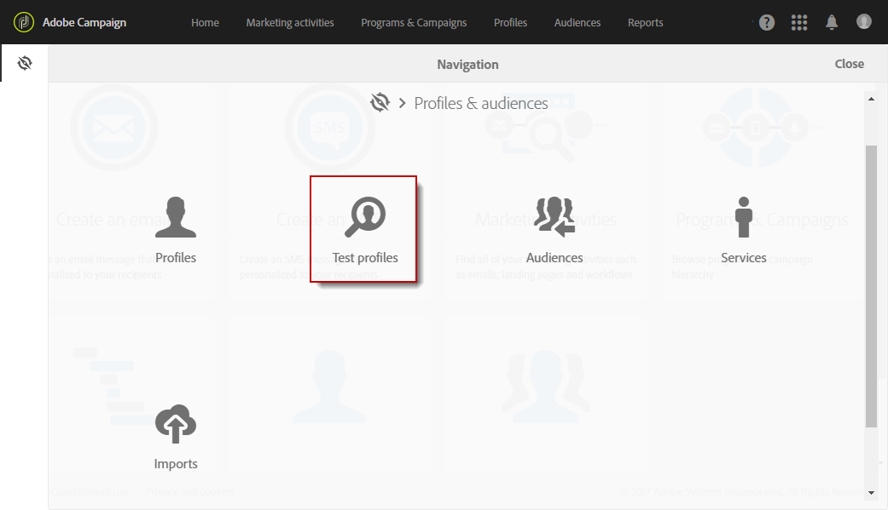
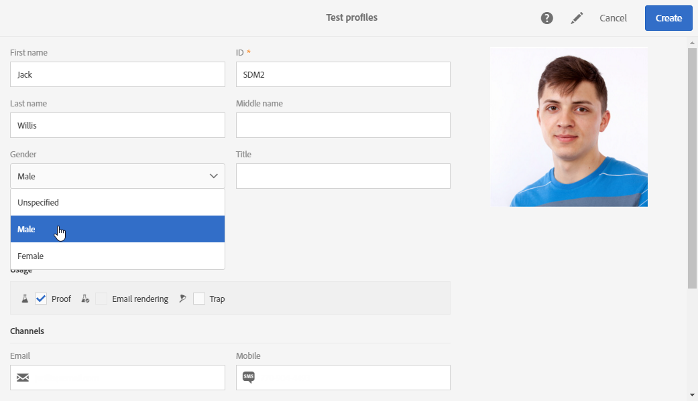

# Testprofielen beheren {#managing-test-profiles}

## Testprofielen {#about-test-profiles}

Met testprofielen kunt u aanvullende ontvangers die niet voldoen aan de gedefinieerde targetingcriteria doelgericht benaderen. Deze profielen worden toegevoegd aan de doelgroep van een bericht om frauduleus gebruik van uw database met ontvangers op te sporen of om ervoor te zorgen dat de e-mails in de inboxen aankomen.

 [Ontdek deze functie in video](#video)

U kunt uw testprofielen beheren via het geavanceerde menu **[!UICONTROL Profiles & audiences > Test profiles]**.

Een testprofiel bevat fictieve contactinformatie, of contactinformatie die door de afzender wordt gecontroleerd, en die dan in een bericht in de volgende context kan worden gebruikt:

* Voor het verzenden van **proeven**: Een proef is een specifiek bericht dat wordt gebruikt om het bericht te controleren voordat de definitieve levering naar ontvangers wordt verzonden. Een testprofiel voor proeven is verantwoordelijk voor de controle van de levering met betrekking tot de content en de opmaak ervan. Zie [Proeven verzenden](../../sending/using/sending-proofs.md).
* Voor **e-mailweergave**: Het testprofiel voor e-mailweergave wordt gebruikt om te controleren hoe een bericht wordt weergegeven volgens de berichteninbox die het bericht ontvangt. Dit kan bijvoorbeeld webmail, een berichtenservice, een mobiele applicatie, enzovoort zijn. Zie [E-mailweergave](../../sending/using/email-rendering.md).

   **E-mailweergave** is alleen-lezen. Testprofielen voor dit gebruik zijn alleen kant-en-klaar beschikbaar in Adobe Campaign.

* Als een **trap**: Het bericht wordt naar het testprofiel verzonden op dezelfde manier als het naar het belangrijkste doel wordt verzonden. Zie [Traps gebruiken](../../sending/using/using-traps.md).
* Voor het weergeven van **voorbeelden** van berichten: U kunt een testprofiel selecteren wanneer u een voorbeeld van een bericht weergeeft om de personalisatie-elementen te testen. Zie [Berichten voorvertonen](/help/sending/using/previewing-messages.md).

## Testprofielen maken {#creating-test-profiles}

1. Selecteer in het geavanceerde menu via het Adobe Campaign-logo de optie **Profiles &amp; audiences > Test profiles** om de lijst met testprofielen te openen.

   

1. Klik in het dashboard **[!UICONTROL Test profiles]** op **Create**.

   

1. Voer de data voor dit profiel in.

   

1. Selecteer het gewenste gebruik voor het testprofiel.

   

1. Voer zo nodig de contactkanalen **[!UICONTROL Email, Telephone, Mobile, Mobile app]** en het adres van het testprofiel in.

   >[!NOTE]
   >
   >U kunt een e-mailindeling van uw voorkeur definiëren: **[!UICONTROL Text]** of **[!UICONTROL HTML]**.

1. Geef een gebeurtenistype en de data voor deze gebeurtenis op als u dit testprofiel wilt gebruiken om de personalisatie van een transactioneel bericht te testen.
1. Klik op **[!UICONTROL Create]** om het testprofiel op te slaan.

Het testprofiel wordt vervolgens toegevoegd aan de lijst met profielen.

## Testprofielen bewerken {#editing-test-profiles}

U kunt als volgt een testprofiel bewerken en de bijbehorende data raadplegen of het profiel wijzigen:

1. Selecteer het testprofiel dat u wilt bewerken door op de afbeelding ervan te klikken.
1. Raadpleeg of wijzig de velden.

   

1. Klik op **[!UICONTROL Save]** als u de wijzigingen hebt ingevoerd of selecteer de naam van het testprofiel en vervolgens **[!UICONTROL Test profiles]** in de sectie bovenaan het scherm om terug te gaan naar het dashboard voor testprofielen.

## Video over zelfstudie {#video}

In deze video wordt getoond hoe u een testprofiel kunt maken.

>[!VIDEO](https://video.tv.adobe.com/v/24094?quality=12)

Er zijn [hier](https://experienceleague.adobe.com/docs/campaign-standard-learn/tutorials/overview.html?lang=nl) extra Campaign Standard hoe kan ik-video&#39;s beschikbaar.
