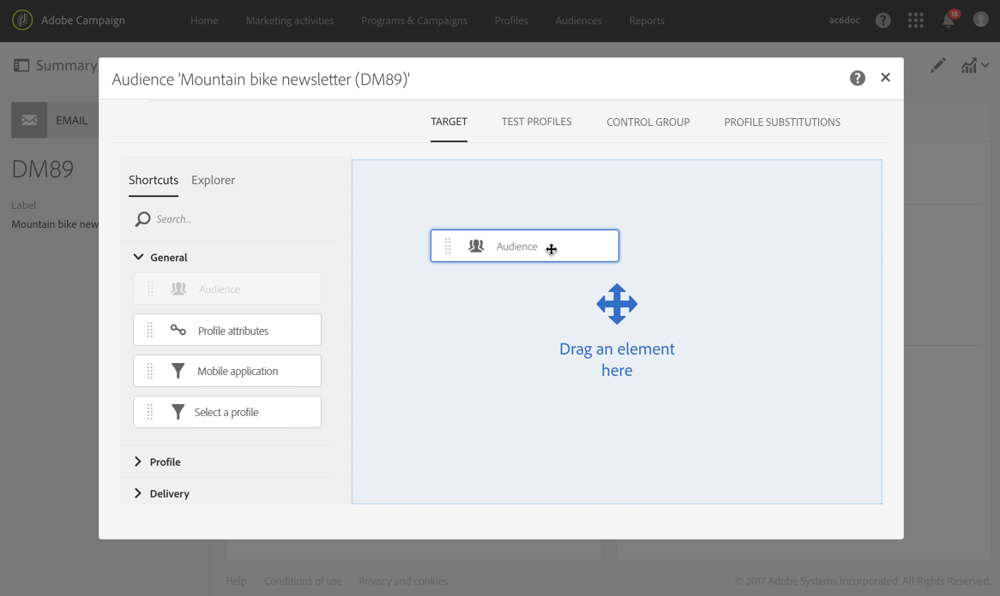

# Een publiek in een bericht selecteren{#selecting-an-audience-in-a-message}

Met Adobe Campaign kunt u verschillende profieltypen configureren voor een berichtvenster.

Het publiek kan worden bepaald wanneer het creëren van het bericht via de aanmaaktovenaar of van het berichtdashboard als het bericht reeds is gecreeerd.

>[!NOTE]
>
>Als het publiek is opgebouwd binnen een werkstroom en verrijkt met extra gegevens, zult u deze gegevens niet kunnen gebruiken om een standalone levering te personaliseren. Ze kunnen alleen worden gebruikt vanuit een levering die wordt uitgevoerd in een workflow.

1. Ga vanaf het dashboard naar het blok publiek om te beginnen.

   

   Het scherm om het publiek te bepalen dan opent. Het heeft twee lusjes die u toestaan om elk type van publiek afzonderlijk te bepalen dat het bericht zal ontvangen:

   * Doel
   * Testprofielen
   

1. Hoofdgedeelte **[!UICONTROL Target]** van e-mail definiëren. Dit is het reguliere doelpubliek van de e-mail.

   Het doel wordt gedefinieerd op het **[!UICONTROL Target]** tabblad en bestaat uit geïdentificeerde profielen uit uw database.

   U kunt uw belangrijkste doel vestigen gebruikend de functionaliteit van de [vraagredacteur](../../automating/using/editing-queries.md#creating-queries) .

   Op dit tabblad bevat het **[!UICONTROL Shortcuts]** palet alleen vooraf gedefinieerde filters en het publiek dat is gedefinieerd in de opgegeven profielen. Op het **[!UICONTROL Explorer]** tabblad hebt u toegang tot extra configuraties.

   U kunt daarom bestaande doelgroepen hergebruiken en combineren, er aanvullende filters op toepassen, enzovoort.

1. Definieer de **[!UICONTROL Test profiles]** gegevens die u voor de e-mail wilt gebruiken. De testprofielen ontvangen de proefdrukken die u vóór kunt verzenden om de e-mail te testen voordat u deze naar het hoofddoel verzendt.

   Raadpleeg de sectie [Testprofielen](../../audiences/using/managing-test-profiles.md) voor meer informatie over het configureren van testprofielen.

Het blok Soorten publiek wordt vervolgens bijgewerkt en toont dat een doel- en testprofiel zijn geselecteerd voor de e-mail in kwestie.

