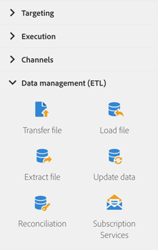

# Informatie over databeheeractiviteiten{#about-data-management-activities}

Ga naar het palet links op het scherm en vouw de sectie **[!UICONTROL Data management (ETL)]** uit.

Met deze activiteiten kunt u gegevens manipuleren. Zo kunt u bijvoorbeeld gegevens importeren, massa-updates uitvoeren op databasevelden, bestanden ontvangen of verzenden of niet-geïdentificeerde gegevens koppelen aan bestaande bronnen.

De sectie **[!UICONTROL Data management (ETL)]** bevat de volgende activiteiten:

* [Data bijwerken](../../automating/using/update-data.md)
* [Bestand laden](../../automating/using/load-file.md)
* [Bestand overdragen](../../automating/using/transfer-file.md)
* [Afstemming](../../automating/using/reconciliation.md)
* [Bestand extraheren](../../automating/using/extract-file.md)
* [Abonnementsservices](../../automating/using/subscription-services.md)

**[!UICONTROL Data management (ETL)]** De activiteiten staan u toe om **segmentcodes** voor hun uitgaande overgangen te bepalen. Vervolgens kunt u rapporten maken op basis van deze segmentcodes om de efficiëntie van uw marketingcampagnes te meten. Raadpleeg [deze sectie](../../reporting/using/creating-a-report-workflow-segment.md) voor meer informatie.
