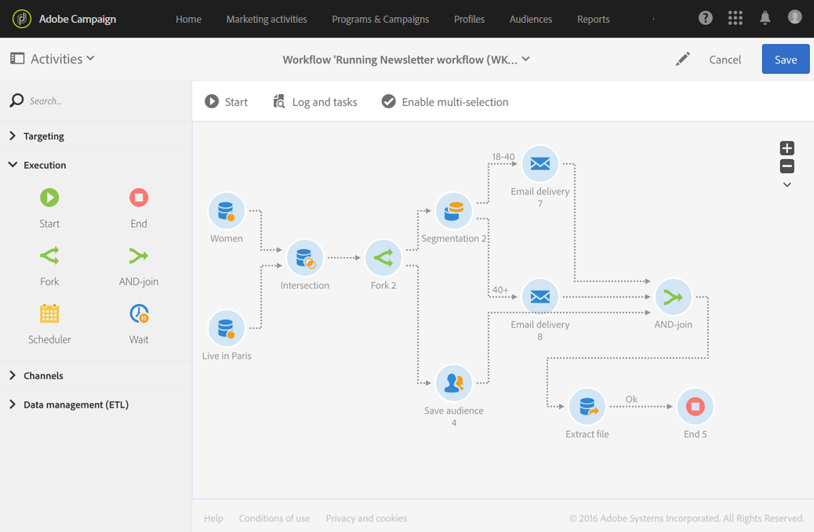

# AND-join{#and-join}

## Beschrijving {#description}

Met de activiteit **[!UICONTROL AND-join]** kunt u meerdere uitvoeringstakken van een workflow synchroniseren.

## Gebruikscontext {#context-of-use}

De activiteit **[!UICONTROL AND-join]** start de uitgaande overgang pas wanneer alle binnenkomende overgangen zijn geactiveerd, met andere woorden wanneer alle voorafgaande activiteiten zijn geëindigd.

## Configuratie {#configuration}

1. Sleep meerdere activiteiten, zoals query’s, naar uw workflow om minstens twee verschillende uitvoeringstakken te vormen.
1. Sleep een activiteit **[!UICONTROL AND-join]** en zet deze neer in uw workflow.
1. Verbind de activiteit na de twee verschillende takken die u wilt synchroniseren.
1. Selecteer de activiteit en open deze met de knop  vanuit de snelle acties die verschijnen.
1. Selecteer de hoofdset die in de uitgaande overgang behouden moet blijven. Als u geen set selecteert, wordt een willekeurige populatie verzonden vanuit de activiteit.
1. Bevestig de configuratie van uw activiteit en sla de workflow op.

## Voorbeeld {#example}

In het volgende voorbeeld ziet u workflowvertakkingen voordat ze aan de activiteit **[!UICONTROL AND-join]** zijn gekoppeld. Het extraheren van bestanden kan pas plaatsvinden wanneer de drie binnenkomende overgangen van de activiteit **[!UICONTROL AND-join]** zijn ingeschakeld.

