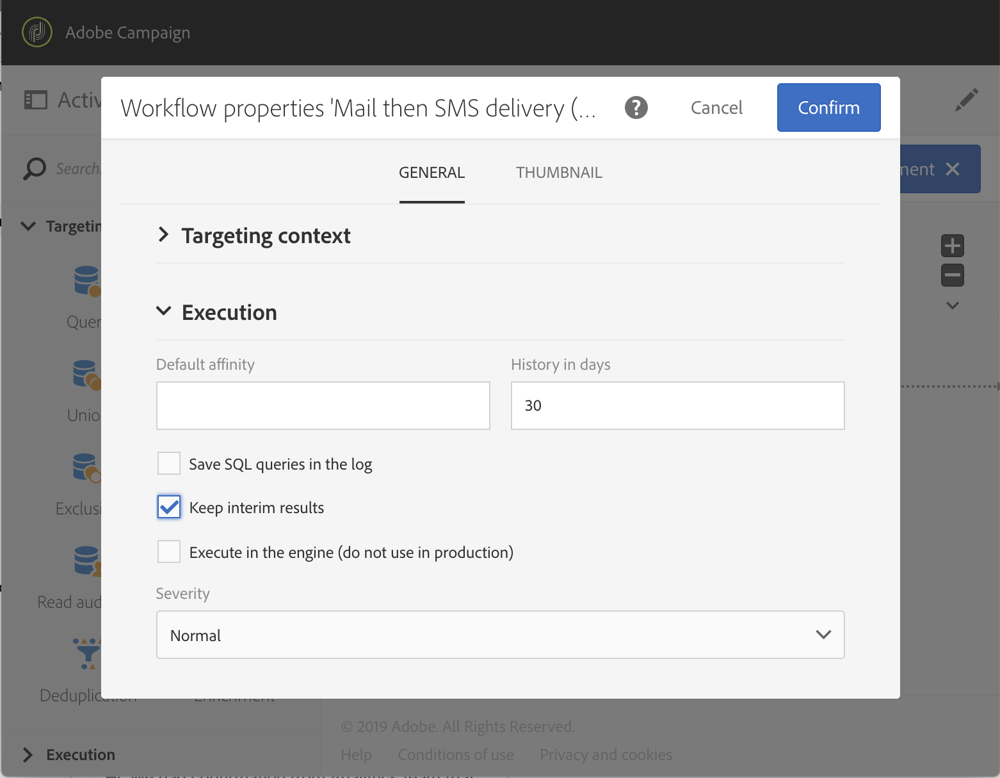

# Best practices voor workflows{#workflow-best-practices}

Met Adobe Campaign kunt u allerlei workflows instellen om een groot taakbereik uit te voeren. Bij het ontwerpen en uitvoeren van uw workflows moet u echter zeer voorzichtig zijn, aangezien een slechte implementatie kan leiden tot slechte prestaties, fouten en platformproblemen. Hieronder vindt u een lijst met aanbevolen procedures en tips voor het oplossen van problemen.

>[!NOTE]
>
>Workflowontwerp en -uitvoering moeten worden uitgevoerd door een geavanceerde gebruiker van Adobe Campaign.

## Naamgeving{#naming}

Adobe raadt u aan uw workflows expliciet een naam te geven en een label te geven om het oplossen van problemen met de workflow te vereenvoudigen. Vul het beschrijvingsveld van de werkstroom in om een overzicht te geven van het proces dat moet worden uitgevoerd zodat de exploitant het gemakkelijk kan begrijpen.
Als de workflow deel uitmaakt van een proces waarbij meerdere workflows zijn betrokken, kunt u nummers gebruiken wanneer u een label invoert om deze duidelijk te ordenen.

Bijvoorbeeld:

* 001 - Invoer - Ontvangers van de invoer
* 002 - Invoer - Uitvoer
* 003 - Invoer - Gegevens over de verkoop bij invoer
* 010 - Exporteren - Leveringslogboeken exporteren
* 011 - Logbestanden voor bijhouden van export

## Workflows dupliceren{#duplicating-workflows}

U kunt workflows dupliceren. Houd de muisaanwijzer boven de workflow **[!UICONTROL Marketing Activities]** en klik op **[!UICONTROL Duplicate element]**. Als de workflow eenmaal is gedupliceerd, worden wijzigingen van de workflow niet doorgevoerd in de kopie van de workflow. De kopie van de workflow kan worden bewerkt.

## Uitvoering{#execution}

### Aantal werkstromen

Standaard raden we u aan niet meer dan 20 actieve workflows tegelijk uit te voeren. Nadat deze limiet is bereikt, worden workflows in de wachtrij geplaatst om de prestaties niet te beïnvloeden. Op dezelfde manier raadt Adobe u aan uw workflowdetectie over een bepaalde periode uit te spreiden.
In specifieke contexten, kunt u meer dan 20 werkschema&#39;s moeten in werking stellen. Dit is niet van toepassing op workflows die wachten op een geplande uitvoering.  Als dat het geval is, moet u de gebruiksgevallen controleren met een campagneexpert en contact opnemen met de klantenservice van Adobe om de limiet te verhogen.

### Frequentie

Een werkstroom kan niet automatisch vaker dan om de tien minuten worden uitgevoerd.
De herhalingsfrequentie van de activiteit mag niet minder dan 10 minuten bedragen. Als de herhalingsfrequentie is ingesteld op 0 (ook de standaardwaarde), wordt met deze optie geen rekening gehouden en wordt de workflow uitgevoerd volgens de uitvoeringsfrequentie.

### Gepauzeerde workflows

Workflows die langer dan 7 dagen zijn gepauzeerd of gezakt, worden gestopt om minder schijfruimte te verbruiken. De reinigingstaak wordt weergegeven in de werkstroomlogboeken.

### Overgangen

Een workflow met niet-afgesloten overgangen kan nog steeds worden uitgevoerd: er wordt een waarschuwingsbericht gegenereerd en de workflow wordt gepauzeerd zodra de overgang is bereikt, maar er wordt geen fout gegenereerd. U kunt ook een workflow starten zonder een voltooid ontwerp en deze voltooien.

Raadpleeg Workflows uitvoeren voor meer informatie.

### Tijdzone

Met de workfloweigenschappen kunt u een specifieke tijdzone definiëren die standaard wordt gebruikt voor alle activiteiten. Standaard is de tijdzone van de workflow de tijdzone die is gedefinieerd voor de huidige Campagneoperator.

## Activiteit{#activity}

### Workflowontwerp

Om ervoor te zorgen dat de werkstroom behoorlijk beëindigt, gebruik een **[!UICONTROL End activity]**. Laat de laatste overgang van een workflow niet op zichzelf staan.

Als u toegang wilt tot de gedetailleerde weergave van de overgangen, controleert u de **[!UICONTROL Keep interim results]** optie in het gedeelte Uitvoering van de workfloweigenschappen.

>[!CAUTION]
>
>Deze optie verbruikt veel schijfruimte en is ontworpen om u te helpen een workflow te maken en een correcte configuratie en functionaliteit te garanderen. Laat deze optie uitgeschakeld op productieexemplaren.

### Etiketteringsactiviteiten{#activity-labeling}

Tijdens het ontwikkelen van uw workflow wordt een naam gegenereerd voor elke activiteit, zoals voor alle Adobe Campagneobjecten. Terwijl de naam van een activiteit door het hulpmiddel wordt geproduceerd en niet kan worden uitgegeven, adviseren wij om het met een expliciete naam te etiketteren wanneer het vormen van het.

### Dupliceren van activiteiten{#activity-duplicating}

U kunt kopiëren en plakken gebruiken om bestaande activiteiten te dupliceren. Op deze manier behoudt u de instellingen die oorspronkelijk zijn gedefinieerd. Raadpleeg [Duplicerende workflowactiviteiten](../../automating/using/workflow-interface.md)voor meer informatie.

### Planningsactiviteit{#acheduler-activity}

Bij het samenstellen van uw workflow gebruikt u slechts één **[!UICONTROL Scheduler activity]** vertakking. Als de zelfde tak van een werkschema verscheidene planners (verbonden aan elkaar) heeft, zal het aantal uit te voeren taken exponentieel worden vermenigvuldigd, die het gegevensbestand aanzienlijk zou overbelasten.

U kunt de volgende tien uitvoeringen van uw werkschema&#39;s voorvertonen door te klikken **[!UICONTROL Preview next executions]**.

Voor meer informatie, verwijs naar de activiteit [van de](../../automating/using/scheduler.md)Planner.

## Werkstroom aanroepen met parameters{#workflow-with-parameters}

Zorg ervoor dat de naam en het aantal parameters identiek zijn aan wat wordt bepaald wanneer het roepen van het werkschema (zie het [Definiëren van de parameters wanneer het roepen van het werkschema](../../automating/using/calling-a-workflow-with-external-parameters.md#defining-the-parameters-when-calling-the-workflow)). De parametertypen moeten ook consistent zijn met de waarden die worden verwacht.

Zorg ervoor dat alle parameters in de **[!UICONTROL External signal activity]** code zijn gedeclareerd. Anders treedt er een fout op wanneer de activiteit wordt uitgevoerd.

Zie [Een workflow met externe parameters](../../automating/using/calling-a-workflow-with-external-parameters.md)aanroepen voor meer informatie.

## Pakketten exporteren{#exporting-packages}

De geëxporteerde bronnen mogen geen standaard-id&#39;s bevatten om pakketten te exporteren. De id&#39;s van bronnen die kunnen worden geëxporteerd, moeten daarom worden gewijzigd door een andere naam te gebruiken dan de sjablonen die standaard worden geleverd door Adobe Campagne Standard.
Zie [Pakketten](../../automating/using/managing-packages.md)beheren voor meer informatie.

## Lijsten exporteren{#exporting-lists}

Met de optie voor de exportlijst kunt u standaard maximaal 100.000 regels exporteren, gedefinieerd door de optie **Nms_ExportListLimit**. Deze optie kan door de functionele beheerder, onder **[!UICONTROL Administration]** > **[!UICONTROL Application settings]** > worden beheerd **[!UICONTROL Options]**.
Zie Lijsten exporteren voor meer informatie.

## Problemen oplossen{#workflow-troubleshooting}

Adobe Campaign biedt verschillende logbestanden om meer inzicht te krijgen in workflowproblemen.

### Workflowlogs gebruiken{#using-workflow-logs}

U kunt werkstroomlogboeken openen om de uitvoering van uw activiteiten te controleren. De uitgevoerde bewerkingen en uitvoeringsfouten worden in chronologische volgorde geïndexeerd. Het tabblad Logs bestaat uit de geschiedenis van de uitvoering van alle of bepaalde geselecteerde activiteiten.
Op het tabblad Taken wordt de volgorde van uitvoering van de activiteiten weergegeven. Klik op een taak voor meer informatie over een activiteit.
Raadpleeg de uitvoering van de [controleworkflow](../../automating/using/executing-a-workflow.md#monitoring)voor meer informatie.

#### Problemen met gegevensbeheer oplossen{#troubleshooting-data-management-activities}

U kunt SQL-query&#39;s analyseren op het tabblad Logboek.

1. Klik in de werkstroomwerkruimte op **[!UICONTROL Edit properties]**.
1. Controleer in **[!UICONTROL General]** > **[!UICONTROL Execution]** de opties **[!UICONTROL Save SQL queries in the log]** en **[!UICONTROL Execute in the engine]** opties en klik op **[!UICONTROL Confirm]**.

**SQL-query&#39;s weergeven in logbestand:**
1. Klik op **[!UICONTROL Log and Tasks]**.
1. Open het **[!UICONTROL Logs]** **[!UICONTROL Search]** deelvenster op het tabblad.
1. Controleer **[!UICONTROL Display SQL logs only]**.

De vraag wordt getoond in de **[!UICONTROL Message]** kolom van het logboeken.

### Leveringslogboeken gebruiken{#using-delivery-logs}

Met leveringslogboeken kunt u het succes van uw leveringen controleren. Uitsluitingslogboeken retourneren uitgesloten berichten tijdens de voorbereiding van de verzending. Het verzenden van logboeken geeft de status van de levering voor elk profiel.
Voor meer informatie, verwijs naar het [Begrip van leveringsmislukkingen](../../sending/using/understanding-delivery-failures.md).

### Waarschuwing bij levering gebruiken{#delivery-alerting}

De voorziening voor leveringswaarschuwingen is een systeem voor waarschuwingsbeheer dat een groep gebruikers in staat stelt automatisch meldingen te ontvangen die informatie bevatten over de uitvoering van hun leveringen.
Raadpleeg [Leveringswaarschuwingen](../../sending/using/receiving-alerts-when-failures-happen.md)voor meer informatie.

**Verwante onderwerpen:**

* [Foutbeheer](../../automating/using/executing-a-workflow.md#error-management)
