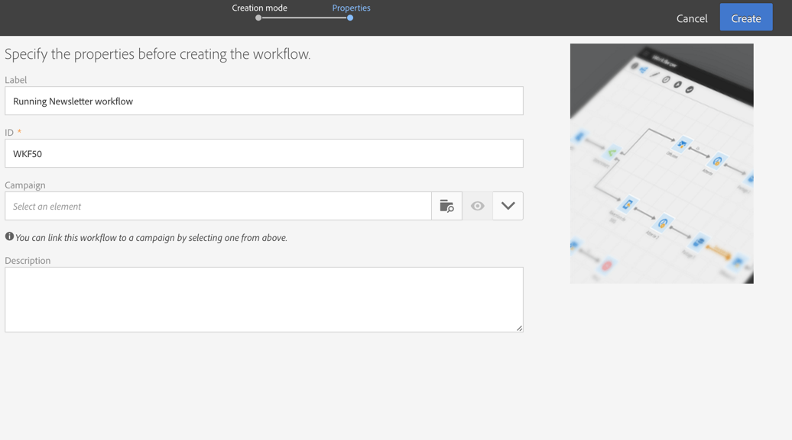

# Een workflow maken{#building-a-workflow}

In deze sectie worden de belangrijkste beginselen en aanbevolen procedures voor het maken van een nieuwe workflow beschreven.

## Operationele workflowbeginselen{#workflow-operating-principles}

Een workflow is een **reeks configureerbare activiteiten**. Elke activiteit heeft een specifieke rol in het proces. Het resultaat van elke activiteit wordt doorgestuurd naar de volgende activiteit door een **overgang**, die door een pijl wordt vertegenwoordigd.

Het type gegevens dat tussen de ene activiteit en de andere wordt uitgewisseld, kan van invloed zijn op de manier waarop de volgende activiteiten worden geconfigureerd. Als bijvoorbeeld een populatie is ingesteld vóór verzending via e-mail, kan deze als doel dienen voor de betreffende e-mail.

U kunt activiteiten openen om parameters te controleren of te bewerken voordat of nadat u de workflow hebt uitgevoerd.

U kunt overgangen openen om te controleren of de verzonden gegevens tijdens of na het uitvoeren van de werkstroom correct zijn. Voor toegang tot de gedetailleerde weergave van de overgangen moet u de **[!UICONTROL Keep interim results]** optie in het **[!UICONTROL Execution]** gedeelte van de workfloweigenschappen controleren.

## Een workflow maken {#creating-a-workflow}

U kunt een workflow maken op basis van een programma, een campagne of de lijst met marketingactiviteiten.

Het maken van een marketingactiviteit wordt gedetailleerd beschreven in het gedeelte [marketingactiviteiten](../../start/using/marketing-activities.md#creating-a-marketing-activity) maken.

1. Nadat u een marketingactiviteit voor het workflowtype hebt gemaakt, selecteert u de sjabloon die u wilt gebruiken.

   

   >[!NOTE]
   >
   >Elke marketingactiviteit biedt standaard diverse typen aan. Hiermee kunt u bepaalde parameters vooraf configureren op basis van uw behoeften. Raadpleeg de sectie [Sjablonen](../../start/using/marketing-activity-templates.md) beheren voor meer informatie.

1. Voer de algemene eigenschappen van de workflow in.

   

   U kunt een naam invoeren in het veld **Label** en de id wijzigen. De activiteitennaam en zijn identiteitskaart verschijnen in de interface, maar deze zijn niet zichtbaar door de berichtontvangers.

   >[!NOTE]
   >
   >U kunt uw workflow in een bovenliggende campagne maken vanuit de lijst met marketingactiviteiten. U kunt deze workflow koppelen aan een campagne door een campagne te selecteren die al is gemaakt.

   U kunt een beschrijving toevoegen die de gebruiker in de inhoud van de campagne kan zien.

   Omdat het hen gemakkelijker maakt om te vinden en problemen op te lossen als zij niet op de verwachte manieren presteren, adviseert Adobe om uw werkschema&#39;s eigennamen en etiketten te geven: Vul het beschrijvingsveld van de werkstroom in om een overzicht te geven van het proces dat moet worden uitgevoerd zodat de exploitant het gemakkelijk kan begrijpen.

1. Bevestig het creëren van de activiteit en het dashboard voor die activiteit zal dan worden getoond. Raadpleeg voor meer informatie de sectie [Werkstroominterface](../../automating/using/workflow-interface.md) .

1. Als de workflow gereed is om te worden geconfigureerd, hebt u toegang tot extra opties door op de **[!UICONTROL Edit properties]** knop te klikken. U kunt bijvoorbeeld een specifieke tijdzone definiëren die standaard in alle activiteiten van de workflow moet worden gebruikt. Standaard is de tijdzone van de workflow de tijdzone die is gedefinieerd voor de huidige Campagneoperator.

   

**Verwant onderwerp:**

* [Een werkstroomvideo](https://docs.adobe.com/content/help/en/campaign-standard/using/managing-processes-and-data/workflow-general-operation/building-a-workflow.html) maken
* [Workflow-eigenschappen](../../automating/using/managing-execution-options.md)

## Toevoegen en koppelen van activiteiten {#adding-and-linking-activities}

U moet nu de verschillende activiteiten definiëren en deze koppelen in het diagram.

>[!NOTE]
>
>Als het palet niet wordt weergegeven, klikt u op de eerste knop van de werkbalk om het weer te geven.

De activiteiten worden gegroepeerd op categorie in de verschillende secties van het palet.

* Het eerste deel bevat [gerichte activiteiten](../../automating/using/about-targeting-activities.md)
* Het tweede deel bevat de [uitvoeringsactiviteiten](../../automating/using/about-execution-activities.md), die hoofdzakelijk worden gebruikt voor de coördinatie van andere activiteiten.
* De derde sectie bevat activiteiten die kunnen worden gebruikt om berichten op verschillende [kanalen](../../automating/using/about-channel-activities.md)te verzenden. De activiteiten in deze sectie kunnen afhankelijk van de kanalen variëren die op uw instantie worden toegelaten.
* Het vierde gedeelte bevat [activiteiten](../../automating/using/about-data-management-activities.md)op het gebied van bestandmanipulatie en gegevensbeheer.

Het diagram maken:

1. Voeg een activiteit toe door het uit het palet te slepen en het in het diagram te laten vallen.

   Bijvoorbeeld, voeg een activiteit van het **[Begin](../../automating/using/start-and-end.md)**en dan een**[ E-mail leveringsactiviteit](../../automating/using/email-delivery.md)** op het diagram toe.

1. Koppel de activiteiten aan elkaar door de overgang naar activiteit **starten** te slepen en neer te zetten op de activiteit **E-maillevering** .

   >[!NOTE]
   >
   >U kunt een activiteit aan vorige automatisch verbinden door de nieuwe activiteit aan het eind van de overgang van vorige te plaatsen.

1. Voeg de activiteiten toe die u nodig hebt en koppel deze aan elkaar om uw workflow te voltooien.

   >[!NOTE]
   >
   >U kunt bestaande activiteiten ook dupliceren door deze te kopiëren en te plakken. Op deze manier behoudt u de instellingen die oorspronkelijk zijn gedefinieerd. Raadpleeg [Duplicerende workflowactiviteiten](../../automating/using/workflow-interface.md#duplicating-workflow-activities)voor meer informatie hierover.

Als uw workflowactiviteiten aan elkaar zijn gekoppeld, kunt u de overgangen tussen de activiteiten aanpassen met het **label** van uw keuze. Dubbelklik hiertoe op de overgang om de eigenschappen ervan te openen.

Bovendien staat **[!UICONTROL Targeting]** en de **[!UICONTROL Data management (ETL)]** activiteiten u toe om **segmentcodes** voor hun uitgaande overgangen te bepalen. Vervolgens kunt u rapporten maken op basis van deze segmentcodes om de efficiëntie van uw marketingcampagnes te meten. For more on this, refer to [this section](../../reporting/using/creating-a-report-workflow-segment.md).

**Gebruiksscenario&#39;s voor werkstroom:**

* [Hoofdlettergebruik: Eenmaal per week een e-maillevering maken](../../automating/using/workflow-weekly-offer.md)
* [Hoofdlettergebruik: Een levering maken die op een locatie is gesegmenteerd](../../automating/using/workflow-segmentation-location.md)
* [Hoofdlettergebruik: Leveringen maken met een aanvulling](../../automating/using/workflow-created-query-with-complement.md)
* [Hoofdlettergebruik: Werkstroom opnieuw toewijzen om een nieuwe levering naar niet-openers te verzenden](../../automating/using/workflow-cross-channel-retargeting.md)

## Activiteiten configureren {#configuring-activities}

Door gebrek, worden de activiteiten niet geplaatst en zullen niet de gegevens correct verwerken als zij niet worden gevormd. Elke activiteit bevat verscheidene lusjes om specifieke configuraties en activiteit generische opties zoals uitgaande overgangen, etiketten, enz. te beheren.

1. Controleer of alle activiteiten correct zijn verbonden. Sommige activiteiten vereisen om de structuur of aard van de inkomende gegevens te ontdekken om de correcte configuratieopties aan te bieden.
1. Dubbelklik op een activiteit of selecteer deze en klik op de **[!UICONTROL Edit]** contextafhankelijke actie om het configuratievenster te openen.
1. Bewerk het label van de activiteit.
1. Definieer alle verschillende opties die u nodig hebt om de gegevens te verwerken. Raadpleeg de specifieke sectie van de activiteit in deze documentatie voor meer informatie over de mogelijke opties voor elke activiteit.
1. Sla de activiteit op en herhaal deze bewerkingen voor elke activiteit van de workflow.
1. Sla de workflow op.
