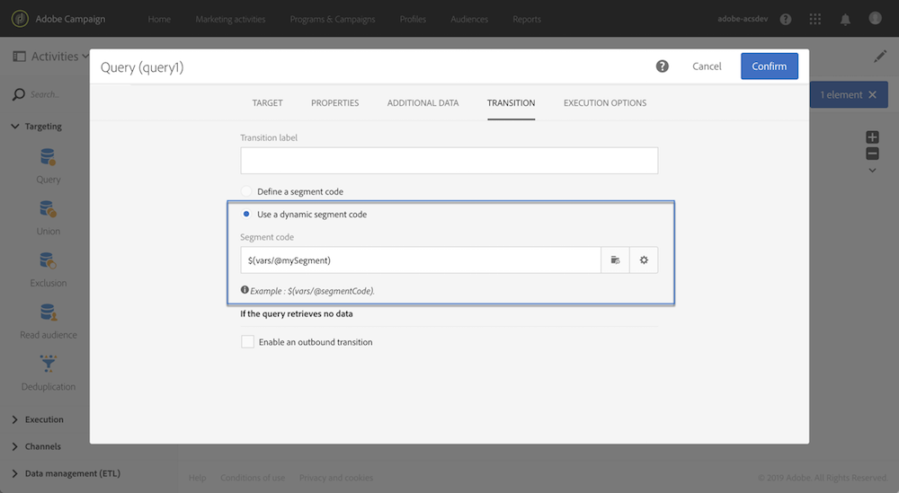
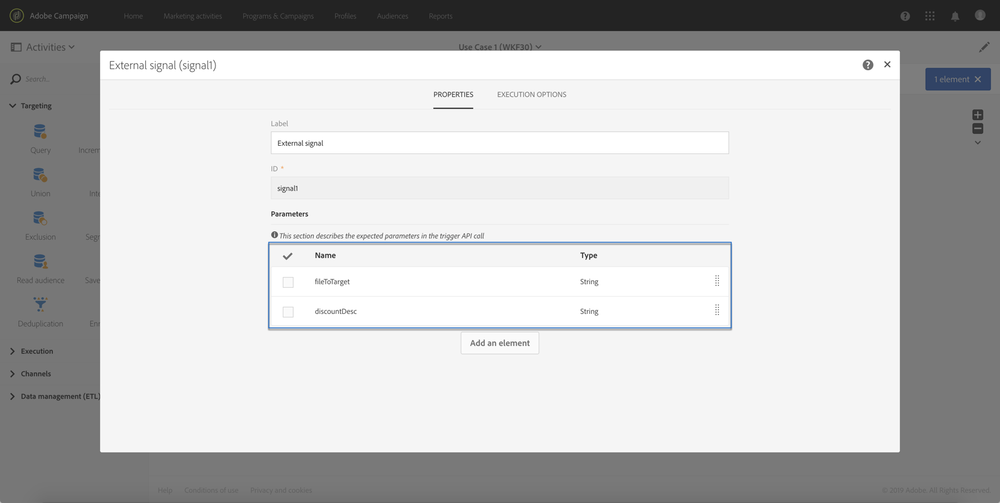

# Een workflow aanroepen met externe parameters{#calling-a-workflow-with-external-parameters}

Met Campagnestandaard kunt u een workflow aanroepen met parameters (een doelnaam, een bestandsnaam die u wilt importeren, een deel van de berichtinhoud, enz.). Op deze manier kunt u uw campagneautomatisering eenvoudig integreren met uw externe systeem.

Neem het volgende voorbeeld, waar wij e-mails rechtstreeks van CMS willen verzenden. In dat geval kunt u uw systeem zo configureren dat het publiek en de e-mailinhoud in het CMS worden geselecteerd. Als u op Verzenden klikt, wordt een Campagneworkflow met deze parameters aangeroepen, zodat u deze in de workflow kunt gebruiken om het publiek en de URL-inhoud voor de levering te definiëren.

Het proces om een werkschema met parameters te roepen is het volgende:

1. Declareer de parameters in de **[!UICONTROL External signal]** activiteit. Zie de parameters [declareren in de externe signaalactiviteit](../../automating/using/calling-a-workflow-with-external-parameters.md#declaring-the-parameters-in-the-external-signal-activity).
1. Configureer de **[!UICONTROL End]** activiteit of de API-aanroep om de parameters te definiëren en de **[!UICONTROL External signal]** workflowactiviteit te activeren.

Nadat de workflow is geactiveerd, worden de parameters opgenomen in de gebeurtenisvariabelen van de workflow en kunnen deze binnen de workflow worden gebruikt. Zie Een workflow [aanpassen met externe parameters](../../automating/using/calling-a-workflow-with-external-parameters.md#customizing-a-workflow-with-external-parameters).


## De parameters in de externe signaalactiviteit declareren {#declaring-the-parameters-in-the-external-signal-activity}

De eerste stap om een werkschema met parameters te roepen is hen in een **[!UICONTROL External signal]** activiteit te verklaren.

1. Open the **[!UICONTROL External signal]** activity, then select the **[!UICONTROL Parameters]** tab.
1. Klik op de **[!UICONTROL Create element]** knop en geef vervolgens de naam en het type van elke parameter op.

   >[!CAUTION]
   >
   >Zorg ervoor dat de naam en het aantal parameters identiek zijn aan wat wordt bepaald wanneer het roepen van het werkschema (zie het [Definiëren van de parameters wanneer het roepen van het werkschema](../../automating/using/calling-a-workflow-with-external-parameters.md#defining-the-parameters-when-calling-the-workflow)). Bovendien moeten de parametertypen consistent zijn met de waarden die worden verwacht.

   

1. Zodra de gedeclareerde parameters zijn voltooid, voltooit u de workflowconfiguratie en voert u deze uit.

## Parameters definiëren wanneer de workflow wordt aangeroepen {#defining-the-parameters-when-calling-the-workflow}

In deze sectie wordt beschreven hoe u parameters definieert wanneer u een workflow oproept. Raadpleeg de documentatie [van de](../../api/using/triggering-a-signal-activity.md)REST API&#39;s voor meer informatie over het uitvoeren van deze bewerking vanuit een API-aanroep.

Voordat u de parameters definieert, moet u ervoor zorgen dat:

* De parameters zijn gedeclareerd in de **[!UICONTROL External Signal]** activiteit. Zie de parameters [declareren in de externe signaalactiviteit](../../automating/using/calling-a-workflow-with-external-parameters.md#declaring-the-parameters-in-the-external-signal-activity).
* De workflow met de signaalactiviteit wordt uitgevoerd.

Volg onderstaande stappen om de **[!UICONTROL End]** activiteit te configureren:

1. Open the **[!UICONTROL End]** activity, then select the **[!UICONTROL External signal]** tab.
1. Selecteer het werkschema en de externe signaalactiviteit die u wilt roepen.
1. Klik op de **[!UICONTROL Create element]** knop om een parameter toe te voegen en vul vervolgens de naam en waarde van de parameter in.

   * **[!UICONTROL Name]**: de naam die in de **[!UICONTROL External signal]** activiteit (zie het [Verklaren van de parameters in de Externe signaalactiviteit](../../automating/using/calling-a-workflow-with-external-parameters.md#declaring-the-parameters-in-the-external-signal-activity)) is verklaard.
   * **[!UICONTROL Value]**: de waarde die u aan de parameter wilt toewijzen. De waarde moet de **standaardsyntaxis** volgen, die in [deze sectie](../../automating/using/advanced-expression-editing.md#standard-syntax)wordt beschreven.
   

   >[!CAUTION]
   >
   >Controleer of alle parameters zijn gedeclareerd in de **[!UICONTROL External signal]** activiteit. Anders treedt er een fout op wanneer de activiteit wordt uitgevoerd.

1. Nadat de parameters zijn gedefinieerd, bevestigt u de activiteit en slaat u vervolgens uw workflow op.

## Gebeurtenisvariabelen controleren {#monitoring-the-events-variables}

Het is mogelijk om de gebeurtenisvariabelen te controleren die in het werkschema, met inbegrip van de gedeclareerde externe parameters beschikbaar zijn. Hiervoor voert u de volgende stappen uit:

1. Selecteer de activiteit die de **[!UICONTROL External signal]** activiteit volgt, dan klik de **[!UICONTROL Log and tasks]** knoop.
1. Klik op de **[!UICONTROL Tasks]** tab op de  knop.

   

1. De uitvoeringscontext van de taak wordt weergegeven (id, status, duur, enz.), inclusief alle gebeurtenisvariabelen die nu beschikbaar zijn voor gebruik in de workflow.

   

## Een workflow aanpassen met externe parameters {#customizing-a-workflow-with-external-parameters}

Nadat de workflow is geactiveerd, worden de parameters opgenomen in de gebeurtenisvariabelen en kunnen deze worden gebruikt om de activiteiten van de workflow aan te passen.

Ze kunnen bijvoorbeeld worden gebruikt om te definiëren welk publiek in de **[!UICONTROL Read audience]** activiteit moet worden gelezen, welke naam van het bestand in de **[!UICONTROL Transfer file]** activiteit moet worden overgebracht, enzovoort.

Activiteiten die kunnen worden aangepast met gebeurtenisvariabelen worden in [deze sectie](../../automating/using/calling-a-workflow-with-external-parameters.md#customizing-activities-with-events-variables)beschreven.

### Gebeurtenisvariabelen gebruiken {#using-events-variables}

Gebeurtenisvariabelen worden gebruikt binnen een expressie die de **[standaardsyntaxis](../../automating/using/advanced-expression-editing.md#standard-syntax)**moet gebruiken.

De syntaxis voor het gebruik van gebeurtenisvariabelen moet de onderstaande indeling volgen en de naam van de parameter gebruiken die in de **[!UICONTROL External signal]** activiteit is gedefinieerd (zie [Parameters declareren in de externe signaalactiviteit](../../automating/using/calling-a-workflow-with-external-parameters.md#declaring-the-parameters-in-the-external-signal-activity)):

```
$(vars/@parameterName)
```

In deze syntaxis retourneert de functie **$** het gegevenstype van de **tekenreeks** . Als u een ander type gegevens wilt opgeven, gebruikt u de volgende functies:

* **$long**: geheel getal.
* **$float**: decimaal getal.
* **$boolean**: true/false.
* **$datetime**: tijdstempel.

Wanneer het gebruiken van een variabele in een activiteit, verstrekt de interface hulp om het te roepen.


* : Selecteer de gebeurtenisvariabele onder alle variabelen die beschikbaar zijn in de workflow.

   

* : bewerkingsexpressies waarin variabelen en functies worden gecombineerd. Voor meer op de redacteur van de Uitdrukking, verwijs naar [deze sectie](../../automating/using/advanced-expression-editing.md).

   

**Verwante onderwerpen:**

* [Een expressie bewerken](../../automating/using/advanced-expression-editing.md#edit-an-expression)
* [Standaardsyntaxis](../../automating/using/advanced-expression-editing.md#standard-syntax)
* [Lijst met functies](../../automating/using/list-of-functions.md)

### Activiteiten aanpassen met gebeurtenisvariabelen {#customizing-activities-with-events-variables}

Gebeurtenisvariabelen kunnen worden gebruikt om verschillende activiteiten aan te passen die in de onderstaande sectie worden vermeld. Voor meer op hoe te om een variabele van een activiteit te roepen, verwijs naar [deze sectie](../../automating/using/calling-a-workflow-with-external-parameters.md#using-events-variables).

**[!UICONTROL Read audience]** activiteit: het publiek bepalen om te richten op basis van gebeurtenisvariabelen.

Raadpleeg de [desbetreffende sectie](../../automating/using/read-audience.md)voor meer informatie over het gebruik van de activiteit.


**[!UICONTROL Test]** activiteit: voorwaarden bouwen die op gebeurtenisvariabelen worden gebaseerd.

Raadpleeg de [desbetreffende sectie](../../automating/using/test.md)voor meer informatie over het gebruik van de activiteit.


**[!UICONTROL Transfer file]** activiteit: Pas het bestand aan dat u wilt overbrengen op basis van gebeurtenisvariabelen.

Raadpleeg de [desbetreffende sectie](../../automating/using/transfer-file.md)voor meer informatie over het gebruik van de activiteit.


**[!UICONTROL Query]** activiteit: In een query kan naar parameters worden verwezen door expressies te gebruiken die gebeurtenisvariabelen en -functies combineren. Hiervoor voegt u een regel toe en klikt u op de **[!UICONTROL Advanced mode]** koppeling om het venster voor het bewerken van expressies te openen (zie [Geavanceerde bewerking](../../automating/using/advanced-expression-editing.md)van expressies).

Raadpleeg de [desbetreffende sectie](../../automating/using/query.md)voor meer informatie over het gebruik van de activiteit.


**[!UICONTROL Channels]** activiteiten: leveringen personaliseren op basis van gebeurtenisvariabelen.

>[!NOTE]
>
>De waarden van de leveringsparameters worden teruggewonnen telkens als de levering wordt voorbereid.
>
>De voorbereiding van de terugkerende leveringen is gebaseerd op de **aggregatieperiode** van de levering. Als de samenvoegingsperiode bijvoorbeeld &quot;op dag&quot; is, wordt de levering slechts eenmaal per dag opnieuw voorbereid. Als de waarde van een leveringsparameter tijdens de dag wordt gewijzigd, zal het niet in de levering worden bijgewerkt, aangezien het reeds eens is voorbereid.
>
>Als u de workflow meerdere keren per dag wilt aanroepen, gebruikt u de [!UICONTROL No aggregation] optie, zodat de leveringsparameters elke keer worden bijgewerkt. Voor meer bij terugkomende leveringsconfiguratie, verwijs naar [deze sectie](/help/automating/using/email-delivery.md#configuration).

Om een levering te personaliseren die op gebeurtenisvariabelen wordt gebaseerd, moet u eerst in de leveringsactiviteit de variabelen verklaren die u wilt gebruiken:

1. Selecteer de activiteit, dan klik de  knoop om tot de montages toegang te hebben.
1. Selecteer het **[!UICONTROL General]** tabblad en voeg vervolgens de gebeurtenisvariabelen toe die beschikbaar zijn als aanpassingsvelden in de levering.

   

1. Klik op de **[!UICONTROL Confirm]** knop.

De gedeclareerde gebeurtenisvariabelen zijn nu beschikbaar in de lijst met verpersoonlijkingsvelden. U kunt ze in de levering gebruiken om de onderstaande handelingen uit te voeren:

* Definieer de naam van de sjabloon die voor de levering moet worden gebruikt.

   >[!NOTE]
   >
   >Deze actie is alleen beschikbaar voor **terugkerende** leveringen.

   

* De levering personaliseren: wanneer het selecteren van een verpersoonlijkingsgebied om een levering te vormen, zijn de gebeurtenisvariabelen beschikbaar in het **[!UICONTROL Workflow parameters]** element. U kunt ze als een willekeurig verpersoonlijkingsveld gebruiken, bijvoorbeeld om het leveringsonderwerp, de afzender enzovoort te definiëren.

   De personalisatie van de levering wordt gedetailleerd in [deze sectie](../../designing/using/personalization.md).

   

**Segmentcodes**: definieert de segmentcode op basis van gebeurtenisvariabelen.

>[!NOTE]
>
>Deze actie kan van om het even welke activiteit worden uitgevoerd die u een segmentcode zoals, bijvoorbeeld, **[!UICONTROL Query]** of **[!UICONTROL Segmentation]** activiteiten laat bepalen.



**Leveringslabel**: het leveringslabel definiëren op basis van gebeurtenisvariabelen.


## Hoofdletters gebruiken {#use-case}

Het onderstaande gebruiksgeval laat zien hoe u een workflow met parameters in uw workflows kunt aanroepen.

Het doel is een workflow te activeren vanaf een API-aanroep met externe parameters. Deze workflow laadt gegevens uit een bestand in uw database en maakt een gekoppeld publiek. Zodra het publiek creeerde, zal een tweede werkschema worden teweeggebracht om een bericht te verzenden dat met de externe parameters wordt gepersonaliseerd die in de API vraag worden bepaald.

Voor dit gebruik moet u de volgende handelingen uitvoeren:

1. **Maak een API vraag** om Werkschema 1 met externe parameters teweeg te brengen. Zie [stap 1: De API-aanroep](../../automating/using/calling-a-workflow-with-external-parameters.md#step-1--configuring-the-api-call)configureren.
1. **Workflow 1** samenstellen: de workflow zal een bestand overbrengen en in de database laden . Vervolgens wordt getest of de gegevens leeg zijn of niet en worden de profielen uiteindelijk in een publiek opgeslagen. Tot slot zal het Werkschema 2 teweegbrengen. Zie [stap 2: Workflow 1](../../automating/using/calling-a-workflow-with-external-parameters.md#step-2--configuring-workflow-1)configureren.
1. **Workflow 2** samenstellen: De workflow leest het publiek dat in Workflow 1 is gemaakt en stuurt vervolgens een gepersonaliseerd bericht naar de profielen, met een segmentcode die met de parameters is aangepast. Zie [stap 3: Workflow 2](../../automating/using/calling-a-workflow-with-external-parameters.md#step-3--configuring-workflow-2)configureren.


### Vereisten {#prerequisites}

Alvorens de werkschema&#39;s te vormen, moet u Werkschema 1 en 2 met een **[!UICONTROL External signal]** activiteit in elk van hen tot stand brengen. Deze manier, zult u deze signaalactiviteiten kunnen richten wanneer het roepen van de werkschema&#39;s.

### Stap 1: De API-aanroep configureren {#step-1--configuring-the-api-call}

Maak een API vraag om Werkstroom 1 met parameters teweeg te brengen. Raadpleeg voor meer informatie over de syntaxis van de API-aanroep de documentatie [van de standaard REST API&#39;s voor](../../api/using/triggering-a-signal-activity.md)campagne.

In ons geval willen we de workflow met de volgende parameters oproepen:

* **fileToTarget**: de naam van het bestand dat we in de database willen importeren.
* **kortingDesc**: de beschrijving die wij in de levering voor de korting willen tonen.

```
-X POST https://mc.adobe.io/<ORGANIZATION>/campaign/<TRIGGER_URL>
-H 'Authorization: Bearer <ACCESS_TOKEN>' 
-H 'Cache-Control: no-cache' 
-H 'X-Api-Key: <API_KEY>' 
-H 'Content-Type: application/json;charset=utf-8' 
-H 'Content-Length:79' 
-i
-d {
-d "source:":"API",
-d "parameters":{
-d "fileToTarget":"profile.txt",
-d "discountDesc":"Running shoes"
-d } 
```

### Stap 2: Workflow 1 configureren {#step-2--configuring-workflow-1}

Workflow 1 wordt als volgt samengesteld:

* **[!UICONTROL External signal]** activiteit: waar de externe parameters moeten worden gedeclareerd om binnen de werkstroom te worden gebruikt.
* **[!UICONTROL Transfer file]** activiteit: Hiermee importeert u het bestand met de naam die in de parameters is gedefinieerd.
* **[!UICONTROL Load file]** activiteit: laadt gegevens uit het geïmporteerde bestand in de database.
* **[!UICONTROL Update data]** activiteit: de database invoegen of bijwerken met gegevens uit het geïmporteerde bestand.
* **[!UICONTROL Test]** activiteit: controleert of er gegevens zijn geïmporteerd.
* **[!UICONTROL Save audience]** activiteit: als het bestand gegevens bevat, worden de profielen in een publiek opgeslagen.
* **[!UICONTROL End activity]** activiteit: roept Werkschema 2 met de parameters die u binnen het wilt gebruiken.


Voer de onderstaande stappen uit om de workflow te configureren:

1. Declareer de parameters die in de API vraag zijn bepaald. Hiervoor opent u de **[!UICONTROL External signal]** activiteit en voegt u de namen en typen van de parameters toe.

   

1. Voeg een **[!UICONTROL Transfer file]** activiteit toe om gegevens in het gegevensbestand in te voeren. Om dit te doen, sleep en laat vallen de activiteit, open het, dan selecteer het **[!UICONTROL Protocol]** lusje.
1. Selecteer de **[!UICONTROL Use a dynamic file path]** optie en gebruik vervolgens de parameter **fileToTarget** als het over te dragen bestand:

   ```
   $(vars/@fileToTarget)
   ```

   

1. Laad de gegevens uit het bestand in de database.

   Om dit te doen, sleep en laat vallen een **[!UICONTROL Load file]** activiteit in het werkschema, dan vorm het op uw behoeften.

1. De database invoegen en bijwerken met gegevens uit het geïmporteerde bestand.

   U doet dit door een **[!UICONTROL Update data]** activiteit te slepen en neer te zetten en vervolgens het **[!UICONTROL Identification]** tabblad te selecteren om verzoeningscriteria toe te voegen (in ons geval het veld **E-mail** ).

   

1. Selecteer het **[!UICONTROL Fields to update]** tabblad en geef vervolgens de velden op die u wilt bijwerken in de database (in ons geval de velden **firstname** en **email** ).

   

1. Controleer of gegevens uit het bestand zijn opgehaald. U doet dit door een **[!UICONTROL Test]** activiteit naar de werkstroom te slepen en vervolgens op de **[!UICONTROL Add an element]** knop te klikken om een voorwaarde toe te voegen.
1. Geef de voorwaarde een naam en definieer deze. In ons geval, willen wij testen of bevat de uitgaande overgang gegevens met de syntaxis hieronder:

   ```
   $long(vars/@recCount)>0
   ```

   

1. Als gegevens worden opgehaald, slaat u deze op in een publiek. Hiervoor voegt u een **[!UICONTROL Save audience]** activiteit toe aan het **doel en maakt u de overgang niet leeg** . Open vervolgens de bewerking.
1. Selecteer de **[!UICONTROL Use a dynamic label]** optie en gebruik vervolgens de parameter **fileToTarget** als label van het publiek:

   ```
   $(vars/@fileToTarget)
   ```

   

1. Sleep en zet een **[!UICONTROL End]** activiteit neer die Werkschema 2 met parameters zal roepen, dan het openen.
1. Selecteer het **[!UICONTROL External signal]** tabblad en geef vervolgens de workflow op die u wilt activeren en de bijbehorende signaalactiviteit.
1. Bepaal de parameters die u binnen Werkschema 2 en hun bijbehorende waarden wilt gebruiken.

   In ons geval, willen wij de parameters die oorspronkelijk in de API vraag (**fileToTarget** en **discontoDesc**) werden bepaald, en een extra **segmentCode** parameter met een constante waarde (&quot;20% korting&quot;) overgaan.

   

Werkschema 1 wordt gevormd, kunt u Werkschema 2 nu bouwen. For more on this, refer to [this section](../../automating/using/calling-a-workflow-with-external-parameters.md#step-3--configuring-workflow-2).

### Stap 3: Workflow 2 configureren {#step-3--configuring-workflow-2}

Workflow 2 wordt als volgt samengesteld:

* **[!UICONTROL External signal]** activiteit: waar de parameters moeten worden gedeclareerd om binnen de werkstroom te worden gebruikt.
* **[!UICONTROL Read audience]** activiteit: leest het publiek dat is opgeslagen in Workflow 1.
* **[!UICONTROL Email delivery]** activiteit: verzendt een terugkerend bericht naar het gerichte publiek, gepersonaliseerd met parameters.


Voer de onderstaande stappen uit om de workflow te configureren:

1. Declareer de parameters die in Werkschema 1 zijn bepaald.

   Om dit te doen, open de **[!UICONTROL External signal]** activiteit, dan voeg de naam en het type van elke parameter toe die in de **[!UICONTROL End]** activiteit van Werkschema 1 wordt bepaald.

   

1. Gebruik het publiek dat in Werkstroom 1 is opgeslagen. U doet dit door een **[!UICONTROL Read audience]** activiteit naar de werkstroom te slepen en vervolgens te openen.
1. Selecteer de **[!UICONTROL Use a dynamic audience]** optie en gebruik vervolgens de parameter **fileToTarget** als de naam van het publiek dat u wilt lezen:

   ```
   $(vars/@fileToTarget)
   ```

   

1. Noem de uitgaande overgang volgens de **segmentCode** parameter.

   U doet dit door het **[!UICONTROL Transition]** tabblad en vervolgens de **[!UICONTROL Use a dynamic segment code]** optie te selecteren.

1. Gebruik de **segmentCode** parameter als naam van de uitgaande overgang:

   ```
   $(vars/@segmentCode)
   ```

   

1. Sleep een **[!UICONTROL Email delivery]** activiteit om een bericht naar het publiek te verzenden.
1. Identificeer de parameters in het bericht te gebruiken om het met de parameter **discontoDesc** te personaliseren. Hiervoor opent u de geavanceerde opties van de activiteit en voegt u vervolgens de naam en de waarde van de parameter toe.

   

1. U kunt het bericht nu vormen. Open de activiteit en selecteer vervolgens **[!UICONTROL Recurring email]**.

   

1. Selecteer de sjabloon die u wilt gebruiken en definieer de e-maileigenschappen naar wens.
1. Gebruik de parameter **kortingDesc** als verpersoonlijkingsgebied. Selecteer dit in de lijst met personalisatievelden.

   

1. U kunt nu klaar zijn met het configureren van het bericht en het vervolgens op de gebruikelijke manier verzenden.

   

### Workflows uitvoeren {#executing-the-workflows}

Nadat de workflows zijn samengesteld, kunt u deze uitvoeren. Zorg ervoor dat de twee workflows zijn gestart voordat u de API-aanroep uitvoert.
