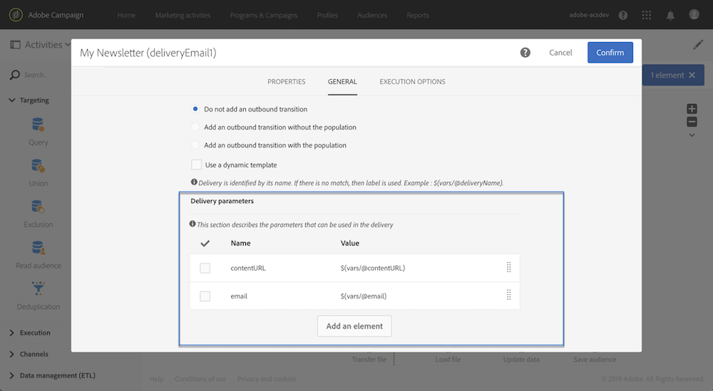

# Een workflow aanpassen met externe parameters {#customizing-a-workflow-with-external-parameters}

Nadat de workflow is geactiveerd, worden de parameters opgenomen in de gebeurtenisvariabelen en kunnen deze worden gebruikt om de activiteiten van de workflow aan te passen.

Ze kunnen bijvoorbeeld worden gebruikt om te definiëren welk publiek moet worden gelezen in het dialoogvenster **[!UICONTROL Read audience]** activiteit, de naam van het over te brengen dossier in **[!UICONTROL Transfer file]** activiteit, enz. (zie [deze pagina](../../automating/using/customizing-workflow-external-parameters.md)).

## Gebeurtenisvariabelen gebruiken {#using-events-variables}

Gebeurtenisvariabelen worden gebruikt binnen een expressie die de [Standaardsyntaxis](../../automating/using/advanced-expression-editing.md#standard-syntax).

De syntaxis voor het gebruik van gebeurtenisvariabelen moet de onderstaande indeling hebben en de naam van de parameter gebruiken die is gedefinieerd in het dialoogvenster **[!UICONTROL External signal]** activiteit (zie [De parameters in de externe signaalactiviteit declareren](../../automating/using/declaring-parameters-external-signal.md)):

```
$(vars/@parameterName)
```

In deze syntaxis worden de **$** functie retourneert **string** gegevenstype. Als u een ander type gegevens wilt opgeven, gebruikt u de volgende functies:

* **$long**: geheel getal.
* **$float**: decimaal getal.
* **$boolean**: true/false.
* **$datetime**: tijdstempel.

Wanneer het gebruiken van een variabele in een activiteit, verstrekt de interface hulp om het te roepen.


* : Selecteer de gebeurtenisvariabele onder alle variabelen die beschikbaar zijn in de workflow.

   

* : expressies bewerken waarin variabelen en functies worden gecombineerd (zie [deze pagina](../../automating/using/advanced-expression-editing.md)).

   

   Deze lijst verstrekt functies die u toestaan om het complexe filtreren uit te voeren. Deze functies worden nader beschreven in [deze sectie](../../automating/using/list-of-functions.md).

   Daarnaast kunt u de onderstaande functies gebruiken, die beschikbaar zijn in alle activiteiten waarmee u gebeurtenisvariabelen kunt gebruiken nadat u een workflow met externe parameters hebt aangeroepen (zie [deze sectie](../../automating/using/customizing-workflow-external-parameters.md#customizing-activities-with-events-variables)):

   | Naam | Beschrijving | Syntaxis |
   | ---------|----------|---------|
   | EndWith | Geeft aan of een tekenreeks (eerste parameter) eindigt met een specifieke tekenreeks (tweede parameter). | EndWith()&lt;string>,&lt;string>) |
   | startWith | Geeft aan of een tekenreeks (eerste parameter) begint met een specifieke tekenreeks (tweede parameter). | startWith()&lt;string>,&lt;string>) |
   | Extraheren | Retourneert de eerste tekens van een tekenreeks met een scheidingsteken. | Extract()&lt;string>,&lt;separator>) |
   | ExtractRight | Retourneert de laatste tekens van een tekenreeks met een scheidingsteken. | ExtractRight()&lt;string>,&lt;separator>) |
   | DateFormat | Maakt een datum op in de notatie die is opgegeven in de tweede parameter (voorbeeld: &#39;%4Y%2M%2D&#39;) | DateFormat(&lt;date>,&lt;format>) |
   | FileName | Retourneert de naam van een bestandspad. | FileName(&lt;string>) |
   | FileExt | Retourneert de extensie van een bestandspad. | FileExt()&lt;string>) |
   | GetOption | Retourneert de waarde van de opgegeven functie. | GetOption()&lt;optionname>) |
   | IsNull | Geeft aan of een tekenreeks of datum null is. | IsNull()&lt;string date=&quot;&quot;>) |
   | UrlUtf8Encode | Codeert een URL in UTF8. | UrlUtf8Encode()&lt;string>) |

## Activiteiten aanpassen met gebeurtenisvariabelen {#customizing-activities-with-events-variables}

Gebeurtenisvariabelen kunnen worden gebruikt om verschillende activiteiten aan te passen die in de onderstaande sectie worden vermeld. Voor meer op hoe te om een variabele van een activiteit te roepen, verwijs naar [deze sectie](../../automating/using/customizing-workflow-external-parameters.md#using-events-variables).

**[!UICONTROL Read audience]** activiteit: het publiek bepalen om te richten op basis van gebeurtenisvariabelen. Raadpleeg voor meer informatie over het gebruik van de activiteit [deze sectie](../../automating/using/read-audience.md).


**[!UICONTROL Test]** activiteit: voorwaarden bouwen die op gebeurtenisvariabelen worden gebaseerd. Raadpleeg voor meer informatie over het gebruik van de activiteit [deze sectie](../../automating/using/test.md).


**[!UICONTROL Transfer file]** activiteit: Pas het bestand aan dat u wilt overbrengen op basis van gebeurtenisvariabelen. Raadpleeg voor meer informatie over het gebruik van de activiteit [deze sectie](../../automating/using/transfer-file.md).


**[!UICONTROL Query]** activiteit: In een query kan naar parameters worden verwezen door expressies te gebruiken die gebeurtenisvariabelen en -functies combineren. Hiervoor voegt u een regel toe en klikt u op de knop **[!UICONTROL Advanced mode]** koppeling voor toegang tot het venster voor het bewerken van expressies (zie [Geavanceerde expressies bewerken](../../automating/using/advanced-expression-editing.md)).

Raadpleeg voor meer informatie over het gebruik van de activiteit [deze sectie](../../automating/using/query.md).


**[!UICONTROL Channels]** activiteiten: leveringen personaliseren op basis van gebeurtenisvariabelen.

>[!NOTE]
>
>De waarden van de leveringsparameters worden teruggewonnen telkens als de levering wordt voorbereid.
>
>De voorbereiding van de terugkerende leveringen is gebaseerd op de levering **samenvoegingsperiode**. Als de samenvoegingsperiode bijvoorbeeld &quot;op dag&quot; is, wordt de levering slechts eenmaal per dag opnieuw voorbereid. Als de waarde van een leveringsparameter tijdens de dag wordt gewijzigd, zal het niet in de levering worden bijgewerkt, aangezien het reeds eens is voorbereid.
>
>Als u de workflow meerdere keren per dag wilt aanroepen, gebruikt u de opdracht [!UICONTROL No aggregation] zodat de leveringsparameters telkens worden bijgewerkt. Voor meer bij terugkerende leveringsconfiguratie, verwijs naar [deze sectie](/help/automating/using/email-delivery.md#configuration).

Om een levering te personaliseren die op gebeurtenisvariabelen wordt gebaseerd, moet u eerst in de leveringsactiviteit de variabelen verklaren die u wilt gebruiken:

1. Selecteer de activiteit en klik op de knop  voor toegang tot de instellingen.
1. Selecteer **[!UICONTROL General]** voegt u vervolgens de gebeurtenisvariabelen toe die beschikbaar zijn als aanpassingsvelden in de levering.

   

1. Klik op de knop **[!UICONTROL Confirm]**.

De gedeclareerde gebeurtenisvariabelen zijn nu beschikbaar in de lijst met verpersoonlijkingsvelden. U kunt ze in de levering gebruiken om de onderstaande handelingen uit te voeren:

* Definieer de naam van de sjabloon die voor de levering moet worden gebruikt.

   >[!NOTE]
   >
   >Deze handeling is beschikbaar voor **terugkerend** alleen leveringen.

   

* De levering personaliseren: wanneer het selecteren van een verpersoonlijkingsgebied om een levering te vormen, zijn de gebeurtenisvariabelen beschikbaar in **[!UICONTROL Workflow parameters]** element. U kunt ze als een willekeurig verpersoonlijkingsveld gebruiken, bijvoorbeeld om het leveringsonderwerp, de afzender enzovoort te definiëren.

   De personalisatie van de levering wordt gedetailleerd in [deze sectie](../../designing/using/personalization.md).

   

**Segmentcodes**: definieert de segmentcode op basis van gebeurtenisvariabelen.

>[!NOTE]
>
>Deze handeling kan worden uitgevoerd vanuit elke activiteit waarmee u bijvoorbeeld een segmentcode kunt definiëren **[!UICONTROL Query]** of **[!UICONTROL Segmentation]** activiteiten.


**Afleveringslabel**: het leveringslabel definiëren op basis van gebeurtenisvariabelen.


