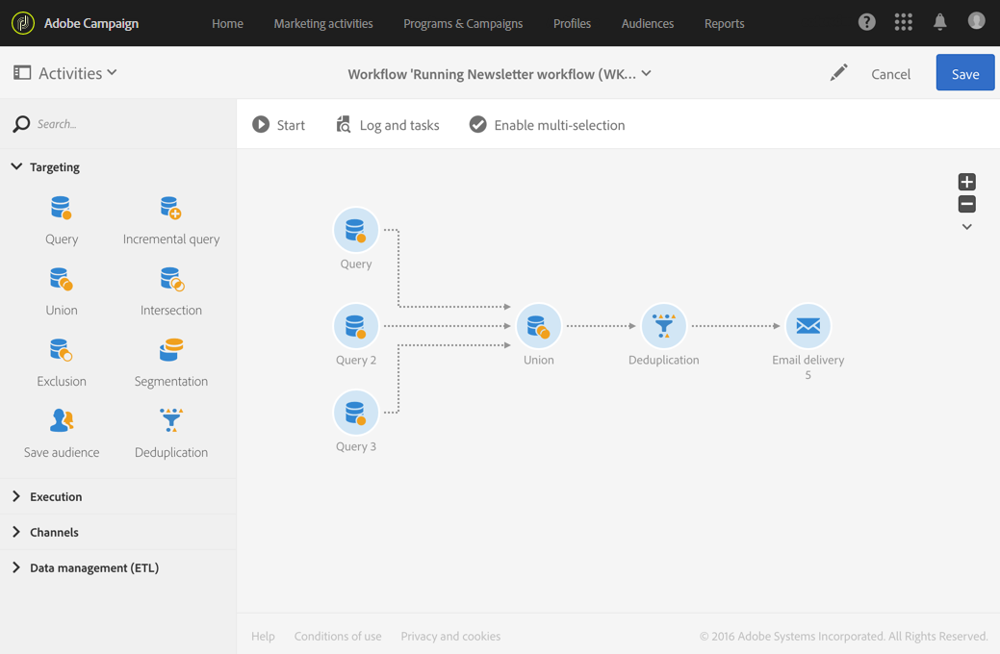

# Deduplicatie{#deduplication}

## Beschrijving {#description}


Met de **[!UICONTROL Deduplication]** activiteit kunt u duplicaten verwijderen uit het resultaat of de resultaten van de binnenkomende activiteiten.

## Gebruikscontext {#context-of-use}

De **[!UICONTROL Deduplication]** activiteit wordt over het algemeen gebruikt na doelactiviteiten of na het importeren van een bestand en vóór activiteiten die het gebruik van gerichte gegevens mogelijk maken.

Tijdens deduplicatie worden inkomende overgangen afzonderlijk verwerkt. Als profiel &#39;A&#39; bijvoorbeeld aanwezig is in het resultaat van query 1 en ook in het resultaat van query 2, wordt het profiel niet gededupliceerd.

Daarom wordt geadviseerd dat een deduplicatie slechts één inkomende overgang heeft. Om dit te doen, kunt u uw verschillende vragen combineren door activiteiten te gebruiken die aan uw het richten behoeften zoals verenigingsactiviteit, een intersectieactiviteit, enz. beantwoorden. Bijvoorbeeld:



## Configuratie {#configuration}

Om een deduplicatieactiviteit te vormen, moet u een etiket, de methode en de deduplicatiecriteria, evenals de opties met betrekking tot het resultaat ingaan.

1. Sleep een **[!UICONTROL Deduplication]** activiteit naar uw werkstroom.
1. Selecteer de activiteit, dan open het gebruikend de  knoop van de snelle acties die verschijnen.

   

1. Selecteer de **[!UICONTROL Resource type]** wijze waarop de deduplicatie moet worden uitgevoerd:

   * **[!UICONTROL Database resource]** indien de deduplicatie wordt uitgevoerd op gegevens die al in de database aanwezig zijn. Selecteer de **[!UICONTROL Filtering dimension]** en de **[!UICONTROL Targeting dimension]** afbeelding, afhankelijk van de gegevens die u wilt dedupliceren. Standaard wordt deduplicatie uitgevoerd op de **profielen**.
   * **[!UICONTROL Temporary resource]** indien de deduplicatie wordt uitgevoerd op de tijdelijke gegevens van de werkstroom: Selecteer het bestand **[!UICONTROL Targeted set]** met de gegevens die u wilt dedupliceren. Dit gebruik kan voorkomen na het invoeren van een dossier of als de gegevens in het gegevensbestand (met een segmentcode, bijvoorbeeld) werden verrijkt.

1. Selecteer de **[!UICONTROL Number of unique records to keep]**. De standaardwaarde voor dit veld is 1. Met de waarde 0 kunt u alle duplicaten behouden.

   Bijvoorbeeld, als de verslagen A en B als duplicaten van verslag Y worden beschouwd, en een verslag C als duplicaat van verslag Z wordt beschouwd:

   * Als de waarde van het veld 1 is: alleen de Y- en Z-gegevens worden bewaard.
   * Wanneer de waarde van het veld 0 is: alle registers worden bijgehouden.
   * Als de waarde van het veld 2 is: de registers C en Z worden bijgehouden en twee registers van A, B en Y worden, bij toeval of afhankelijk van de daarna gekozen deduplicatiemethode, bijgehouden.

1. Definieer de **[!UICONTROL Duplicate identification]** criteria door voorwaarden toe te voegen in de opgegeven lijst. Geef de velden en/of expressies op waarvoor de duplicaten met dezelfde waarden kunnen worden geïdentificeerd: e-mailadres, voornaam, achternaam, enz. In de volgorde van de voorwaarden kunt u opgeven welke voorwaarden eerst moeten worden verwerkt.
1. Selecteer in de vervolgkeuzelijst de **[!UICONTROL Deduplication method]** volgende opties:

   * **[!UICONTROL Choose for me]**: Hiermee selecteert u willekeurig de record die u uit de duplicaten wilt verwijderen.
   * **[!UICONTROL Following a list of values]**: Hiermee kunt u een prioriteit voor een of meer velden definiëren. Als u de waarden wilt definiëren, selecteert u een veld of maakt u een expressie. Voeg vervolgens de waarde(n) toe aan de desbetreffende tabel. Als u een nieuw veld wilt definiëren, klikt u op de **[!UICONTROL Add]** knop boven de lijst met waarden.

      

   * **[!UICONTROL Non-empty value]**: Hiermee kunt u records bewaren waarvoor de waarde van de geselecteerde expressie niet leeg is als prioriteit.

      

   * **[!UICONTROL Using an expression]**: hiermee kunt u de records bijhouden waarin de waarde van de ingevoerde expressie het kleinst of het grootst is.

      

1. Indien nodig, beheer de [Overgangen](../../automating/using/activity-properties.md) van de activiteit om tot de geavanceerde opties voor de uitgaande bevolking toegang te hebben.
1. Bevestig de configuratie van uw activiteit en sla uw werkschema op.

## Voorbeeld 1: Duplicaten identificeren vóór levering {#example-1--identifying-duplicates-before-a-delivery}

In het volgende voorbeeld ziet u een deduplicatie waarmee u de duplicaten van een doel kunt uitsluiten voordat u een e-mail verzendt. Dit betekent dat u een communicatie niet meerdere keren naar hetzelfde profiel verzendt.

De workflow bestaat uit:


* Een **[!UICONTROL Query]** methode waarmee u het doel van de e-mail kunt definiëren. Hier, richt het werkschema zich alle profielen tussen 18 en 25 die in het cliëntgegevensbestand meer dan een jaar zijn geweest.

   

* Een **[!UICONTROL Deduplication]** activiteit, die u toestaat om de duplicaten te identificeren die uit de voorafgaande vraag komen. In dit voorbeeld wordt slechts één record opgeslagen voor elk duplicaat. De duplicaten worden geïdentificeerd aan de hand van het e-mailadres. Dit betekent dat de e-maillevering slechts eenmaal kan worden verzonden voor elk e-mailadres dat aanwezig is bij de doelversie.

   De geselecteerde deduplicatiemethode is **[!UICONTROL Non-empty value]**. Op die manier kunt u ervoor zorgen dat bij dubbele gegevens voorrang wordt gegeven aan de gegevens waarvoor de **voornaam** is opgegeven. Hierdoor wordt het coherenter als de voornaam wordt gebruikt in de personalisatievelden van de e-mailinhoud.

   Bovendien wordt een extra overgang toegevoegd om de duplicaten te behouden en deze weer te geven.

   

* Een **[!UICONTROL Email delivery]** geplaatst na de belangrijkste uitgaande overgang van deduplicatie. De configuratie voor e-mailleveringen wordt gedetailleerd beschreven in de sectie [E-maillevering](../../automating/using/email-delivery.md) .
* Een **[!UICONTROL Save audience]** activiteit die na de extra overgang van deduplicatie wordt geplaatst om de duplicaten in een **Duplicaten** publiek te bewaren. Dit publiek kan worden hergebruikt om zijn leden van elke e-maillevering direct uit te sluiten.

## Voorbeeld 2: De gegevens uit een geïmporteerd bestand dedupliceren {#example-2--deduplicating-the-data-from-an-imported-file}

In dit voorbeeld wordt getoond hoe u gegevens uit een geïmporteerd bestand kunt dedupliceren voordat u de gegevens in de database laadt. Deze procedure verbetert de kwaliteit van de gegevens die in het gegevensbestand worden geladen.

De workflow bestaat uit:


* Een bestand dat een lijst met profielen bevat, wordt met behulp van een **[!UICONTROL Load file]** activiteit geïmporteerd. In dit voorbeeld heeft het geïmporteerde bestand de CSV-indeling en bevat het 10 profielen:

   ```
   lastname;firstname;dateofbirth;email
   Smith;Hayden;23/05/1989;hayden.smith@example.com
   Mars;Daniel;17/11/1987;dannymars@example.com
   Smith;Clara;08/02/1989;hayden.smith@example.com
   Durance;Allison;15/12/1978;allison.durance@example.com
   Lucassen;Jody;28/03/1988;jody.lucassen@example.com
   Binder;Tom;19/01/1982;tombinder@example.com
   Binder;Tommy;19/01/1915;tombinder@example.com
   Connor;Jade;10/10/1979;connor.jade@example.com
   Mack;Clarke;02/03/1985;clarke.mack@example.com
   Ross;Timothy;04/07/1986;timross@example.com
   ```

   Dit bestand kan ook worden gebruikt als voorbeeldbestand om de indeling van de kolommen te detecteren en te definiëren. Controleer in het **[!UICONTROL Column definition]** tabblad of elke kolom van het geïmporteerde bestand correct is geconfigureerd.

   

* Een **[!UICONTROL Deduplication]** activiteit. De deduplicatie wordt direct uitgevoerd na het invoeren van het dossier en alvorens de gegevens in het gegevensbestand op te nemen. Daarom moet zij gebaseerd zijn op de **[!UICONTROL Temporary resource]** resultaten van de **[!UICONTROL Load file]** activiteit.

   In dit voorbeeld willen we één item per uniek e-mailadres in het bestand bewaren. Dubbele identificatie vindt daarom plaats in de **e-mailkolom** van de tijdelijke bron. Twee e-mailadressen staan echter twee keer in het bestand. Twee lijnen worden daarom als duplicaten beschouwd.

   

* Een **[!UICONTROL Update data]** activiteit staat u toe om de gegevens op te nemen die van het deduplicatieproces in het gegevensbestand worden gehouden. Alleen wanneer de gegevens worden bijgewerkt, worden de geïmporteerde gegevens geïdentificeerd als behorend tot de profieldimensie.

   Hier willen we graag **[!UICONTROL Insert only]** de profielen zien die nog niet bestaan in de database. We gaan dit doen door de e-mailkolom van het bestand en het e-mailveld van de dimensie **Profiel** te gebruiken als de combinatietoets.

   

   Geef de toewijzingen op tussen de kolommen van het bestand waaruit u de gegevens en de databasevelden vanaf het **[!UICONTROL Fields to update]** tabblad wilt invoegen.

   

Start vervolgens de workflow. De records die tijdens het deduplicatieproces zijn opgeslagen, worden vervolgens toegevoegd aan de profielen in uw database.
