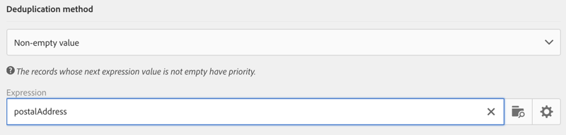

# Deduplicatie{#deduplication}

## Beschrijving {#description}

Met de activiteit **[!UICONTROL Deduplication]** kunt u duplicaten in het resultaat of de resultaten van de binnenkomende activiteiten verwijderen.

## Gebruikscontext {#context-of-use}

De activiteit **[!UICONTROL Deduplication]** wordt over het algemeen gebruikt na targetingactiviteiten of na het importeren van een bestand en vóór activiteiten die het gebruik van getargete data mogelijk maken.

Tijdens deduplicatie worden binnenkomende overgangen afzonderlijk verwerkt. Als profiel A bijvoorbeeld aanwezig is in het resultaat van query 1 en ook in het resultaat van query 2, wordt het profiel niet gededupliceerd.

Daarom wordt aangeraden slechts één binnenkomende overgang in te stellen voor een deduplicatie. U doet dit door verschillende query&#39;s te combineren door activiteiten te gebruiken die aan uw targetingbehoeften voldoen zoals een activiteit Samenvoeging, een activiteit Doorsnede enzovoort. Bijvoorbeeld:

**Verwante onderwerpen**

* [Hoofdlettergebruik: Duplicaten identificeren vóór levering](../../automating/using/identifying-duplicated-before-delivery.md)
* [Hoofdlettergebruik: De gegevens uit een geïmporteerd bestand dedupliceren](../../automating/using/deduplicating-data-imported-file.md)

## Configuratie {#configuration}

Om een deduplicatie-activiteit te configureren, moet u een label, de methode en de deduplicatiecriteria invoeren, evenals de opties met betrekking tot het resultaat.

1. Sleep een activiteit **[!UICONTROL Deduplication]** en zet deze neer in uw workflow.
1. Selecteer de activiteit en open deze met de knop  vanuit de snelle acties die verschijnen.

   

1. Selecteer het **[!UICONTROL Resource type]** waarop de deduplicatie moet worden uitgevoerd:

   * **[!UICONTROL Database resource]** als de deduplicatie wordt uitgevoerd op data die al in de database aanwezig zijn. Selecteer de **[!UICONTROL Filtering dimension]** en de **[!UICONTROL Targeting dimension]**, afhankelijk van de data die u wilt dedupliceren. Standaard wordt deduplicatie uitgevoerd op de **profielen**.
   * **[!UICONTROL Temporary resource]** als de deduplicatie wordt uitgevoerd op de tijdelijke data van de workflow: selecteer de **[!UICONTROL Targeted set]** met de data die u wilt dedupliceren. Dit gebruiksscenario kan optreden na het importeren van een bestand of als de data in de database zijn verrijkt (bijvoorbeeld met een segmentcode).

1. Selecteer het **[!UICONTROL Number of unique records to keep]**. De standaardwaarde voor dit veld is 1. Met de waarde 0 kunt u alle duplicaten behouden.

   Stel bijvoorbeeld dat records A en B worden beschouwd als duplicaten van record Y en dat een record C wordt beschouwd als duplicaat van record Z:

   * Als de waarde van het veld 1 is: alleen de records Y en Z blijven behouden.
   * Als de waarde van het veld 0 is: alle records blijven behouden.
   * Als de waarde van het veld 2 is: de records C en Z blijven behouden en twee records van A, B en Y blijven behouden, bij toeval of afhankelijk van de daarna geselecteerde deduplicatiemethode.

1. Definieer de criteria voor **[!UICONTROL Duplicate identification]** door voorwaarden toe te voegen in de opgegeven lijst. Geef de velden en/of expressies op waarvoor de duplicaten met dezelfde waarden kunnen worden geïdentificeerd: e-mailadres, voornaam, achternaam, enzovoort. In de volgorde van de voorwaarden kunt u opgeven welke voorwaarden eerst moeten worden verwerkt.
1. Selecteer in de vervolgkeuzelijst de te gebruiken **[!UICONTROL Deduplication method]**:

   * **[!UICONTROL Choose for me]**: Hiermee selecteert u willekeurig de record die u uit de duplicaten wilt houden.
   * **[!UICONTROL Following a list of values]**: Hiermee kunt u een waardeprioriteit voor een of meer velden definiëren. Als u de waarden wilt definiëren, selecteert u een veld of maakt u een expressie en vervolgens voegt u de waarde(n) toe aan de desbetreffende tabel. Als u een nieuw veld wilt definiëren, klikt u op de knop **[!UICONTROL Add]** boven de lijst met waarden.

      

   * **[!UICONTROL Non-empty value]**: Hiermee kunt u records waarvoor de waarde van de geselecteerde expressie niet leeg is als prioriteit behouden.

      

   * **[!UICONTROL Using an expression]**: Hiermee kunt u de records behouden waarin de waarde van de ingevoerde expressie het kleinst of het grootst is.

      

1. Indien nodig beheert u de [Overgangen](../../automating/using/activity-properties.md) van de activiteit om toegang te krijgen tot de geavanceerde opties voor de uitgaande populatie.
1. Bevestig de configuratie van uw activiteit en sla de workflow op.
