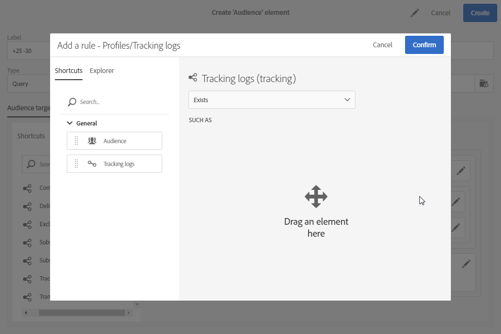

# Bewerkquery&#39;s{#editing-queries}

## Query-editor {#about-query-editor}

De query-editor is een wizard waarmee u gegevens in de Adobe Campagne-database kunt filteren.

Met deze functie kunt u een populatie maken die beter is afgestemd op de ontvangers dankzij de vooraf gedefinieerde filters en regels.

Dit wordt door verschillende toepassingsfuncties gebruikt om:

* Type **query** maken **publiek**
* E- **maildoelen** definiëren
* Populaties definiëren in **workflowactiviteiten**

## Interface van Query-editor {#query-editor-interface}

De query-editor bestaat uit een **palet** en een **werkruimte**.

### Palet {#palette}

Het palet, dat zich aan de linkerkant van de redacteur bevindt, is verdeeld in twee tabbladen, die elementen bevatten die in thematische blokken zijn verdeeld. Deze tabbladen zijn:

* De **sneltoetsen**, standaard beschikbaar of gemaakt door de Instance Administrator. Hier vindt u velden, knooppunten, groepen, 1-1 koppelingen, 1-N-koppelingen en andere vooraf gedefinieerde filters.
* De **Ontdekkingsreiziger** die u toestaat om tot alle beschikbare gebieden in het doelmiddel toegang te hebben: knooppunten, groeperingselementen, koppelingen (1-1 en 1-N).

De elementen in de lusjes moeten in de werkruimte worden bewogen om worden gevormd en rekening gehouden met de vraag. Afhankelijk van de geselecteerde doeldimensie (zie [Doeldimensies en middelen](../../automating/using/query.md#targeting-dimensions-and-resources)), kunt u:

* Selecteer een voor een publiek of profiel
* Vooraf gedefinieerde filters gebruiken
* Eenvoudige regels definiëren voor velden naar keuze
* Geavanceerde regels definiëren waarmee u functies kunt toepassen op bepaalde velden

### Werkruimte {#workspace}

De werkruimte is de centrale zone waarin u regels, soorten publiek en vooraf gedefinieerde filters die u vanuit het palet hebt toegevoegd, kunt configureren en combineren.

Wanneer u een element van het palet naar de werkruimte verplaatst, wordt een nieuw venster geopend en kunt u query&#39;s [maken](#creating-queries).

## Vragen maken {#creating-queries}

De vraagredacteur kan worden gebruikt om een publiek of testprofiel in een bericht, een bevolking in een werkschema te bepalen en een vraagtype publiek tot stand te brengen.

Vragen kunnen in het **[!UICONTROL Audience]** venster worden gedefinieerd tijdens het maken van een levering of in een **Query** -activiteit tijdens het maken van een workflow.

1. Een element van het palet naar de werkruimte verplaatsen. Het venster voor het bewerken van de regel wordt geopend.

   * Geef voor een tekenreeks of numeriek **veld** de vergelijkingsoperator en de waarde op.

      

   * Voor een datum- of datum- en **tijdveld** kunt u een specifieke datum, een bereik tussen twee datums of een periode definiëren ten opzichte van de uitvoeringsdatum van de query.

      

   * Voor een Booleaans **veld** schakelt u de vakken in die zijn gekoppeld aan de mogelijke waarden voor het veld.
   * Voor een **groeperingsgebied** , selecteer het groeperingsgebied waarop u de regel wilt tot stand brengen, dan bepaal de voorwaarde op de zelfde manier zoals voor de andere gebieden.

      

   * Voor een verbinding **1-1** met een ander gegevensbestandmiddel, selecteer direct een waarde van de gerichte lijst.

      

   * Voor een verbinding **1-N** met een andere gegevensbestandmiddel, kunt u een sub-vraag op de gebieden van dit tweede middel bepalen.

      U hoeft geen subvoorwaarde op te geven.

      U kunt bijvoorbeeld alleen de **[!UICONTROL Exists]** operator selecteren in de logboeken voor het bijhouden van profielen en de regel goedkeuren. De regel retourneert alle profielen waarvoor trackinglogboeken bestaan.

      

   * Voor een **vooraf gedefinieerd filter** voert u de elementen in die u volgens de aangeboden criteria wilt gebruiken of selecteert u deze.

      Beheerders kunnen filters maken om complexe en herhaalde query&#39;s te vereenvoudigen. Deze zullen in de vraagredacteur in de vorm van pre-gevormde regels verschijnen en zij beperken het aantal stappen die door de gebruiker moeten worden uitgevoerd.

      

1. U kunt een naam voor uw regel specificeren. Dit wordt dan getoond als regelnaam in de werkruimte. Als de regel geen naam heeft, wordt een automatische beschrijving van de voorwaarden weergegeven.
1. Als u de werkruimte-elementen wilt combineren, koppelt u ze aan elkaar om verschillende groepen en/of groepsniveaus te maken. Vervolgens kunt u een logische operator selecteren om elementen op hetzelfde niveau te combineren:

   * **[!UICONTROL AND]**: een doorsnede van twee criteria. Alleen de elementen die aan elk criterium voldoen, worden in aanmerking genomen.
   * **[!UICONTROL OR]**: een unie van twee criteria . Elementen die ten minste aan een van de twee criteria voldoen, worden in aanmerking genomen.
   * **[!UICONTROL EXCEPT]**: uitsluitingscriteria. Elementen die aan het eerste criterium voldoen, worden in aanmerking genomen, tenzij zij ook aan het tweede criterium voldoen.

1. U kunt nu het aantal elementen berekenen en voorvertonen dat de query als doel heeft met behulp van de  en  knoppen op de actiebalk.

   

Als u een element van de vraag wilt wijzigen, klik op het uitgeven pictogram. De regel wordt geopend aangezien het eerder werd gevormd en u kunt dan om het even welke noodzakelijke aanpassingen uitvoeren.

Uw vragen worden nu gecreeerd en bepaald, dit staat u toe om een bevolking te bouwen om uw leveringen beter te personaliseren.

**Verwante onderwerpen:**

* [Geavanceerde functies](../../automating/using/advanced-expression-editing.md)
* [Filters definiëren](../../developing/using/configuring-filter-definition.md)
* [Hoofdlettergebruik: Eenmaal per week een e-maillevering maken](../../automating/using/workflow-weekly-offer.md)
* [Hoofdlettergebruik: Een levering maken die op een locatie is gesegmenteerd](../../automating/using/workflow-segmentation-location.md)
* [Hoofdlettergebruik: Leveringen maken met een aanvulling](../../automating/using/workflow-created-query-with-complement.md)
* [Hoofdlettergebruik: Werkstroom opnieuw toewijzen om een nieuwe levering naar niet-openers te verzenden](../../automating/using/workflow-cross-channel-retargeting.md)
