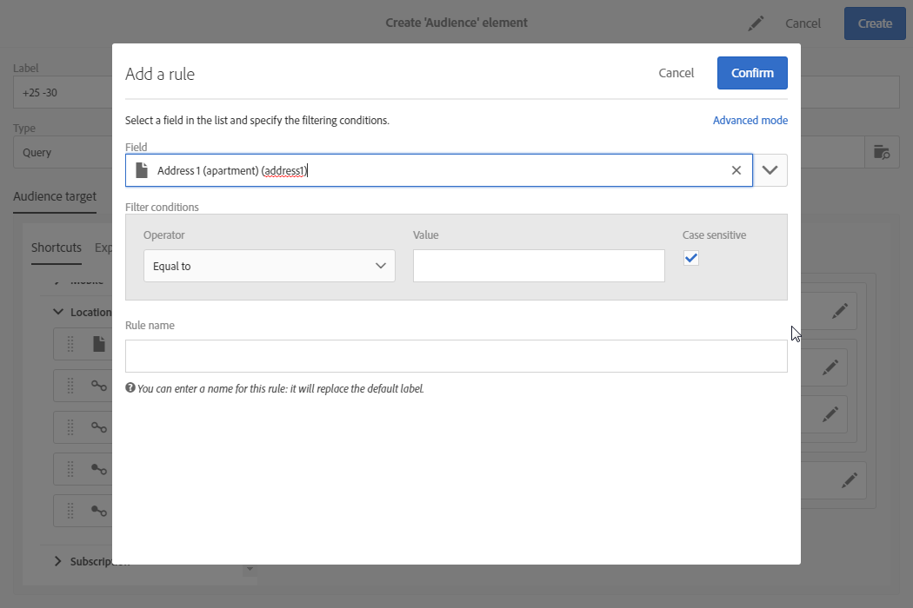

# Query&#39;s bewerken{#editing-queries}

## Query-editor {#about-query-editor}

De query-editor is een wizard waarmee u data in de Adobe Campaign-database kunt filteren.

Met deze functie kunt u een populatie maken die beter is afgestemd op uw ontvangers dankzij vooraf gedefinieerde filters en regels.

Dit wordt door verschillende functies van de applicatie gebruikt voor de volgende punten:

* **Doelgroepen** van het type **Query** maken 
* **E-mailtargets** definiëren
* Populaties definiëren in **workflowactiviteiten**

## Interface van de query-editor {#query-editor-interface}

De query-editor bestaat uit een **palet** en een **werkruimte**.

### Palet {#palette}

Het palet bevindt zich links van de editor en bevat twee tabbladen met elementen die in thematische blokken zijn verdeeld. Deze tabbladen zijn:

* Het tabblad **Shortcuts** biedt sneltoetsen die standaard beschikbaar zijn, of gemaakt door de instantiebeheerder. Hier vindt u velden, nodes, groepen, 1-1-koppelingen, 1-N-koppelingen en andere vooraf gedefinieerde filters.
* Op het tabblad **Explorer** hebt u toegang tot alle beschikbare velden in de doelbron: nodes, groeperingselementen en koppelingen (1-1 en 1-N).

De elementen in de tabbladen moeten naar de werkruimte worden verplaatst zodat ze kunnen worden geconfigureerd en opgenomen in de query. Afhankelijk van de geselecteerde targetingdimensie (zie [Targetingdimensies en bronnen](../../automating/using/query.md#targeting-dimensions-and-resources)), kunt u het volgende doen:

* Individuele doelgroepen of profielen selecteren
* Vooraf gedefinieerde filters gebruiken
* Eenvoudige regels definiëren voor velden naar keuze
* Geavanceerde regels definiëren waarmee u functies kunt toepassen op bepaalde velden

### Werkruimte {#workspace}

De werkruimte is de centrale zone waar u regels, doelgroepen en vooraf gedefinieerde filters die vanuit het palet zijn toegevoegd, kunt configureren en combineren.

Wanneer u een element van het palet naar de werkruimte verplaatst, wordt een nieuw venster geopend en kunt u [query&#39;s maken](#creating-queries).

## Query&#39;s maken {#creating-queries}

Met de query-editor kunt u een doelgroep of testprofiel definiëren voor een bericht, een populatie bepalen voor een workflow, en een doelgroep maken die geschikt is voor query&#39;s.

Query&#39;s kunnen in het venster **[!UICONTROL Audience]** worden gedefinieerd wanneer u een levering maakt, of in een **query** activiteit wanneer u een workflow maakt.

1. Verplaats een element van het palet naar de werkruimte. Het venster voor het bewerken van de regel wordt geopend.

   * Bij een tekenreeks of numeriek **veld** moet u de vergelijkingsoperator en de waarde opgeven.

      

   * Bij een datum- of **tijdveld** kunt u een specifieke datum, een bereik tussen twee datums of een periode definiëren ten opzichte van de uitvoeringsdatum van de query.

      

   * Bij een Booleaans **veld** vinkt u de selectievakken aan die zijn gekoppeld aan de mogelijke waarden voor het veld.
   * Bij een **groeperingsveld** selecteer u het veld waarop u de regel wilt toepassen. Daarna definieert u de voorwaarde op dezelfde manier als bij de andere velden.

      

   * Voor een **1-1**-koppeling met een andere databasebron selecteert u de waarde rechtstreeks in de getargete tabel.

      

   * Voor een **1-N**-koppeling met een andere databasebron definieert u een subquery voor de velden van deze tweede bron.

      U hoeft geen subvoorwaarde op te geven.

      U kunt bijvoorbeeld alleen de operator **[!UICONTROL Exists]** selecteren in de profieltrackinglogboeken en de regel goedkeuren. De regel retourneert alle profielen waarvoor trackinglogboeken bestaan.

      

   * Bij een **vooraf gedefinieerd filter** voert u de elementen in die u volgens de aangeboden criteria wilt gebruiken of selecteert u deze.

      Beheerders kunnen filters maken om het uitvoeren van complexe en herhaalde query&#39;s te vereenvoudigen. Deze zijn beschikbaar in de query-editor in de vorm van vooraf geconfigureerde regels, waarmee het aantal stappen dat door de gebruiker moet worden uitgevoerd, sterk wordt verminderd.

      

1. U kunt een naam voor uw regel opgeven. Deze naam wordt dan weergegeven als regelnaam in de werkruimte. Als de regel geen naam heeft, wordt een automatische beschrijving van de voorwaarden getoond.
1. Als u de werkruimte-elementen wilt combineren, koppelt u ze aan elkaar om verschillende groepen en/of groepsniveaus te maken. Vervolgens kiest u een logische operator om elementen op hetzelfde niveau te combineren:

   * **[!UICONTROL AND]**: een doorsnede van twee criteria. Alleen de elementen die aan elk criterium voldoen, worden in aanmerking genomen.
   * **[!UICONTROL OR]**: een unie van twee criteria. Elementen die ten minste aan een van de twee criteria voldoen, worden in aanmerking genomen.
   * **[!UICONTROL EXCEPT]**: uitsluitingscriteria. Elementen die aan het eerste criterium voldoen, worden in aanmerking genomen, tenzij ze ook aan het tweede criterium voldoen.

1. Nu kunt u het aantal elementen berekenen en voorvertonen die door de query worden getarget. Gebruik hiervoor de knoppen  en  op de actiebalk.

   

Als u een element van de query wilt wijzigen, klikt op het pictogram Bewerken. De regel wordt geopend zoals deze voorheen was geconfigureerd. U kunt alle benodigde wijzigingen toepassen.

Uw query&#39;s worden nu gemaakt en gedefinieerd, zodat u een populatie kunt samenstellen met een optimale personalisatie voor uw leveringen.

**Verwante onderwerpen:**

* [Geavanceerde functies](../../automating/using/advanced-expression-editing.md)
* [Filters definiëren](../../developing/using/configuring-filter-definition.md)
* [Gebruiksscenario: Eenmaal per week een e-maillevering maken](../../automating/using/workflow-weekly-offer.md)
* [Gebruiksscenario: Een levering maken die is gesegmenteerd op locatie](../../automating/using/workflow-segmentation-location.md)
* [Gebruiksscenario: Leveringen maken met een aanvulling](../../automating/using/workflow-created-query-with-complement.md)
* [Gebruiksscenario: Retargeting van een workflow om een nieuwe levering te zenden naar personen die het bericht niet hebben geopend](../../automating/using/workflow-cross-channel-retargeting.md)
