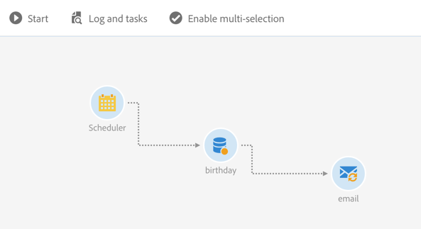

# E-maillevering{#email-delivery}

## Beschrijving {#description}

Met deze **[!UICONTROL Email delivery]** activiteit kunt u het verzenden van een e-mail configureren in een workflow. Dit kan **één verzendend** e-mail zijn en slechts één keer worden verzonden, of het kan een **terugkomende** e-mail zijn.

E-mailberichten die u per e-mail verzendt, zijn standaard e-mailberichten die u één keer verzendt.

Als u e-mails terugstuurt, kunt u dezelfde e-mail gedurende een bepaalde periode meerdere keren naar verschillende doelen verzenden. U kunt de leveringen per periode samenvoegen om rapporten te krijgen die aan uw behoeften beantwoorden.

## Gebruikscontext {#context-of-use}

De **[!UICONTROL Email delivery]** activiteit wordt over het algemeen gebruikt om het verzenden van een e-mail naar een doel te automatiseren dat in de zelfde werkschema wordt berekend.

Wanneer u een koppeling naar een planner maakt, kunt u terugkerende e-mails definiëren.

E-mailontvangers worden vóór de activiteit in dezelfde workflow gedefinieerd, via doelactiviteiten zoals query&#39;s, snijpunten, enz.

De voorbereiding van berichten wordt geactiveerd volgens de parameters voor workflowuitvoering. Van het berichtdashboard, kunt u selecteren of om een manuele bevestiging te verzoeken of niet om het bericht te verzenden (die door gebrek wordt vereist). U kunt de workflow handmatig starten of een planneractiviteit in de workflow plaatsen om de uitvoering te automatiseren.

## Configuratie {#configuration}

1. Sleep een **[!UICONTROL Email delivery]** activiteit naar uw werkstroom.
1. Selecteer de activiteit, dan open het gebruikend de  knoop van de snelle acties die verschijnen.

   >[!NOTE]
   >
   >U kunt de algemene eigenschappen en geavanceerde opties van de activiteit (en niet van de levering zelf) via de  knoop van de snelle acties van de activiteit toegang hebben. Deze knop is specifiek voor de **[!UICONTROL Email delivery]** activiteit. De eigenschappen van de e-mail zijn toegankelijk via de actiebalk in het e-maildashboard.

1. Selecteer de modus voor het verzenden van e-mail:

   * **[!UICONTROL Email]**: het e-mailbericht wordt één keer verzonden. U kunt hier specificeren of u al dan niet een uitgaande overgang aan de activiteit wilt toevoegen. De verschillende overgangstypen worden beschreven in stap 7 van deze procedure.
   * **[!UICONTROL Recurring email]**: de e-mail wordt verscheidene keren verzonden, volgens de frequentie die in een **[!UICONTROL Scheduler]** activiteit wordt bepaald. Selecteer de samenvoegingsperiode van de verzendingen. Hierdoor kunt u alle verzendingen die tijdens de gedefinieerde periode optreden, hergroeperen in één e-mail die ook wel **Herhalende uitvoering** wordt genoemd en die vanuit de lijst met marketingactiviteiten van de toepassing kan worden benaderd.

      Bijvoorbeeld, voor een terugkerende verjaardagse-mail, die dagelijks wordt verzonden, kunt u verkiezen om verzendt per maand samen te voegen. Op deze manier kunt u maandelijks rapporten over uw levering ontvangen, hoewel de e-mail elke dag wordt verzonden.

1. Selecteer een e-mailtype. De e-mailtypen zijn afkomstig van e-mailsjablonen die u hebt gedefinieerd in het menu **[!UICONTROL Resources]** > **[!UICONTROL Templates]** > **[!UICONTROL Delivery templates]** .
1. Voer de algemene eigenschappen voor de e-mail in. U kunt het aan een bestaande campagne ook vastmaken. Het label van de leveringsactiviteit van de werkstroom wordt bijgewerkt met het e-maillabel.
1. Geef de e-mailinhoud op. Raadpleeg de sectie over het bewerken van [inhoud](../../designing/using/designing-content-in-adobe-campaign.md).
1. Standaard bevat de **[!UICONTROL Email delivery]** activiteit geen uitgaande overgangen. Als u een uitgaande overgang aan uw **[!UICONTROL Email delivery]** activiteit wilt toevoegen, ga naar het **[!UICONTROL General]** lusje van de geavanceerde activiteitenopties (  knoop in de snelle acties van de activiteit) dan controleren één van de volgende opties:

   * **[!UICONTROL Add outbound transition without the population]**: dit laat u een uitgaande overgang produceren die de nauwkeurige zelfde bevolking zoals de binnenkomende overgang bevat.
   * **[!UICONTROL Add outbound transition with the population]**: dit laat u een uitgaande overgang produceren die de bevolking bevat aan wie e - mail werd verzonden. De leden van het doel die tijdens de voorbereiding van de levering zijn uitgesloten (quarantaine, ongeldige e-mail, enz.) zijn uitgesloten van deze overgang.

1. Bevestig de configuratie van uw activiteit en sla uw werkschema op.

Als u de activiteit opnieuw opent, gaat u rechtstreeks naar het e-maildashboard. Alleen de inhoud kan worden bewerkt.

Door gebrek, leidt het beginnen van een leveringswerkschema slechts tot de berichtvoorbereiding. Het verzenden van berichten die op basis van een workflow zijn gemaakt, moet nog worden bevestigd nadat de workflow is gestart. Maar van het berichtdashboard, en slechts als het bericht van een werkschema werd gecreeerd, kunt u de **[!UICONTROL Request confirmation before sending messages]** optie onbruikbaar maken. Als u deze optie uitschakelt, worden berichten zonder verdere kennisgeving verzonden zodra de voorbereiding is voltooid.

## Opmerkingen {#remarks}

De leveringen die in een workflow worden gemaakt, zijn toegankelijk in de lijst met marketingactiviteiten van de toepassing. U kunt de uitvoeringsstatus van de workflow weergeven via het dashboard. Via koppelingen in het overzichtsvenster voor e-mail hebt u rechtstreeks toegang tot gekoppelde elementen (workflow, campagne, bovenliggende verzending in het geval van een terugkerende e-mail).

De uitvoeringen van terugkerende leveringen worden echter standaard gemaskeerd. U kunt deze weergeven door de **[!UICONTROL Show recurring executions]** optie in het zoekvenster voor marketingactiviteiten te selecteren.

In de ouderleveranties, die van de marketing activiteitenlijst of direct via de bijbehorende terugkomende uitvoeringen kunnen worden betreden, kunt u het totale aantal verzenden bekijken die zijn verwerkt (volgens de samenvoegingsperiode die wordt gespecificeerd toen de **[!UICONTROL Email delivery]** activiteit werd gevormd). U doet dit door de detailweergave van het **[!UICONTROL Deployment]** blok van de bovenliggende levering te openen door te selecteren.

## Voorbeeld {#example}

Dit voorbeeld is een verjaardagsworkflow. Elke dag wordt een e-mail verzonden naar profielen waarvan het verjaart op die dag is. Dit doet u als volgt:

* Met dit **[!UICONTROL Scheduler]** programma kunt u elke dag om 8.00 uur de workflow starten.

   

* Met deze **[!UICONTROL Query]** activiteit kunt u de profielen berekenen die een e-mail hebben verzonden en waarvan de verjaardag op de huidige dag is, telkens wanneer de workflow wordt uitgevoerd. De verjaardagsberekening wordt uitgevoerd gebruikend een vooraf bepaald filter beschikbaar in het palet in het vraaguitgevende hulpmiddel.

   

* Het **[!UICONTROL Email]** is terugkerend. De verzendingen worden samengevoegd per maand. Alle e-mails die in een maand worden verzonden, worden dus samengevoegd tot één weergave. In één jaar worden er daarom 365 leveringen uitgevoerd, maar deze worden in de interface van Adobe Campagne gerangschikt in 12 weergaven (ook wel **terugkerende uitvoeringen** genoemd). De geschiedenis en rapportdetails worden getoond elke maand en niet voor elke verzend.

   

**Verwante onderwerpen**

* [Hoofdlettergebruik: Eenmaal per week een e-maillevering maken](../../automating/using/workflow-weekly-offer.md)
* [Hoofdlettergebruik: Een levering maken die op een locatie is gesegmenteerd](../../automating/using/workflow-segmentation-location.md)
* [Hoofdlettergebruik: Leveringen maken met een aanvulling](../../automating/using/workflow-created-query-with-complement.md)
* [Hoofdlettergebruik: Werkstroom opnieuw toewijzen om een nieuwe levering naar niet-openers te verzenden](../../automating/using/workflow-cross-channel-retargeting.md)