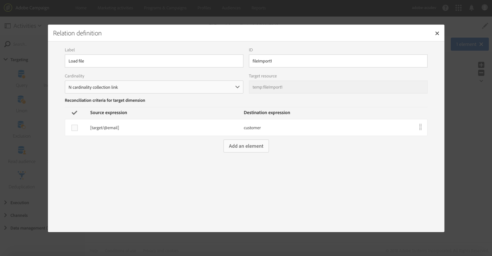

# Profieldata verrijken met data in een bestand {#enriching-profile-data-with-data-contained-in-a-file}

In dit voorbeeld ziet u hoe u profielgegevens verrijkt met aankoopgegevens in een bestand. De aankoopgegevens worden hier opgeslagen in een systeem van derden. Voor elk profiel kunnen meerdere aankopen in het bestand worden opgeslagen. Het uiteindelijke doel van de workflow is een e-mail te sturen naar de doelprofielen die ten minste twee items hebben aangeschaft om ze te bedanken voor hun loyaliteit.

De workflow is als volgt geconfigureerd:


* A [Query](../../automating/using/query.md) activity that targets the profiles who will receive the message.
* A [Load file](../../automating/using/load-file.md) activity that loads the purchase data. Bijvoorbeeld:

   ```
   tcode;tdate;customer;product;tamount
   aze123;21/05/2017;dannymars@example.com;TV;799
   aze124;28/05/2017;dannymars@example.com;Headphones;8
   aze125;31/07/2017;john.smith@example.com;Headphones;8
   aze126;14/12/2017;john.smith@example.com;Plastic Cover;4
   aze127;02/01/2018;dannymars@example.com;Case Cover;79
   aze128;04/03/2017;clara.smith@example.com;Phone;149
   ```

   In dit voorbeeldbestand gebruiken we het e-mailadres om de data af te stemmen op de databaseprofielen. U kunt ook unieke id’s inschakelen, zoals beschreven in [dit document](../../developing/using/configuring-the-resource-s-data-structure.md#generating-a-unique-id-for-profiles-and-custom-resources).

* An [Enrichment](../../automating/using/enrichment.md) activity that creates a link between the transaction data loaded from the file and the profiles selected in the **[!UICONTROL Query]**. De koppeling wordt gedefinieerd op het tabblad **[!UICONTROL Advanced relations]** van de activiteit. De koppeling is gebaseerd op de overgang die uit de activiteit **[!UICONTROL Load file]** komt. Het veld met de e-mail van de profielresource en de kolom met de klant van het geïmporteerde bestand worden gebruikt als afstemmingscriteria.

   

   Nadat de koppeling is gemaakt, worden twee sets **[!UICONTROL Additional data]** toegevoegd:

   * Een verzameling van twee regels die overeenkomen met de twee laatste transacties van elk profiel. Voor deze verzameling worden de productnaam, de transactiedatum en de prijs van het product toegevoegd als aanvullende data. Op de data wordt een aflopende sortering toegepast. Als u de verzameling wilt maken, klikt u op het tabblad **[!UICONTROL Additional data]**:

      Selecteer de koppeling die eerder is gedefinieerd op het tabblad **[!UICONTROL Advanced relations]** van de activiteit.

      

      Schakel **[!UICONTROL Collection]** in en geef het aantal regels op dat moet worden opgehaald (2 in dit voorbeeld). Op dit scherm kunt u de **[!UICONTROL Alias]** en het **[!UICONTROL Label]** van de verzameling aanpassen. Deze waarden zijn zichtbaar in de volgende activiteiten van de workflow wanneer naar deze verzameling wordt verwezen.

      

      Selecteer de kolommen die in de uiteindelijke levering zullen worden gebruikt als de **[!UICONTROL Data]** die voor de verzameling moeten worden behouden.

      

      Pas een aflopende sortering toe op de transactiedatum om ervoor te zorgen dat u de meest recente transacties ophaalt.

      

   * Een aggregaat met het totale aantal transacties voor elk profiel. Dit aggregaat wordt later gebruikt om profielen te filteren waarvoor ten minste twee transacties zijn vastgelegd. Voer de volgende stappen uit vanaf het tabblad **[!UICONTROL Additional data]** om het aggregaat te maken:

      Selecteer de koppeling die eerder is gedefinieerd op het tabblad **[!UICONTROL Advanced relations]** van de activiteit.

      

      Selecteer **[!UICONTROL Aggregate]**.

      

      Definieer een aggregaat **Count All** als **[!UICONTROL Data]** die u wilt behouden. Geef desgewenst een aangepaste alias op om deze sneller te vinden in de volgende activiteiten.

      

* A [Segmentation](../../automating/using/segmentation.md) activity with only one segment, that retrieves profiles of the initial target that have at least two transactions recorded. Profielen met slechts één transactie worden uitgesloten. Hiervoor wordt de query van de segmentatie gemaakt op het eerder gedefinieerde aggregaat.

   

* An [Email delivery](../../automating/using/email-delivery.md) activity that uses the additional data defined in the **[!UICONTROL Enrichment]** to dynamically retrieve the two last purchases made by the profile. De aanvullende data bevinden zich in het knooppunt **Additional data (TargetData)** bij het toevoegen van een personalisatieveld.

   

**Verwant onderwerp:**

* [Klantprofielen verrijken met externe data](https://helpx.adobe.com/campaign/kb/simplify-campaign-management.html#Managedatatofuelengagingexperiences)
