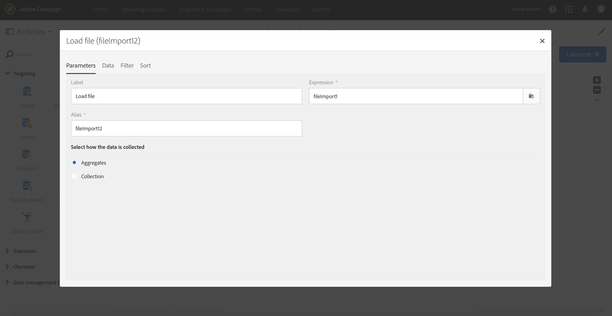

# Verrijking{#enrichment}

## Beschrijving {#description}


De **[!UICONTROL Enrichment]** activiteit is een geavanceerde activiteit die u toestaat om extra gegevens te bepalen in uw werkschema te verwerken.

## Gebruikscontext {#context-of-use}

De **[!UICONTROL Enrichment]** activiteit wordt over het algemeen gebruikt na doelactiviteiten of na het importeren van een bestand en vóór activiteiten die het gebruik van gerichte gegevens mogelijk maken.

Deze activiteit bevat meer geavanceerde verrijkingsfuncties dan de **[!UICONTROL Query]** activiteit. Sommige eenvoudige gevallen van verrijking kunnen direct in de activiteit [van de](../../automating/using/query.md#enriching-data)Vraag worden uitgevoerd.

Met de **[!UICONTROL Enrichment]** activiteit, kunt u hefboomwerking de binnenkomende overgang en de activiteit vormen om de outputovergang met extra gegevens te voltooien. Het staat toe om gegevens te combineren die uit veelvoudige reeksen komen, of verbindingen aan een tijdelijke middel tot stand te brengen.

## Configuratie {#configuration}

Een **[!UICONTROL Enrichment]** activiteit configureren:

1. Sleep een **[!UICONTROL Enrichment]** activiteit naar uw werkstroom.
1. Selecteer de activiteit, dan open het gebruikend de  knoop van de snelle acties die verschijnen.
1. Als de activiteit verscheidene binnenkomende overgangen heeft, selecteer **[!UICONTROL Primary set]**. De extra gegevens die in deze activiteit worden gevormd zullen aan deze primaire reeks in de uitgaande overgang worden toegevoegd.

   Als de primaire set al aanvullende gegevens bevat, kunt u deze behouden of verwijderen. Als u de **[!UICONTROL Keep all additional data from the main set]** optie uncheck, slechts worden de extra gegevens die in **[!UICONTROL Enrichment]** worden gevormd gehouden in de uitgaande overgang.

1. Als er verscheidene binnenkomende overgangen zijn, bepaal relaties tussen de primaire reeks en de andere binnenkomende gegevens op het **[!UICONTROL Advanced Relations]** lusje van de activiteit. U kunt meerdere relaties toevoegen met de **[!UICONTROL Add element]** knop.

   Wanneer u een nieuwe relatie definieert, selecteert u de set binnenkomende gegevens die u wilt koppelen aan de primaire set. Definieer vervolgens het type relatie. Afhankelijk van de binnenkomende gegevens en uw gegevensmodel zijn er verschillende soorten relaties beschikbaar:

   * **[!UICONTROL 1 cardinality simple link]**: elke record van de binnenkomende gegevens is gekoppeld aan één record uit de primaire set. Elke record uit de primaire set heeft één gekoppelde record in de gekoppelde gegevens.
   * **[!UICONTROL N cardinality collection link]**: 0, 1 of meer (N) records van de gekoppelde gegevens kunnen worden gekoppeld aan 1 record van de primaire set.
   * **[!UICONTROL 0 or 1 cardinality simple link]**: records uit de primaire set kunnen worden gekoppeld aan 0 of 1 record uit de gekoppelde gegevens, maar niet meer dan één record.
   Als de definitie eenmaal **[!UICONTROL Cardinality]** is opgegeven, definieert u een **[!UICONTROL Reconciliation criteria]**. De afstemmingscriteria **[!UICONTROL Source expression]** kunnen een veld zijn van de doelbron, een [expressie](../../automating/using/advanced-expression-editing.md) of rechtstreeks een waarde tussen aanhalingstekens.

   Definieer een **[!UICONTROL Label]** en een bestand **[!UICONTROL ID]** dat later in de workflow gemakkelijk kan worden herkend.

   >[!NOTE]
   >
   >U kunt alleen relaties definiëren tussen de primaire set en de andere binnenkomende overgangen die verbonden zijn met de **[!UICONTROL Enrichment]** activiteit. Voor eenvoudigere gevallen die bedoeld zijn om relaties met databasebronnen te definiëren, gebruikt u een [afstemmingsactiviteit](../../automating/using/reconciliation.md) .

1. Definieer de aanvullende gegevens op het **[!UICONTROL Additional data]** tabblad van de activiteit. U kunt aanvullende gegevens (eenvoudige velden, aggregaten en verzamelingen) definiëren die betrekking hebben op de doeldimensie van de primaire set of die zijn gebaseerd op de koppelingen die zijn gemaakt op het **[!UICONTROL Advanced relations]** tabblad van de **[!UICONTROL Enrichment]** activiteit.

   Raadpleeg de sectie [Verrijkende gegevens](../../automating/using/query.md#enriching-data) .

1. Bevestig de configuratie van uw activiteit en sla uw werkschema op.

De gegevens zijn nu beschikbaar voor gebruik in de activiteiten die na de **[!UICONTROL Enrichment]** verbinding zijn verbonden. U vindt deze bijvoorbeeld onder de **[!UICONTROL Additional data (targetData)]** koppeling van de verpersoonlijkingsvelden in een e-mailinhoud.

## Voorbeeld: Profielgegevens verrijken met gegevens in een bestand {#example--enriching-profile-data-with-data-contained-in-a-file}

In dit voorbeeld wordt getoond hoe u profielgegevens verrijkt met aankoopgegevens in een bestand. Wij zijn van mening dat de aankoopgegevens in een systeem van derden worden opgeslagen. Voor elk profiel kunnen meerdere aankopen in het bestand worden opgeslagen. Het uiteindelijke doel van de workflow is een e-mail te sturen naar de doelprofielen die ten minste twee items hebben aangeschaft om ze te bedanken voor hun loyaliteit.

De workflow is als volgt geconfigureerd:


* Een **[!UICONTROL Query]** activiteit die de profielen richt die het bericht zullen ontvangen.
* Een **[!UICONTROL Load file]** activiteit die de aankoopgegevens laadt. Bijvoorbeeld:

   ```
   tcode;tdate;customer;product;tamount
   aze123;21/05/2017;dannymars@example.com;TV;799
   aze124;28/05/2017;dannymars@example.com;Headphones;8
   aze125;31/07/2017;john.smith@example.com;Headphones;8
   aze126;14/12/2017;john.smith@example.com;Plastic Cover;4
   aze127;02/01/2018;dannymars@example.com;Case Cover;79
   aze128;04/03/2017;clara.smith@example.com;Phone;149
   ```

   Met dit voorbeeldbestand gebruiken we het e-mailadres om de gegevens in overeenstemming te brengen met de databaseprofielen. U kunt ook unieke id&#39;s inschakelen, zoals beschreven in [dit document](../../developing/using/configuring-the-resource-s-data-structure.md#generating-a-unique-id-for-profiles-and-custom-resources).

* Een **[!UICONTROL Enrichment]** activiteit die tot een verbinding tussen de transactiegegevens leidt die van het dossier en de profielen worden geladen die in **[!UICONTROL Query]** worden geselecteerd. De koppeling wordt gedefinieerd op het **[!UICONTROL Advanced relations]** tabblad van de activiteit. De koppeling is gebaseerd op de overgang die uit de **[!UICONTROL Load file]** activiteit komt. Het veld E-mail van de profielbron en de kolom &quot;klant&quot; van het geïmporteerde bestand worden gebruikt als afstemmingscriteria.

   

   Nadat de koppeling is gemaakt, worden twee sets **[!UICONTROL Additional data]** toegevoegd:

   * Een verzameling van twee regels die overeenkomen met de twee laatste transacties van elk profiel. Voor deze verzameling worden de productnaam, de transactiedatum en de prijs van het product toegevoegd als aanvullende gegevens. Op de gegevens wordt een aflopende sortering toegepast. Als u de verzameling wilt maken, klikt u op het **[!UICONTROL Additional data]** tabblad:

      Selecteer de koppeling die eerder is gedefinieerd op het **[!UICONTROL Advanced relations]** tabblad van de activiteit.

      

      Controleer **[!UICONTROL Collection]** en geef het aantal regels op dat moet worden opgehaald (2 in dit voorbeeld). In dit scherm, kunt u de **[!UICONTROL Alias]** en de **[!UICONTROL Label]** van de inzameling aanpassen. Deze waarden zijn zichtbaar in de volgende activiteiten van de workflow wanneer wordt verwezen naar deze verzameling.

      

      Als u voor de verzameling wilt bewaren, selecteert u de kolommen die in de uiteindelijke levering worden gebruikt. **[!UICONTROL Data]**

      

      Pas een aflopende sortering toe op de transactiedatum om ervoor te zorgen dat u de meest recente transacties ophaalt.

      

   * Een geaggregeerd getal waarbij het totale aantal transacties voor elk profiel wordt geteld. Dit aggregaat wordt later gebruikt om profielen te filteren waarvoor ten minste twee transacties zijn opgenomen. Om het aggregaat tot stand te brengen, van het **[!UICONTROL Additional data]** lusje:

      Selecteer de koppeling die eerder is gedefinieerd op het **[!UICONTROL Advanced relations]** tabblad van de activiteit.

      

      Selecteer **[!UICONTROL Aggregate]**.

      

      Definieer een aggregaat **[!UICONTROL Data]** Alles **** tellen als u wilt behouden. Geef desgewenst een aangepaste alias op om deze sneller te vinden in de volgende activiteiten.

      

* Een **[!UICONTROL Segmentation]** activiteit met slechts één segment, die profielen van het aanvankelijke doel terugwint die minstens twee geregistreerde transacties hebben. Profielen met slechts één transactie worden uitgesloten. Om dat te doen, wordt de vraag van de segmentatie gemaakt op het eerder bepaalde aggregaat.

   

* Een **[!UICONTROL Email delivery]** activiteit die de extra gegevens gebruikt die in de **[!UICONTROL Enrichment]** worden bepaald om de twee laatste aankopen dynamisch terug te winnen die door het profiel worden gemaakt. De extra gegevens kunnen in de **Extra knoop van Gegevens (TargetData)** worden gevonden wanneer het toevoegen van een verpersoonlijkingsgebied.

   

**Verwant onderwerp:**

* [Klantenprofielen verrijken met externe gegevens](https://helpx.adobe.com/campaign/kb/simplify-campaign-management.html#Managedatatofuelengagingexperiences)

