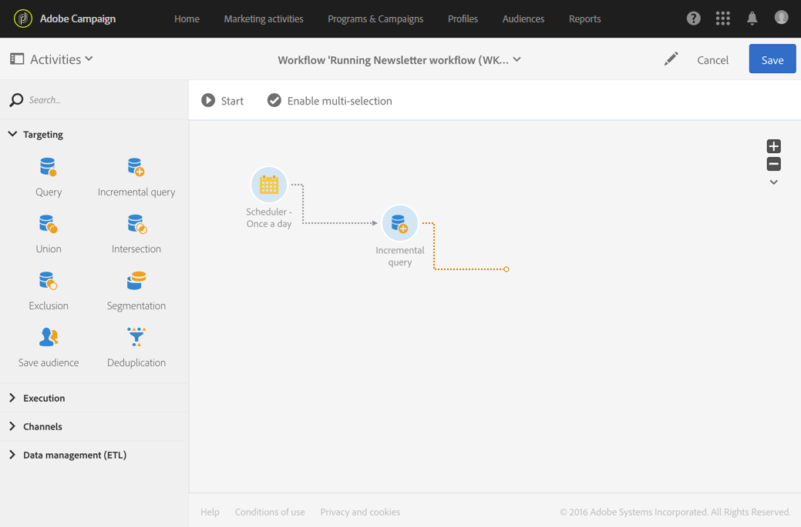

# Een workflow uitvoeren{#executing-a-workflow}

## Workflowuitvoering {#about-workflow-execution}

Een workflow wordt altijd handmatig gestart. Nochtans, zodra begonnen, kan het inactief blijven, afhankelijk van de informatie die in een activiteit van de [Planner](../../automating/using/scheduler.md) wordt gespecificeerd.

>[!CAUTION]
>
> Adobe raadt klanten aan prioriteit te geven aan workflowuitvoering en maximaal twintig gelijktijdige workflowuitvoering uit te voeren, zodat u consistent maximale prestaties voor uw hele exemplaar bereikt. Er kunnen meer dan twintig gelijktijdige workflowuitvoeringen worden gepland en deze worden standaard opeenvolgend uitgevoerd. U kunt de standaardinstellingen voor het maximale aantal gelijktijdige workflowuitvoering aanpassen door een ticket naar de klantenservice in te dienen.

Aan uitvoering gerelateerde handelingen (starten, stoppen, pauzeren, enz.) zijn **asynchrone** processen: de opdracht wordt opgeslagen en wordt van kracht zodra de server beschikbaar is om deze toe te passen.

In een werkstroom wordt het resultaat van elke activiteit over het algemeen verzonden naar de volgende activiteit via een overgang, die door een pijl wordt vertegenwoordigd.

Een overgang is niet beëindigd als deze niet aan een doelactiviteit is gekoppeld.

>[!NOTE]
>
>Een workflow met niet-afgesloten overgangen kan nog steeds worden uitgevoerd: er wordt een waarschuwingsbericht gegenereerd en de workflow wordt gepauzeerd zodra de overgang is bereikt , maar dit leidt niet tot een fout . U kunt ook een workflow starten zonder het ontwerp volledig af te ronden en u kunt het tijdens de stappen voltooien.

Nadat een activiteit is uitgevoerd, wordt boven de overgang het aantal records weergegeven dat in de overgang is verzonden.

U kunt overgangen openen om te controleren of de verzonden gegevens tijdens of na het uitvoeren van de werkstroom correct zijn. U kunt de gegevens en de gegevensstructuur weergeven.

Standaard zijn alleen de details van de laatste overgang van de workflow toegankelijk. Als u toegang wilt tot de resultaten van de voorgaande activiteiten, moet u de **[!UICONTROL Keep interim results]** optie in het **[!UICONTROL Execution]** gedeelte van de workfloweigenschappen controleren voordat u de workflow start.

>[!NOTE]
>
>Deze optie verbruikt veel geheugen en is ontworpen om een workflow te helpen construeren en ervoor te zorgen dat deze correct is geconfigureerd en gedraagt. Laat deze optie uitgeschakeld op productieexemplaren.

Wanneer een overgang is geopend, kunt u de overgang bewerken **[!UICONTROL Label]** of er een koppeling **[!UICONTROL Segment code]** aan maken. Hiervoor bewerkt u de desbetreffende velden en bevestigt u uw wijzigingen.

Met de standaard REST API&#39;s voor campagnes kunt u een workflow **starten**, **pauzeren**, **hervatten** en **stoppen** . Meer details en voorbeelden van REST-aanroepen vindt u in de [API-documentatie.](../../api/using/controlling-a-workflow.md)

## Levenscyclus {#life-cycle}

De levenscyclus van een werkstroom omvat drie hoofdstappen en elke stap is gekoppeld aan een status en een kleur:

* **Bewerken** (grijs)

   Dit is de eerste ontwerpfase van een workflow (zie [Een workflow](../../automating/using/building-a-workflow.md#creating-a-workflow)maken). De workflow wordt nog niet door de server afgehandeld en kan zonder risico worden gewijzigd.

* **Bezig** (blauw)

   Zodra de eerste ontwerpfase is voltooid, kan de workflow worden gestart en door de server worden afgehandeld.

* **Voltooid** (groen)

   Een werkstroom wordt voltooid wanneer er geen taken meer worden uitgevoerd of wanneer een operator de instantie expliciet heeft gestopt.

Als de workflow eenmaal is gestart, kan deze ook twee andere statussen hebben:

* **Waarschuwing** (geel)

   De werkstroom kon niet worden voltooid of werd gepauzeerd met de  knoppen of  knoppen.

* **Onjuist** (rood)

   Er is een fout opgetreden bij het uitvoeren van een workflow. De werkstroom is gestopt en de gebruiker moet een actie uitvoeren. Als u meer wilt weten over deze fout, gebruikt u de  knop om het workflowlogboek te openen (zie [Controle](#monitoring)).

In de lijst met marketingactiviteiten kunt u alle workflows en de bijbehorende statussen weergeven. Zie [Marketing activities](../../start/using/marketing-activities.md#about-marketing-activities)beheren voor meer informatie.

## Uitvoeropdrachten {#execution-commands}

Met de pictogrammen op de actiebalk kunt u de uitvoering van een werkstroom starten, bijhouden en wijzigen. Zie [Actiebalk](../../automating/using/workflow-interface.md#action-bar).

De beschikbare acties zijn als volgt:

**Start**

Met de  knop wordt een workflow uitgevoerd die vervolgens de status **In uitvoering** (blauw) krijgt. Als de werkstroom is gepauzeerd, wordt deze hervat, anders wordt deze gestart en worden de initiële activiteiten geactiveerd.

>[!NOTE]
>
>De aanvang is een asynchroon proces: het verzoek wordt opgeslagen en zal zo spoedig mogelijk door de werkschemauitvoeringsmotor worden verwerkt.

**Pauzeren**

De  knop pauzeert de uitvoering. De workflow neemt de status **Waarschuwing** (geel) over. Er zullen geen nieuwe activiteiten worden geactiveerd totdat de activiteiten worden hervat, maar de lopende activiteiten worden niet opgeschort.

**Stoppen**

Met de  knop wordt een workflow gestopt die wordt uitgevoerd en die vervolgens de status **Voltooid** (groen) krijgt. De bewerkingen die worden uitgevoerd, worden indien mogelijk onderbroken en de import of SQL-query&#39;s die worden uitgevoerd, worden onmiddellijk geannuleerd. U kunt de workflow niet hervatten vanaf de plaats waar deze is gestopt.

**Opnieuw starten**

De  knop bestaat uit stoppen en een workflow opnieuw starten. In de meeste gevallen kunt u de toepassing sneller opnieuw starten. Het kan ook handig zijn om opnieuw starten te automatiseren wanneer het stoppen een bepaalde hoeveelheid tijd in beslag neemt, omdat de  knop alleen beschikbaar is wanneer de stop effectief is.

Wanneer een of meerdere activiteiten in een workflow zijn geselecteerd, kunt u andere handelingen uitvoeren, zoals:

**Onmiddellijke uitvoering**

Met de  knop worden alle lopende activiteiten zo snel mogelijk gestart.

**Normale uitvoering**

Met de  knop activeert u gepauzeerde of gedeactiveerde activiteiten.

**Uitvoering opgeschort**

Met de  knop wordt de workflow bij de geselecteerde activiteit onderbroken: deze taak en alle taken die erop volgen (in dezelfde vertakking) worden niet uitgevoerd.

**Geen uitvoering**

Met de  knop worden geselecteerde activiteiten gedeactiveerd.

>[!NOTE]
>
>Met snelle handelingen hebt u toegang tot verschillende handelingen die betrekking hebben op een bepaalde activiteit en worden deze weergegeven wanneer een activiteit wordt geselecteerd.

## Toezicht {#monitoring}

Met het  pictogram opent u het workflowlogboek en het taakmenu.

De workflowgeschiedenis wordt opgeslagen voor de duur die is opgegeven in de opties voor workflowuitvoering (zie [Workfloweigenschappen](#workflow-properties)). Tijdens deze duur, worden alle berichten daarom bewaard, zelfs na een nieuw begin. Als u de berichten van een vorige uitvoering niet wilt opslaan, moet u de geschiedenis wissen door op de  knop te klikken.

Het **[!UICONTROL Log]** tabblad bevat de uitvoeringsgeschiedenis van alle activiteiten of van geselecteerde activiteiten. De uitgevoerde bewerkingen en uitvoeringsfouten worden in chronologische volgorde geïndexeerd.

Het **[!UICONTROL Tasks]** tabblad bevat de volgorde van uitvoering van de activiteiten. Klik op een taak voor meer informatie.

In deze twee lijsten:

* Klik op de teller om het totale aantal activiteiten weer te geven op basis van het toegepaste filter. De teller wordt standaard weergegeven als het aantal elementen in de lijst kleiner is dan 30.
* Met de **[!UICONTROL Configure list]** knop kunt u de weergegeven informatie kiezen, de kolomvolgorde definiëren en de lijst sorteren.
* Met filters kunt u sneller de informatie vinden die u nodig hebt. Gebruik het zoekveld om te zoeken naar een specifieke tekst in namen van workflowactiviteiten (bijvoorbeeld: &quot;query&quot;) en logbestanden.

## Foutbeheer {#error-management}

Wanneer een fout optreedt, wordt de werkstroom gepauzeerd en de activiteit die werd uitgevoerd toen de fout flitsrood werd aangetroffen.

De workflowstatus wordt rood en de fout wordt opgenomen in het logbestand.

U kunt de workflow zodanig configureren dat deze niet wordt gepauzeerd en verder wordt uitgevoerd zonder fouten. Hiervoor gaat u naar de workfloweigenschappen via de  knop en selecteert u in de **[!UICONTROL Execution]** sectie de optie **Negeren** in het veld **Bij een fout** .

In dit geval wordt de onjuiste taak afgebroken. Deze modus is vooral geschikt voor workflows die zijn ontworpen om de bewerking later opnieuw te proberen (periodieke handelingen).

>[!NOTE]
>
>U kunt deze configuratie afzonderlijk toepassen voor elke activiteit. U doet dit door een activiteit te selecteren en deze te openen met de snelle actie . Selecteer vervolgens de modus voor foutbeheer op het tabblad **Uitvoeropties** . Zie Opties voor het uitvoeren van [activiteiten](#activity-execution-options).

In de eigenschappen [van de](#workflow-properties)workflow zijn aanvullende opties beschikbaar voor foutbeheer.

Mogelijke opties zijn:

* **[!UICONTROL Supervisors]**: Hiermee kunt u de groep personen definiëren die op de hoogte moeten worden gesteld (e-mail en meldingen in de app) als de workflow een fout aantreft. Als er geen groep wordt gedefinieerd, wordt niemand op de hoogte gebracht. Meer informatie over Adobe Campagne-meldingen vindt u in [Adobe Campagne-meldingen](../../administration/using/sending-internal-notifications.md).

* **[!UICONTROL In case of error]**: kunt u opgeven welke actie moet worden uitgevoerd als de activiteit een fout aantreft. Hiervoor zijn twee opties beschikbaar:

   * **Het proces** onderbreken: de workflow wordt automatisch opgeschort. De workflowstatus is dan **fout** en de bijbehorende kleur wordt rood. Start de workflow opnieuw als het probleem is opgelost.
   * **Negeren**: de activiteit wordt niet uitgevoerd, en bijgevolg zijn er ook geen van de activiteiten die daarop volgen (in dezelfde tak). Dit kan handig zijn voor terugkerende taken. Als de tak een eerder geplaatste planner heeft, zou dit op de volgende uitvoeringsdatum moeten teweegbrengen.

* **[!UICONTROL Consecutive errors]** : Hiermee kunt u een aantal opeenvolgende fouten definiëren die zijn geautoriseerd voordat de uitvoering van de workflow automatisch wordt onderbroken.

   * Wanneer het opgegeven getal wordt opgegeven **[!UICONTROL 0]**, of zolang het opgegeven getal niet wordt bereikt, worden activiteiten die fouten tegenkomen, genegeerd. De andere werkstroomvertakkingen worden normaal uitgevoerd.

   * Als het opgegeven aantal is bereikt, wordt de gehele workflow onderbroken en wordt deze **[!UICONTROL Erroneous]** vervolgens geactiveerd. Als toezichthouders zijn gedefinieerd, worden ze automatisch via e-mail op de hoogte gesteld. Zie [Adobe Campagne-meldingen](../../administration/using/sending-internal-notifications.md).

## Workflow-eigenschappen {#workflow-properties}

Als u de uitvoeringsopties van een workflow wilt wijzigen, gebruikt u de  knop om de workfloweigenschappen te openen en selecteert u de **[!UICONTROL Execution]** sectie.

Mogelijke opties zijn:

* **[!UICONTROL Default affinity]**: in dit veld kunt u ervoor zorgen dat een workflow of een werkstroomactiviteit op een bepaalde computer wordt uitgevoerd.

* **[!UICONTROL History in days]**: geeft het aantal dagen aan waarna de historie moet worden gewist. De geschiedenis bestaat uit alle elementen die verwant zijn aan logboeken, taken, gebeurtenissen. De standaardwaarde is 30 dagen voor workflowsjablonen buiten de box.

   De geschiedenis wordt gewist door het technische werk van de Opschoonmaakbeurt van het Gegevensbestand, dat door gebrek dagelijks wordt uitgevoerd (zie [Lijst van technische werkschema](../../administration/using/technical-workflows.md).)

   >[!IMPORTANT]
   >
   >Als het **[!UICONTROL History in days]** veld leeg blijft, wordt de waarde ervan beschouwd als &quot;1&quot;, wat betekent dat de historie na 1 dag wordt gewist.

* **[!UICONTROL Save SQL queries in the log]**: Hiermee kunt u de SQL-query&#39;s uit de workflow opslaan in de logbestanden.

* ***[!UICONTROL Keep interim results]**: Schakel deze optie in als u de details van de overgangen wilt bekijken. Waarschuwing: Als u deze optie inschakelt, kan de uitvoering van de workflow aanzienlijk worden vertraagd.

* **[!UICONTROL Execute in the engine (do not use in production)]**: Hiermee kunt u de workflow lokaal uitvoeren voor het testen van ontwikkelomgevingen.

* **[!UICONTROL Severity]**: kunt u een prioriteitsniveau opgeven voor het uitvoeren van workflows in uw Adobe Campagne-instantie. Kritieke workflows worden eerst uitgevoerd.

Het **[!UICONTROL Error management]** gedeelte bevat aanvullende opties waarmee u kunt bepalen hoe workflows zich gedragen bij fouten. Deze opties worden beschreven in de sectie [Foutbeheer](#error-management) .

## Activiteiteneigenschappen {#activity-properties}

### Algemene eigenschappen van een activiteit {#general-properties-of-an-activity}

Elke activiteit heeft een **[!UICONTROL Properties]** tabblad. Op dit tabblad kunt u de algemene parameters van de activiteit wijzigen, met name het label en de id. Het configureren van dit tabblad is optioneel.

### De uitgaande overgangen van een activiteit beheren {#managing-an-activity-s-outbound-transitions}

Door gebrek, hebben bepaalde activiteiten geen uitgaande overgang. U kunt een proces toevoegen vanaf het **[!UICONTROL Transitions]** tabblad of vanaf het **[!UICONTROL Properties]** tabblad Activiteit om andere processen toe te passen op uw populatie in dezelfde workflow.

Afhankelijk van de activiteiten kunt u verschillende typen uitgaande overgangen toevoegen:

* Standaardovergang: populatie berekend door de activiteit
* Overgang zonder populatie: dit type uitgaande overgang kan worden toegevoegd om de werkstroom voort te zetten en bevat geen populatie om geen onnodige ruimte op het systeem te verbruiken.
* Afwijzingen: de bevolking werd afgewezen. Bijvoorbeeld, als de binnenkomende gegevens van de activiteit niet konden worden verwerkt omdat het onjuist of onvolledig was.
* Complementeren: populatie die overblijft na uitvoering van de activiteit. Bijvoorbeeld, als een segmentatieactiviteit wordt gevormd om slechts een percentage van de binnenkomende bevolking te bewaren.

Geef, indien van toepassing, een **[!UICONTROL Segment code]** voor de uitgaande overgang van de activiteit. Deze segmentcode zal u toestaan om te identificeren waar de ondergroepen van de doelbevolking van komen, en kan, later, voor de doeleinden van de berichtverpersoonlijking dienen.

### Opties voor het uitvoeren van activiteiten {#activity-execution-options}

In het eigenschappenscherm van de activiteit, is er een **[!UICONTROL Advanced options]** lusje dat u de de uitvoeringswijze en gedrag van de activiteit in het geval van fouten laat bepalen.

Als u deze opties wilt openen, selecteert u een activiteit in een workflow en opent u deze met de  knop op de actiebalk.

In het **[!UICONTROL Execution]** veld kunt u de actie definiëren die moet worden uitgevoerd wanneer de taak wordt gestart. Hiervoor zijn drie opties beschikbaar:

* **Normaal**: de activiteit wordt normaal uitgevoerd.
* **Inschakelen maar niet uitvoeren**: de activiteit wordt gepauzeerd , en als gevolg daarvan zijn er ook toekomstige processen die volgen . Dit kan nuttig blijken als u aanwezig wilt zijn wanneer de taak wordt begonnen.
* **Niet inschakelen**: de activiteit wordt niet uitgevoerd en bijgevolg zijn ook niet alle activiteiten die volgen (in dezelfde tak).

In het **[!UICONTROL In case of error]** veld kunt u opgeven welke actie moet worden uitgevoerd als er een fout optreedt. Hiervoor zijn twee opties beschikbaar:

* **Het proces** onderbreken: de workflow wordt automatisch opgeschort. De workflowstatus is dan **fout** en de bijbehorende kleur wordt rood. Start de workflow opnieuw als het probleem is opgelost.
* **Negeren**: de activiteit wordt niet uitgevoerd, en bijgevolg zijn er ook geen van de activiteiten die daarop volgen (in dezelfde tak). Dit kan handig zijn voor terugkerende taken. Als de tak een eerder geplaatste planner heeft, zou dit op de volgende uitvoeringsdatum moeten teweegbrengen.

In het **[!UICONTROL Behavior]** veld kunt u de procedure definiëren die moet worden gevolgd wanneer asynchrone taken worden gebruikt. Hiervoor zijn twee opties beschikbaar:

* **Meerdere geoorloofde** taken: meerdere taken kunnen tegelijkertijd worden uitgevoerd, zelfs als de eerste niet is voltooid.
* **De huidige taak heeft prioriteit**: zodra een taak is uitgevoerd , krijgt deze prioriteit . Zolang één taak nog bezig is, zal geen andere taak worden uitgevoerd.

In het **[!UICONTROL Max. execution duration]** veld kunt u een duur opgeven, zoals &#39;30&#39; of &#39;1 uur&#39;. Als de activiteit niet wordt gebeëindigd nadat de gespecificeerde duur is verstreken, wordt een alarm teweeggebracht. Dit heeft geen invloed op de werking van de workflow.

In het **[!UICONTROL Affinity]** veld kunt u een workflow of een werkstroomactiviteit op een bepaalde computer uitvoeren. Hiervoor moet u een of meer affiniteiten opgeven voor de workflow of activiteit in kwestie.

In het **[!UICONTROL Time zone]** veld kunt u de tijdzone van de activiteit selecteren. Met Adobe Campaign kunt u de tijdverschillen tussen meerdere landen op hetzelfde moment beheren. De toegepaste instelling wordt geconfigureerd wanneer de instantie wordt gemaakt.

>[!NOTE]
>
>Als er standaard geen tijdzone is geselecteerd, wordt voor de activiteit de tijdzone gebruikt die is gedefinieerd in de workfloweigenschappen.

Het veld **Opmerking** is een gratis veld waarin u een notitie kunt toevoegen.
