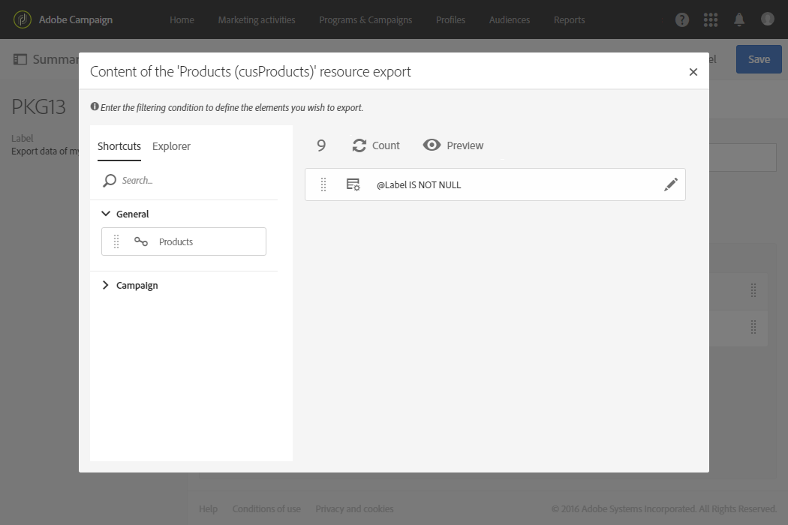
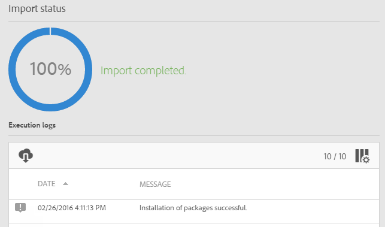

# Aangepaste bronnen exporteren/importeren {#exporting-importing-custom-resources}

In deze zelfstudie wordt uitgelegd hoe u een pakket met aangepaste bronnen vanuit een ontwikkelomgeving kunt exporteren en importeren in een productieomgeving.

Dit voorbeeld is gericht op functionele beheerders die zijn gekoppeld aan Adobe Campaign.

De voorwaarden zijn:

* **Een of meer aangepaste bronnen** die beschikbaar en gepubliceerd zijn.

   Bovendien moet u een unieke sleutel voor deze middelen hebben bepaald omdat de automatische primaire sleutels niet in de pakketten worden uitgevoerd. De bron kan daarom een primaire sleutel en een extra unieke sleutel hebben om de unieke gegevens te garanderen.
* **De benodigde rechten** om een pakket te maken en te exporteren.

Aanvullende bronnen:

* [Pakketten beheren](../../automating/using/managing-packages.md)
* [Pakketten implementeren: Exploitatiebeginsel](../../developing/using/data-model-concepts.md)
* [Een bron toevoegen of uitbreiden](../../developing/using/key-steps-to-add-a-resource.md)

## De structuur exporteren {#exporting-the-structure}

In deze sectie gaan we een eerste pakket exporteren dat de fysieke structuur van de gegevens van de aangepaste bron aangeeft.

Dit voorbeeld heeft twee aangepaste bronnen: **Producten** en **Orders**.

1. Ga naar het menu **[!UICONTROL Administration]** / **[!UICONTROL Deployment]** / **[!UICONTROL Package exports]** .

   We gaan een nieuw pakket maken om het **[!UICONTROL Custom resource (cusResource)]** gefilterde bestand te exporteren met de twee aangepaste bronnen, ‘Producten’ en ‘Bestellingen’.

1. Klik op de **[!UICONTROL Package exports]** pagina **[!UICONTROL Create]** om een nieuw pakket te maken.
1. Voltooi het label en klik op **[!UICONTROL Create element]**.

   

1. Zoek naar en selecteer **[!UICONTROL Custom resource (cusResource)]**.

   

1. Vorm de details van het **[!UICONTROL Custom resource]** door de twee middelen, de **Producten** en de **Orden**, in de het filtreren voorwaarden te selecteren.

   Zorg ervoor dat u niet vergeet om de logische exploitant te veranderen. De waarde moet aan **OR** worden geplaatst zodat de structuur van het productmiddel en het ordermiddel in het pakket worden geïntegreerd.

   

1. Bevestig de pakketdefinitie en sla deze op.

U kunt nu klikken **[!UICONTROL Start export]**.

Het gegenereerde pakket is beschikbaar in de map Downloads. De naam van het ZIP-bestand wordt willekeurig gegenereerd. U kunt de naam ervan wijzigen.

## De gegevens exporteren {#exporting-the-data}

Met deze tweede export kunnen we de gegevens exporteren uit de aangepaste bronnen voor **Producten** en **Bestellingen** .

Op basis van hetzelfde type export als de structuurexport gaat u een tweede pakket maken dat de gegevens bevat.

1. Klik op de **[!UICONTROL Package exports]** pagina **[!UICONTROL Create]** om een nieuw pakket te maken.
1. Voltooi het label met **[!UICONTROL Export data of my resources]** en klik vervolgens **[!UICONTROL Create element]** op het **[!UICONTROL Export content]** tabblad.
1. Zoek naar en selecteer het middel van **Producten** .

   

1. Configureer een geavanceerde **filtervoorwaarde** met **@Label IS NIET NULL**.

   

1. Controleer het aantal.

   

1. Herhaal dezelfde bewerking voor de aangepaste bron **Orders** .

   

1. Bevestig de pakketdefinitie en sla deze op.

U kunt nu klikken **[!UICONTROL Start export]**.

Het gegenereerde pakket is beschikbaar in de map Downloads. De naam van het ZIP-bestand wordt willekeurig gegenereerd. U kunt de naam ervan wijzigen.

## De structuur importeren {#importing-the-structure}

### Het pakket importeren {#importing-the-structure-package}

1. Maak verbinding met de **doelinstantie** waarop u de nieuwe pakketten wilt importeren.
1. Ga naar het menu **[!UICONTROL Administration]** / **[!UICONTROL Deployment]** / **[!UICONTROL Package imports]** om een nieuw pakket te maken waarmee u het bestand uit de eerste exportbewerking kunt importeren.
1. Sleep het **structuurbestand** naar de zone die voor dit doel is opgegeven. De toegestane indelingen zijn ZIP of XML.

   

1. Wijzig het label, bijvoorbeeld Structuur **** importeren en klik op **[!UICONTROL Save]**.
1. Klik op **[!UICONTROL Start import]**.

   

### Publiceren {#publish-structure}

1. Ga naar het menu **[!UICONTROL Administration]** / **[!UICONTROL Development]** / **[!UICONTROL Publication]** .
1. Klik **[!UICONTROL Prepare publication]** dan **[!UICONTROL Publish]** om de instantie met de gegevens van de nieuwe douanemiddelen bij te werken.
1. De menu-items die overeenkomen met het geïnstalleerde pakket worden in het **[!UICONTROL Client data]** menu ingevoegd.

   

## De gegevens importeren {#importing-the-data}

In deze sectie gaan we de gegevens **** importeren die zijn gekoppeld aan het pakket dat in de vorige stap op de instantie is geïnstalleerd.

Op dezelfde manier als bij de vorige stap wordt deze in twee delen opgesplitst: het pakket importeren en publiceren.

### Het pakket importeren {#importing-the-data-package}

1. Ga naar het menu **[!UICONTROL Administration]** / **[!UICONTROL Deployment]** / **[!UICONTROL Package imports]** om een nieuw pakket te maken waarmee het bestand met de gegevens wordt geïmporteerd.
1. Sleep het gegevensbestand en zet het neer in de streek die voor dit doel wordt verstrekt. De toegestane indelingen zijn ZIP of XML.
1. Wijzig het label, bijvoorbeeld &#39;Gegevens importeren&#39;, en klik vervolgens **[!UICONTROL Save]**.
1. Klik op **[!UICONTROL Start import]**.

   

### Publiceren {#publish-data}

1. Ga naar het menu **[!UICONTROL Administration]** / **[!UICONTROL Development]** / **[!UICONTROL Publication]** .
1. Klik **[!UICONTROL Prepare publication]** dan **[!UICONTROL Publish]** om de instantie met de gegevens van de douanemiddelen bij te werken.
