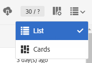

# Lijsten exporteren{#exporting-lists}

Met Adobe Campaign kunt u uw lijsten rechtstreeks in een bestand exporteren voor toekomstig gebruik. Wanneer u een lijst in een bestand exporteert, wordt een logbestandvermelding in het **[!UICONTROL Export audits]** menu gegenereerd. Raadpleeg voor meer informatie over exportaudits de sectie [Audit export](../../administration/using/auditing-export-logs.md) .

Met de optie voor de exportlijst kunt u standaard maximaal 100.000 regels exporteren, gedefinieerd door de optie **Nms_ExportListLimit** . Deze optie kan door de functionele beheerder, onder **[!UICONTROL Administration]** > **[!UICONTROL Application settings]** > **[!UICONTROL Options]** menu worden beheerd.

De lijst van de uitvoer is beschikbaar in alle schermen die een de wijzemening van de **Lijst** , voor gebruikers met de **[!UICONTROL EXPORT (export)]** rol hebben.

1. Ga naar het gekozen **lijstscherm** . Bijvoorbeeld het scherm met het testprofiel ( **[!UICONTROL Profiles & audiences]** > **[!UICONTROL Test profiles]** ).
1. Controleer of het scherm in de **lijstmodus** staat.

   

1. Organiseer de kolommen in de lijst in de volgorde waarin u ze wilt exporteren met de **[!UICONTROL Configure list]** knop in de rechterbovenhoek. Naast gevormde kolommen, zal de primaire sleutel van het middel ook worden uitgevoerd.
1. U kunt desgewenst een filter toepassen. Klik hiertoe op de knop in de linkerbovenhoek om het zoekvenster weer te geven.

   Als u een export uitvoert vanuit een lijst die verschillende bronnen bevat, moet u uw filters toepassen zodat er slechts één type bron in de lijst wordt weergegeven.

1. U kunt desgewenst de gekozen kolom(men) sorteren.
1. Selecteer de knop Exporteren .

   Er verschijnt een pop-up ter bevestiging van het exporteren. Nadat u het exporteren hebt bevestigd, wordt het bestand automatisch naar de computer gedownload.

Het bestand wordt gegenereerd in CSV-indeling met de extensie .TXT. Deze naam is afhankelijk van de geëxporteerde bron en de exportdatum. Bijvoorbeeld: de naam profileBase_20150426_120253.txt zou worden toegepast op een profieluitvoer die op 26 april 2015 om 12:02:53 wordt uitgevoerd. Het is gecodeerd in UTF-8-indeling.

De numerieke waarden en datums houden rekening met de lokale tijd (landinstelling) van de gebruiker die het exporteren uitvoert. Bijvoorbeeld: DD-MM-JJJJ of DD-MM-JJJJ.

Als u een exportbewerking wilt uitvoeren die groter is dan deze, moet u een specifieke workflow maken. Raadpleeg de sectie Bestand [](../../automating/using/extract-file.md) uitpakken.

**Voorbeeld**

In het volgende voorbeeld wordt een export uitgevoerd uit de onderstaande profiellijst:

* Getoonde kolommen (in volgorde): Achternaam, Voornaam, Geboortedatum, E-mailadres.
* Namen worden in alfabetische volgorde gesorteerd.


Het gegenereerde bestand wordt als volgt weergegeven (voor de eerste tien records):

```
Last name;First name;Birth date;Email;Zip code
Abalo;Patrick;11/11/1941 02:00:00;patrick.a@testmail.com;29200
Abasq;Joel;21/08/1977 02:00:00;abasq.joel@testmail.com;92160
Abernot;John;12/07/1963 01:00:00;john.abernot@testmail.com;78510
Abiven;Christian;16/03/1975 01:00:00;chris.a@mailtest.com;35000
Abouvier;Peter;02/07/1975 01:00:00;pabouvier@mailtest.com;94560
Accardi;Mike;22/06/1948 01:00:00;mike.accardi@mail.com;76400
Accremont;Frank;27/04/1947 01:00:00;accr.frank@mailtest.com;13500
Adam;Daniel;17/09/1953 01:00:00;danieladam@mail.com;17000
Adama;Pascal;22/01/1990 01:00:00;adapascal@mailtest.com;75012
Adama;Henry;22/09/1992 02:00:00;henry.adama@mail.com;64120
```

**Verwante onderwerpen:**

* [Rollen](../../administration/using/list-of-roles.md)
* [Lijsten aanpassen](../../start/using/customizing-lists.md)
* [Lijstvideo configureren](https://docs.adobe.com/content/help/en/campaign-learn/campaign-standard-tutorials/getting-started/configure-a-list.html)
