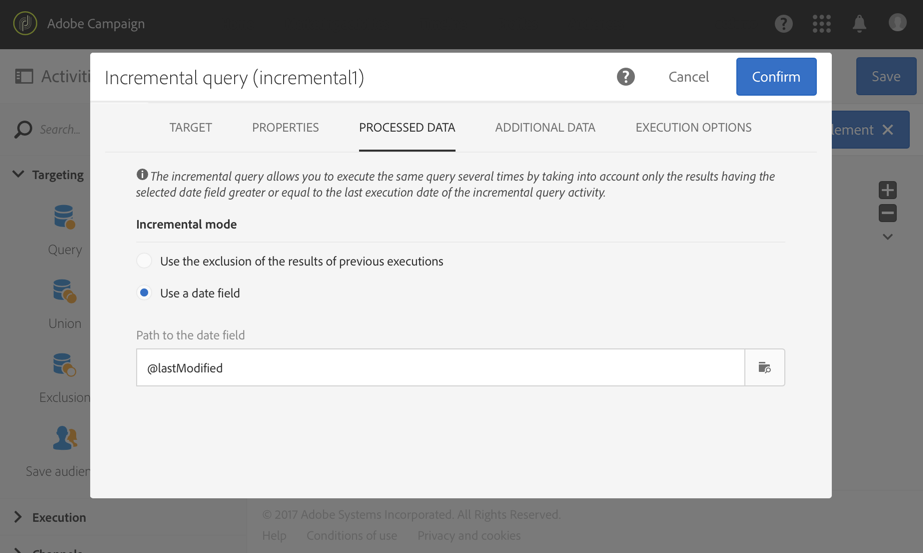

# Logboeken exporteren{#exporting-logs}

Loggegevens, of ze nu betrekking hebben op leveringen of op abonnementen, kunnen via een eenvoudige workflow worden geëxporteerd. Hiermee kunt u de resultaten van uw campagnes analyseren in uw eigen rapportage- of BI-programma.

>[!CAUTION]
>
>Alleen functionele [beheerders](../../administration/using/users-management.md#functional-administrators)met **[!UICONTROL Administration]** rol en toegang tot **alle** eenheden hebben toegang tot verzendende logboeken, berichtlogbestanden, trackinglogboeken, uitsluitings- of abonnementlogbestanden. Een gebruiker zonder beheerdersrechten kan zich richten op deze logbestanden, maar begint met een gekoppelde tabel (profielen, levering).

Door een bestand te gebruiken **[!UICONTROL Incremental query]** dat alleen nieuwe logbestanden ophaalt wanneer de workflow wordt uitgevoerd en een eenvoudige **[!UICONTROL Extract file]** activiteit om de uitvoerkolommen te definiëren, kunt u een bestand ophalen met de indeling en alle gegevens die u nodig hebt. Dan gebruik een **[!UICONTROL Transfer file]** activiteit om het definitieve dossier terug te winnen. Elke werkstroomuitvoering wordt gepland door een **[!UICONTROL Scheduler]**.

De bewerking voor het exporteren van logbestanden kan worden uitgevoerd door standaardgebruikers. Particuliere middelen zoals: de uitzendingen, het volgen logboeken, de logboeken van het uitsluitingslogboeken van het abonnement en de geschiedenis van het abonnement logboeken op **Profielen** kunnen slechts door functionele beheerder worden beheerd.

1. Maak een nieuwe workflow zoals in [deze sectie](../../automating/using/building-a-workflow.md#creating-a-workflow)wordt beschreven.
1. Voeg een **[!UICONTROL Scheduler]** activiteit toe en plaats het op uw behoeften. Hieronder ziet u een voorbeeld van een maandelijkse uitvoering.

   

1. Voeg een **[!UICONTROL Incremental query]** activiteit toe en vorm het zodat het de logboeken selecteert u wenst. Bijvoorbeeld, om alle nieuwe of bijgewerkte uitzendingen (de logboeken van de profiellevering te selecteren):

   * Wijzig op het **[!UICONTROL Properties]** tabblad de doelbron in **leveringslogboeken** (wideLogRcp).

      

   * In het **[!UICONTROL Target]** lusje, plaats een voorwaarde om alle leveringslogboeken terug te winnen die aan leveringen beantwoorden die in 2016 of daarna worden verzonden. For more information, refer to the [Editing queries](../../automating/using/editing-queries.md#creating-queries) section.

      

   * Selecteer op het **[!UICONTROL Processed data]** tabblad het veld **[!UICONTROL Use a date field]** Laatst gewijzigd **en kies het veld** Laatst gewijzigd. Bij de volgende uitvoeringen van de workflow worden alleen logboeken opgehaald die na de laatste uitvoering zijn gewijzigd of gemaakt.

      

      Na de eerste uitvoering van de workflow ziet u op dit tabblad de laatste uitvoeringsdatum die wordt gebruikt voor de volgende uitvoering. Deze wordt automatisch steeds bijgewerkt wanneer de workflow wordt uitgevoerd. U kunt deze waarde ook overschrijven door handmatig een nieuwe waarde in te voeren die beter aan uw behoeften voldoet.

1. Voeg een **[!UICONTROL Extract file]** activiteit toe die de gevraagde gegevens in een dossier zal uitvoeren:

   * Geef op het **[!UICONTROL Extraction]** tabblad de naam van het bestand op.

      Als u de **[!UICONTROL Add date and time to the file name]** optie selecteert, wordt deze naam automatisch aangevuld met de datum van het exporteren om ervoor te zorgen dat alle geëxtraheerde bestanden uniek zijn. Selecteer de kolommen die u in het bestand wilt exporteren. U kunt hier gegevens selecteren die afkomstig zijn uit gerelateerde bronnen, zoals leverings- of profielgegevens.

      >[!NOTE]
      >
      >Als u een unieke id voor elk logboek wilt exporteren, selecteert u het **[!UICONTROL Delivery log ID]** element.

      U kunt een sortering toepassen om het uiteindelijke bestand te ordenen. Bijvoorbeeld op de logboekdatum, zoals aangetoond in het voorbeeld hieronder.

      

   * Definieer op het **[!UICONTROL File structure]** tabblad de indeling van het uitvoerbestand zodat dit aan uw wensen voldoet.

      Schakel de optie **[!UICONTROL Export labels instead of internal values of enumerations]** in als u opsommingswaarden exporteert. Hiermee kunt u kortere labels ophalen die gemakkelijker zijn te begrijpen dan id&#39;s.

1. Voeg een **[!UICONTROL Transfer file]** activiteit toe en vorm het om het onlangs gecreëerde dossier van de server van Adobe Campaign naar een andere plaats over te brengen waar u tot het kunt toegang hebben, zoals een server SFTP.

   * Selecteer op het **[!UICONTROL General]** tabblad **[!UICONTROL File upload]** de optie die u wilt gebruiken om het bestand van Adobe Campaign naar een andere server te verzenden.
   * Geef op het **[!UICONTROL Protocol]** tabblad de overdrachtsparameters op en selecteer de [externe account](../../administration/using/external-accounts.md#creating-an-external-account) die u wilt gebruiken.

1. Voeg een **[!UICONTROL End]** activiteit toe om ervoor te zorgen het behoorlijk beëindigt en uw werkschema bewaart.

   

U kunt nu de workflow uitvoeren en het uitvoerbestand op uw externe server ophalen.

**Verwant onderwerp:**

[Workflows](../../automating/using/get-started-workflows.md)
