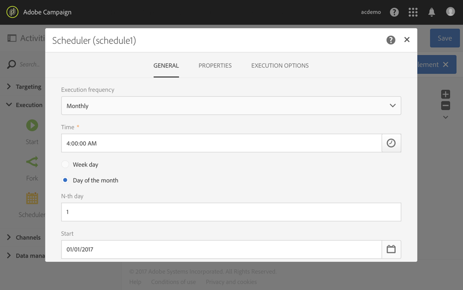

# Logboeken exporteren{#exporting-logs}

Loggegevens, of ze nu betrekking hebben op leveringen of op abonnementen, kunnen via een eenvoudige workflow worden geëxporteerd. Hiermee kunt u de resultaten van uw campagnes analyseren in uw eigen rapportage- of BI-programma.

>[!CAUTION]
>
>Alleen functioneel [beheerders](../../administration/using/users-management.md#functional-administrators), met **[!UICONTROL Administration]** rol en toegang tot **Alles** eenheden hebben toegang tot verzendende logboeken, berichtenlogboeken, trackinglogboeken, uitsluitings- of abonnementlogboeken. Een gebruiker zonder beheerdersrechten kan zich richten op deze logbestanden, maar begint met een gekoppelde tabel (profielen, levering).

Door een **[!UICONTROL Incremental query]** dat slechts nieuwe logboeken terugwint telkens als het werkschema wordt uitgevoerd en eenvoudig **[!UICONTROL Extract file]** Als u de uitvoerkolommen wilt definiëren, kunt u een bestand ophalen met de indeling en alle gegevens die u nodig hebt. Gebruik vervolgens een **[!UICONTROL Transfer file]** activiteit om het definitieve dossier terug te winnen. Elke werkstroomuitvoering wordt gepland door een **[!UICONTROL Scheduler]**.

De bewerking voor het exporteren van logbestanden kan worden uitgevoerd door standaardgebruikers. Persoonlijke bronnen, zoals de logbestanden voor uitzending, bijhouden van logbestanden, abonnementenlogbestanden en abonnementshistorie **Profielen** kan alleen door de functionele beheerder worden beheerd.

1. Een nieuwe workflow maken zoals beschreven in [deze sectie](../../automating/using/building-a-workflow.md#creating-a-workflow).
1. Voeg een **[!UICONTROL Scheduler]** en deze op uw behoeften instellen. Hieronder ziet u een voorbeeld van een maandelijkse uitvoering.

   

1. Een **[!UICONTROL Incremental query]** activiteit en vorm het zodat het de logboeken selecteert u wenst. Bijvoorbeeld, om alle nieuwe of bijgewerkte uitzendingen (de logboeken van de profiellevering te selecteren):

   * In de **[!UICONTROL Properties]** tab, wijzig de doelbron in **Leveringslogboeken** (wideLogRcp).

     

   * In de **[!UICONTROL Target]** , stelt u een voorwaarde in om alle leveringslogs op te halen die overeenkomen met leveringen die in 2016 of daarna zijn verzonden. Raadpleeg voor meer informatie de [Bewerkquery&#39;s](../../automating/using/editing-queries.md#creating-queries) sectie.

     

   * In de **[!UICONTROL Processed data]** tab, selecteert u **[!UICONTROL Use a date field]** en kiest u **lastModified** veld. Bij de volgende uitvoeringen van de workflow worden alleen logboeken opgehaald die na de laatste uitvoering zijn gewijzigd of gemaakt.

     

     Na de eerste uitvoering van de workflow ziet u op dit tabblad de laatste uitvoeringsdatum die wordt gebruikt voor de volgende uitvoering. Deze wordt automatisch steeds bijgewerkt wanneer de workflow wordt uitgevoerd. U kunt deze waarde ook overschrijven door handmatig een nieuwe waarde in te voeren die beter aan uw behoeften voldoet.

1. Een **[!UICONTROL Extract file]** activiteit die de gevraagde gegevens in een dossier zal uitvoeren:

   * In de **[!UICONTROL Extraction]** geeft u de naam van het bestand op.

     Als u **[!UICONTROL Add date and time to the file name]** Deze naam wordt automatisch aangevuld met de datum van het exporteren om ervoor te zorgen dat alle geëxtraheerde bestanden uniek zijn. Selecteer de kolommen die u in het bestand wilt exporteren. U kunt hier gegevens selecteren die afkomstig zijn uit gerelateerde bronnen, zoals leverings- of profielgegevens.

     >[!NOTE]
     >
     >Als u een unieke id voor elk logboek wilt exporteren, selecteert u de optie **[!UICONTROL Delivery log ID]** element.

     U kunt een sortering toepassen om het uiteindelijke bestand te ordenen. Bijvoorbeeld op de logboekdatum, zoals aangetoond in het voorbeeld hieronder.

     

   * In de **[!UICONTROL File structure]** , definieert u de indeling van het uitvoerbestand zodat dit aan uw wensen voldoet.

     Schakel de optie **[!UICONTROL Export labels instead of internal values of enumerations]** in als u opsommingswaarden exporteert. Hiermee kunt u kortere labels ophalen die gemakkelijker zijn te begrijpen dan id&#39;s.

1. Voeg een **[!UICONTROL Transfer file]** en configureer het bestand om het nieuwe bestand van de Adobe Campaign-server over te brengen naar een andere locatie waar u het kunt openen, zoals een SFTP-server.

   * In de **[!UICONTROL General]** tab, selecteert u **[!UICONTROL File upload]** omdat het bestand van Adobe Campaign naar een andere server wordt verzonden.
   * In de **[!UICONTROL Protocol]** , geeft u de overdrachtsparameters op en selecteert u de optie [externe rekening](../../administration/using/external-accounts.md#creating-an-external-account) te gebruiken.

1. Een **[!UICONTROL End]** om ervoor te zorgen dat het correct eindigt en uw werkschema bewaart.

   

U kunt nu de workflow uitvoeren en het uitvoerbestand op uw externe server ophalen.

**Verwant onderwerp:**

[Workflows](../../automating/using/get-started-workflows.md)
