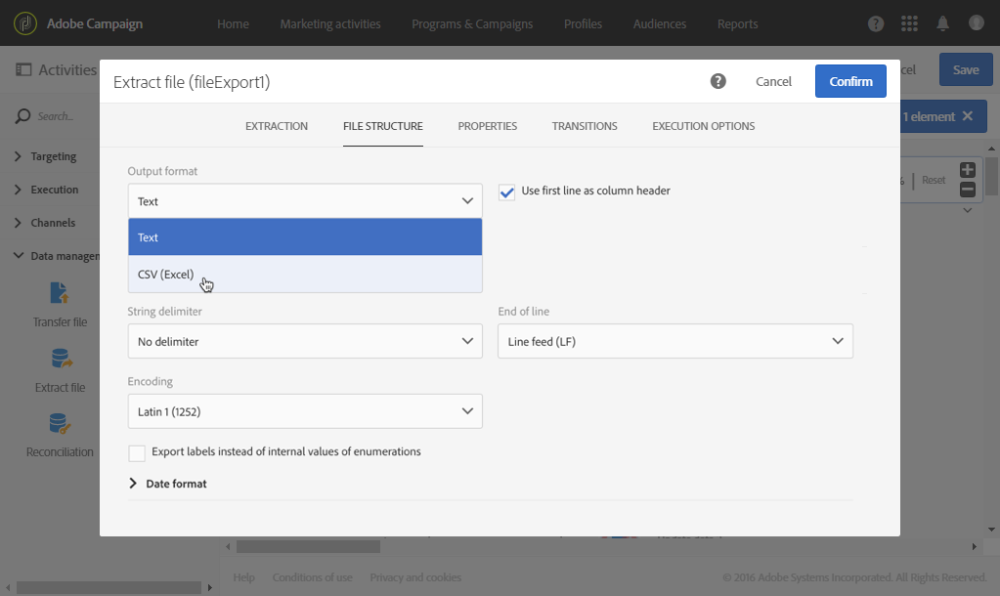

# Profielen exporteren in een extern bestand {#exporting-profiles-external-file}

In het volgende voorbeeld ziet u hoe u een **[!UICONTROL Extract file]** activiteit na een **[!UICONTROL Query]** activiteit configureert.

Het doel van deze workflow is een lijst met profielen te exporteren in de vorm van een extern bestand, zodat de gegevens buiten Adobe Campaign kunnen worden gebruikt.

1. Sleep een [activiteit van het Extraheren dossier](../../automating/using/extract-file.md) in uw werkschema en plaats het na de activiteit van de [Vraag](../../automating/using/query.md) .

   In dit voorbeeld wordt de query uitgevoerd op alle profielen in de leeftijd van 18 tot en met 30 jaar.

1. Open de **[!UICONTROL Extract file]** activiteit om deze te bewerken.
1. Geef het uitvoerbestand een naam.
1. Uitvoerkolommen toevoegen.

   In dit voorbeeld worden het e-mailbericht, de leeftijd, de geboortedatum, de voornaam en achternaam van de profielen toegevoegd als uitvoerkolommen.

   

1. Klik op het **[!UICONTROL File structure]** tabblad om te definiëren:

   * CSV-uitvoerindeling

      

   * Datumnotatie

      

1. Bevestig je activiteit.
1. Sleep een [bestandsactiviteit](../../automating/using/transfer-file.md) overbrengen naar een externe account **[!UICONTROL Extract file]** na deactiviteit om het uittrekbestand te herstellen.
1. Open de activiteit en kies de **[!UICONTROL File upload]** actie.

   

1. Selecteer de externe account en voer het pad van de map op de server in.

   

1. Bevestig uw activiteit en sla uw werkschema op.
1. Start de workflow.

   Wanneer de workflow correct is uitgevoerd, is het uitgepakte bestand beschikbaar op de externe account.
