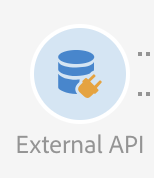
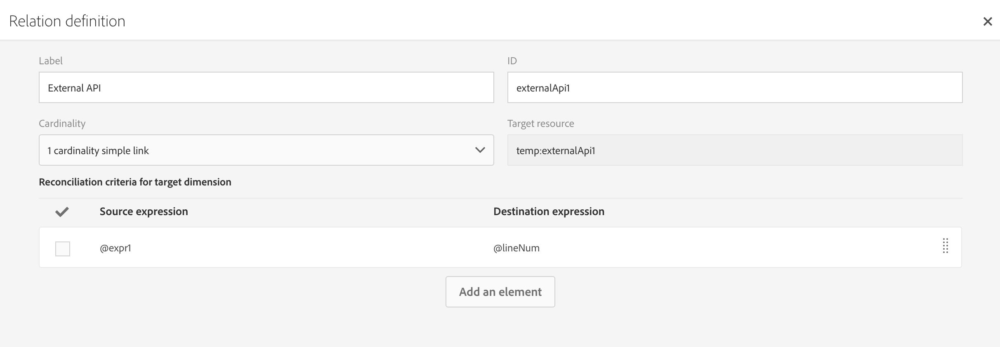

# Externe API {#external-api}

## Beschrijving {#description}

De activiteit **[!UICONTROL External API]** brengt data vanaf een **extern systeem** in de workflow via een **HTTP API**-aanroep.

De eindpunten van het externe systeem kunnen openbare API-eindpunten, klantenbeheersystemen of serverloze applicatie-instanties (bijvoorbeeld [Adobe I/O Runtime](https://www.adobe.io/apis/experienceplatform/runtime.html)) zijn, om maar een paar categorieën te noemen.

>[!NOTE]
>
>Om veiligheidsredenen wordt het gebruik van JSSP&#39;s niet ondersteund in Campaign Standard. Als u code moet uitvoeren, kunt u een Adobe I/O Runtime-instantie aanroepen via de activiteit Externe API.

De belangrijkste kenmerken van deze activiteit zijn:

* Mogelijkheid om data in een JSON-indeling door te geven aan een REST API-eindpunt van derden
* Mogelijkheid om een JSON-antwoord terug te krijgen, het toe te wijzen aan uitvoertabellen en stroomafwaarts door te geven aan andere workflowactiviteiten.
* Het beheer van mislukkingen met een specifieke uitgaande overgang

### Berichten over compatibiliteit met oudere versies {#from-beta-to-ga}

Met de release Campaign Standard 20.4 zijn de groottelimieten voor http-responsdata en de responstime-outbeveiligingen verlaagd in overeenstemming met best practices (zie de sectie Beperkingen en beveiligingen). Deze beveiligingswijzigingen gelden niet voor bestaande Externe API-activiteiten; daarom wordt u aangeraden bestaande Externe API-activiteiten in alle workflows te vervangen door nieuwe versies.

Als u een upgrade uitvoert van Campaign Standard 20.2 (of eerder), moet u er rekening mee houden dat de Externe API-functionaliteit in de release Campaign Standard 20.3 is verplaatst van bèta naar algemene beschikbaarheid.

Als u bèta-activiteiten voor Externe API gebruikte, dient u deze dus te vervangen door GA-activiteiten voor Externe API in alle workflows.  Workflows die de bètaversie van een Externe API gebruiken, werken niet vanaf de release Campaign Standard 20.3.

Wanneer u activiteiten voor Externe API vervangt, voegt u de nieuwe activiteit Externe API toe aan de workflow, kopieert u handmatig de configuratiedetails en verwijdert u vervolgens de oude activiteit.

>[!NOTE]
>
>U kunt niet over activiteitspecifieke koptekstwaarden heen kopiëren omdat deze binnen de activiteit gemaskeerd zijn.

Vervolgens configureert u opnieuw andere activiteiten in de workflow die verwijzen naar en/of gebruik maken van data uit de bèta-activiteit voor Externe API om in plaats daarvan te verwijzen naar en/of gebruik te maken van data uit de nieuwe activiteit Externe API. Voorbeelden van activiteiten: e-maillevering (personalisatievelden), verrijkingsactiviteit, enz.

### Beperkingen en beveiligingen {#guardrails}

Op deze activiteit zijn de volgende beveiligingen van toepassing:

* Groottelimiet van 5 MB voor http-responsdata (opmerking: dit is een wijziging ten opzichte van de limiet van 50 MB in de vorige release)
* De time-out van de aanvraag is 1 minuut (opmerking: dit is een wijziging ten opzichte van de time-out van 10 minuten in de vorige release)
* HTTP-omleidingen zijn niet toegestaan
* Niet-HTTPS-URL&#39;s worden geweigerd
* Aanvraagheader ‘Accept: application/json’ en antwoordheader ‘Content-Type: application/json’ zijn toegestaan

Er zijn specifieke beveiligingen aangebracht:

* **JSON Max Depth**: Beperk de maximumdiepte van een aangepaste geneste JSON die kan worden verwerkt tot 10 niveaus.
* **JSON Max Key Length**: Beperk de maximumlengte van de gegenereerde interne sleutel tot 255. Deze sleutel is gekoppeld aan de kolom-id.
* **JSON Max Duplicate Keys Allowed**: Beperk het maximumaantal dubbele JSON-eigenschapsnamen, die als kolom-id worden gebruikt, tot 150.

>[!CAUTION]
>
>Houd er rekening mee dat de activiteit van de Externe API is bedoeld voor het ophalen van data voor de hele campagne (de nieuwste aanbiedingen, meest recente scores, enz.), niet voor het ophalen van specifieke informatie voor elk profiel, omdat dit kan leiden tot de overdracht van grote hoeveelheden data. Als het gebruiksscenario dit vereist, wordt aangeraden om de activiteit [Bestand overdragen](../../automating/using/transfer-file.md) te gebruiken.

## Configuratie {#configuration}

Sleep een activiteit **[!UICONTROL External API]** en zet deze neer in uw workflow en open de activiteit om de configuratie te beginnen.

### Inbound Mapping

Inbound mapping is een tijdelijke tabel die door een vorige binnenkomende activiteit wordt gegenereerd en die als JSON in de gebruikersinterface wordt weergegeven en verzonden.
Op basis van deze tijdelijke tabel kan de gebruiker wijzigingen in binnenkomende data aanbrengen.

Met de vervolgkeuzelijst **Inbound resource** kunt u de activiteit Query selecteren waardoor de tijdelijke tabel zal worden gemaakt.

Met het selectievakje **Add count parameter** wordt een telwaarde toegevoegd voor elke rij die uit de tijdelijke tabel komt. Merk op dat dit selectievakje alleen beschikbaar is als de binnenkomende activiteit een tijdelijke tabel genereert.

Met de sectie **Inbound Columns** kan de gebruiker willekeurige velden uit de tabel met binnenkomende overgangen toevoegen. De geselecteerde kolommen fungeren als de sleutels in het dataobject. Het dataobject in de JSON wordt een matrixlijst met data voor geselecteerde kolommen uit elke rij van de tabel met binnenkomende overgangen.

In het tekstvak **Customize parameter** kunt u een geldige JSON toevoegen met aanvullende data die nodig zijn voor de externe API. Deze aanvullende data worden toegevoegd aan het parameterobject in de gegenereerde JSON.

### Outbound Mapping

Op dit tabblad kunt u de **JSON-voorbeeldstructuur** definiëren die door de API-aanroep wordt geretourneerd.

De JSON-parser is ontworpen voor standaard typen JSON-structuurpatronen, met enkele uitzonderingen. Een voorbeeld van een standaard patroon is:`{“data”:[{“key”:“value”}, {“key”:“value”},...]}`

De JSON-voorbeelddefinitie moet de **volgende kenmerken** hebben:

* **Matrixelementen** moeten eigenschappen op het eerste niveau bevatten (diepere niveaus worden niet ondersteund).
   **Eigenschapsnamen** worden uiteindelijk de kolomnamen voor het uitvoerschema van de tijdelijke uitvoertabel.
* **JSON-elementen** die moeten worden vastgelegd, moeten zich binnen de eerste 10 nestniveaus van het JSON-antwoord bevinden.
* **De kolomnaamdefinitie** is gebaseerd op het eerste element van de ‘data’-matrix.
De definitie van kolommen (toevoegen/verwijderen) en de typewaarde van de eigenschap kunnen in het tabblad **Column definition** worden bewerkt.

Gedrag van het selectievakje **Flatten**:

Het selectievakje Flatten (standaard niet ingeschakeld) wordt opgegeven om aan te geven of de JSON al dan niet moet worden afgevlakt tot een sleutel-/waardetoewijzing.

* Wanneer het **selectievakje is uitgeschakeld** (niet geselecteerd), wordt de voorbeeld-JSON geparseerd om naar een matrixobject te zoeken. De gebruiker moet een bijgesneden versie van de JSON-voorbeeldindeling voor API-antwoorden opgeven, zodat Adobe Campaign precies kan bepalen in welke matrix de gebruiker geïnteresseerd is. Tijdens het ontwerpen van de workflow wordt het pad naar het geneste matrixobject bepaald en opgenomen, zodat het tijdens de uitvoering kan worden gebruikt om toegang te krijgen tot het matrixobject van de JSON-antwoordtekst dat van de API-aanroep is ontvangen.

* Wanneer het **selectievakje is ingeschakeld** (geselecteerd), wordt de voorbeeld-JSON afgevlakt en worden alle eigenschappen die in de opgegeven voorbeeld-JSON zijn gespecificeerd, gebruikt om kolommen van de tijdelijke uitvoertabel te maken en worden deze weergegeven op het tabblad Column definition. Als er een matrixobject in de voorbeeld-JSON voorkomt, worden alle elementen van die matrixobjecten ook afgevlakt.

Als de **parsering wordt gevalideerd**, verschijnt er een bericht waarin u wordt gevraagd de datatoewijzing op het tabblad Column definition aan te passen. In andere gevallen wordt een foutbericht weergegeven.

### Execution

Op dit tabblad kunt u het eindpunt van de verbinding definiëren. Met het veld **[!UICONTROL URL]** kunt u het **HTTPS-eindpunt** definiëren waarmee data naar ACS worden verzonden.

Er zijn twee soorten verificatiemethoden beschikbaar, mits vereist door het eindpunt:

* Basisverificatie: voer in het veld **[!UICONTROL Request Header(s)]** uw gebruikersnaam en wachtwoord in.

* OAuth-verificatie: als u op de knop **[!UICONTROL Use connection parameters defined in an external account]** klikt, kunt u een extern account selecteren waarin de OAuth-verificatie is gedefinieerd. Raadpleeg de sectie [Externe accounts](../../administration/using/external-accounts.md) voor meer informatie.

### Properties

Op dit tabblad kunt u **algemene eigenschappen** voor de activiteit Externe API bepalen, zoals het weergegeven label in de gebruikersinterface. De interne id kan niet worden aangepast.

### Column definition

>[!NOTE]
>
>Dit tabblad wordt weergegeven wanneer de **data-indeling van het antwoord** is voltooid en gevalideerd op het tabblad Outbound Mapping.

Op het tabblad **Column definition** kunt u nauwkeurig de datastructuur van elke kolom opgeven om data te importeren die geen fouten bevatten en deze in overeenstemming te brengen met de typen die al aanwezig zijn in de Adobe Campaign-database voor toekomstige bewerkingen.

U kunt bijvoorbeeld het label van een kolom wijzigen, het type kolom selecteren (tekenreeks, geheel getal, datum, enzovoort) of zelfs foutverwerking opgeven.

Raadpleeg de sectie [Bestand laden](../../automating/using/load-file.md) voor meer informatie.

### Transition

Op dit tabblad kunt u de **uitgaande overgang** en het label ervan activeren. Deze specifieke overgang is nuttig in het geval van **time-outs** of als de payload de **groottelimiet van data** overschrijdt.

### Execution options

Dit tabblad is beschikbaar voor de meeste workflowactiviteiten. Raadpleeg de sectie [Activiteitseigenschappen](../../automating/using/activity-properties.md) voor meer informatie.

## Problemen oplossen

Er zijn twee soorten logboekberichten die aan deze nieuwe workflowactiviteit worden toegevoegd: informatie en fouten. Ze kunnen u helpen potentiële problemen op te lossen.

### Informatie

Deze logboekberichten worden gebruikt om informatie over nuttige controlepunten tijdens de uitvoering van de workflowactiviteit in een logboek te registreren.
<table> 
 <thead> 
  <tr> 
   <th> Berichtindeling  </th> 
   <th> Voorbeeld  </th> 
  </tr> 
 </thead> 
 <tbody> 
  <tr> 
   <td> Invoking API URL '%s'.</td> 
   <td> 
Invoking API URL 'https://example.com/api/v1/web-coupon?count=2'.
</td> 
  </tr> 
  <tr> 
   <td> API-URL %s wordt opnieuw uitgevoerd vanwege %s in %d ms, poging %d.</td> 
   <td> 
API-URL https://example.com/api/v1/web-coupon?count=0 wordt opnieuw uitgevoerd vanwege HTTP - 401 in 2364 ms, poging 2.
</td>
  </tr> 
  <tr> 
   <td> Transferring content from '%s' (%s / %s).</td> 
   <td> 
Transferring content from 'https://example.com/api/v1/web-coupon?count=2' (1234 / 1234).
</td> 
  </tr>
  <tr> 
   <td> Toegangstoken in cache wordt gebruikt voor provider-ID %s.</td> 
   <td> 
Toegangstoken in cache wordt gebruikt voor provider-ID EXT25. Opmerking: EXT25 is de ID (of naam) van het externe account. 
</td> 
  </tr>
  <tr> 
   <td> Toegangstoken opgehaald van server voor provider-ID %s.</td> 
   <td> 
Toegangstoken opgehaald van server voor provider-ID EXT25. Opmerking: EXT25 is de ID (of naam) van het externe account.
</td> 
  </tr>
  <tr> 
   <td> OAuth-toegangstoken wordt vernieuwd vanwege fout (HTTP: %d).</td> 
   <td> 
OAuth-toegangstoken wordt vernieuwd vanwege fout (HTTP: 401).
</td> 
  </tr>
  <tr> 
   <td> Fout bij het vernieuwen van OAuth-toegangstoken (fout: %d). </td> 
   <td> 
Fout bij het vernieuwen van OAuth-toegangstoken (fout: 404).
</td> 
  </tr>
  <tr> 
   <td> Kan het OAuth-toegangstoken niet ophalen met het opgegeven externe account bij poging %d, nieuwe poging over %d ms.</td> 
   <td> 
Kan het OAuth-toegangstoken niet ophalen met het opgegeven externe account bij poging 1, nieuwe poging over 1387 ms.
</td> 
  </tr>
 </tbody> 
</table>

### Fouten

Deze logboekberichten worden gebruikt om informatie in een logboek te registreren over onverwachte fouten die ertoe kunnen leiden dat de workflowactiviteit mislukt.

<table> 
 <thead> 
  <tr> 
   <th> Code - Berichtindeling  </th> 
   <th> Voorbeeld  </th> 
  </tr> 
 </thead> 
 <tbody> 
  <tr> 
   <td> WKF-560250 - API request body exceeded limit (limit: '%d').</td> 
   <td> 
API request body exceeded limit (limit: '5242880').
</td> 
  </tr> 
  <tr> 
   <td> WKF-560239 -  API response exceeded limit (limit: '%d').</td> 
   <td> 
API response exceeded limit (limit: 5242880').
</td> 
  </tr> 
  <tr> 
   <td> WKF-560245 - API URL could not be parsed (error: '%d').</td> 
   <td> 
API URL could not be parsed (error: '-2010').

   
 Opmerking: Deze fout wordt in een logboek geregistreerd wanneer validatieregels mislukken voor de API URL.
</td>
  </tr> 
  <tr>
   <td> WKF-560244 - API URL host must not be 'localhost', or IP address literal (URL host: '%s').</td> 
   <td> 
API URL host must not be 'localhost', or IP address literal (URL host: 'localhost').

    
API URL host must not be 'localhost', or IP address literal (URL host: '192.168.0.5').

    
API URL host must not be 'localhost', or IP address literal (URL host: '[2001]').
</td>
  </tr> 
  <tr> 
   <td> WKF-560238 - API URL must be a secure URL (https) (requested URL: '%s').</td> 
   <td> 
API URL must be a secure URL (https) (requested URL: 'https://example.com/api/v1/web-coupon?count=2').
</td> 
  </tr> 
  <tr> 
   <td> WKF-560249 - Failed to create request body JSON. Error when adding '%s'.</td> 
   <td> 
Failed to create request body JSON. Error when adding 'params'.

    
Failed to create request body JSON. Error when adding 'data'.
</td>
  </tr> 
  <tr> 
   <td> WKF-560246 - HTTP header key is bad (header key: '%s').</td> 
   <td> 
HTTP header key is bad (header key: '%s').

   
 Opmerking: Deze fout wordt in een logboek geregistreerd wanneer de aangepaste koptekstsleutel niet kan worden gevalideerd volgens <a href="https://tools.ietf.org/html/rfc7230#section-3.2.html">RFC</a>
</td> 
  </tr>
 <tr> 
   <td> WKF-560248 - HTTP header key is not allowed (header key: '%s').</td> 
   <td> 
HTTP header key is not allowed (header key: 'Accept').
</td> 
  </tr> 
  <tr> 
   <td> WKF-560247 - A HTTP header value is bad (header value: %s).</td> 
   <td> 
HTTP header value is bad (header value: '%s'). 

    
Opmerking: Deze fout wordt in een logboek geregistreerd wanneer de aangepaste koptekstwaarde niet kan worden gevalideerd volgens <a href="https://tools.ietf.org/html/rfc7230#section-3.2.html">RFC</a>
</td> 
  </tr> 
  <tr> 
   <td> WKF-560240 - JSON payload has bad property '%s'.</td> 
   <td> 
JSON payload has bad property 'blah'.
</td>
  </tr> 
  <tr>
   <td> WKF-560241 - Malformed JSON or unacceptable format.</td> 
   <td> 
Onjuiste JSON of onaanvaardbare indeling.

   
Opmerking: Dit bericht is alleen van toepassing op het parseren van de antwoordtekst van de externe API en wordt in een logboek geregistreerd bij een poging te valideren of de antwoordtekst voldoet aan de JSON-indeling die wordt voorgeschreven door deze activiteit.
</td>
  </tr>
  <tr> 
   <td> WKF-560246 - Activity failed (reason: '%s').</td> 
   <td> 
When activity fails due to HTTP 401 error response - Activity failed (reason: 'HTTP - 401')

        
When activity fails due to a failed internal call - Activity failed (reason: 'iRc - -Nn').

        
When activity fails due to an invalid Content-Type header. - Activity failed (reason: 'Content-Type - application/html').
</td> 
  </tr>
  <tr> 
   <td> WKF-560278 - Error initializing OAuth helper (error: '%d').</td> 
   <td> 
Deze fout geeft aan dat de activiteit de interne OAuth2.0-helperfaciliteit niet kan initialiseren wegens een fout bij het gebruiken van de kenmerken die in het externe account zijn geconfigureerd om de helper te initialiseren.
</td>
  </tr>
  <tr> 
   <td> WKF-560279 - HTTP header key is not allowed (header key: %s)</td> 
   <td> 
Deze waarschuwing (geen fout) geeft aan dat het externe OAuth 2.0-account is geconfigureerd om een referentie toe te voegen als een HTTP-header, maar dat de gebruikte headersleutel niet is toegestaan omdat het een gereserveerde headersleutel is.
</td>
  </tr>
  <tr> 
   <td> WKF-560280 - External account of '%s' ID cannot be found.</td> 
   <td> 
Extern account van EXT25-ID is niet gevonden.  Opmerking: Deze fout geeft aan dat de activiteit is geconfigureerd voor het gebruik van een extern account, dat niet meer kan worden gevonden. De kans hierop is het grootst wanneer het account uit de DB is verwijderd, en het zal dan ook niet vaak gebeuren in normale omstandigheden.
</td>
  </tr>
  <tr> 
   <td> WKF-560281 - External account of '%s' ID is disabled.</td> 
   <td> 
Extern account van EXT25-ID is uitgeschakeld. Opmerking: Deze fout geeft aan dat de activiteit is geconfigureerd voor het gebruik van een extern account, maar dat dit account is uitgeschakeld (of is gemarkeerd als inactief).
</td>
  </tr>
  <tr> 
   <td> WKF-560282 - Protocol not supported.</td> 
   <td> 
Deze fout geeft aan dat het externe account dat aan de activiteit is gekoppeld, geen extern OAuth2.0-account is. Deze fout komt dan ook niet vaak voor, tenzij er beschadigingen of handmatige wijzigingen in de activiteitenconfiguratie optreden.
</td>
  </tr>
  <tr> 
   <td> WKF-560283 - Failed to fetch the OAuth access token.</td> 
   <td> 
De meest voorkomende oorzaak van deze fout is een verkeerde configuratie van het externe account (bijvoorbeeld gebruik van het externe account zonder te testen of de verbinding is gelukt). Het is mogelijk dat URL/referenties van het externe account zijn gewijzigd.
</td>
  </tr>
  <tr> 
   <td> CRL-290199 - Cannot reach page at: %s.</td> 
   <td> 
Dit foutbericht wordt weergegeven in het scherm met de gebruikersinterface voor externe accounts wanneer u het instelt voor Oauth. Dit betekent dat de URL voor de externe verificatieserver onjuist of gewijzigd is of dat de server de reactie Pagina niet gevonden geeft.
</td>
  </tr>
  <tr> 
   <td> CRL-290200 - Incomplete/Incorrect credentials.</td> 
   <td> 
Dit foutbericht wordt weergegeven in het scherm met de gebruikersinterface voor externe accounts wanneer u het instelt voor Oauth. Dit betekent dat de referenties onjuist zijn of dat er andere vereiste referenties ontbreken voor verbinding met de verificatieserver.

</td>
  </tr>
 </tbody> 
</table>

<!--
## Example: Managing coupons with External API Activity

This example illustrates how to **add coupon value** retrieving by a REST call to profiles and then sending an email containing these coupon values.

The workflow is presented as follows:

1. Drag and drop an **External API** activity
    1. Parse the JSON sample responsa as {"data":[{"code":"value"}]}.
    1. Add the **Rest endpoint URL** and define authentication setting if needed
    
    1. In the **column definition** tab, add a new column called **code** that will store the code value.
        
    1. Enabled an **outbound transition** to manage request failures.
1. Drag and drop a **Query** activity
    1. Configure the **Target** tab to query all the **@adobe.com** email. For different Query samples, refer to the [Query](../../automating/using/query.md) section.
    1. In the **additional data** tab, add a new column based on **rowId()** function. This additional column allows you to reconciliate coupon code with the profile ID..
        

        >[!NOTE]
        >
        >This reconciliation approach means that the profile query number is equal to the number of coupon values returned by the REST call.
1. Once this two activities are configured, drag and drop an **Enrichment** activity to associate coupon values with profiles.
    1. Select the previous Query activity in the **primarySet** field.
        
    1. Create a new relation in the **Advanced relations** tab, and add the following reconciliation criteria:
    1. **@expr1** coming grom the Query activity in the source expression field.
    1. **@lineNum** as an expression that returns the line number for each coupon value in the destination field.
        
        More information on the enrichment activity are available [here](../../automating/using/enrichment.md)

    1. The transition **Data Structure** will contain:
        
1. Finally drag and drop a **Send via Email** activity.
    You can modify your email template by adding the **code** personnalized field.

-->
