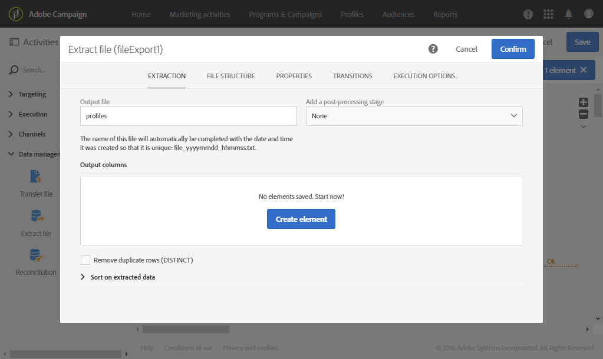

# Bestand extraheren{#extract-file}

## Beschrijving {#description}

Met de **[!UICONTROL Extract file]**-activiteit kunt u data uit Adobe Campaign exporteren naar een extern bestand.

## Gebruikscontext {#context-of-use}

De specifieke data-extractiemethode wordt gedefinieerd bij het configureren van de activiteit.

>[!CAUTION]
>
>De **[!UICONTROL Extract file]**-activiteit moet na een **[!UICONTROL Query]**-activiteit worden geplaatst om te kunnen worden gebruikt.

**Verwante onderwerpen:**

* [Hoofdlettergebruik: Profielen exporteren in een extern bestand](../../automating/using/exporting-profiles-in-file.md)

## Configuratie {#configuration}

1. Sleep een activiteit **[!UICONTROL Extract file]** en zet deze neer in uw workflow.

   

1. Selecteer de activiteit en open deze met de knop  vanuit de snelle acties die verschijnen.
1. Voer het label van het **uitvoerbestand** in. Het bestandslabel wordt automatisch aangevuld met de datum en tijd waarop het is gemaakt. Dit label is dus uniek. Bijvoorbeeld: ontvangers_20150815_081532.txt voor een bestand dat op 15 augustus 2015 om 08:15:32 uur is gemaakt.

   >[!NOTE]
   >
   >Met de functie **[!UICONTROL formatDate]** in dit veld kunt u de bestandsnaam opgeven.

1. Indien gewenst, kunt u het uitvoerbestand comprimeren door de optie **[!UICONTROL Compression]** in het veld **[!UICONTROL Add a pre-processing step]** te selecteren. Het uitvoerbestand wordt gecomprimeerd naar een GZIP-bestand (.gz).

   In het **[!UICONTROL Add a pre-processing step]** veld kunt u een bestand ook versleutelen voordat u het uitpakt. Raadpleeg [deze sectie voor meer informatie over het werken met gecodeerde bestanden](../../automating/using/managing-encrypted-data.md)

1. Klik op de knop  of **[!UICONTROL Add an element]** om een uitvoerkolom toe te voegen.

   

   Er wordt een nieuw venster geopend.

   

1. Voer een expressie in. Selecteer hiervoor een bestaande expressie of maak een nieuwe expressie met de **expressie-editor**.
1. Bevestig uw expressie.

   De expressie wordt toegevoegd aan de uitvoerkolommen.

1. Maak zoveel kolommen als u nodig hebt. U kunt kolommen bewerken door op de bijbehorende expressies en labels te klikken.

   Als u profielen exporteert en deze in een externe tool wilt gebruiken, moet u ervoor zorgen dat u een unieke id exporteert. Niet alle profielen hebben standaard een unieke id. Dit hangt af van de manier waarop ze aan de database worden toegevoegd. Raadpleeg de sectie [Een unieke id voor profielen genereren](../../developing/using/configuring-the-resource-s-data-structure.md#generating-a-unique-id-for-profiles-and-custom-resources) voor meer informatie.

1. Klik op het tabblad **[!UICONTROL File structure]** om de uitvoer-, datum- en getalnotaties te configureren voor het bestand dat wordt geëxporteerd.

   Schakel de optie **[!UICONTROL Export labels instead of internal values of enumerations]** in als u opsommingswaarden exporteert. Hiermee kunt u kortere labels ophalen die gemakkelijker zijn te begrijpen dan id&#39;s.

1. Ga naar het tabblad **[!UICONTROL Properties]** en selecteer de optie **[!UICONTROL Do not generate a file if the inbound transition is empty]** om te voorkomen dat er lege bestanden worden gemaakt en geüpload op SFTP-servers als de binnenkomende overgang leeg is.
1. Bevestig de configuratie van uw activiteit en sla de workflow op.
