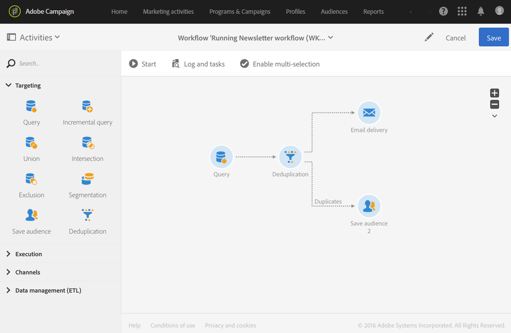

# Duplicaten identificeren vóór een levering {#identifying-duplicates-before-a-delivery}

In het volgende voorbeeld ziet u een deduplicatie waarmee u de duplicaten van een doel kunt uitsluiten voordat u een e-mail verzendt. Hierdoor vermijdt u dat u een communicatie meerdere keren naar hetzelfde profiel verzendt.

De workflow bestaat uit:

* A [Query](../../automating/using/query.md) which allows you to define the target of the email. Hier is de workflow gericht op alle profielen tussen 18 en 25 jaar die al langer dan een jaar in de klantendatabase staan.

   

* A [Deduplication](../../automating/using/deduplication.md) activity, which allows you to identify the duplicates that come from the preceding query. In dit voorbeeld wordt slechts één record opgeslagen voor elk duplicaat. De duplicaten worden geïdentificeerd aan de hand van het e-mailadres. Dit betekent dat de e-maillevering slechts eenmaal kan worden verzonden voor elk e-mailadres dat aanwezig is in de targeting.

   De geselecteerde deduplicatiemethode is **[!UICONTROL Non-empty value]**. Op die manier kunt u ervoor zorgen dat bij duplicaten voorrang wordt gegeven aan de data waarvoor de **voornaam** is opgegeven. Dit zorgt voor meer cohesie als de voornaam wordt gebruikt in de personalisatievelden van de e-mailcontent.

   Bovendien wordt een extra overgang toegevoegd om de duplicaten te behouden en deze weer te geven.

   

* An [Email delivery](../../automating/using/email-delivery.md) placed after the main outbound transition of the deduplication.
* A [Save audience](../../automating/using/save-audience.md) activity placed after the additional transition of the deduplication to save the duplicates in a **Duplicates** audience. Deze doelgroep kan opnieuw worden gebruikt om de leden ervan direct uit te sluiten van elke e-maillevering.
