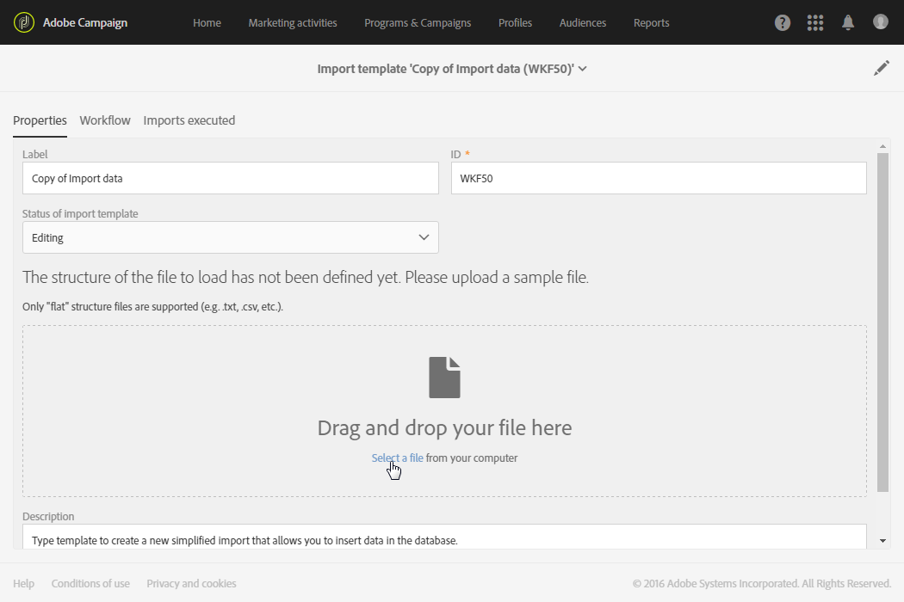

# Data importeren met importsjablonen{#importing-data-with-import-templates}

Door data te importeren, kunt u data verzamelen om uw Campaign-database te voeden.

Als alternatief voor [Workflows](../../automating/using/get-started-workflows.md) biedt Adobe Campaign een vereenvoudigde importfunctie waarmee de gebruiker bepaalde typen importbewerkingen kan beheren die door een beheerder zijn gedefinieerd.

De werkwijze is als volgt: een **beheerder** definieert en beheert importsjablonen (zie [Importsjablonen definiëren](../../automating/using/importing-data-with-import-templates.md#setting-up-import-templates)). Deze importsjablonen worden vervolgens beschikbaar gesteld aan gebruikers met vereenvoudigde weergaven onder het menu **[!UICONTROL Profiles & audiences]** > **[!UICONTROL Imports]**.

Deze gebruikers moeten daarom alleen het type import selecteren dat ze willen uitvoeren en het bestand met de te importeren data uploaden. De workflow die door de beheerder is gedefinieerd, wordt op transparante wijze uitgevoerd voor de gebruiker, die toegang heeft tot de details van het resultaat van de import nadat deze is voltooid.

>[!NOTE]
>
>De functie voor data-import kan worden beheerd door gebruikers met de rollen **[!UICONTROL GENERIC IMPORT (import)]** en **[!UICONTROL WORKFLOW (workflow)]**. Raadpleeg [deze sectie](../../administration/using/list-of-roles.md) voor meer informatie over rollen.

Een importbewerking kan worden gefilterd op basis van de sjabloon vanwaar deze werd uitgevoerd, de uitvoeringsdatum en de uitvoeringsstatus.

1. Klik in het overzicht met de importbewerkingen op de knop **[!UICONTROL Create]**. De wizard wordt geopend.
1. Selecteer het type import dat u wilt uitvoeren. De importtypen komen overeen met de beschikbare importsjablonen.
1. Download indien nodig het voorbeeldbestand dat aan de sjabloon is gekoppeld naar de computer om de datatypen weer te geven die in het te importeren bestand worden verwacht.
1. Download het bestand met de data die u in de wizard wilt importeren.
1. Start het importeren. De wizard wordt afgesloten en u keert terug naar de lijst met importbewerkingen die met de gebruikte sjabloon worden uitgevoerd.
1. Vernieuw de pagina en selecteer de importbewerking die u zojuist hebt uitgevoerd om de details van de uitvoering weer te geven.

   

De details van de uitvoering van de importbewerking zijn nu beschikbaar. Zowel het bestand dat is geïmporteerd als het bestand met de geweigerde data (data die niet zijn geïmporteerd) kunnen naar de computer worden gedownload.

## Importsjablonen instellen {#setting-up-import-templates}

Met importsjablonen kan de beheerder een bepaald aantal technische importconfiguraties vooraf definiëren. Deze sjablonen kunnen vervolgens ter beschikking worden gesteld aan standaardgebruikers voor het uitvoeren en uploaden van bestanden.

Een importsjabloon wordt gedefinieerd door de functionele beheerder en kan worden beheerd via het menu **[!UICONTROL Resources]** > **[!UICONTROL Templates]** > **[!UICONTROL Import templates]**.

Er zijn drie standaardsjablonen met het kenmerk Alleen-lezen beschikbaar:

* **[!UICONTROL Update Direct mail quarantines and delivery logs]**: Deze sjabloon kan dienen als basis voor nieuwe importbewerkingen om quarantaines en leveringslogboeken voor direct mail bij te werken. De workflow van de sjabloon bevat de volgende activiteiten:
* **[!UICONTROL Import data]**: Deze sjabloon kan dienen als basis voor nieuwe importbewerkingen om data uit een bestand in de database in te voegen. De workflow van deze sjabloon bevat de volgende activiteiten:

   * **[!UICONTROL Load file]**: Met deze activiteit kunt u een bestand uploaden naar de Adobe Campaign-server.
   * **[!UICONTROL Update data]**: Met deze activiteit kunt u data uit het bestand in de database invoegen.

* **[!UICONTROL Import list]**: Deze sjabloon kan dienen als basis voor nieuwe importbewerkingen om een doelgroep van het type **List** te maken op basis van data in een bestand. De workflow van deze sjabloon bevat de volgende activiteiten:

   * **[!UICONTROL Load file]**: Met deze activiteit kunt u een bestand uploaden naar de Adobe Campaign-server.
   * **[!UICONTROL Reconciliation]**: Met deze activiteit kunt u een doeldimensie koppelen aan geïmporteerde data. Zo kunt u een doelgroep van het type **List** maken. Als de doeldimensie van de geïmporteerde data niet bekend is, is de doelgroep van het type **File**. Zie [Doeldimensies en resources](../../automating/using/query.md#targeting-dimensions-and-resources).
   * **[!UICONTROL Save audience]**: Met deze activiteit kunt u data opslaan die zijn geïmporteerd in de vorm van een doelgroep van het type **List** . De naam van de opgeslagen doelgroep komt overeen met de naam van het bestand dat door de gebruiker is geïmporteerd en er wordt een achtervoegsel toegevoegd met de datum en tijd van het importeren. Bijvoorbeeld: ‘profiles_20150406_151448’.

Deze standaardsjablonen zijn alleen-lezen en zijn niet zichtbaar voor standaardgebruikers. Voer de volgende stappen uit om een sjabloon te maken die beschikbaar is voor gebruikers:

1. Dupliceer een standaardsjabloon. De gedupliceerde sjabloon bevat drie tabbladen:

   * **[!UICONTROL Properties]**: De algemene parameters van de importsjabloon. Op dit tabblad kunt u de sjabloon inschakelen en een voorbeeldbestand uploaden.
   * **[!UICONTROL Workflow]**: De importworkflow. Op dit tabblad kunt u de workflowactiviteiten definiëren. Deze activiteiten zijn niet zichtbaar tijdens vereenvoudigde importbewerkingen door gebruikers.
   * **[!UICONTROL Executed imports]**: De lijst met importbewerkingen die met deze sjabloon zijn uitgevoerd. U kunt de status, details en resultaten bekijken van elke importbewerking die met deze sjabloon is uitgevoerd. Vanaf deze lijst hebt u rechtstreeks toegang tot de workflow (op een transparante manier uitgevoerd voor de gebruiker).

1. Wijzig de naam van de sjabloon op het tabblad **[!UICONTROL Properties]** en voeg een beschrijving toe. Gebruikers kunnen de beschrijving bekijken wanneer de sjabloon beschikbaar is.

   

1. Ga naar het tabblad **[!UICONTROL Workflow]**. Van hieruit kunt u de workflow die standaard wordt aangeboden, verrijken door nieuwe activiteiten toe te voegen op basis van uw behoeften.

   Raadpleeg het gebruiksscenario in de sectie [Voorbeeld: Workflowsjabloon importeren](../../automating/using/creating-import-workflow-templates.md) voor meer informatie over het configureren van de workflowactiviteiten. Dit gebruiksscenario helpt u bij het instellen van een workflow die opnieuw kan worden gebruikt voor het importeren van profielen die afkomstig zijn van een CRM in de Adobe Campaign-database.

1. Sla de sjabloon op zodat de configuratie van de workflow correct in aanmerking wordt genomen.
1. Upload een voorbeeldbestand vanaf het tabblad **[!UICONTROL Properties]**. Het geüploade bestand kan alleen kolommen bevatten die nodig zijn voor toekomstige importbewerkingen of voorbeelddata. Met de data in het voorbeeldbestand kunt u de vereenvoudigde importbewerking testen zodra de workflow is gedefinieerd.

   

   Dit voorbeeldbestand is vervolgens beschikbaar voor gebruikers die de sjabloon gebruiken om een importbewerking uit te voeren. Ze kunnen het bestand downloaden naar hun computer, bijvoorbeeld om het te vullen met te importeren data. Houd hiermee rekening wanneer u een voorbeeldbestand toevoegt.

1. Sla de sjabloon op. Het voorbeeldbestand wordt nu in aanmerking genomen. U kunt het bestand op elk gewenst moment naar de computer downloaden om de content te controleren of wijzigen door de optie **[!UICONTROL Drop a new sample file]** in te schakelen.

   

1. Ga terug naar het tabblad **[!UICONTROL Workflow]** en open de activiteit **[!UICONTROL Load file]** om de kolomconfiguratie van het voorbeeldbestand dat bij de vorige stap is geüpload, te controleren en aan te passen.
1. Test de importbewerking door de workflow te starten. Het voorbeeldbestand dat in stap **5** is geüpload, moet data bevatten.

   De data uit het voorbeeldbestand worden vervolgens echt geïmporteerd. Zorg ervoor dat de gebruikte data klein en fictief zijn om ervoor te zorgen dat de veiligheid van de database niet in het gedrang komt.

1. Ga naar het logboek voor workflowuitvoering, dat beschikbaar in de actiebalk. Als er een fout optreedt, controleert u of de activiteiten correct zijn geconfigureerd.

   

1. Stel op het tabblad **[!UICONTROL Properties]** de optie **[!UICONTROL Import template status]** in op **[!UICONTROL Available]** en sla de sjabloon op. Als u het gebruik van deze sjabloon wilt stoppen, kunt u de optie **[!UICONTROL Import template status]** instellen op **[!UICONTROL Archived]**.

De sjabloonworkflow kan worden gewijzigd door het voorbeeldbestand opnieuw te uploaden en de configuratie **[!UICONTROL Load file]** te controleren.

De importsjabloon is nu beschikbaar voor de gebruikers en kan worden gebruikt om bestanden te uploaden.

**Verwante onderwerpen:**

* [Workflows](../../automating/using/get-started-workflows.md)
* [Voorbeeld: Workflowsjabloon importeren](../../automating/using/creating-import-workflow-templates.md)
