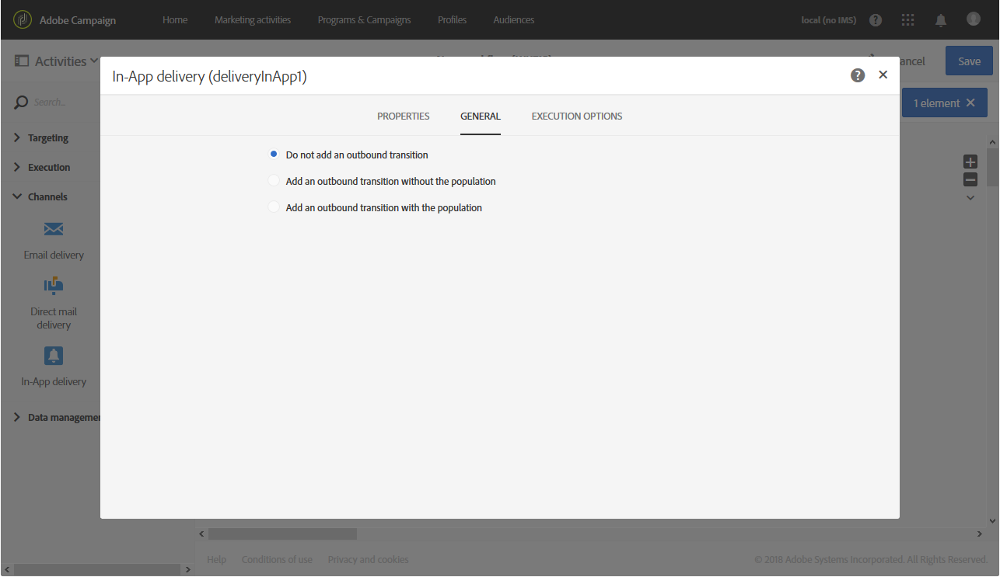

# In-app-levering{#in-app-delivery}

## Beschrijving {#description}

De **levering in-app** activiteit staat u toe om het verzenden van een bericht in-app binnen een werkschema te vormen. Met In-App-berichten kunt u een bericht weergeven wanneer de gebruiker actief is in de toepassing. Voor meer informatie betreffende de levering in-App, verwijs naar deze [&#x200B; sectie &#x200B;](../../channels/using/about-in-app-messaging.md).

## Gebruikscontext {#context-of-use}

De activiteit **[!UICONTROL In-App delivery]** wordt over het algemeen gebruikt om het verzenden van een bericht In-App naar een doelpubliek te automatiseren dat in de zelfde werkstroom wordt berekend.

De ontvangers worden vóór de activiteit in de zelfde werkschema gedefinieerd, via het richten van activiteiten zoals vragen, snijpunten, enz.

De voorbereiding van berichten wordt geactiveerd volgens de parameters voor workflowuitvoering. Op het berichtdashboard kunt u kiezen of u al dan niet handmatig wilt bevestigen of u het bericht wilt versturen (standaard vereist). U kunt de workflow handmatig starten of een planneractiviteit in de workflow plaatsen om de uitvoering te automatiseren.

## Configuratie {#configuration}

1. Sleep een **[!UICONTROL Query]** -activiteit naar uw werkstroom. Houd er rekening mee dat de dimensie **[!UICONTROL Query]** activity targeting op het tabblad **[!UICONTROL Properties]** moet worden bijgewerkt volgens de sjabloon die is gekozen in Stap 4:

   * Targetingdimensie moet worden ingesteld op **[!UICONTROL mobileApp (mobileAppV5)]** voor de sjabloon **[!UICONTROL Target all users of a Mobile app (inAppBroadcast)]**.
   * Targetingdimensie moet worden ingesteld op **[!UICONTROL profile (profile)]** voor de sjabloon **[!UICONTROL Target users based on their Campaign profile (inAppProfile)]**.
   * Het richten afmeting zou aan **[!UICONTROL subscriptions to an application (`nms:appSubscriptionRcp:appSubscriptionRcpDetail`)]** voor het **[!UICONTROL Target users based on their Mobile profile (inApp)]** malplaatje moeten worden geplaatst.

1. Sleep een activiteit **[!UICONTROL In-App delivery]** en zet deze neer in uw workflow.
1. Selecteer de activiteit en open deze met de knop  vanuit de snelle acties die verschijnen.

   >[!NOTE]
   >
   >Via de knop  hebt u via de snelle acties van de activiteit toegang tot de algemene eigenschappen en geavanceerde opties van de activiteit (en niet van de levering zelf).

   

1. Selecteer het berichttype in de app. Dit hangt af van de gegevens die het doel zijn van de **[!UICONTROL Query]** -activiteit.

   * **[!UICONTROL Target users based on their Campaign profile (inAppProfile)]**: Met dit berichttype kunt u zich richten op Adobe Campaign-profielen die zijn geabonneerd op uw mobiele toepassing en kunt u In-App-berichten personaliseren met profielkenmerken die beschikbaar zijn in Campagne.
   * **[!UICONTROL Target all users of a Mobile app (inAppBroadcast)]**: Met dit berichttype kunt u een bericht verzenden naar alle gebruikers van uw mobiele toepassing, zelfs als zij geen bestaand profiel in Campagne hebben.
   * **[!UICONTROL Target users based on their Mobile profile (inApp)]**: Met dit berichttype kunt u alle gebruikers van een mobiele app met een mobiel profiel in Campaign als doel instellen, ongeacht of dit bekend is of niet, en kunt u In-App-berichten personaliseren met alle profielkenmerken die zijn verkregen van een mobiel apparaat.

   

1. Voer de berichteigenschappen van uw In-App in en selecteer uw mobiele app in het veld **[!UICONTROL Associate a Mobile App to a delivery]** .
1. Sleep op het tabblad **[!UICONTROL Triggers]** de gebeurtenis die het bericht activeert. Er zijn drie categorieën gebeurtenissen beschikbaar:
1. Definieer uw inhoud in de app. Verwijs naar de sectie betreffende [&#x200B; in-app aanpassing &#x200B;](../../channels/using/customizing-an-in-app-message.md).
1. Standaard bevat de activiteit **[!UICONTROL In-App delivery]** geen uitgaande overgangen. Als u een uitgaande overgang wilt toevoegen aan uw activiteit **[!UICONTROL In-App delivery]**, ga dan naar het tabblad **[!UICONTROL General]** van de geavanceerde opties voor activiteiten (de knop  in de snelle acties van de activiteit) en vink een van de volgende opties aan:

   * **[!UICONTROL Add outbound transition without the population]**: Hiermee kunt u een uitgaande overgang genereren die exact dezelfde populatie als de binnenkomende overgang bevat.
   * **[!UICONTROL Add outbound transition with the population]**: hiermee kunt u een uitgaande overgang genereren met de populatie waarnaar het bericht is verzonden. De leden van het doel die tijdens de voorbereiding van de levering zijn uitgesloten, zijn van deze overgang uitgesloten.

   

1. Bevestig de configuratie van uw activiteit en sla de workflow op.

Wanneer u de activiteit opnieuw opent, wordt u rechtstreeks genomen aan het dashboard in-App. Alleen de content kan worden bewerkt.

Standaard wordt bij het starten van een leveringsworkflow alleen de berichtvoorbereiding geactiveerd. Het verzenden van berichten die op basis van een workflow zijn gemaakt, moet nog worden bevestigd nadat de workflow is gestart. U kunt echter vanaf het berichtdashboard de optie **[!UICONTROL Request confirmation before sending messages]** uitschakelen, maar alleen als het bericht vanuit een workflow is gemaakt. Als u deze optie uitschakelt, worden berichten zonder verdere kennisgeving verzonden zodra de voorbereiding is voltooid.

## Opmerkingen {#remarks}

De leveringen die in een workflow zijn gemaakt, zijn toegankelijk in de lijst met marketingactiviteiten van de applicatie. U kunt de uitvoeringsstatus van de workflow bekijken via het dashboard. Via koppelingen in het overzichtsvenster voor pushmeldingen hebt u rechtstreeks toegang tot gekoppelde elementen (workflow, campagne, enz.).

In de ouderleveringen, die van de marketing activiteitenlijst kunnen worden betreden, kunt u het totale aantal verzenden bekijken die zijn verwerkt (volgens de samenvoegingsperiode die wordt gespecificeerd toen **[!UICONTROL In-App delivery]** activiteit werd gevormd). U doet dit door de detailweergave van het blok **[!UICONTROL Deployment]** van de bovenliggende levering te openen door  te selecteren.
