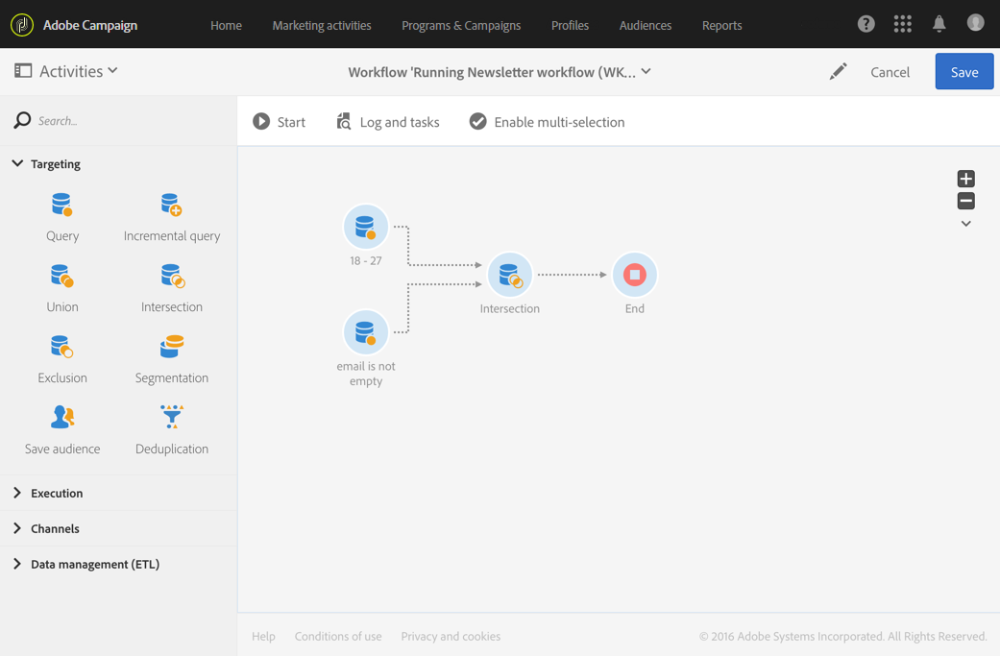

# Intersectie{#intersection}

## Beschrijving {#description}

Met de **[!UICONTROL Intersection]** activiteit kunt u alleen de elementen behouden die de verschillende binnenkomende populaties in de activiteit gemeen hebben.

## Gebruikscontext {#context-of-use}

De **[!UICONTROL Intersection]** activiteit wordt over het algemeen gebruikt om aanvullende filtering op populaties van binnenkomende overgangen uit te voeren.

## Configuratie {#configuration}

1. Sleep een **[!UICONTROL Intersection]** activiteit naar uw werkstroom.
1. Sluit het aan de andere activiteiten aan die voor het komen, zoals vragen.
1. Selecteer de activiteit, dan open het gebruikend de  knoop van de snelle acties die verschijnen.
1. Selecteer de **[!UICONTROL Reconciliation type]**:

   * **[!UICONTROL Keys only]**: Standaardmodus. De activiteit houdt slechts één element wanneer de elementen van de verschillende binnenkomende overgangen de zelfde sleutel hebben.
   * **[!UICONTROL All shared columns]**: De gegevens worden op basis van kolommen afgestemd op de binnenkomende overgangen. Daarom moet u de primaire reeks selecteren die als basis voor vergelijking zal dienen. Deze optie kan worden gebruikt als de binnenkomende populatie verschillende doeldimensies heeft.
   * **[!UICONTROL A selection of columns]**: Selecteer deze optie om de lijst met kolommen te definiëren waarop de afstemming van gegevens wordt toegepast. U moet eerst de primaire set selecteren (die de brongegevens bevat) en vervolgens de velden opgeven die u wilt gebruiken voor de samenvoeging.

1. Schakel het **[!UICONTROL Use common additional data only]** selectievakje in als u alleen de aanvullende gegevens in alle binnenkomende overgangen wilt behouden.
1. Indien nodig, beheer de [Overgangen](../../automating/using/executing-a-workflow.md#managing-an-activity-s-outbound-transitions) van de activiteit om tot de geavanceerde opties voor de uitgaande bevolking toegang te hebben.
1. Bevestig de configuratie van uw activiteit en sla uw werkschema op.

## Voorbeeld {#example}

Het volgende voorbeeld toont de doorsnede tussen twee vraagactiviteiten. Deze wordt hier gebruikt om de Adobe Campagne-database te bekijken en profielen op te halen die tussen de 18 en 27 jaar oud zijn en profielen waarvan het e-mailadres is opgegeven.

