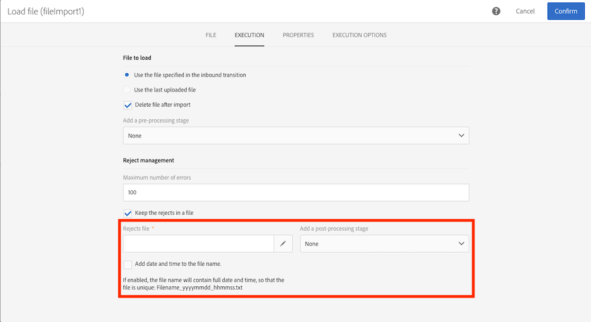

# Bestand laden {#load-file}

## Beschrijving {#description}

>[!CAUTION]
>
>Houd bij het gebruik van deze functionaliteit rekening met de beperkingen voor SFTP-opslag, DB-opslag en actieve profielen die gelden voor uw AdobeCampagne-contract.

Met de activiteit **[!UICONTROL Load file]** kunt u data in één gestructureerd formulier importeren en deze data gebruiken in Adobe Campaign. De data worden tijdelijk geïmporteerd en een andere activiteit is nodig om deze definitief te integreren in de Adobe Campaign-database.

## Gebruikscontext {#context-of-use}

De manier waarop de data worden geëxtraheerd, wordt gedefinieerd wanneer de activiteit wordt geconfigureerd. Het te laden bestand kan bijvoorbeeld een lijst met contactpersonen zijn.

U kunt:

* De bestandsstructuur gebruiken om deze toe te passen op de data van een ander bestand (hersteld met behulp van de activiteit **[!UICONTROL Transfer file]**) of
* De structuur en de data uit het bestand gebruiken om het bestand te importeren in Adobe Campaign.

>[!IMPORTANT]
>
>Alleen bestanden met een platte structuur worden in aanmerking genomen, bijvoorbeeld txt- en csv-bestanden.

**Verwante onderwerpen:**

* [Hoofdlettergebruik: De database bijwerken met externe gegevens](../../automating/using/update-database-file.md)
* [Hoofdlettergebruik: Gegevens bijwerken op basis van een automatische bestandsdownload](../../automating/using/update-data-automatic-download.md)
* [Hoofdlettergebruik: Een e-mail verzenden met verrijkte velden](../../automating/using/sending-email-enriched-fields.md)
* [Hoofdlettergebruik: Een bestandspubliek in overeenstemming brengen met de database](../../automating/using/reconcile-file-audience-with-database.md)

## Configuratie {#configuration}

De activiteitconfiguratie omvat twee stappen. Eerst moet u de verwachte bestandsstructuur definiëren door een voorbeeldbestand te uploaden. Als dit is gebeurd, kunt u de oorsprong opgeven van het bestand waarvan de data worden geïmporteerd.

>[!NOTE]
>
>De data van het voorbeeldbestand worden gebruikt voor het configureren van de activiteit, maar worden niet geïmporteerd. We raden u aan een voorbeeldbestand te gebruiken dat weinig data bevat.

1. Sleep een activiteit **[!UICONTROL Load file]** en zet deze neer in uw workflow.
1. Selecteer de activiteit en open deze met de knop  vanuit de snelle acties die verschijnen.
1. Upload het voorbeeldbestand waarmee u de verwachte structuur kunt definiëren wanneer u het uiteindelijke bestand importeert.

   

   Nadat het databestand is geüpload, worden twee nieuwe tabbladen weergegeven in de activiteit: **[!UICONTROL File structure]** en **[!UICONTROL Column definition]**.

1. Ga naar het tabblad **[!UICONTROL File structure]** om de structuur te bekijken die automatisch is gedetecteerd vanaf het voorbeeldbestand.

   Als de bestandsstructuur onjuist is gedetecteerd, hebt u verschillende opties om mogelijke fouten te corrigeren:

   * U kunt kiezen om de structuur van een ander bestand te gebruiken door de optie **[!UICONTROL Detect structure from a new file]** te selecteren.
   * U kunt de standaarddetectieparameters wijzigen om deze aan te passen aan het bestand. In het veld **[!UICONTROL File type]** kunt u opgeven of het bestand dat u wilt importeren, bestaat uit kolommen met een vaste lengte. In dat geval moet u ook het maximum aantal tekens voor elke kolom opgeven op het tabblad **[!UICONTROL Column definition]**.

      Alle detectieopties die nodig zijn om de data uit het bestand correct te herstellen, worden opnieuw gegroepeerd in **[!UICONTROL File format]**. U kunt deze wijzigen en vervolgens de structuur van het laatste bestand dat in de activiteit is geladen, opnieuw detecteren door deze nieuwe instellingen in aanmerking te nemen. Gebruik de knop **[!UICONTROL Apply configuration]** om dit te doen. U kunt bijvoorbeeld een ander kolomscheidingsteken opgeven.

      >[!NOTE]
      >
      >Deze bewerking neemt het laatste bestand dat in de activiteit is geladen, in aanmerking. Als het gedetecteerde bestand groot is, worden in het datavoorbeeld alleen de eerste 30 regels weergegeven.

      

      In de sectie **[!UICONTROL File format]** kunt u met de optie **[!UICONTROL Check columns from file against column definitions]** controleren of de kolommen van het bestand dat u uploadt, overeenkomen met de kolomdefinitie.

      Als het aantal kolommen en/of de naam van kolommen niet overeenkomen met de kolomdefinitie, wordt een foutbericht weergegeven wanneer de workflow wordt uitgevoerd. Als de optie niet is geactiveerd, worden waarschuwingen in het logboekbestand weergegeven.

      

1. Ga naar het tabblad **[!UICONTROL Column definition]** om de data-indeling voor elke kolom te controleren en indien nodig de parameters aan te passen.

   Op het tabblad **[!UICONTROL Column definition]** kunt u nauwkeurig de datastructuur van elke kolom opgeven om data te importeren die geen fouten bevatten (bijvoorbeeld met null-beheer) en deze in overeenstemming te brengen met de typen die al aanwezig zijn in de Adobe Campaign-database voor toekomstige bewerkingen.

   U kunt bijvoorbeeld het label van een kolom wijzigen, het type kolom selecteren (tekenreeks, geheel getal, datum, enzovoort) of zelfs foutverwerking opgeven.

   Raadpleeg de sectie [Kolomindeling](#column-format) voor meer informatie.

   

1. Geef op het tabblad **[!UICONTROL Execution]** de volgende informatie op over het bestand dat moet worden verwerkt voor het laden van data:

   * Het bestand is afkomstig uit een binnenkomende overgang in de workflow.
   * Het betreft het bestand dat u tijdens de vorige stap hebt geüpload.
   * Het betreft een nieuw bestand dat vanaf de lokale computer moet worden geüpload. De optie **[!UICONTROL Upload a new file from local machine]** wordt weergegeven als het uploaden van een eerste bestand al is gedefinieerd in de workflow. Hierdoor kunt u een ander bestand uploaden dat u wilt verwerken als het huidige bestand niet aan uw wensen voldoet.

      

1. Als het bestand waarvan u de data wilt laden, is gecomprimeerd tot een gzip-bestand (.gz), selecteert u de optie **[!UICONTROL Decompression]** in het veld **[!UICONTROL Add a pre-processing step]**. Hierdoor kunt u het bestand uitpakken voordat u de data laadt. Deze optie is alleen beschikbaar als het bestand afkomstig is van de binnenkomende overgang van de activiteit.

   In het **[!UICONTROL Add a pre-processing step]** veld kunt u ook een bestand decoderen voordat u het in de database importeert. Raadpleeg [deze sectie voor meer informatie over het werken met gecodeerde bestanden](../../automating/using/managing-encrypted-data.md)

1. Met de optie **[!UICONTROL Keep the rejects in a file]** kunt u een bestand downloaden dat fouten bevat die tijdens het importeren zijn opgetreden en het vervolgens toepassen in een naverwerkingsfase. Wanneer de optie wordt geactiveerd, wordt de naam van de uitgaande overgang gewijzigd in ‘Rejects’.

   >[!NOTE]
   >
   >Met de optie **[!UICONTROL Add date and time to the file name]** kunt u een tijdstempel toevoegen aan de naam van het bestand dat de afwijzingen bevat.

   

1. Bevestig de configuratie van uw activiteit en sla de workflow op.

Als er na het uitvoeren van de workflow een fout optreedt met de activiteit, raadpleegt u de logboeken voor meer informatie over de waarden die niet correct zijn in het bestand. Raadpleeg [deze sectie](../../automating/using/monitoring-workflow-execution.md) voor meer informatie over workflowlogboeken.

## Kolomindeling {#column-format}

Wanneer u een voorbeeldbestand laadt, wordt de kolomindeling automatisch gedetecteerd met de standaardparameters voor elk datatype. U kunt deze standaardparameters wijzigen om de specifieke processen op te geven die op uw data moeten worden toegepast, in het bijzonder wanneer er een fout of een lege waarde is.

U doet dit door **[!UICONTROL Edit properties]** te kiezen in de snelle acties van de kolom waarvan u de indeling wilt definiëren. Het detailvenster voor kolomindelingen wordt geopend.

Vervolgens kunt u de opmaak voor elke kolom wijzigen.

Met de kolomopmaak kunt u de waardeverwerking van elke kolom definiëren:

* **[!UICONTROL Ignore column]**: Deze kolom wordt niet verwerkt tijdens het laden van data.
* **[!UICONTROL Data type]**: Deze geeft het type data op dat voor elke kolom wordt verwacht.
* **[!UICONTROL Format and separators]**, **Properties**: Hiermee geeft u de eigenschappen van een tekst, de indeling voor tijd, datum en numerieke waarde, en het scheidingsteken op dat is opgegeven door de kolomcontext.

   * **[!UICONTROL Maximum number of characters]**: Hiermee geeft u het maximum aantal tekens voor tekenreekstypekolommen aan.

      Dit veld moet worden ingevuld bij het laden van bestanden die bestaan uit kolommen met een vaste lengte.

   * **[!UICONTROL Letter case management]**: Hiermee bepaalt u of een proces voor hoofdletters/kleine letters moet worden toegepast op data van het type **Text** .
   * **[!UICONTROL White space management]**: Hiermee geeft u aan of bepaalde spaties moeten worden genegeerd in een tekenreeks voor data van het type **Text** .
   * **[!UICONTROL Time format]**, **[!UICONTROL Date format]**: Hiermee geeft u de indeling op voor de data voor **Date**, **Time** en **Date and time**.
   * **[!UICONTROL Format]**: Hiermee kunt u de indeling voor numerieke waarden definiëren voor de data voor **Integer** en **Floating number** .
   * **[!UICONTROL Separator]**: Hiermee definieert u het scheidingsteken dat wordt opgegeven door de kolomcontext (scheidingsteken voor duizendtallen of decimaal scheidingsteken voor numerieke waarden, scheidingsteken voor datum en tijd) voor de data voor **Date**, **Time**, **Date and time**, **Integer** en **Floating number** .

* **[!UICONTROL Remapping of values]**: Dit veld is alleen beschikbaar in de configuratie van kolomdetails. Hiermee kunt u bepaalde waarden transformeren wanneer deze worden geïmporteerd. U kunt bijvoorbeeld ‘three’ omzetten in ‘3’.
* **[!UICONTROL Error processing]**: Dit definieert het gedrag als een fout optreedt.

   * **[!UICONTROL Ignore the value]**: De waarde wordt genegeerd. Er wordt een waarschuwing gegenereerd in het logboek voor workflowuitvoering.
   * **[!UICONTROL Reject the line]**: De volledige regel wordt niet verwerkt.
   * **[!UICONTROL Use a default value]**: Dit vervangt de waarde die de fout veroorzaakt door een standaardwaarde, die in het veld **[!UICONTROL Default value]** is gedefinieerd.
   * **[!UICONTROL Use a default value in case the value is not remapped]**: Dit vervangt de waarde die de fout veroorzaakt door een standaardwaarde, die in het veld **[!UICONTROL Default value]** is gedefinieerd tenzij een toewijzing is gedefinieerd voor de foutieve waarde (zie de optie **[!UICONTROL Remapping of values]** hierboven).
   * **[!UICONTROL Reject the line when there is no remapping value]**: De volledige regel wordt alleen verwerkt als een toewijzing voor de foutieve waarde is gedefinieerd (zie de optie **[!UICONTROL Remapping of values]** hierboven).

   >[!NOTE]
   >
   >**[!UICONTROL Error processing]** heeft betrekking op fouten betreffende waarden in het geïmporteerde bestand. Bijvoorbeeld een onjuist datatype (‘four’ in letters voor een kolom ‘Integer’), een tekenreeks die meer tekens bevat dan het toegestane maximumaantal, een datum met onjuiste scheidingstekens, enzovoort. Deze optie heeft echter geen betrekking op fouten die worden gegenereerd door beheer van lege waarden.

* **[!UICONTROL Default value]**: Hiermee geeft u de standaardwaarde op op basis van de gekozen foutverwerking.
* **[!UICONTROL Empty value management]**: Hiermee geeft u op hoe lege waarden moeten worden beheerd tijdens het laden van data.

   * **[!UICONTROL Generate an error for numerical fields]**: Dit genereert alleen een fout voor numerieke velden. Als dit niet het geval is, wordt een NULL-waarde ingevoegd.
   * **[!UICONTROL Insert NULL in the corresponding field]**: Dit autoriseert lege waarden. De waarde NULL wordt daarom ingevoegd.
   * **[!UICONTROL Generate an error]**: Dit genereert een fout als een waarde leeg is.
