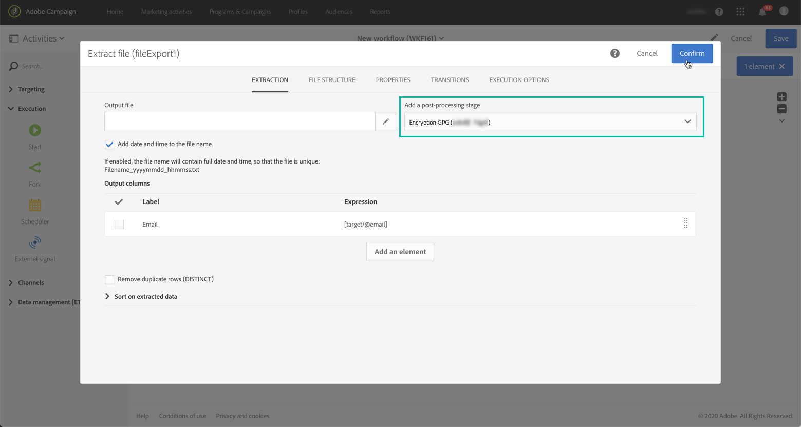

# Gecodeerde gegevens beheren {#managing-encrypted-data}

## Voorbereidende verwerkingsfasen {#about-preprocessing-stages}

In sommige gevallen moeten de gegevens die u wilt importeren, mogelijk worden gecodeerd, bijvoorbeeld als deze PII-gegevens bevatten.

Als u uitgaande gegevens wilt coderen of binnenkomende gegevens wilt decoderen, moet u de GPG-sleutels beheren met het [Configuratiescherm](https://docs.adobe.com/content/help/en/control-panel/using/instances-settings/gpg-keys-management.html).

>[!NOTE]
>
>Het Configuratiescherm is beschikbaar voor alle klanten die op AWS worden gehost (behalve voor klanten die hun marketinginstanties op locatie hosten).

Als u niet in aanmerking komt om het Configuratiescherm te gebruiken, dient u contact op te nemen met de klantenservice van Adobe, zodat deze uw exemplaar de benodigde opdrachten voor versleuteling/ontsleuteling kunnen geven. Hiertoe dient u een verzoek in met de volgende gegevens:

* Het **label** dat in de interface van de Campagne zal tonen om het bevel te gebruiken. Bijvoorbeeld &quot;Bestand versleutelen&quot;.
* De **opdracht** om op uw instantie te installeren.

Zodra het verzoek wordt verwerkt, zullen de encryptie/decryptiebevelen op het **[!UICONTROL Pre-processing stage]** gebied van de **[!UICONTROL Load file]** en **[!UICONTROL Extract file]** activiteiten beschikbaar zijn. U kunt deze gebruiken om de bestanden te decoderen of te coderen die u wilt importeren of exporteren.

**Verwante onderwerpen:**

* [Bestand laden](../../automating/using/load-file.md)
* [Bestand uitpakken](../../automating/using/extract-file.md)

## Hoofdlettergebruik: Gegevens importeren die zijn versleuteld met een toets die is gegenereerd door het Configuratiescherm {#use-case-gpg-decrypt}

In dit geval, zullen wij een werkschema bouwen om gegevens in te voeren die in een extern systeem zijn gecodeerd, gebruikend een sleutel die in het Controlebord wordt geproduceerd.

In [deze sectie](https://docs.adobe.com/content/help/en/campaign-standard-learn/tutorials/administrating/control-panel/gpg-key-management/decrypting-data.html)is ook een zelfstudievideo beschikbaar die laat zien hoe u een GPG-sleutel kunt gebruiken voor het decoderen van gegevens.

De volgende stappen worden uitgevoerd:

1. Gebruik het Configuratiescherm om een sleutelpaar (openbaar/privé) te genereren. Gedetailleerde stappen zijn beschikbaar in de documentatie [van het](https://docs.adobe.com/content/help/en/control-panel/using/instances-settings/gpg-keys-management.html#decrypting-data)Configuratiescherm.

   * De openbare sleutel zal met het externe systeem worden gedeeld, dat het zal gebruiken om de gegevens te coderen om naar Campagne te verzenden.
   * De persoonlijke sleutel wordt door Campagne gebruikt om de inkomende gecodeerde gegevens te decoderen.

   

1. In het externe systeem gebruikt u de openbare sleutel die u van het Configuratiescherm hebt gedownload om de gegevens te coderen die u naar Campaign Standard wilt importeren.

   

1. In Campaign Standard maakt u een workflow om de gecodeerde gegevens te importeren en te decoderen met de persoonlijke sleutel die is geïnstalleerd via het Configuratiescherm. Hiervoor maken we als volgt een workflow:

   

   * **[!UICONTROL Transfer file]** activiteit: Hiermee wordt het bestand van een externe bron naar Campagne overgedragen. In dit voorbeeld willen we het bestand overbrengen van een SFTP-server.
   * **[!UICONTROL Load file]** activiteit: Laadt de gegevens van het dossier in het gegevensbestand en decrypteert het gebruikend de privé sleutel die in het Controlebord wordt geproduceerd.

1. Open de **[!UICONTROL Transfer file]** activiteit dan vorm het op uw behoeften. De globale concepten op hoe te om de activiteit te vormen zijn beschikbaar in [deze sectie](../../automating/using/load-file.md).

   Geef op het **[!UICONTROL Protocol]** tabblad gegevens op over de ftp-server en het gecodeerde gpg-bestand dat u wilt overbrengen.

   

1. Open de **[!UICONTROL Load file]** activiteit, dan vorm het op uw behoeften. De globale concepten op hoe te om de activiteit te vormen zijn beschikbaar in [deze sectie](../../automating/using/load-file.md).

   Voeg een voorbewerkingsstadium aan de activiteit toe, om de inkomende gegevens te decrypteren. Selecteer hiertoe de **[!UICONTROL Decryption GPG]** optie in de lijst.

   >[!NOTE]
   >
   >U hoeft niet de persoonlijke sleutel op te geven die moet worden gebruikt om de gegevens te decoderen. De persoonlijke sleutel wordt opgeslagen in het Configuratiescherm, dat automatisch de sleutel detecteert die moet worden gebruikt om het bestand te decoderen.

   

1. Klik **[!UICONTROL OK]** om de activiteitenconfiguratie te bevestigen.

1. U kunt de workflow nu uitvoeren.

## Hoofdlettergebruik: Gegevens coderen en exporteren met een sleutel die is geïnstalleerd in het Configuratiescherm {#use-case-gpg-encrypt}

In dit geval, zullen wij een werkschema bouwen om gegevens te coderen en uit te voeren gebruikend een sleutel die op Controlebord wordt geïnstalleerd.

In [deze sectie](https://docs.adobe.com/content/help/en/campaign-standard-learn/tutorials/administrating/control-panel/gpg-key-management/using-a-gpg-key-to-encrypt-data.html)is ook een zelfstudievideo beschikbaar die laat zien hoe u een GPG-sleutel kunt gebruiken om gegevens te coderen.

De volgende stappen worden uitgevoerd:

1. Genereer een sleutelpaar van GPG (openbaar/privé) gebruikend een nut van GPG, dan installeer de openbare sleutel op Controlebord. Gedetailleerde stappen zijn beschikbaar in de documentatie [van het](https://docs.adobe.com/content/help/en/control-panel/using/instances-settings/gpg-keys-management.html#encrypting-data)Configuratiescherm.

   

1. In Campaign Standard maakt u een workflow om de gegevens te exporteren en deze te exporteren met de persoonlijke sleutel die is geïnstalleerd via het Configuratiescherm. Hiervoor maken we als volgt een workflow:

   

   * **[!UICONTROL Query]** activiteit: In dit voorbeeld, willen wij een vraag uitvoeren om de gegevens van het gegevensbestand te richten dat wij willen uitvoeren.
   * **[!UICONTROL Extract file]** activiteit: De gegevens worden gecodeerd en uitgepakt in een bestand.
   * **[!UICONTROL Transfer file]** activiteit: Hiermee wordt het bestand met de gecodeerde gegevens overgebracht naar een SFTP-server.

1. Vorm de **[!UICONTROL Query]** activiteit om de gewenste gegevens van het gegevensbestand te richten. For more on this, refer to [this section](../../automating/using/query.md).

1. Open de **[!UICONTROL Extract file]** activiteit en configureer de activiteit naar wens (uitvoerbestand, kolommen, indeling, enz.). De globale concepten op hoe te om de activiteit te vormen zijn beschikbaar in [deze sectie](../../automating/using/extract-file.md).

   Voeg een voorbewerkingsstadium aan de activiteit toe, om de gegevens te coderen om te halen. Selecteer hiertoe de GPG-sleutel voor versleuteling die u wilt gebruiken om de gegevens te versleutelen.

   

   >[!NOTE]
   >
   >De waarde tussen haakjes is de **opmerking** die u hebt gedefinieerd toen u het sleutelpaar genereerde met het GPG-coderingsgereedschap. Zorg ervoor dat u de juiste overeenkomende sleutel selecteert, anders kan de ontvanger het bestand niet decoderen.

1. Open de **[!UICONTROL Transfer file]** activiteit, dan specificeer de server SFTP waarnaar u het dossier wilt verzenden. De globale concepten op hoe te om de activiteit te vormen zijn beschikbaar in [deze sectie](../../automating/using/transfer-file.md).

   

1. U kunt de workflow nu uitvoeren. Zodra het wordt uitgevoerd, zal het gegevensdoel door de vraag naar de server SFTP in een gecodeerd.gpg- dossier worden uitgevoerd.

   
